Guide to the Software Engineering Body of Knowledge Version 3.

SWEBOK

A Project of the IEEE Computer Society

Guide to the Software Engineering Body of Knowledge

Version 3

\\*\\*Editors\\*\\*

Pierre Bourque, École de technologie supérieure (ÉTS)

Richard E. (Dick) Fairley, Software and Systems Engineering Associates (S2EA)

\\_Copyright and Reprint Permissions.\\_ Educational or personal use of this

material is permitted without fee provided such copies 1) are not made for

profit or in lieu of purchasing copies for classes, and that this notice and a

full citation to the original work appear on the first page of the copy and 2)

do not imply IEEE endorsement of any third-party products or services.

Permission to reprint/republish this material for commercial, advertising or

promotional purposes or for creating new collective works for resale or

redistribution must be obtained from IEEE by writing to the IEEE Intellectual

Property Rights Office, 445 Hoes Lane, Piscataway, NJ 08854-4141 or

pubs-permissions@ieee.org.

Reference to any specific commercial products, process, or service does not

imply endorsement by IEEE. The views and opinions expressed in this work do

not necessarily reflect those of IEEE.

IEEE makes this document available on an “as is” basis and makes no

warranty, express or implied, as to the accuracy, capability, efficiency

merchantability, or functioning of this document. In no event will IEEE be

liable for any general, consequential, indirect, incidental, exemplary, or

special damages, even if IEEE has been advised of the possibility of such

damages.

Copyright © 2014 IEEE. All rights reserved.

Paperback ISBN-10: 0-7695-5166-

Paperback ISBN-13: 978-0-7695-5166-

Digital copies of \\_SWEBOK Guide\\_ V3.0 may be downloaded free of charge for

personal and academic use via [http://www.swebok.org/](http://www.swebok.org).

\\_IEEE Computer Society Staff for This Publication\\_

- Angela Burgess, Executive Director
- Anne Marie Kelly, Associate Executive Director, Director of Governance
- Evan M. Butterfield, Director of Products and Services
- John Keppler, Senior Manager, Professional Education
- Kate Guillemette, Product Development Editor
- Dorian McClenahan, Education Program Product Developer
- Michelle Phon, Professional Education & Certification Program Coordinator
- Jennie Zhu-Mai, Editorial Designer

\\_IEEE Computer Society Products and Services.\\_

The world-renowned IEEE Computer Society publishes, promotes, and distributes a

wide variety of authoritative computer science and engineering journals,

magazines, conference proceedings, and professional education products. Visit

the Computer Society at [http://www.computer.org](http://www.computer.org) for

more information.

\## Cover

\### Foreword

Every profession is based on a body of knowledge, although that knowledge is

not always defined in a concise manner. In cases where no formality exists, the

body of knowledge is “generally recognized” by practitioners and may be

codified in a variety of ways for a variety of different uses. But in many

cases, a guide to a body of knowledge is formally documented, usually in a form

that permits it to be used for such purposes as development and accreditation

of academic and training programs, certification of specialists, or

professional licensing. Generally, a professional society or similar body

maintains stewardship of the formal definition of a body of knowledge.

During the past forty-five years, software engi neering has evolved from a

conference catch phrase into an engineering profession, characterized by 1) a

professional society, 2) standards that specify generally accepted professional

practices, 3) a code of ethics, 4) conference proceedings, 5) textbooks, 6)

curriculum guidelines and curricula, 7) accreditation criteria and accredited

degree programs, 8) certification and licensing, and 9) this Guide to the Body

of Knowledge. In this \\_Guide to the Software Engineering Body of Knowledge\\_,

the IEEE Computer Society pres ents a revised and updated version of the body

of knowledge formerly documented as SWEBOK 2004; this revised and updated

version is denoted SWEBOK V3. This work is in partial fulfillment of the

Society’s responsibility to promote the advancement of both theory and practice

for the profession of software engineering.

It should be noted that this \\_Guide\\_ does not present the entire the body of

knowledge for software engineering but rather serves as a guide to the body of

knowledge that has been developed over more than four decades. The software

engineering body of knowledge is constantly evolving. Nevertheless, this

\\_Guide\\_ constitutes a valuable characterization of the software engineering

profession.

In 1958, John Tukey, the world-renowned statistician, coined the term software.

The term software engineering was used in the title of a NATO conference held

in Germany in 1968. The IEEE Computer Society first published its Transactions

on Software Engineering in 1972, and a committee for developing software

engineering standards was established within the IEEE Computer Society in 1976.

In 1990, planning was begun for an international standard to provide an overall

view of software engineering. The standard was completed in 1995 with

designation ISO/IEC 12207 and given the title of Standard for Software Life

Cycle Processes. The IEEE version of 12207 was published in 1996 and provided a

major foundation for the body of knowledge captured in SWEBOK 2004.  The

current version of 12207 is designated as ISO/IEC 12207:2008 and IEEE

12207-2008; it provides the basis for this SWEBOK V3.

This Guide to the Software Engineering Body of Knowledge is presented to you,

the reader, as a mechanism for acquiring the knowledge you need in your

lifelong career development as a software engineering professional.

Dick Fairley, Chair

Software and Systems Engineering Committee

IEEE Computer Society

Don Shafer, Vice President

Professional Activities Board

IEEE Computer Society

\### Foreword To The 2004 Edition

In this \\_Guide\\_ , the IEEE Computer Society establishes for the first time a

baseline for the body of knowledge for the field of software engineering, and

the work partially fulfills the Society’s responsibility to promote the

advancement of both theory and practice in this field. In so doing, the Society

has been guided by the experience of disciplines with longer histories but was

not bound either by their problems or their solutions.

It should be noted that the \\_Guide\\_ does not purport to define the body of

knowledge but rather to serve as a compendium and guide to the body of

knowledge that has been developing and evolving over the past four decades.

Furthermore, this body of knowledge is not static. The \\_Guide\\_ must,

necessarily, develop and evolve as software engineering matures. It

nevertheless constitutes a valuable element of the software engineering

infrastructure.

In 1958, John Tukey, the world-renowned statistician, coined the term

\\_software\\_. The term \\_software engineering\\_ was used in the title of a NATO

conference held in Germany in 1968. The IEEE Computer Society first published

its \\_Transactions on Software Engineering\\_ in 1972. The committee established

within the IEEE Computer Society for developing software engineering standards

was founded in 1976.

The first holistic view of software engineering to emerge from the IEEE

Computer Society resulted from an effort led by Fletcher Buckley to develop

IEEE standard 730 for software quality assurance, which was completed in

1979\.

The purpose of IEEE Std. 730 was to provide uniform, minimum acceptable

requirements for preparation and content of software quality assurance plans.

This standard was influential in completing the developing standards in the

following topics: configuration management, software testing, software

requirements, software design, and software verification and validation.

During the period 1981–1985, the IEEE Computer Society held a series of

workshops concerning the application of software engineering standards. These

workshops involved practitioners sharing their experiences with existing

standards. The workshops also held sessions on planning for future standards,

including one involving measures and metrics for software engineering

products and processes. The planning also resulted in IEEE Std. 1002, Taxonomy

of Software Engineering Standards (1986), which provided a new, holistic view

of software engineering. The standard describes the form and content of a

software engineering standards taxonomy. It explains the various types of

software engineering standards, their functional and external relationships,

and the role of various functions participating in the software life cycle.

In 1990, planning for an international standard with an overall view was begun.

The planning focused on reconciling the software process views from IEEE Std.

1074 and the revised US DoD standard 2167A. The revision was eventually

published as DoD Std. 498. The international standard was completed in 1995

with designation, ISO/IEC 12207, and given the title of Standard for Software

Life Cycle Processes. Std. ISO/IEC 12207 provided a major point of departure

for the body of knowledge captured in this book.

It was the IEEE Computer Society Board of Governors’ approval of the motion put

forward in May 1993 by Fletcher Buckley which resulted in the writing of this

book. The Association for Computing Machinery (ACM) Council approved a related

motion in August 1993. The two motions led to a joint committee under the

leadership of Mario Barbacci and Stuart Zweben who served as cochairs. The

mission statement of the joint committee was “To establish the appropriate

sets(s) of criteria and norms for professional practice of software engineering

upon which industrial decisions, professional certification, and educational

curricula can be based.” The steering committee organized task forces in the

following areas:

1. Define Required Body of Knowledge and Recommended Practices.
1. Define Ethics and Professional Standards.
1. Define Educational Curricula for undergraduate, graduate, and continuing

education.

This book supplies the first component: required body of knowledge and

recommend practices.  The code of ethics and professional practice for software

engineering was completed in 1998 and approved by both the ACM Council and the

IEEE Computer Society Board of Governors. It has been adopted by numerous

corporations and other organizations and is included in several recent

textbooks.

The educational curriculum for undergraduates is being completed by a joint

effort of the IEEE Computer Society and the ACM and is expected to be completed

in 2004.

Every profession is based on a body of knowledge and recommended practices,

although they are not always defined in a precise manner. In many cases, these

are formally documented, usually in a form that permits them to be used for

such purposes as accreditation of academic programs, development of education

and training programs, certification of specialists, or professional licensing.

Generally, a professional society or related body maintains custody of such a

formal definition. In cases where no such formality exists, the body of

knowledge and recommended practices are “generally recognized” by practitioners

and may be codified in a variety of ways for different uses.

It is hoped that readers will find this book useful in guiding them toward the

knowledge and resources they need in their lifelong career development as

software engineering professionals.  The book is dedicated to Fletcher Buckley

in recognition of his commitment to promoting software engineering as a

professional discipline and his excellence as a software engineering

practitioner in radar applications.

Leonard L. Tripp, IEEE Fellow 2003

Chair, Professional Practices Committee, IEEE

Computer Society (2001–2003)

Chair, Joint IEEE Computer Society and ACM

Steering Committee for the Establishment of

Software Engineering as a Profession (1998–1999)

Chair, Software Engineering Standards Committee,

IEEE Computer Society (1992–1998)

\### Editors

Pierre Bourque, Department of Software and IT Engineering, École de technologie

supérieure (ÉTS), Canada, pierre.bourque@etsmtl.ca

Richard E. (Dick) Fairley, Software and Systems Engineering Associates (S2EA),

USA, dickfairley@gmail.com

\### Coeditors

Alain Abran, Department of Software and IT Engineering, École de technologie

supérieure (ÉTS), Canada, alain.abran@etsmtl.ca

Juan Garbajosa, Universidad Politecnica de Madrid (Technical University of

Madrid, UPM), Spain, juan.garbajosa@upm.es

Gargi Keeni, Tata Consultancy Services, India, gargi@ieee.org Beijun Shen,

School of Software, Shanghai Jiao Tong University, China, bjshen@sjtu.edu.cn

\### Contributing Editors

The following persons contributed to editing the SWEBOK Guide V3:

- Don Shafer
- Linda Shafer
- Mary Jane Willshire
- Kate Guillemette

\### Change Control Board

The following persons served on the SWEBOK Guide V3 Change Control Board:

- Pierre Bourque
- Richard E. (Dick) Fairley, Chair
- Dennis Frailey
- Michael Gayle
- Thomas Hilburn
- Paul Joannou
- James W. Moore
- Don Shafer
- Steve Tockey

\### Knowledge Area Editors

\\*\\*Software Requirements\\*\\*

Gerald Kotonya, School of Computing and Communications, Lancaster University,

UK, gerald@comp.lancs.ac.uk

Peter Sawyer, School of Computing and Communications, Lancaster University, UK,

sawyer@comp.lancs.ac.uk

\\*\\*Software Design\\*\\*

Yanchun Sun, School of Electronics Engineering and Computer Science, Peking

University, China, sunyc@pku.edu.cn

\\*\\*Software Construction\\*\\*

Xin Peng, Software School, Fudan University, China, pengxin@fudan.edu.cn

\\*\\*Software Testing\\*\\*

Antonia Bertolino, ISTI-CNR, Italy, antonia.bertolino@isti.cnr.it

Eda Marchetti, ISTI-CNR, Italy, eda.marchetti@isti.cnr.it

\\*\\*Software Maintenance\\*\\*

Alain April, École de technologie supérieure (ÉTS), Canada,

alain.april@etsmtl.ca

Mira Kajko-Mattsson, School of Information and Communication Technology,

KTH Royal Institute of Technology, mekm2@kth.se

\\*\\*Software Configuration Management\\*\\*

Roger Champagne, École de technologie supérieure (ÉTS), Canada,

roger.champagne@etsmtl.ca

Alain April, École de technologie supérieure (ÉTS), Canada,

alain.april@etsmtl.ca

\\*\\*Software Engineering Management\\*\\*

James McDonald, Department of Computer Science and Software Engineering,

Monmouth University, USA, jamesmc@monmouth.edu

\\*\\*Software Engineering Process\\*\\*

Annette Reilly, Lockheed Martin Information Systems & Global Solutions, USA,

annette.reilly@computer.org

Richard E. Fairley, Software and Systems Engineering Associates (S2EA), USA,

dickfairley@gmail.com

\\*\\*Software Engineering Models and Methods\\*\\*

Michael F. Siok, Lockheed Martin Aeronautics Company, USA, mike.f.siok@lmco.com

\\*\\*Software Quality\\*\\*

J. David Blaine, USA, jdavidblaine@gmail.com

Durba Biswas, Tata Consultancy Services, India, durba.biswas@tcs.com

\\*\\*Software Engineering Professional Practice\\*\\*

Aura Sheffield, USA, arsheff@acm.org

Hengming Zou, Shanghai Jiao Tong University, China, zou@sjtu.edu.cn

\\*\\*Software Engineering Economics\\*\\*

Christof Ebert, Vector Consulting Services, Germany, christof.ebert@vector.com

\\*\\*Computing Foundations\\*\\*

Hengming Zou, Shanghai Jiao Tong University, China, zou@sjtu.edu.cn

\\*\\*Mathematical Foundations\\*\\*

Nabendu Chaki, University of Calcutta, India, nabendu@ieee.org

\\*\\*Engineering Foundations\\*\\*

Amitava Bandyopadhayay, Indian Statistical Institute, India,

bamitava@isical.ac.in

Mary Jane Willshire, Software and Systems Engineering Associates (S2EA), USA,

mj.fairley@gmail.com

\\*\\*Appendix B: IEEE and ISO/IEC Standards Supporting SWEBOK\\*\\*

James W. Moore, USA, James.W.Moore@ieee.org

\### Knowledge Area Editors Of Previous SWEBOK Versions

The following persons served as Associate Editors for either the Trial version

published in 2001 or for the 2004 version.

\\*\\*Software Requirements\\*\\*

Peter Sawyer, Computing Department, Lancaster University, UK

Gerald Kotonya, Computing Department, Lancaster University, UK

\\*\\*Software Design\\*\\*

Guy Tremblay, Département d’informatique, UQAM, Canada

\\*\\*Software Construction\\*\\*

Steve McConnell, Construx Software, USA

Terry Bollinger, the MITRE Corporation, USA

Philippe Gabrini, Département d’informatique, UQAM, Canada

Louis Martin, Département d’informatique, UQAM, Canada

\\*\\*Software Testing\\*\\*

Antonia Bertolino, ISTI-CNR, Italy

Eda Marchetti, ISTI-CNR, Italy

\\*\\*Software Maintenance\\*\\*

Thomas M. Pigoski, Techsoft Inc., USA

Alain April, École de technologie supérieure, Canada

\\*\\*Software Configuration Management\\*\\*

John A. Scott, Lawrence Livermore National Laboratory, USA

David Nisse, USA

\\*\\*Software Engineering Management\\*\\*

Dennis Frailey, Raytheon Company, USA

Stephen G. MacDonell, Auckland University of Technology, New Zealand

Andrew R. Gray, University of Otago, New Zealand

\\*\\*Software Engineering Process\\*\\*

Khaled El Emam, served while at the Canadian National Research Council, Canada

\\*\\*Software Engineering Tools and Methods\\*\\*

David Carrington, School of Information Technology and Electrical Engineering,

The University of Queensland, Australia

\\*\\*Software Quality\\*\\*

Alain April, École de technologie supérieure, Canada

Dolores Wallace, retired from the National Institute of Standards and

Technology, USA Larry Reeker, NIST, USA

\\*\\*References Editor\\*\\*

Marc Bouisset, Département d’informatique, UQAM

\### Review Team

The people listed below participated in the public review process of \\_SWEBOK

Guide\\_ V3. Membership of the IEEE Computer Society was not a requirement to

participate in this review process, and membership information was not

requested from reviewers. Over 1500 individual comments were collected and duly

adjudicated.

Carlos C. Amaro, USA

Mark Ardis, USA

Mora-Soto Arturo, Spain

Ohad Barzilay, Israel

Gianni Basaglia, Italy

Denis J. Bergquist, USA

Alexander Bogush, UK

Christopher Bohn, USA

Steve Bollweg, USA

Reto Bonderer, Switzerland

Alexei Botchkarev, Canada

Pieter Botman, Canada

Robert Bragner, USA

Kevin Brune, USA

Ogihara Bryan, USA

Luigi Buglione, Italy

Rick Cagle, USA

Barbara Canody, USA

Rogerio A. Carvalho, Brazil

Daniel Cerys, USA

Philippe Cohard, France

Ricardo Colomo-Palacios, Spain

Mauricio Coria, Argentina

Marek Cruz, UK

Stephen Danckert, USA

Bipul K. Das, Canada

James D. Davidson, USA

Jon Dehn, USA

Lincoln P. Djang, USA

Andreas Doblander, Austria

Yi-Ben Doo, USA

Scott J. Dougherty, UK

Regina DuBord, USA

Fedor Dzerzhinskiy, Russia

Ann M. Eblen, Australia

David M. Endres, USA

Marilyn Escue, USA

Varuna Eswer, India

Istvan Fay, Hungary

Jose L. Fernandez-Sanchez, Spain

Dennis J. Frailey, USA

Tihana Galinac Grbac, Croatia

Colin Garlick, New Zealand

Garth J.G. Glynn, UK

Jill Gostin, USA

Christiane Gresse von Wangenheim, Brazil

Thomas Gust, USA

H.N. Mok, Singapore

Jon D. Hagar, USA

Anees Ahmed Haidary, India

Duncan Hall, New Zealand

James Hart, USA

Jens H.J. Heidrich, Germany

Rich Hilliard, USA

Bob Hillier, Canada

Norman M. Hines, USA

Dave Hirst, USA

Theresa L. Hunt, USA

Kenneth Ingham, USA

Masahiko Ishikawa, Japan

Michael A. Jablonski, USA

G. Jagadeesh, India

Sebastian Justicia, Spain

Umut Kahramankaptan, Belgium

Pankaj Kamthan, Canada

Perry Kapadia, USA

Tarig A. Khalid, Sudan

Michael K.A. Klaes, Germany

Maged Koshty, Egypt

Claude C. Laporte, Canada

Dong Li, China

Ben Linders, Netherlands

Claire Lohr, USA

Vladimir Mandic, Serbia

Matt Mansell, New Zealand

John Marien, USA

Stephen P. Masticola, USA

Nancy Mead, USA

Fuensanta Medina-Dominguez, Spain

Silvia Judith Meles, Argentina

Oscar A. Mondragon, Mexico

David W. Mutschler, USA

Maria Nelson, Brazil

John Noblin, USA

Bryan G. Ogihara, USA

Takehisa Okazaki, Japan

Hanna Oktaba, Mexico

Chin Hwee Ong, Hong Kong

Venkateswar Oruganti, India

Birgit Penzenstadler, Germany

Larry Peters, USA

S.K. Pillai, India

Vaclav Rajlich, USA

Kiron Rao, India

Luis Reyes, USA

Hassan Reza, USA

Steve Roach, USA

Teresa L. Roberts, USA

Dennis Robi, USA

Warren E. Robinson, USA

Jorge L. Rodriguez, USA

Alberto C. Sampaio, Portugal

Ed Samuels, USA

Maria-Isabel Sanchez-Segura, Spain

Vineet Sawant, USA

R. Schaaf, USA

James C. Schatzman, USA

Oscar A. Schivo, Argentina

Florian Schneider, Germany

Thom Schoeffling, USA

Reinhard Schrage, Germany

Neetu Sethia, India

Cindy C. Shelton, USA

Alan Shepherd, Germany

Katsutoshi Shintani, Japan

Erik Shreve, USA

Jaguaraci Silva, Brazil

M. Somasundaram, India

Peraphon Sophatsathit, Thailand

John Standen, UK

Joyce Statz, USA

Perdita P. Stevens, UK

David Struble, USA

Ohno Susumu, Japan

Urcun Tanik, USA

Talin Tasciyan, USA

J. Barrie Thompson, UK

Steve Tockey, USA

Miguel Eduardo Torres Moreno, Colombia

Dawid Trawczynski, USA

Adam Trendowicz, Germany

Norio Ueno, Japan

Cenk Uyan, Turkey

Chandra Sekar Veerappan, Singapore

Oruganti Venkateswar, India

Jochen Vogt, Germany

Hironori Washizaki, Japan

Ulf Westermann, Germany

Don Wilson, USA

Aharon Yadin, Israel

Hong Zhou, UK

\### Acknowledgements

Funding for the development of \\_SWEBOK Guide\\_ V3 has been provided by the IEEE

Computer Society. The editors and coeditors appreciate the important work

performed by the KA editors and the contributing editors as well as by the the

members of the Change Control Board. The editorial team must also acknowledge

the indispensable contribution of reviewers.

The editorial team also wishes to thank the following people who contributed to

the project in various ways: Pieter Botman, Evan Butterfield, Carine Chauny,

Pierce Gibbs, Diane Girard, John Keppler, Dorian McClenahan, Kenza Meridji,

Samuel Redwine, Annette Reilly, and Pam Thompson.  Finally, there are surely

other people who have contributed to this Guide , either directly or

indirectly, whose names we have inadvertently omitted. To those people, we

offer our tacit appreciation and apologize for having omitted explicit

recognition.

\### IEEE Computer Society Presidents

Dejan Milojicic, 2014 President

David Alan Grier, 2013 President

Thomas Conte, 2015 President

\### Professional Activities Board, 2013 Membership

Donald F. Shafer, Chair

Pieter Botman, CSDP

Pierre Bourque

Richard Fairley, CSDP

Dennis Frailey

S. Michael Gayle

Phillip Laplante, CSDP

Jim Moore, CSDP

Linda Shafer, CSDP

Steve Tockey, CSDP

Charlene “Chuck” Walrad

\### Motions Regarding The Approval Of SWEBOK Guide v3.0

The \\_SWEBOK Guide\\_ V3.0 was submitted to ballot by verified IEEE Computer

Society members in November 2013 with the following question: “Do you approve

this manuscript of the \\_SWEBOK Guide\\_ V3.0 to move forward to formatting and

publication?”

The results of this ballot were 259 Yes votes and 5 No votes.

\\*\\*The following motion was unanimously adopted by the Professional Activities

Board of the IEEE Computer Society in December 2013:\\*\\*

\\_The Professional Activities Board of the IEEE Computer Society finds\\_ that the

Guide to the Software Engineering Body of Knowledge Version 3.0 \\_has been

successfully completed; and endorses the\\_ Guide to the Software Engineering Body

of Knowledge Version 3.0 \\_and commends it to the IEEE Computer Society Board of

Governors for their approval\\_.

\\*\\*The following motion was adopted by the IEEE Computer Society Board of

Governors in December 2013:\\*\\*

\\_MOVED, that the Board of Governors of the IEEE Computer Society approves

Version 3.0 of the\\_ Guide to the Software Engineering Body of Knowledge \\_and

authorizes the Chair of the Professional Activities Board to proceed with

printing\\_.

\### Motions Regarding The Approval Of SWEBOK Guide 2004 Version

\\*\\*The following motion was unanimously adopted by the Industrial Advisory Board

of the \\_SWEBOK Guide\\_ project in February 2004:\\*\\*

\\_The Industrial Advisory Board finds that the Software Engineering Body of

Knowledge project initiated in 1998 has been successfully completed; and

endorses the 2004 Version of the Guide to the SWEBOK and commends it to the

IEEE Computer Society Board of Governors for their approval\\_.

\\*\\*The following motion was adopted by the IEEE Computer Society Board of

Governors in February 2004:\\*\\*

\\_MOVED, that the Board of Governors of the IEEE Computer Society approves the

2004 Edition of the\\_ Guide to the Software Engineering Body of Knowledge \\_and

authorizes the Chair of the Professional Practices Committee to proceed with

printing\\_.

Please also note that the 2004 edition of the \\_Guide to the Software

Engineering Body of Knowledge\\_ was submitted by the IEEE Computer Society to

ISO/IEC without any change and was recognized as Technical Report ISO/IEC TR

19759:2005.

\## Introduction To The Guide

- KA Knowledge Area
- SWEBOK Software Engineering Body of Knowledge

Publication of the 2004 version of this \\_Guide to the Software Engineering Body

of Knowledge\\_ (SWEBOK 2004) was a major milestone in establishing software

engineering as a recognized engineering discipline. The goal in developing this

update to SWEBOK is to improve the currency, readability, consistency, and

usability of the \\_Guide\\_.

All knowledge areas (KAs) have been updated to reflect changes in software

engineering since publication of SWEBOK 2004. Four new foundation KAs and a

Software Engineering Profes sional Practices KA have been added. The Software

Engineering Tools and Methods KA has been revised as Software Engineering

Models and Methods. Software engineering tools is now a topic in each of the

KAs. Three appendices provide the specifications for the KA description, an

annotated set of relevant standards for each KA, and a listing of the

references cited in the \\_Guide\\_.

This \\_Guide\\_, written under the auspices of the Professional Activities Board

of the IEEE Computer Society, represents a next step in the evolution of the

software engineering profession.

\\*\\*What Is Software Engineering?\\*\\*

ISO/IEC/IEEE Systems and Software Engineering Vocabulary (SEVOCAB) defines

software engineering as “the application of a systematic, disciplined,

quantifiable approach to the development, operation, and maintenance of

software; that is, the application of engineering to software).”^1

\\*\\*What Are The Objectives Of The SWEBOK Guide?\\*\\*

The \\_Guide\\_ should not be confused with the Body of Knowledge itself, which

exists in the published

<!-- FIXME -->

1. See [http://www.computer.org/sevocab](http://www.computer.org/sevocab).

literature. The purpose of the Guide is to describe the portion of the Body of

Knowledge that is generally accepted, to organize that portion, and to provide

topical access to it.

The Guide to the Software Engineering Body of Knowledge (SWEBOK Guide) was

established with the following five objectives:

1. To promote a consistent view of software engineering worldwide
1. To specify the scope of, and clarify the place of software engineering with

respect to other disciplines such as computer science, project management,

computer engineering, and mathematics

1. To characterize the contents of the software engineering discipline
1. To provide a topical access to the Software Engineering Body of Knowledge
1. To provide a foundation for curriculum development and for individual

certification and licensing material

The first of these objectives, a consistent worldwide view of software

engineering, was supported by a development process which engaged approximately

150 reviewers from 33 countries. More information regarding the development

process can be found on the website ([www.swebok.org](http://www.swebok.org)).

Professional and learned societies and public agencies involved in software

engineering were contacted, made aware of this project to update SWEBOK, and

invited to participate in the review process. KA editors were recruited from

North America, the Pacific Rim, and Europe. Presentations on the project were

made at various international venues. The second of the objectives, the desire

to specify the scope of software engineering, motivates the fundamental

organization of the Guide. The material that is recognized as being within this

discipline is organized into the fifteen KAs listed in Table I.1. Each of these

KAs is treated in a chapter in this Guide.

Table I.1. The 15 SWEBOK KAs <!-- FIXME -->

Software Requirements

Software Design

Software Construction

Software Testing

Software Maintenance

Software Configuration Management

Software Engineering Management

Software Engineering Process

Software Engineering Models and Methods

Software Quality

Software Engineering Professional Practice

Software Engineering Economics

Computing Foundations

Mathematical Foundations

Engineering Foundations

In specifying scope, it is also important to identify the disciplines that

intersect with software engineering. To this end, SWEBOK V3 also recognizes

seven related disciplines, listed in Table I.2. Software engineers should, of

course, have knowledge of material from these disciplines (and the KA

descriptions in this \\_Guide\\_ may make reference to them). It is not, however,

an objective of the \\_SWEBOK Guide\\_ to characterize the knowledge of the related

disciplines.

Table I.2. Related Disciplines <!-- FIXME -->

Computer Engineering

Computer Science

General Management

Mathematics

Project Management

Quality Management

Systems Engineering

The relevant elements of computer science and mathematics are presented in the

Computing Foundations and Mathematical Foundations KAs of the \\_Guide\\_ (Chapters

13 and 14).

\\*\\*Hierarchical Organization\\*\\*

The organization of the KA chapters supports the third of the project’s

objectives - a characterization of the contents of software engineering. The

detailed specifications provided by the project’s editorial team to the

associate editors regarding the contents of the KA descriptions can be found in

Appendix A.

The Guide uses a hierarchical organization to decompose each KA into a set of

topics with recognizable labels. A two (sometime three) level breakdown

provides a reasonable way to find topics of interest. The Guide treats the

selected topics in a manner compatible with major schools of thought and with

breakdowns generally found in industry and in software engineering literature

and standards. The breakdowns of topics do not presume particular application

domains, business uses, management philosophies, development methods, and so

forth. The extent of each topic’s description is only that needed to understand

the generally accepted nature of the topics and for the reader to successfully

find reference material; the Body of Knowledge is found in the reference

materials themselves, not in the Guide.

\\*\\*Reference Material And Matrix\\*\\*

To provide topical access to the knowledge-the fourth of the project’s

objectives-the Guide identifies authoritative reference material for each KA.

Appendix C provides a Consolidated Reference List for the Guide. Each KA

includes relevant references from the Consolidated Reference List and also

includes a matrix relating the reference material to the included topics.  It

should be noted that the Guide does not attempt to be comprehensive in its

citations. Much material that is both suitable and excellent is not

referenced. Material included in the Consolidated Reference List provides

coverage of the topics described.

\\*\\*Depth Of Treatment\\*\\*

To achieve the SWEBOK fifth objective-providing a foundation for curriculum

development, certification, and licensing, the criterion of \\_generally

accepted\\_ knowledge has been applied, to be distinguished from advanced and

research knowledge (on the grounds of maturity) and from specialized knowledge

(on the grounds of generality of application).

The equivalent term \\_generally recognized\\_ comes from the Project Management

Institute: “Generally recognized means the knowledge and practices described

are applicable to most projects most of the time, and there is consensus about

their value and usefulness.”^2 However, the terms “generally accepted” or

“generally recognized” do not imply that the designated knowledge should be

uniformly applied to all software engineering endeavors—each project’s needs

determine that—but it does imply that competent, capable software engineers

should be equipped with this knowledge for potential application. More

precisely, generally accepted knowledge should be included in the study

material for the software engineering licensing examination that graduates

would take after gaining four years of work experience. Although this criterion

is specific to the US style of education and does not necessarily apply to

other countries, we deem it useful.

\\*\\*Structure Of The KA Descriptions\\*\\*

The KA descriptions are structured as follows. In the introduction, a brief

definition of the KA and an overview of its scope and of its relationship

with other KAs are presented.

\\_A Guide to the Project Management Body of Knowledge\\_, 5th ed., Project

Management Institute, 2013; [http://www.pmi.org/](http://www.pmi.org/).

The breakdown of topics in each KA constitutes the core the KA description,

describing the decomposition of the KA into subareas, topics, and sub-topics.

For each topic or subtopic, a short description is given, along with one or

more references.

The reference material was chosen because it is considered to constitute the

best presentation of the knowledge relative to the topic. A matrix links the

topics to the reference material. The last part of each KA description is the

list of recommended references and (optionally) further readings. Relevant

standards for each KA are presented in Appendix B of the Guide.

\\*\\*APPENDIX A. KA Description Specifications\\*\\*

Appendix A describes the specifications provided by the editorial team to the

associate editors for the content, recommended references, format, and style of

the KA descriptions.

\\*\\*APPENDIX B. Allocation Of Standards To KAS\\*\\*

Appendix B is an annotated list of the relevant standards, mostly from the IEEE

and the ISO, for each of the KAs of the SWEBOK Guide.

\\*\\*APPENDIX C. Consolidated Reference List\\*\\*

Appendix C contains the consolidated list of recommended references cited in

the KAs (these references are marked with an asterisk (\\*) in the text).

\## Chapter 1: Software Requirements

\\*\\*Acronyms\\*\\*

- CIA - Confidentiality, Integrity, and Availability
- DAG Directed Acyclic Graph
- FSM Functional Size Measurement
- INCOSE International Council on Systems Engineering
- UML Unified Modeling Language
- SysML Systems Modeling Language

\\*\\*Introduction\\*\\*

The Software Requirements knowledge area (KA) is concerned with the

elicitation, analysis, specification, and validation of software requirements

as well as the management of requirements during the whole life cycle of the

software product. It is widely acknowledged amongst researchers and industry

practitioners that software projects are critically vulnerable when the

requirements-related activities are poorly performed.

Software requirements express the needs and constraints placed on a software

product that contribute to the solution of some real-world problem.

The term “requirements engineering” is widely used in the field to denote the

systematic handling of requirements. For reasons of consistency, the term

“engineering” will not be used in this KA other than for software engineering

per se.

For the same reason, “requirements engineer,” a term which appears in some of

the literature, will not be used either. Instead, the term “software engineer”

or, in some specific cases, “requirements specialist” will be used, the latter

where the role in question is usually performed by an individual other than a

software engineer. This does not imply, however, that a software engineer could

not perform the function.

A risk inherent in the proposed breakdown is that a waterfall-like process may

be inferred. To guard against this, topic 2, Requirements Process, is designed

to provide a high-level overview of the requirements process by setting out the

resources and constraints under which the process operates and which act to

configure it.

An alternate decomposition could use a product-based structure (system

requirements, software requirements, prototypes, use cases, and so on). The

process-based breakdown reflects the fact that the requirements process, if it

is to be successful, must be considered as a process involving complex, tightly

coupled activities (both sequential and concurrent), rather than as a discrete,

one-off activity performed at the outset of a software development project.

The Software Requirements KA is related closely to the Software Design,

Software Testing, Software Maintenance, Software Configuration Management,

Software Engineering Management, Software Engineering Process, Software

Engineering Models and Methods, and Software Quality KAs.

\\*\\*Breakdown Of Topics For Software Requirements\\*\\*

The breakdown of topics for the Software Requirements KA is shown in Figure

1\.1.

\### 1. Software Requirements Fundamentals

<!--[1, c4, c4s1, c10s1, c10s4] [2, c1, c6, c12]-->

\#### 1.1. Definition of a Software Requirement

At its most basic, a software requirement is a property that must be exhibited

by something in order to solve some problem in the real world. It may aim to

automate part of a task for someone to support the business processes of an

organization, to correct shortcomings of existing software, or to control a

device to name just a few of the many problems for which software solutions are

possible. The ways in which users, business processes, and devices function are

typically complex. By extension, therefore, the requirements on particular

software are typically a complex combination from various people at different

levels of an organization, and who are in one way or another involved or

connected with this feature from the environment in which the software will

operate.

An essential property of all software requirements is that they be verifiable

as an individual feature as a functional requirement or at the system level as

a nonfunctional requirement. It may be difficult or costly to verify certain

software requirements. For example, verification of the throughput requirement

on a call center may necessitate the development of simulation software.

Software requirements, software testing, and quality personnel must ensure that

the requirements can be verified within available resource constraints.

Requirements have other attributes in addition to behavioral properties. Common

examples include a priority rating to enable tradeoffs in the face of finite

resources and a status value to enable project progress to be monitored.

Typically, software requirements are uniquely identified so that they can be

subjected to software configuration management over the entire life cycle of

the feature and of the software.

\#### 1.2. Product and Process Requirements

A product requirement is a need or constraint on the software to be developed

(for example, “The software shall verify that a student meets all prerequisites

before he or she registers for a course”). A process requirement is essentially

a constraint on the development of the software (for example, “The software

shall be developed using a RUP process”).

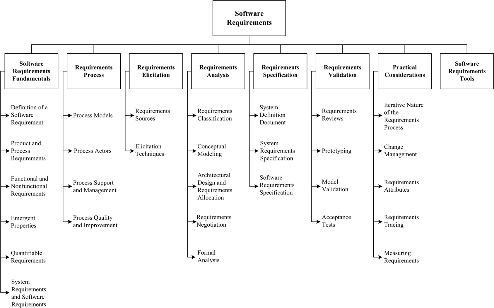

Some software requirements generate implicit process requirements. The choice

of verification technique is one example. Another might be the use of

particularly rigorous analysis techniques (such as formal specification

methods) to reduce faults that can lead to inadequate reliability. Process

requirements may also be imposed directly by the development organization,

their customer, or a third party such as a safety regulator.

\#### 1.3. Functional and Nonfunctional Requirements

\\_Functional\\_ requirements describe the functions that the software is to

execute; for example, formatting some text or modulating a signal. They are

sometimes known as capabilities or features. A functional requirement can also

be described as one for which a finite set of test steps can be written to

validate its behavior.

\\_Nonfunctional\\_ requirements are the ones that act to constrain the solution.

Nonfunctional requirements are sometimes known as constraints or quality

requirements. They can be further classified according to whether they are

performance requirements, maintainability requirements, safety requirements,

reliability requirements, security requirements, interoperability requirements

or one of many other types of software requirements (see Models and Quality

Characteristics in the Software Quality KA).

\#### 1.4. Emergent Properties

Some requirements represent emergent properties of software that is,

requirements that cannot be addressed by a single component but that depend

on how all the software components interoperate. The throughput requirement for

a call center would, for example, depend on how the telephone system,

information system, and the operators all interacted under actual operating

conditions. Emergent properties are crucially dependent on the system

architecture.

\#### 1.5. Quantifiable Requirements

Software requirements should be stated as clearly and as unambiguously as

possible, and, where appropriate, quantitatively. It is important to avoid

vague and unverifiable requirements that depend for their interpretation on

subjective judgment (“the software shall be reliable”; “the software shall be

user-friendly”). This is particularly important for nonfunctional requirements.

Two examples of quantified requirements are the following: a call center’s

software must increase the center’s throughput by 20%; and a system shall have

a probability of generating a fatal error during any hour of operation of less

than 1 \\* 10^-8. The throughput requirement is at a very high level and will

need to be used to derive a number of detailed requirements. The reliability

requirement will tightly constrain the system architecture.

\#### 1.6. System Requirements and Software Requirements

In this topic, “system” means

an interacting combination of elements to accomplish a defined objective. These

include hardware, software, firmware, people, information, techniques,

facilities, services, and other support elements,

as defined by the International Council on Software and Systems

Engineering (INCOSE) [3].

\\_System\\_ requirements are the requirements for the system as a whole. In a system

containing software components, software requirements are derived from \\_system\\_

requirements. This KA defines “user requirements” in a restricted way, as the

requirements of the system’s customers or end users. System requirements, by

contrast, encompass user requirements, requirements of other stakeholders (such

as regulatory authorities), and requirements without an identifiable human

source.

\### 2. Requirements Process

<!-- [1\\*, c4s4] [2\\*, c1–4, c6, c22, c23] -->

This section introduces the software requirements process, orienting the

remaining five topics and showing how the requirements process dovetails with

the overall software engineering process.

\#### 2.1. Process Models

The objective of this topic is to provide an understanding that the

requirements process

- is not a discrete front-end activity of the software life cycle, but rather

a process initiated at the beginning of a project that continues to be

refined throughout the life cycle;

- identifies software requirements as configuration items and manages them

using the same software configuration management practices as other products

of the software life cycle processes;

- needs to be adapted to the organization and project context.

In particular, the topic is concerned with how the activities of elicitation,

analysis, specification, and validation are configured for different types of

projects and constraints. The topic also includes activities that provide input

into the requirements process, such as marketing and feasibility studies.

\#### 2.2. Process Actors

This topic introduces the roles of the people who participate in the

requirements process. This process is fundamentally interdisciplinary, and the

requirements specialist needs to mediate between the domain of the stakeholder

and that of software engineering. There are often many people involved besides

the requirements specialist, each of whom has a stake in the software. The

stakeholders will vary across projects, but will always include users/operators

and customers (who need not be the same). Typical examples of software

stakeholders include (but are not restricted to) the following:

- Users: This group comprises those who will operate the software. It is often

a heterogeneous group involving people with different roles and

requirements.

- Customers: This group comprises those who have commissioned the software or

who represent the software’s target market.

- Market analysts: A mass-market product will not have a commissioning

customer, so marketing people are often needed to establish what the market

needs and to act as proxy customers.

- Regulators: Many application domains, such as banking and public transport,

are regulated. Software in these domains must comply with the

requirements of the regulatory authorities.

- Software engineers: These individuals have a legitimate interest in profiting

from developing the software by, for example, reusing components in or from

other products. If, in this scenario, a customer of a particular product has

specific requirements that compromise the potential for component reuse, the

software engineers must carefully weigh their own stake against those of the

customer. Specific requirements, particularly constraints, may have major

impact on project cost or delivery because they either fit well or poorly

with the skill set of the engineers. Important tradeoffs among such

requirements should be identified.

It will not be possible to perfectly satisfy the requirements of every

stakeholder, and it is the software engineer’s job to negotiate tradeoffs that

are both acceptable to the principal stakeholders and within budgetary,

technical, regulatory, and other constraints. A prerequisite for this is that

all the stakeholders be identified, the nature of their “stake” analyzed, and

their requirements elicited.

\#### 2.3. Process Support and Management

This section introduces the project management resources required and consumed

by the requirements process. It establishes the context for the first topic

(Initiation and Scope Definition) of the Software Engineering Management KA.

Its principal purpose is to make the link between the process activities

identified in 2.1 and the issues of cost, human resources, training, and tools.

\#### 2.4. Process Quality and Improvement

This topic is concerned with the assessment of the quality and improvement of

the requirements process. Its purpose is to emphasize the key role the

requirements process plays in terms of the cost and timeliness of a software

product and of the customer’s satisfaction with it. It will help to orient the

requirements process with quality standards and process improvement models for

software and systems. Process quality and improvement is closely related to

both the Software Quality KA and Software Engineering Process KA, comprising

- requirements process coverage by process improvement standards and models;
- requirements process measures and benchmarking;
- improvement planning and implementation;
- security/CIA improvement/planning and implementation.

\### 3. Requirements Elicitation

<!-- [1, c4s5] [2, c5, c6, c9] -->

Requirements elicitation is concerned with the origins of software requirements

and how the software engineer can collect them. It is the first stage in

building an understanding of the problem the software is required to solve. It

is fundamentally a human activity and is where the stakeholders are

identified and relationships established between the development team and the

customer. It is variously termed “requirements capture,” “requirements

discovery,” and “requirements acquisition.”

One of the fundamental principles of a good requirements elicitation process is

that of effective communication between the various stakeholders. This

communication continues through the entire Software Development Life Cycle

(SDLC) process with different stakeholders at different points in time. Before

development begins, requirements specialists may form the conduit for this

communication. They must mediate between the domain of the software users (and

other stakeholders) and the technical world of the software engineer. A set of

internally consistent models at different levels of abstraction facilitate

communications between software users/stakeholders and software engineers.

A critical element of requirements elicitation is informing the project scope.

This involves providing a description of the software being specified and its

purpose and prioritizing the deliverables to ensure the customer’s most

important business needs are satisfied first. This minimizes the risk of

requirements specialists spending time eliciting requirements that are of low

importance, or those that turn out to be no longer relevant when the software

is delivered. On the other hand, the description must be scalable and

extensible to accept further requirements not expressed in the first formal

lists and compatible with the previous ones as contemplated in recursive

methods.

\#### 3.1. Requirements Sources

Requirements have many sources in typical software, and it is essential that

all potential sources be identified and evaluated. This topic is designed to

promote awareness of the various sources of software requirements and of the

frameworks for managing them. The main points covered are as follows:

- Goals. The term “goal” (sometimes called “business concern” or “critical

success factor”) refers to the overall, high-level objectives of the

software. Goals provide the motivation for the software but are often vaguely

formulated. Software engineers need to pay particular attention to assessing

the value (relative to priority) and cost of goals. A feasibility study is a

relatively low-cost way of doing this.

- Domain knowledge. The software engineer needs to acquire or have available

knowledge about the application domain. Domain knowledge provides the

background against which all elicited requirements knowledge must be set in

order to understand it. It’s a good practice to emulate an ontological

approach in the knowledge domain. Relations between relevant concepts within

the application domain should be identified.

- Stakeholders (see section 2.2, Process Actors). Much software has proved

unsatisfactory because it has stressed the requirements of one group of

stakeholders at the expense of others. Hence, the delivered software is

difficult to use, or subverts the cultural or political structures of the

customer organization. The software engineer needs to identify, represent,

and manage the “viewpoints” of many different types of stakeholders.

- Business rules. These are statements that define or constrain some aspect of

the structure or the behavior of the business itself. “A student cannot

register in next semester’s courses if there remain some unpaid tuition fees”

would be an example of a business rule that would be a requirement source for

a university’s course-registration software.

- The operational environment. Requirements will be derived from the

environment in which the software will be executed. These may be, for

example, timing constraints in real-time software or performance constraints

in a business environment. These must be sought out actively because they can

greatly affect software feasibility and cost as well as restrict design

choices.

- The organizational environment. Software is often required to support a

business process, the selection of which may be conditioned by the

structure, culture, and internal politics of the organization. The software

engineer needs to be sensitive to these since, in general, new software

should not force unplanned change on the business process.

\#### 3.2. Elicitation Techniques

Once the requirements sources have been identified, the software engineer can

start eliciting requirements information from them. Note that requirements are

seldom elicited ready-made. Rather, the software engineer elicits information

from which he or she formulates requirements. This topic concentrates on

techniques for getting human stakeholders to articulate requirements-relevant

information. It is a very difficult task and the software engineer needs to be

sensitized to the fact that (for example) users may have difficulty describing

their tasks, may leave important information unstated, or may be unwilling or

unable to cooperate. It is particularly important to understand that

elicitation is not a passive activity and that, even if cooperative and

articulate stakeholders are available, the software engineer has to work hard

to elicit the right information. Many business or technical requirements are

tacit or in feedback that has yet to be obtained from end users. The impor

tance of planning, verification, and validation in requirements elicitation

cannot be overstated. A number of techniques exist for requirements

elicitation; the principal ones are these:

- Interviews. Interviewing stakeholders is a “traditional” means of eliciting

requirements. It is important to understand the advantages and limitations of

interviews and how they should be conducted.

- Scenarios. Scenarios provide a valuable means for providing context to the

elicitation of user requirements. They allow the software engineer to provide

a framework for questions about user tasks by permitting “what if” and “how

is this done” questions to be asked. The most common type of scenario is the

use case description. There is a link here to topic 4.2 (Conceptual Modeling)

because scenario notations such as use case diagrams are common in modeling

software.

- Prototypes. This technique is a valuable tool for clarifying ambiguous

requirements. They can act in a similar way to scenarios by providing users

with a context within which they can better understand what information they

need to provide. There is a wide range of prototyping techniques from paper

mockups of screen designs to beta-test versions of software products and a

strong overlap of their separate uses for requirements elicitation and for

requirements validation (see section 6.2, Prototyping). Low fidelity

prototypes are often preferred to avoid stakeholder “anchoring” on minor,

incidental characteristics of a higher quality prototype that can limit

design flexibility in unintended ways.

- Facilitated meetings. The purpose of these meetings is to try to achieve a

summative effect, whereby a group of people can bring more insight into their

software requirements than by working individually. They can brainstorm and

refine ideas that may be difficult to bring to the surface using interviews.

Another advantage is that conflicting requirements surface early on in a way

that lets the stakeholders recognize where these occur. When it works well,

this technique may result in a richer and more consistent set of requirements

than might otherwise be achievable. However, meetings need to be handled

carefully (hence the need for a facilitator) to prevent a situation in which

the critical abilities of the team are eroded by group loyalty, or in which

requirements reflecting the concerns of a few outspoken (and perhaps senior)

people that are favored to the detriment of others.

- Observation. The importance of software context within the organizational

environment has led to the adaptation of observational techniques such as

ethnography for requirements elicitation. Software engineers learn about user

tasks by immersing themselves in the environment and observing how users

perform their tasks by interacting with each other and with software tools

and other resources. These techniques are relatively expensive but also

instructive because they illustrate that many user tasks and business

processes are too subtle and complex for their actors to describe easily.

- User stories. This technique is commonly used in adaptive methods (see Agile

Methods in the Software Engineering Models and Methods KA) and refers to

short, high-level descriptions of required functionality expressed in

customer terms. A typical user story has the form: \\_“As a <role>, I want

<goal/desire> so that <benefit>.”\\_ A user story is intended to contain just

enough information so that the developers can produce a reasonable estimate

of the effort to implement it. The aim is to avoid some of the waste that

often happens in projects where detailed requirements are gathered early but

become invalid before the work begins. Before a user story is implemented, an

appropriate acceptance procedure must be written by the customer to determine

whether the goals of the user story have been fulfilled.

- Other techniques. A range of other techniques for supporting the elicitation

of requirements information exist and range from analyzing competitors’

products to applying data mining techniques to using sources of domain

knowledge or customer request databases.

\### 4. Requirements Analysis

<!-- [1\\*, c4s1, c4s5, c10s4, c12s5] [2\\*, c7, c11, c12, c17] -->

This topic is concerned with the process of analyzing requirements to

- detect and resolve conflicts between requirements;
- discover the bounds of the software and how it must interact with its

organizational and operational environment;

- elaborate system requirements to derive software requirements.

The traditional view of requirements analysis has been that it be reduced to

conceptual modeling using one of a number of analysis methods, such as the

structured analysis method. While conceptual modeling is important, we include

the classification of requirements to help inform tradeoffs between

requirements (requirements classification) and the process of establishing

these tradeoffs (requirements negotiation). Care must be taken to describe

requirements precisely enough to enable the requirements to be validated, their

implementation to be verified, and their costs to be estimated.

\#### 4.1. Requirements Classification

Requirements can be classified on a number of dimensions. Examples include the

following:

- Whether the requirement is functional or nonfunctional (see section 1.3,

Functional and Nonfunctional Requirements).

- Whether the requirement is derived from one or more high-level requirements

or an emergent property (see section 1.4, Emergent Properties), or is being

imposed directly on the software by a stakeholder or some other source.

- Whether the requirement is on the product or the process (see section 1.2,

Product and Process Requirements). Requirements on the process can constrain

the choice of contractor, the software engineering process to be adopted,

or the standards to be adhered to.

- The requirement priority. The higher the priority, the more essential the

requirement is for meeting the overall goals of the software. Often

classified on a fixed-point scale such as mandatory, highly desirable,

desirable, or optional, the priority often has to be balanced against the

cost of development and implementation.

- The scope of the requirement. Scope refers to the extent to which a

requirement affects the software and software components. Some requirements,

particularly certain nonfunctional ones, have a global scope in that their

satisfaction cannot be allocated to a discrete component. Hence, a

requirement with global scope may strongly affect the software architecture

and the design of many components, whereas one with a narrow scope may offer

a number of design choices and have little impact on the satisfaction of

other requirements.

- Volatility/stability. Some requirements will change during the life cycle of

the software and even during the development process itself. It is useful if

some estimate of the likelihood that a requirement will change can be made.

For example, in a banking application, requirements for functions to

calculate and credit interest to customers’ accounts are likely to be more

stable than a requirement to support a particular kind of tax-free account.

The former reflects a fundamental feature of the banking domain (that

accounts can earn interest), while the latter may be rendered obsolete by a

change to government legislation. Flagging potentially volatile requirements

can help the software engineer establish a design that is more tolerant of

change.

Other classifications may be appropriate, depending upon the organization’s

normal practice and the application itself. There is a strong overlap between

requirements classification and requirements attributes (see section 7.3,

Requirements Attributes).

\#### 4.2. Conceptual Modeling

The development of models of a real-world problem is key to software

requirements analysis. Their purpose is to aid in understanding the situation

in which the problem occurs, as well as depicting a solution. Hence, conceptual

models comprise models of entities from the problem domain, configured to

reflect their real-world relationships and dependencies. This topic is closely

related to the Software Engineering Models and Methods KA.

Several kinds of models can be developed. These include use case diagrams, data

flow models, state models, goal-based models, user interactions, object models,

data models, and many others. Many of these modeling notations are part of the

\\_Unified Modeling Language (UML)\\_. Use case diagrams, for example, are routinely

used to depict scenarios where the boundary separates the actors (users or

systems in the external environment) from the internal behavior where each use

case depicts a functionality of the system. The factors that influence the

choice of modeling notation include these:

- The nature of the problem. Some types of software demand that certain aspects

be analyzed particularly rigorously. For example, state and parametric

models, which are part of SysML [4], are likely to be more important for

real-time software than for information systems, while it would usually be

the opposite for object and activity models.

- The expertise of the software engineer. It is often more productive to adopt

a modeling notation or method with which the software engineer has

experience.

- The process requirements of the customer (see section 1.2, Product and

Process Requirements). Customers may impose their favored notation or method

or prohibit any with which they are unfamiliar. This factor can conflict with

the previous factor.

Note that, in almost all cases, it is useful to start by building a model of

the software context. The software context provides a connection between the

intended software and its external environment.

This is crucial to understanding the software’s context in its operational

environment and to identifying its interfaces with the environment. This

subtopic does not seek to “teach” a particular modeling style or notation but

rather provides guidance on the purpose and intent of modeling.

\#### 4.3. Architectural Design and Requirements Allocation

At some point, the solution architecture must be derived. Architectural design

is the point at which the requirements process overlaps with software or

systems design and illustrates how impossible it is to cleanly decouple the two

tasks. This topic is closely related to Software Structure and Architecture in

the Software Design KA. In many cases, the software engineer acts as software

architect because the process of analyzing and elaborating the requirements

demands that the architecture/design components that will be responsible for

satisfying the requirements be identified. This is requirements allocation –

the assignment to architecture components responsible for satisfying the

requirements.

Allocation is important to permit detailed analysis of requirements. Hence, for

example, once a set of requirements has been allocated to a component, the

individual requirements can be further analyzed to discover further

requirements on how the component needs to interact with other components in

order to satisfy the allocated requirements. In large projects, allocation

stimulates a new round of analysis for each subsystem. As an example,

requirements for a particular braking performance for a car (braking distance,

safety in poor driving conditions, smoothness of application, pedal pressure

required, and so on) may be allocated to the braking hardware (mechanical and

hydraulic assemblies) and an antilock braking system (ABS). Only when a

requirement for an antilock braking system has been identified, and the

requirements allocated to it, can the capabilities of the ABS, the braking

hardware, and emergent properties (such as car weight) be used to identify

the detailed ABS software requirements.

Architectural design is closely identified with conceptual modeling (see

section 4.2, Conceptual Modeling).

\#### 4.4. Requirements Negotiation

Another term commonly used for this subtopic is “conflict resolution.” This

concerns resolving problems with requirements where conflicts occur between two

stakeholders requiring mutually incompatible features, between requirements and

resources, or between functional and non-functional requirements, for example.

In most cases, it is unwise for the software engineer to make a unilateral

decision, so it becomes necessary to consult with the stakeholder(s) to reach a

consensus on an appropriate tradeoff. It is often important, for contractual

reasons, that such decisions be traceable back to the customer. We have

classified this as a software requirements analysis topic because problems

emerge as the result of analysis. However, a strong case can also be made for

considering it a requirements validation topic (see topic 6, Requirements

Validation).

Requirements prioritization is necessary, not only as a means to filter

important requirements, but also in order to resolve conflicts and plan for

staged deliveries, which means making complex decisions that require detailed

domain knowledge and good estimation skills. However, it is often difficult to

get real information that can act as a basis for such decisions. In addition,

requirements often depend on each other, and priorities are relative. In

practice, software engineers perform requirements prioritization frequently

without knowing about all the requirements. Requirements prioritization may

follow a cost-value approach that involves an analysis from the stakeholders

defining in a scale the benefits or the aggregated value that the

implementation of the requirement brings them, versus the penalties of not

having implemented a particular requirement. It also involves an analysis from

the software engineers estimating in a scale the cost of implementing each

requirement, relative to other requirements. Another requirements

prioritization approach called the analytic hierarchy process involves

comparing all unique pairs of requirements to determine which of the two is of

higher priority, and to what extent.

\#### 4.5. Formal Analysis

Formal analysis concerns not only topic 4, but also sections 5.3 and 6.3. This

topic is also related to Formal Methods in the Software Engineering Models and

Methods Knowledge Area.

Formal analysis has made an impact on some application domains, particularly

those of high-integrity systems. The formal expression of requirements requires

a language with formally defined semantics. The use of a formal analysis for

requirements expression has two benefits. First, it enables requirements

expressed in the language to be specified precisely and unambiguously, thus (in

principle) avoiding the potential for misinterpretation. Secondly, requirements

can be reasoned over, permitting desired properties of the specified software

to be proven. Formal reasoning requires tool support to be practicable for

anything other than trivial systems, and tools generally fall into two types:

theorem provers or model checkers. In neither case can proof be fully

automated, and the level of competence in formal reasoning needed in order to

use the tools restricts the wider application of formal analysis.

Most formal analysis is focused on relatively late stages of requirements

analysis. It is generally counterproductive to apply formalization until the

business goals and user requirements have come into sharp focus through means

such as those described elsewhere in section 4. However, once the requirements

have stabilized and have been elaborated to specify concrete properties of the

software, it may be beneficial to formalize at least the critical requirements.

This permits static validation that the software specified by the requirements

does indeed have the properties (for example, absence of deadlock) that the

customer, users, and software engineer expect it to have.

\### 5. Requirements Specification

<!-- [1\\*, c4s2, c4s3, c12s2–5] [2\\*, c10] -->

For most engineering professions, the term “specification” refers to the

assignment of numerical values or limits to a product’s design goals. In

software engineering, “software requirements specification” typically refers to

the production of a document that can be systematically reviewed, evaluated,

and approved. For complex systems, particularly those involving substantial

nonsoftware components, as many as three different types of documents are

produced: system definition, system requirements, and software requirements.

For simple software products, only the third of these is required. All three

documents are described here, with the understanding that they may be combined

as appropriate. A description of systems engineering can be found in the

Related Disciplines of Software Engineering chapter of this \\_Guide\\_.

\#### 5.1. System Definition Document

This document (sometimes known as the user requirements document or concept of

operations document) records the system requirements. It defines the high-level

system requirements from the domain perspective. Its readership includes

representatives of the system users/customers (marketing may play these roles

for market-driven software), so its content must be couched in terms of the

domain. The document lists the system requirements along with background

information about the overall objectives for the system, its target

environment, and a statement of the constraints, assumptions, and

nonfunctional requirements. It may include conceptual models designed to

illustrate the system context, usage scenarios, and the principal domain

entities, as well as workflows.

\#### 5.2. System Requirements Specification

Developers of systems with substantial software and nonsoftware components - a

modern airliner, for example - often separate the description of system

requirements from the description of software requirements. In this view,

system requirements are specified, the software requirements are derived from

the system requirements, and then the requirements for the software components

are specified. Strictly speaking, system requirements specification is a

systems engineering activity and falls outside the scope of this Guide.

\#### 5.3. Software Requirements Specification

Software requirements specification establishes the basis for agreement between

customers and contractors or suppliers (in market-driven projects, these

roles may be played by the marketing and development divisions) on what the

software product is to do as well as what it is not expected to do.

Software requirements specification permits a rigorous assessment of

requirements before design can begin and reduces later redesign. It should also

provide a realistic basis for estimating product costs, risks, and schedules.

Organizations can also use a software requirements specification document as

the basis for developing effective verification and validation plans.

Software requirements specification provides an informed basis for transferring

a software product to new users or software platforms. Finally, it can provide

a basis for software enhancement.

Software requirements are often written in natural language, but, in software

requirements specification, this may be supplemented by formal or semiformal

descriptions. Selection of appropriate notations permits particular

requirements and aspects of the software architecture to be described more

precisely and concisely than natural language. The general rule is that

notations should be used that allow the requirements to be described as

precisely as possible. This is particularly crucial for safety-critical,

regulatory, and certain other types of dependable software. However, the choice

of notation is often constrained by the training, skills, and preferences of

the document’s authors and readers.

A number of quality indicators have been developed that can be used to relate

the quality of software requirements specification to other project variables

such as cost, acceptance, performance, schedule, and reproducibility. Quality

indicators for individual software requirements specification statements

include imperatives, directives, weak phrases, options, and continuances.

Indicators for the entire software requirements specification document

include size, readability, specification, depth, and text structure.

\### 6. Requirements Validation

<!-- [1, c4s6] [2, c13, c15] -->

The requirements documents may be subject to validation and verification

procedures. The requirements may be validated to ensure that the software

engineer has understood the requirements; it is also important to verify that a

requirements document conforms to company standards and that it is

understandable, consistent, and complete. In cases where documented company

standards or terminology are inconsistent with widely accepted standards, a

mapping between the two should be agreed on and appended to the document.

Formal notations offer the important advantage of permitting the last two

properties to be proven (in a restricted sense, at least). Different

stakeholders, including representatives of the customer and developer, should

review the document(s).  Requirements documents are subject to the same

configuration management practices as the other deliverables of the software

life cycle processes.  When practical, the individual requirements are also

subject to configuration management, generally using a requirements management

tool (see topic 8, Software Requirements Tools). It is normal to explicitly

schedule one or more points in the requirements process where the requirements

are validated. The aim is to pick up any problems before resources are

committed to addressing the requirements. Requirements validation is concerned

with the process of examining the requirements document to ensure that it

defines the right software (that is, the software that the users expect).

\#### 6.1. Requirements Reviews

Perhaps the most common means of validation is by inspection or reviews of the

requirements document(s). A group of reviewers is assigned a brief to look for

errors, mistaken assumptions, lack of clarity, and deviation from standard

practice. The composition of the group that conducts the review is important

(at least one representative of the customer should be included for a

customer-driven project, for example), and it may help to provide guidance on

what to look for in the form of checklists.

Reviews may be constituted on completion of the system definition document, the

system specification document, the software requirements specification

document, the baseline specification for a new release, or at any other step in

the process.

\#### 6.2. Prototyping

Prototyping is commonly a means for validating the software engineer’s

interpretation of the software requirements, as well as for eliciting new

requirements. As with elicitation, there is a range of prototyping techniques

and a number of points in the process where prototype validation may be

appropriate. The advantage of prototypes is that they can make it easier to

interpret the software engineer’s assumptions and, where needed, give useful

feedback on why they are wrong. For example, the dynamic behavior of a user

interface can be better understood through an animated prototype than through

textual description or graphical models. The volatility of a requirement that

is defined after prototyping has been done is extremely low because there is

agreement between the stakeholder and the software engineer - therefore, for

safety-critical and crucial features prototyping would really help. There are

also disadvantages, however. These include the danger of users’ attention being

distracted from the core underlying functionality by cosmetic issues or quality

problems with the prototype. For this reason, some advocate prototypes that

avoid software, such as flip-chart-based mockups. Prototypes may be costly to

develop. However, if they avoid the wastage of resources caused by trying to

satisfy erroneous requirements, their cost can be more easily justified. Early

prototypes may contain aspects of the final solution. Prototypes may be

evolutionary as opposed to throwaway.

\#### 6.3. Model Validation

It is typically necessary to validate the quality of the models developed

during analysis. For example, in object models, it is useful to perform a

static analysis to verify that communication paths exist between objects that,

in the stakeholders’ domain, exchange data. If formal analysis notations are

used, it is possible to use formal reasoning to prove specification properties.

This topic is closely related to the Software Engineering Models and Methods

KA.

\#### 6.4. Acceptance Tests

An essential property of a software requirement is that it should be possible

to validate that the finished product satisfies it. Requirements that cannot be

validated are really just “wishes.” An important task is therefore planning how

to verify each requirement. In most cases, designing acceptance tests does this

for how end-users typically conduct business using the system. Identifying and

designing acceptance tests may be difficult for nonfunctional requirements

(see section 1.3, Functional and Nonfunctional Requirements). To be

validated, they must first be analyzed and decomposed to the point where

they can be expressed quantitatively. Additional information can be found

in Acceptance/Qualification/Conformance Testing in the Software Testing KA.

\### 7. Practical Considerations

<!-- [1\\*, c4s1, c4s4, c4s6, c4s7] [2\\*, c3, c12, c14, c16, c18–21] -->

The first level of topic decomposition presented in this KA may seem to

describe a linear sequence of activities. This is a simplified view of the

process.

The requirements process spans the whole software life cycle. Change management

and the maintenance of the requirements in a state that accurately mirrors the

software to be built, or that has been built, are key to the success of the

software engineering process.

Not every organization has a culture of documenting and managing requirements.

It is common in dynamic start-up companies, driven by a strong “product

vision” and limited resources, to view requirements documentation as

unnecessary overhead. Most often, however, as these companies expand, as their

customer base grows, and as their product starts to evolve, they discover that

they need to recover the requirements that motivated product features in order

to assess the impact of proposed changes. Hence, requirements documentation and

change management are key to the success of any requirements process.

\#### 7.1. Iterative Nature of the Requirements Process

There is general pressure in the software industry for ever shorter development

cycles, and this is particularly pronounced in highly competitive,

market-driven sectors. Moreover, most projects are constrained in some way by

their environment, and many are upgrades to, or revisions of, existing software

where the architecture is a given. In practice, therefore, it is almost always

impractical to implement the requirements process as a linear, deterministic

process in which software requirements are elicited from the stakeholders,

baselined, allocated, and handed over to the software development team. It is

certainly a myth that the requirements for large software projects are ever

perfectly understood or perfectly specified. Instead, requirements typically

iterate towards a level of quality and detail that is sufficient to permit

design and procurement decisions to be made. In some projects, this may result

in the requirements being baselined before all their properties are fully

understood. This risks expensive rework if problems emerge late in the soft-

ware engineering process. However, software engineers are necessarily

constrained by project management plans and must therefore take steps to ensure

that the “quality” of the requirements is as high as possible given the

available resources. They should, for example, make explicit any assumptions

that underpin the requirements as well as any known problems.

For software products that are developed iteratively, a project team may

baseline only those requirements needed for the current iteration. The

requirements specialist can continue to develop requirements for future

iterations, while developers proceed with design and construction of the

current iteration. This approach provides customers with business value

quickly, while minimizing the cost of rework.

In almost all cases, requirements understanding continues to evolve as design

and development proceeds. This often leads to the revision of requirements late

in the life cycle. Perhaps the most crucial point in understanding software

requirements is that a significant proportion of the requirements will change.

This is sometimes due to errors in the analysis, but it is frequently an

inevitable consequence of change in the “environment” - for example, the

customer’s operating or business environment, regulatory processes imposed by

the authorities, or the market into which software must sell. Whatever the

cause, it is important to recognize the inevitability of change and take steps

to mitigate its effects. Change has to be managed by ensuring that proposed

changes go through a defined review and approval process and by applying

careful requirements tracing, impact analysis, and software configuration

management (see the Software Configuration Management KA). Hence, the

requirements process is not merely a front-end task in software development,

but spans the whole software life cycle. In a typical project, the software

requirements activities evolve over time from elicitation to change management.

A combination of top-down analysis and design methods and bottom-up

implementation and refactoring methods that meet in the middle could provide

the best of both worlds. However, this is difficult to achieve in practice, as

it depends heavily upon the maturity and expertise of the software engineers.

\#### 7.2. Change Management

Change management is central to the management of requirements. This topic

describes the role of change management, the procedures that need to be in

place, and the analysis that should be applied to proposed changes. It has

strong links to the Software Configuration Management KA.

\#### 7.3. Requirements Attributes

Requirements should consist not only of a specification of what is required,

but also of ancillary information, which helps manage and interpret the

requirements. Requirements attributes must be defined, recorded, and updated as

the software under development or maintenance evolves. This should include the

various classification dimensions of the requirement (see section 4.1,

Requirements Classification) and the verification method or relevant acceptance

test plan section. It may also include additional information, such as a

summary rationale for each requirement, the source of each requirement, and a

change history. The most important requirements attribute, however, is an

identifier that allows the requirements to be uniquely and unambiguously

identified.

\#### 7.4. Requirements Tracing

Requirements tracing is concerned with recovering the source of requirements

and predicting the effects of requirements. Tracing is fundamental to

performing impact analysis when requirements change. A requirement should be

traceable backward to the requirements and stakeholders that motivated it (from

a software requirement back to the system requirement(s) that it helps satisfy,

for example). Conversely, a requirement should be traceable forward into the

requirements and design entities that satisfy it (for example, from a

system requirement into the software requirements that have been elaborated

from it, and on into the code modules that implement it, or the test cases

related to that code and even a given section on the user manual which

describes the actual functionality) and into the test case that verifies

it.

The requirements tracing for a typical project will form a complex directed

acyclic graph (DAG) (see Graphs in the Computing Foundations KA) of

requirements. Maintaining an up-to-date graph or traceability matrix is an

activity that must be considered during the whole life cycle of a product. If

the traceability information is not updated as changes in the requirements

continue to happen, the traceability information becomes unreliable for impact

analysis.

\#### 7.5. Measuring Requirements

As a practical matter, it is typically useful to have some concept of the

“volume” of the requirements for a particular software product. This number is

useful in evaluating the “size” of a change in requirements, in estimating the

cost of a development or maintenance task, or simply for use as the denominator

in other measurements. Functional size measurement (FSM) is a technique for

evaluating the size of a body of functional requirements. Additional

information on size measurement and standards will be found in the Software

Engineering Process KA.

\### 8. Software Requirements Tools

Tools for dealing with software requirements fall broadly into two categories:

tools for modeling and tools for managing requirements. Requirements management

tools typically support a range of activities - including documentation,

tracing, and change management and have had a significant impact on practice.

Indeed, tracing and change management are really only practicable if

supported by a tool. Since requirements management is fundamental to good

requirements practice, many organizations have invested in requirements

management tools, although many more manage their requirements in more ad hoc

and generally less satisfactory ways (e.g., using spreadsheets).

\### Matrix of topics vs. Reference material

Sommerville 2011

[1]

Wiegers 2003

[2]

\\*\\*1. Software Requirements Fundamentals\\*\\*

1\.1. Definition of a Software Requirement c4 c1

1\.2. Product and Process Requirements c4s1 c1, c6

1\.3. Functional and Nonfunctional Requirements c4s1 c12

1\.4. Emergent Properties c10 s1

1\.5. Quantifiable Requirements c1

1\.6. System Requirements and Software Requirements c10s4 c1

\\*\\*2. Requirements Process\\*\\*

2\.1. Process Models c4s4 c3

2\.2. Process Actors c1, c2, c4, c6

2\.3. Process Support and Management c3

2\.4. Process Quality and Improvement c22, c23

\\*\\*3. Requirements Elicitation\\*\\*

3\.1. Requirements Sources c4s5 c5, c6,c9

3\.2. Elicitation Techniques c4s5 c6

\\*\\*4. Requirements Analysis\\*\\*

4\.1. Requirements Classification c4s1 c12

4\.2. Conceptual Modeling c4s5 c11

4\.3. Architectural Design and Requirements Allocation c10s4 c17

4\.4. Requirements Negotiation c4s5 c7

4\.5. Formal Analysis c12s5

\\*\\*5. Requirements Specification\\*\\*

5\.1. System Definition Document c4s2 c10

5\.2. System Requirements Specification c4s2, c12s2, c12s3, c12s4, c12s5 c10

5\.3. Software Requirements Specification c4s3 c10

\\*\\*6. Requirements Validation\\*\\*

6\.1. Requirements Reviews c4s6 c15

6\.2. Prototyping c4s6 c13

6\.3. Model Validation c4s6 c15

6\.4. Acceptance Tests c4s6 c15

\\*\\*7. Practical Considerations\\*\\*

7\.1. Iterative Nature of the Requirements Process c4s4 c3, c16

7\.2. Change Management c4s7 c18, c19

7\.3. Requirements Attributes c4s1 c12, c14

7\.4. Requirements Tracing c20

7\.5. Measuring Requirements c4s6 c18

\\*\\*8. Software Requirements Tools\\*\\* c21

\\*\\*Further Readings\\*\\*

1. Alexander and L. Beus-Dukic, \\_Discovering Requirements\\_ [5].

An easily digestible and practically oriented book on software requirements,

this is perhaps the best of current textbooks on how the various elements of

software requirements fit together. It is full of practical advice on (for

example) how to identify the various system stakeholders and how to evaluate

alternative solutions. Its coverage is exemplary and serves as a useful

reference for key techniques such as use case modeling and requirements

prioritization.

C. Potts, K. Takahashi, and A. Antón, “Inquiry-Based Requirements Analysis” [6].

This paper is an easily digested account of work that has proven to be very

influential in the development of requirements handling. It describes how and

why the elaboration of requirements cannot be a linear process by which the

analyst simply transcribes and reformulates requirements elicited from the

customer. The role of scenarios is described in a way that helps to define

their use in discovering and describing requirements.

- van Lamsweerde, Requirements Engineering: From System Goals to UML Models to

Software Specifications [7].

Serves as a good introduction to requirements engineering but its unique value

is as a reference book for the KAOS goal-oriented requirements modelling

language. Explains why goal modelling is useful and shows how it can integrate

with mainstream modelling techniques using UML.

O. Gotel and A. Finkelstein, “An Analysis of the Requirements Traceability

Problem” [8].

This paper is a classic reference work on a key element of requirements

management. Based on empirical studies, it sets out the reasons for and the

barriers to the effective tracing of requirements. It is essential reading for

an understanding of why requirements tracing is an essential element of an

effective software process.

N. Maiden and C. Ncube, “Acquiring COTS Software Selection Requirements” [9].

This paper is significant because it recognises explicitly that software

products often integrate third-party components. It offers insights into the

problems of selecting off-the-shelf software to satisfy requirements: there is

usually a mismatch. This challenges some of the assumptions underpinning much

of traditional requirements handling, which tends to assume custom software.

\\*\\*References\\*\\*

[1] I. Sommerville, \\_Software Engineering\\_, 9th ed., Addison-Wesley, 2011.

[2] K.E. Wiegers, \\_Software Requirements\\_, 2nd ed., Microsoft Press, 2003.

[3] INCOSE, \\_Systems Engineering Handbook: A Guide for System Life Cycle

Processes and Activities\\_, version 3.2.2, International Council on Systems

Engineering, 2012.

[4] S. Friedenthal, A. Moore, and R. Steiner, \\_A Practical Guide to SysML: The

Systems Modeling Language\\_, 2nd ed., Morgan Kaufmann, 2012.

[5] I. Alexander and L. Beus-Deukic, \\_Discovering Requirements: How to Specify

Products and Services\\_, Wiley, 2009.

[6] C. Potts, K. Takahashi, and A.I. Antón, “Inquiry-Based Requirements

Analysis,” IEEE Software, vol. 11, no. 2, Mar. 1994, pp. 21–32.

[7] A. van Lamsweerde, Requirements Engineering: From System Goals to UML

Models to Software Specifications, Wiley, 2009.

[8] O. Gotel and C.W. Finkelstein, “An Analysis of the Requirements

Traceability Problem,” Proc. 1st Int’l Conf. Requirements Eng., IEEE, 1994.

[9] N.A. Maiden and C. Ncube, “Acquiring COTS Software Selection Requirements,”

IEEE Software, vol. 15, no. 2, Mar.–Apr.  1998, pp. 46–56.

\## Chapter 2: Software Design

\\*\\*Acronyms\\*\\*

ADL Architecture Description Language

CBD Component-Based Design

CRC Class Responsibility Collaborator

DFD Data Flow Diagram

ERD Entity Relationship Diagram

IDL Interface Description Language

MVC Model View Controller

OO Object-Oriented

PDL Program Design Language

\\*\\*Introduction\\*\\*

Design is defined as both “the process of defining the architecture,

components, interfaces, and other characteristics of a system or component” and

“the result of [that] process” [1]. Viewed as a process, software design is the

software engineering life cycle activity in which software requirements are

analyzed in order to produce a description of the software’s internal structure

that will serve as the basis for its construction. A software design (the

result) describes the software architecture - that is, how software is

decomposed and organized into components - and the interfaces between those

components. It should also describe the components at a level of detail that

enables their construction.

Software design plays an important role in developing software: during software

design, software engineers produce various models that form a kind of blueprint

of the solution to be implemented. We can analyze and evaluate these models to

determine whether or not they will allow us to fulfill the various

requirements.

We can also examine and evaluate alternative solutions and tradeoffs. Finally,

we can use the resulting models to plan subsequent development activities, such

as system verification and validation, in addition to using them as inputs and

as the starting point of construction and testing. In a standard list of

software life cycle processes, such as that in ISO/IEC/IEEE Std. 12207,

Software Life Cycle Processes [2], software design consists of two activities

that fit between software requirements analysis and software construction:

- Software architectural design (sometimes called high-level design): develops

top-level structure and organization of the software and identifies the

various components.

- Software detailed design: specifies each component in sufficient detail to

facilitate its construction.

This Software Design knowledge area (KA) does not discuss every topic that

includes the word “design.” In Tom DeMarco’s terminology [3], the topics

discussed in this KA deal mainly with D-design (decomposition design), the goal

of which is to map software into component pieces. However, because of its

importance in the field of software architecture, we will also address

FP-design (family pattern design), the goal of which is to establish

exploitable commonalities in a family of software products. This KA does not

address I-design (invention design), which is usually performed during the

software requirements process with the goal of conceptualizing and specifying

software to satisfy discovered needs and requirements, since this topic is

considered to be part of the requirements process (see the Software

Requirements KA).

This Software Design KA is related specifically to the Software Requirements,

Software Construction, Software Engineering Management, Software Engineering

Models and Methods, Software Quality, and Computing Foundations KAs.

\\*\\*Breakdown Of Topics For Software Design\\*\\*

The breakdown of topics for the Software Design KA is shown in Figure 2.1.

\### 1. Software Design Fundamentals

The concepts, notions, and terminology introduced here form an underlying basis

for understanding the role and scope of software design.

\#### 1.1. General Design Concepts

<!-- [4\\*, c1] -->

In the general sense, design can be viewed as a form of problem solving. For

example, the concept of a wicked problem - a problem with no definitive

solution - is interesting in terms of understanding the limits of design. A

number of other notions and concepts are also of interest in understanding

design in its general sense: goals, constraints, alternatives, representations,

and solutions (see Problem Solving Techniques in the Computing Foundations KA).

\#### 1.2. Context of Software Design

<!-- [4\\*, c3] -->

Software design is an important part of the software development process. To

understand the role of software design, we must see how it fits in the software

development life cycle. Thus, it is important to understand the major

characteristics of software requirements analysis, software design, software

construction, software testing, and software maintenance.

\#### 1.3. Software Design Process

<!-- [4\\*, c2] -->

Software design is generally considered a two-step process:

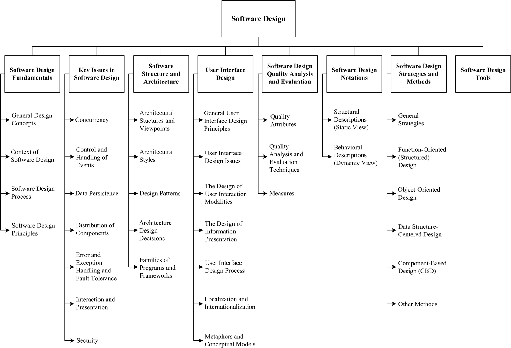

- Architectural design (also referred to as high-level design and top-level

design) describes how software is organized into components.

- Detailed design describes the desired behavior of these components.

The output of these two processes is a set of models and artifacts that record

the major decisions that have been taken, along with an explanation of the

rationale for each nontrivial decision. By recording the rationale, long-term

maintainability of the software product is enhanced.

\#### 1.4. Software Design Principles

<!-- [4] [5\\*, c6, c7, c21] [6\\*, c1, c8, c9] -->

A \\_principle\\_ is “a comprehensive and fundamental law, doctrine, or assumption”

[7]. Software design principles are key notions that provide the basis for many

different software design approaches and concepts. Software design principles

include abstraction; coupling and cohesion; decomposition and modularization;

encapsulation/information hiding; separation of interface and implementation;

sufficiency, completeness, and primitiveness; and separation of concerns.

- \\_Abstraction\\_ is “a view of an object that focuses on the information

relevant to a particular purpose and ignores the remainder of the

information” [1] (see Abstraction in the Computing Foundations KA). In the

context of software design, two key abstraction mechanisms are

parameterization and specification. Abstraction by parameterization abstracts

from the details of data representations by representing the data as named

parameters. Abstraction by specification leads to three major kinds of

abstraction: procedural abstraction, data abstraction, and control

(iteration) abstraction.

- \\_Coupling and Cohesion.\\_ Coupling is defined as “a measure of the

interdependence among modules in a computer program,” whereas cohesion is

defined as “a measure of the strength of association of the elements within a

module” [1].

- \\_Decomposition and modularization.\\_ Decomposing and modularizing means that

large software is divided into a number of smaller named components having

well-defined interfaces that describe component interactions. Usually the

goal is to place different functionalities and responsibilities in different

components.

- \\_Encapsulation and information hiding\\_ means grouping and packaging the

internal details of an abstraction and making those details inaccessible to

external entities.

- \\_Separation of interface and implementation.\\_ Separating interface and

implementation involves defining a component by specifying a public interface

(known to the clients) that is separate from the details of how the component

is realized (see encapsulation and information hiding above).

- \\_Sufficiency, completeness, and primitiveness.\\_ Achieving sufficiency and

completeness means ensuring that a software component captures all the

important characteristics of an abstraction and nothing more. Primitiveness

means the design should be based on patterns that are easy to implement.

- \\_Separation of concerns.\\_ A concern is an “area of interest with respect to a

software design” [8]. A design concern is an area of design that is relevant

to one or more of its stakeholders. Each architecture view frames one or more

concerns. Separating concerns by views allows interested stakeholders to

focus on a few things at a time and offers a means of managing complexity

[9].

\### 2. Key Issues in Software Design

A number of key issues must be dealt with when designing software. Some are

quality concerns that all software must address - for example, performance,

security, reliability, usability, etc. Another important issue is how to

decompose, organize, and package software components. This is so fundamental

that all design approaches address it in one way or another (see section 1.4,

Software Design Principles, and topic 7, Software Design Strategies and

Methods). In contrast, other issues “deal with some aspect of software’s

behavior that is not in the application domain, but which addresses some of the

supporting domains” [10]. Such issues, which often crosscut the system’s

functionality, have been referred to as \\_aspects\\_, which “tend not to be units

of software’s functional decomposition, but rather to be properties that affect

the performance or semantics of the components in systemic ways” [11]. A number

of these key, crosscutting issues are discussed in the following sections

(presented in alphabetical order).

\#### 2.1. Concurrency

<!-- [5\\*, c18] -->

Design for concurrency is concerned with decomposing software into processes,

tasks, and threads and dealing with related issues of efficiency, atomicity,

synchronization, and scheduling.

\#### 2.2. Control and Handling of Events

<!-- [5\\*, c21] -->

This design issue is concerned with how to organize data and control flow as

well as how to handle reactive and temporal events through various mechanisms

such as implicit invocation and call-backs.

\#### 2.3. Data Persistence

<!-- [12\\*, c9] -->

This design issue is concerned with how to handle long-lived data.

\#### 2.4. Distribution of Components

<!-- [5\\*, c18] -->

This design issue is concerned with how to distribute the software across the

hardware (including computer hardware and network hardware), how the components

communicate, and how middleware can be used to deal with heterogeneous

software.

\#### 2.5. Error and Exception Handling and Fault Tolerance

<!-- [5\\*, c18] -->

This design issue is concerned with how to prevent, tolerate, and process

errors and deal with exceptional conditions.

\#### 2.6. Interaction and Presentation

<!-- [5\\*, c16] -->

This design issue is concerned with how to structure and organize interactions

with users as well as the presentation of information (for example, separation

of presentation and business logic using the Model-View-Controller approach).

Note that this topic does not specify user interface details, which is the task

of user interface design (see topic 4, User Interface Design).

\#### 2.7. Security

<!-- [5\\*, c12, c18] [13\\*, c4] -->

Design for security is concerned with how to prevent unauthorized disclosure,

creation, change, deletion, or denial of access to information and other

resources. It is also concerned with how to tolerate security-related attacks

or violations by limiting damage, continuing service, speeding repair and

recovery, and failing and recovering securely. Access control is a fundamental

concept of security, and one should also ensure the proper use of cryptology.

\### 3. Software Structure and Architecture

In its strict sense, a software architecture is “the set of structures needed

to reason about the system, which comprise software elements, relations among

them, and properties of both” [14]. During the mid-1990s, however, software

architecture started to emerge as a broader discipline that involved the study

of software structures and architectures in a more generic way. This gave rise

to a number of interesting concepts about software design at different levels

of abstraction. Some of these concepts can be useful during the architectural

design (for example, architectural styles) as well as during the detailed

design (for example, design patterns). These design concepts can also be used

to design families of programs (also known as product lines). Interestingly,

most of these concepts can be seen as attempts to describe, and thus reuse,

design knowledge.

\#### 3.1. Architectural Structures and Viewpoints

<!-- [14\\*, c1] -->

Different high-level facets of a software design can be described and

documented. These facets are often called views: “A view represents a partial

aspect of a software architecture that shows specific properties of a software

system” [14]. Views pertain to distinct issues associated with software design

- for example, the logical view (satisfying the functional requirements) vs.

the process view (concurrency issues) vs. the physical view (distribution

issues) vs. the development view (how the design is broken down into

implementation units with explicit representation of the dependencies among the

units). Various authors use different terminologies - like behavioral vs.

functional vs. structural vs. data modeling views. In summary, a software

design is a multifaceted artifact produced by the design process and generally

composed of relatively independent and orthogonal views.

\#### 3.2. Architectural Styles

<!-- [14\\*, c1, c2, c3, c4, c5] -->

An architectural style is “a specialization of element and relation types,

together with a set of constraints on how they can be used” [14]. An

architectural style can thus be seen as providing the software’s high-level

organization. Various authors have identified a number of major architectural

styles:

- General structures (for example, layers, pipes and filters, blackboard)
- Distributed systems (for example, client-server, three-tiers, broker)
- Interactive systems (for example, Model-View-Controller,

Presentation-Abstraction-Control)

- Adaptable systems (for example, microkernel, reflection)
- Others (for example, batch, interpreters, process control, rule-based).

\#### 3.3. Design Pattern

<!-- [15\\*, c3, c4, c5] -->

Succinctly described, a pattern is “a common solution to a common problem in a

given context” [16]. While architectural styles can be viewed as patterns

describing the high-level organization of software, other design patterns can

be used to describe details at a lower level. These lower level design patterns

include the following:

- Creational patterns (for example, builder, factory, prototype, singleton)
- Structural patterns (for example, adapter, bridge, composite, decorator,

façade, fly-weight, proxy)

- Behavioral patterns (for example, command, interpreter, iterator, mediator,

memento, observer, state, strategy, template, visitor).

\#### 3.4. Architecture Design Decisions

<!-- [5\\*, c6] -->

Architectural design is a creative process. During the design process, software

designers have to make a number of fundamental decisions that profoundly affect

the software and the development process. It is useful to think of the archi-

tectural design process from a decision-making perspective rather than from an

activity perspective. Often, the impact on quality attributes and tradeoffs

among competing quality attributes are the basis for design decisions.

\#### 3.5. Families of Programs and Frameworks

<!-- [5\\*, c6, c7, c16] -->

One approach to providing for reuse of software designs and components is to

design families of programs, also known as software product lines. This can be

done by identifying the commonalities among members of such families and by

designing reusable and customizable components to account for the variability

among family members. In object-oriented (OO) programming, a key related notion

is that of a framework : a partially completed software system that can be

extended by appropriately instantiating specific extensions (such as plug-ins).

\### 4. User Interface Design

User interface design is an essential part of the software design process. User

interface design should ensure that interaction between the human and the

machine provides for effective operation and control of the machine. For

software to achieve its full potential, the user interface should be designed

to match the skills, experience, and expectations of its anticipated users.

\#### 4.1. General User Interface Design Principles

<!-- [5\\*, c29-web] [17\\*, c2]^1 -->

- \\_Learnability\\_. The software should be easy to learn so that the user can

rapidly start work- ing with the software.

- \\_User familiarity\\_. The interface should use terms and concepts drawn from

the experiences of the people who will use the software.

- \\_Consistency\\_. The interface should be consistent so that comparable

operations are activated in the same way.

- \\_Minimal surprise.\\_ The behavior of software should not surprise users.
- \\_Recoverability.\\_ The interface should provide mechanisms allowing users to

recover from errors.

- \\_User guidance.\\_ The interface should give meaningful feedback when errors

occur and provide context-related help to users.

- \\_User diversity\\_. The interface should provide appropriate interaction

mechanisms for diverse types of users and for users with different

capabilities (blind, poor eyesight, deaf, colorblind, etc.).

\#### \\_4.2. User Interface Design Issues

<!-- [5\\*, c29-web] [17\\*, c2] -->

User interface design should solve two key issues:

- How should the user interact with the software?
- How should information from the software be presented to the user?

1. Chapter 29 is a web-based chapter available

at [http://ifs.host.cs.st-andrews.ac.uk/Books/SE9/](http://ifs.host.cs.st-andrews.ac.uk/Books/SE9/)

WebChapters/.

User interface design must integrate user interaction and information

presentation. User interface design should consider a compromise between the

most appropriate styles of interaction and presentation for the software, the

background and experience of the software users, and the available devices.

\#### 4.3. The Design of User Interaction Modalities

<!-- [5\\*, c29-web] [17\\*, c2] -->

User interaction involves issuing commands and providing associated data to the

software. User interaction styles can be classified into the following

primary styles:

- \\_Question-answer.\\_ The interaction is essentially restricted to a single

question-answer exchange between the user and the software. The user issues a

question to the software, and the software returns the answer to the

question.

- \\_Direct manipulation\\_. Users interact with objects on the computer screen.

Direct manipulation often includes a pointing device (such as a mouse,

trackball, or a finger on touch screens) that manipulates an object and

invokes actions that specify what is to be done with that object.

- \\_Menu selection\\_. The user selects a command from a menu list of commands.
- \\_Form fill-in\\_. The user fills in the fields of a form. Sometimes fields

include menus, in which case the form has action buttons for the user to

initiate action.

- \\_Command language\\_. The user issues a command and provides related parameters

to direct the software what to do.

- \\_Natural language\\_. The user issues a command in natural language. That is,

the natural language is a front end to a command language and is parsed and

translated into software commands.

\#### 4.4. The Design of Information Presentation

<!-- [5\\*, c29-web] [17\\*, c2] -->

Information presentation may be textual or graphical in nature. A good design

keeps the information presentation separate from the information itself. The

MVC (Model-View-Controller) approach is an effective way to keep information

presentation separating from the information being presented.

Software engineers also consider software response time and feedback in the

design of information presentation. Response time is generally measured from

the point at which a user executes a certain control action until the software

responds with a response. An indication of progress is desirable while the

software is preparing the response. Feedback can be provided by restating the

user’s input while processing is being completed. Abstract visualizations can

be used when large amounts of information are to be presented. According to the

style of information presentation, designers can also use color to enhance the

interface. There are several important guidelines:

- Limit the number of colors used.
- Use color change to show the change of software status.
- Use color-coding to support the user’s task.
- Use color-coding in a thoughtful and consistent way.
- Use colors to facilitate access for people with color blindness or color

deficiency (e.g., use the change of color saturation and color brightness,

try to avoid blue and red combinations).

- Don’t depend on color alone to convey important information to users with

different capabilities (blindness, poor eyesight, color-blindness, etc.).

\#### 4.5. User Interface Design Process

<!-- [5\\*, c29-web] [17\\*, c2] -->

User interface design is an iterative process; interface prototypes are often

used to determine the features, organization, and look of the software user

interface. This process includes three core activities:

- \\_User analysis.\\_ In this phase, the designer analyzes the users’ tasks, the

working environment, other software, and how users interact with other

people.

- \\_Software prototyping.\\_ Developing prototype software help users to guide the

evolution of the interface.

- \\_Interface evaluation.\\_ Designers can observe users’ experiences with the

evolving interface.

\#### 4.6. Localization and Internationalization

<!-- [17\\*, c8, c9] -->

User interface design often needs to consider internationalization and

localization, which are means of adapting software to the different languages,

regional differences, and the technical requirements of a target market.

Internationalization is the process of designing a software application so that

it can be adapted to various languages and regions without major engineering

changes. Localization is the process of adapting internationalized software for

a specific region or language by adding locale-specific components and

translating the text. Localization and internationalization should consider

factors such as symbols, numbers, currency, time, and measurement units.

\#### 4.7. Metaphors and Conceptual Models

<!-- [17\\*, c5] -->

User interface designers can use metaphors and conceptual models to set up

mappings between the software and some reference system known to the users in

the real world, which can help the users to more readily learn and use the

interface. For example, the operation “delete file” can be made into a metaphor

using the icon of a trash can. When designing a user interface, software

engineers should be careful to not use more than one metaphor for each concept.

Metaphors also present potential problems with respect to internationalization,

since not all metaphors are meaningful or are applied in the same way within

all cultures.

\### 5. Software Design Quality Analysis and Evaluation

This section includes a number of quality analysis and evaluation topics that

are specifically related to software design. (See also the Software Quality

KA.)

\#### 5.1. Quality Attributes

<!-- [4\\*, c4] -->

Various attributes contribute to the quality of a software design, including

various “-ilities” (maintainability, portability, testability, usability) and

“-nesses” (correctness, robustness). There is an interesting distinction

between quality attributes discernible at runtime (for example, performance,

security, availability, functionality, usability), those not discernible at

runtime (for example, modifiability, portability, reusability, testability),

and those related to the architecture’s intrinsic qualities (for example,

conceptual integrity, correctness, completeness). (See also the Software

Quality KA.)

\#### 5.2. Quality Analysis and Evaluation Techniques

<!-- [4\\*, c4] [5\\*, c24] -->

Various tools and techniques can help in analyzing and evaluating software

design quality.

- Software design reviews: informal and formalized techniques to determine the

quality of design artifacts (for example, architecture reviews, design

reviews, and inspections; scenario-based techniques; requirements tracing).

Software design reviews can also evaluate security. Aids for installation,

operation, and usage (for example, manuals and help files) can be reviewed.

- Static analysis: formal or semiformal static (nonexecutable) analysis that

can be used to evaluate a design (for example, fault-tree analysis or

automated cross-checking). Design vulnerability analysis (for example, static

analysis for security weaknesses) can be performed if security is a concern.

Formal design analysis uses mathematical models that allow designers to

predicate the behavior and validate the performance of the software instead

of having to rely entirely on testing. Formal design analysis can be used to

detect residual specification and design errors (perhaps caused by

imprecision, ambiguity, and sometimes other kinds of mistakes). (See also the

Software Engineering Models and Methods KA.)

- Simulation and prototyping: dynamic techniques to evaluate a design (for

example, performance simulation or feasibility prototypes).

\#### 5.3. Measures

<!-- [4\\*, c4] [5\\*, c24] -->

Measures can be used to assess or to quantitatively estimate various aspects of

a software design; for example, size, structure, or quality. Most measures that

have been proposed depend on the approach used for producing the design. These

measures are classified in two broad categories:

- Function-based (structured) design measures: measures obtained by analyzing

functional decomposition; generally represented using a structure chart

(sometimes called a hierarchical diagram) on which various measures can be

computed.

- Object-oriented design measures: the design structure is typically

represented as a class diagram, on which various measures can be computed.

Measures on the properties of the internal content of each class can also be

computed.

\### 6. Software Design Notations

Many notations exist to represent software design artifacts. Some are used to

describe the structural organization of a design, others to represent software

behavior. Certain notations are used mostly during architectural design and

others mainly during detailed design, although some notations can be used for

both purposes. In addition, some notations are used mostly in the context of

specific design methods (see topic 7, Software Design Strategies and Methods).

Please note that software design is often accomplished using multiple

notations. Here, they are categorized into notations for describing the

structural (static) view vs. the behavioral (dynamic) view.

\#### 6.1. Structural Descriptions (Static View)

<!--

[4\\*, c7] [5\\*, c6, c7] [6\\*, c4, c5, c6, c7]

[12\\*, c7] [14\\*, c7]

-->

The following notations, mostly but not always graphical, describe and

represent the structural aspects of a software design - that is, they are used

to describe the major components and how they are interconnected (static view):

- Architecture description languages (ADLs): textual, often formal, languages

used to describe software architecture in terms of components and connectors.

- Class and object diagrams: used to represent a set of classes (and objects)

and their interrelationships.

- Component diagrams: used to represent a set of components (“physical and

replaceable part[s] of a system that [conform] to and [provide] the

realization of a set of interfaces” [18]) and their interrelationships.

- Class responsibility collaborator cards (CRCs): used to denote the names of

components (class), their responsibilities, and their collaborating

components’ names.

- Deployment diagrams: used to represent a set of (physical) nodes and their

interrelationships, and, thus, to model the physical aspects of software.

- Entity-relationship diagrams (ERDs): used to represent conceptual models of

data stored in information repositories.

- Interface description languages (IDLs): programming-like languages used to

define the interfaces (names and types of exported operations) of software

components.

- Structure charts: used to describe the calling structure of programs (which

modules call, and are called by, which other modules).

\#### 6.2. Behavioral Descriptions (Dynamic View)

<!-- [4\\*, c7, c13] [5\\*, c6, c7] [6\\*, c4, c5, c6, c7] [14\\*, c8] -->

The following notations and languages, some graphical and some textual, are

used to describe the dynamic behavior of software systems and components. Many

of these notations are useful mostly, but not exclusively, during detailed

design. Moreover, behavioral descriptions can include a rationale for design

decision such as how a design will meet security requirements.

- Activity diagrams: used to show control flow from activity to activity. Can

be used to represent concurrent activities.

- Communication diagrams: used to show the interactions that occur among a

group of objects; emphasis is on the objects, their links, and the messages

they exchange on those links.

- Data flow diagrams (DFDs): used to show data flow among elements. A data flow

diagram provides “a description based on modeling the flow of information

around a network of operational elements, with each element making use of or

modifying the information flowing into that element” [4]. Data flows (and

therefore data flow diagrams) can be used for security analysis, as they

offer identification of possible paths for attack and disclosure of

confidential information.

- Decision tables and diagrams: used to represent complex combinations of

conditions and actions.

- Flowcharts: used to represent the flow of control and the associated actions

to be performed.

- Sequence diagrams: used to show the interactions among a group of objects,

with emphasis on the time ordering of messages passed between objects.

- State transition and state chart diagrams: used to show the control flow from

state to state and how the behavior of a component changes based on its

current state in a state machine.

- Formal specification languages: textual languages that use basic notions from

mathematics (for example, logic, set, sequence) to rigorously and abstractly

define software component interfaces and behavior, often in terms of pre- and

postconditions. (See also the Software Engineering Models and Methods KA.)

- Pseudo code and program design languages (PDLs): structured programming-like

languages used to describe, generally at the detailed design stage, the

behavior of a procedure or method.

\### 7. Software Design Strategies and Methods

There exist various general strategies to help guide the design process. In

contrast with general strategies, methods are more specific in that they

generally provide a set of notations to be used with the method, a description

of the process to be used when following the method, and a set of guidelines

for using the method. Such methods are useful as a common framework for teams

of software engineers. (See also the Software Engineering Models and

Methods KA).

\#### 7.1. General Strategies

<!-- [4\\*, c8, c9, c10] [12\\*, c7] -->

Some often-cited examples of general strategies useful in the design process

include the divide-and-conquer and stepwise refinement strategies, top-down vs.

bottom-up strategies, and strategies making use of heuristics, use of patterns

and pattern languages, and use of an iterative and incremental approach.

\#### 7.2. Function-Oriented (Structured) Design

<!-- [4\\*, c13] -->

This is one of the classical methods of software design, where decomposition

centers on identifying the major software functions and then elaborating and

refining them in a hierarchical top-down manner. Structured design is

generally used after structured analysis, thus producing (among other things)

data flow diagrams and associated process descriptions. Researchers have

proposed various strategies (for example, transformation analysis, transaction

analysis) and heuristics (for example, fan-in/fan-out, scope of effect vs.

scope of control) to transform a DFD into a software architecture generally

represented as a structure chart.

\#### 7.3. Object-Oriented Design

<!-- [4\\*, c16] -->

Numerous software design methods based on objects have been proposed. The field

has evolved from the early object-oriented (OO) design of the mid-1980s (noun =

object; verb = method; adjective = attribute), where inheritance and

polymorphism play a key role, to the field of component-based design, where

metainformation can be defined and accessed (through reflection, for example).

Although OO design’s roots stem from the concept of data abstraction,

responsibility-driven design has been proposed as an alternative approach to OO

design.

\#### 7.4. Data Structure-Centered Design

<!-- [4\\*, c14, c15] -->

Data structure-centered design starts from the data structures a program

manipulates rather than from the function it performs. The software engineer

first describes the input and output data structures and then develops the

program’s control structure based on these data structure diagrams. Various

heuristics have been proposed to deal with special cases - for example, when

there is a mismatch between the input and output structures.

\#### 7.5. Component-Based Design (CBD)

<!-- [4\\*, c17] -->

A software component is an independent unit, having well-defined interfaces and

dependencies that can be composed and deployed independently. Component-based

design addresses issues related to providing, developing, and integrating such

components in order to improve reuse. Reused and off-the-shelf software

components should meet the same security requirements as new software. Trust

management is a design concern; components treated as having a certain degree

of trustworthiness should not depend on less trustworthy components or

services.

\#### 7.6. Other Methods

<!-- [5\\*, c19, c21] -->

Other interesting approaches also exist (see the Software Engineering Models

and Methods KA). Iterative and adaptive methods implement software increments

and reduce emphasis on rigorous software requirement and design.

Software Design 2-11

Aspect-oriented design is a method by which software is constructed using

aspects to implement the crosscutting concerns and extensions that are

identified during the software requirements process. Service-oriented

architecture is a way to build distributed software using web services executed

on distributed computers. Software systems are often constructed by using

services from different providers because standard protocols (such as HTTP,

HTTPS, SOAP) have been designed to support service communication and service

information exchange.

\### 8. Software Design Tools

<!-- [14\\*, c10, Appendix A] -->

Software design tools can be used to support the creation of the software

design artifacts during the software development process. They can support

part or whole of the following activities:

- to translate the requirements model into a design representation;
- to provide support for representing functional components and their

interface(s);

- to implement heuristics refinement and partitioning;
- to provide guidelines for quality assessment.

\### Matrix Of Topics vs. Reference Material

Budgen 2003

[4]

Sommerville 2011

[5]

Page-Jones 1999

[6]

Brookshear 2008

[12]

Allen 2008

[13]

Clements et al. 2010

[14]

Gamma et al. 1994

[15]

Nielsen 1993

[17]

\\*\\*1. Software Design Fundamentals\\*\\*

1\.1. General Design Concepts c1

1\.2. The Context of Software Design c3

1\.3. The Software Design Process c2

1\.4. Software Design Principles c1 c6, c7, c21 c1, c8, c9

\\*\\*2. Key Issues in Software Design\\*\\*

2\.1. Concurrency c18

2\.2. Control and Handling of Events c21

2\.3. Data Persistence c9

2\.4. Distribution of Components c18

2\.5. Error and Exception Handling and Fault Tolerance c18

2\.6. Interaction and Presentation c16

2\.7. Security c12, c18 c4

\\*\\*3. Software Structure and Architecture\\*\\*

3\.1. Architectural Structures and Viewpoints c1

3\.2. Architectural Styles c1, c2, c3, c4, c5

3\.3. Design Patterns c3, c4, c5

Software Design 2-13

Budgen 2003

[4]

Sommerville 2011

[5]

Page-Jones 1999

[6]

Brookshear 2008

[12]

Allen 2008

[13]

Clements et al. 2010

[14]

Gamma et al. 1994

[15]

Nielsen 1993

[17]

3\.4. Architecture Design Decisions c6

3\.5. Families of Programs and Frameworks c6, c7, c16

\\*\\*4. User Interface Design\\*\\*

4\.1. General User Interface Design Principle c29- web c2

4\.2. User Interface Design Issues c29- web

4\.3. The Design of User Interaction Modalities c29- web

4\.4. The Design of Information Presentation c29- web

4\.5. User Interface Design Process c29- web

4\.6. Localization and Internationalization c8, c9

4\.7. Metaphors and Conceptual Models c5

\\*\\*5. Software Design Quality Analysis and Evaluation\\*\\*

5\.1. Quality Attributes c4

5\.2. Quality Analysis and Evaluation Techniques c4 c24

5\.3. Measures c4 c24

Budgen 2003

[4]

Sommerville 2011

[5]

Page-Jones 1999

[6]

Brookshear 2008

[12]

Allen 2008

[13]

Clements et al. 2010

[14]

Gamma et al. 1994

[15]

Nielsen 1993

[17]

\\*\\*6. Software Design Notations\\*\\*

6\.1. Structural Descriptions (Static View) c7 c6, c7 c4, c5, c6, c7 c7 c7

6\.2. Behavioral Descriptions (Dynamic View) c7, c13, c18 c6, c7 c4, c5, c6, c7 c8

\\*\\*7. Software Design Strategies and Methods\\*\\*

7\.1. General Strategies c8, c9, c10 c7

7\.2. Function-Oriented (Structured) Design c13

7\.3. Object-Oriented Design c16

7\.4. Data Structure-Centered Design c14, c15

7\.5. Component-Based Design (CBD) c17

7\.6. Other Methods c19, c21

\\*\\*8. Software Design Tools\\*\\*

c10, App. A

Software Design 2-15

\\*\\*Further Readings\\*\\*

Roger Pressman, \\_Software Engineering: A Practitioner’s Approach (Seventh

Edition)\\_ [19].

For roughly three decades, Roger Pressman’s \\_Software Engineering: A

Practitioner’s Approach\\_ has been one of the world’s leading textbooks in

software engineering. Notably, this complemen- tary textbook to [5]

comprehensively presents software design - including design concepts,

architectural design, component-level design, user interface design,

pattern-based design, and web application design.

“The 4+1 View Model of Architecture” [20].

The seminal paper “The 4+1 View Model” organizes a description of a software

architecture using five concurrent views. The four views of the model are the

logical view, the development view, the process view, and the physical view. In

addition, selected use cases or scenarios are utilized to illustrate the

architecture. Hence, the model contains 4+1 views. The views are used to

describe the software as envisioned by different stakeholders - such as

end-users, developers, and project managers.

Len Bass, Paul Clements, and Rick Kazman, \\_Software Architecture in Practice\\_

[21].

This book introduces the concepts and best practices of software architecture,

meaning how software is structured and how the software’s components interact.

Drawing on their own experience, the authors cover the essential technical

topics for designing, specifying, and validating software architectures. They

also emphasize the importance of the business context in which large software

is designed. Their aim is to present software architecture in a real-world

setting, reflecting both the opportunities and constraints that organizations

encounter. This is one of the best books currently available on software

architecture.

\\*\\*References\\*\\*

[1] ISO/IEC/IEEE 24765:2010 Systems and Software Engineering—Vocabulary, ISO/

IEC/IEEE, 2010.

[2] IEEE Std. 12207-2008 (a.k.a. ISO/IEC 12207:2008) Standard for Systems and

Software Engineering—Software Life Cycle Processes, IEEE, 2008.

[3] T. DeMarco, “The Paradox of Software Architecture and Design,” Stevens

Prize Lecture, 1999.

[4] D. Budgen, Software Design, 2nd ed., Addison-Wesley, 2003.

[5] I. Sommerville, Software Engineering, 9th ed., Addison-Wesley, 2011.

[6] M. Page-Jones, Fundamentals of Object- Oriented Design in UML, 1st ed.,

Addison- Wesley, 1999.

[7] Merriam-Webster’s Collegiate Dictionary, 11th ed., 2003.

[8] IEEE Std. 1069-2009 Standard for Information Technology—Systems

Design—Software Design Descriptions, IEEE, 2009.

[9] ISO/IEC 42010:2011 Systems and Software Engineering—Recommended Practice

for Architectural Description of Software- Intensive Systems, ISO/IEC, 2011.

[10] J. Bosch, Design and Use of Software Architectures: Adopting and Evolving

a Product-Line Approach, ACM Press, 2000.

[11] G. Kiczales et al., “Aspect-Oriented Programming,” Proc. 11th European

Conf.  Object-Oriented Programming (ECOOP 97), Springer, 1997.

[12] J.G. Brookshear, \\_Computer Science: An Overview\\_, 10th ed.,

Addison-Wesley, 2008.

[13] J.H. Allen et al., \\_Software Security Engineering: A Guide for Project

Managers\\_, Addison-Wesley, 2008.

[14] P. Clements et al., \\_Documenting Software Architectures: Views and

Beyond\\_, 2nd ed., Pearson Education, 2010.

[15] E. Gamma et al., \\_Design Patterns: Elements of Reusable Object-Oriented

Software\\_, 1st ed., Addison-Wesley Professional, 1994.

[16] I. Jacobson, G. Booch, and J. Rumbaugh, \\_The Unified Software Development

Process\\_, Addison-Wesley Professional, 1999.

[17] J. Nielsen, Usability Engineering, Morgan Kaufmann, 1993.

[18] G. Booch, J. Rumbaugh, and I. Jacobson, The Unified Modeling Language User

Guide, Addison-Wesley, 1999.

[19] R.S. Pressman, Software Engineering: A Practitioner’s Approach, 7th ed.,

McGraw- Hill, 2010.

[20] P.B. Kruchten, “The 4+1 View Model of Architecture,” IEEE Software, vol.

12, no.  6, 1995, pp. 42–55.

[21] L. Bass, P. Clements, and R. Kazman, Software Architecture in Practice,

3rd ed., Addison-Wesley Professional, 2013.

\## Chapter 3: Software Construction

\\*\\*Acronyms\\*\\*

- API Application Programming Interface
- COTS Commercial Off-the-Shelf
- GUI Graphical User Interface
- IDE Integrated Development Environment
- OMG Object Management Group
- POSIX Portable Operating System Interface
- TDD Test-Driven Development
- UML Unified Modeling Language

\\*\\*Introduction\\*\\*

The term software construction refers to the detailed creation of working

software through a combination of coding, verification, unit testing,

integration testing, and debugging. The Software Construction knowledge area

(KA) is linked to all the other KAs, but it is most strongly linked to Software

Design and Software Testing because the software construction process involves

significant software design and testing. The process uses the design output and

provides an input to testing (“design” and “testing” in this case referring to

the activities, not the KAs). Boundaries between design, construction, and

testing (if any) will vary depending on the software life cycle processes that

are used in a project. Although some detailed design may be performed prior to

construction, much design work is performed during the construction activity.

Thus, the Software Construction KA is closely linked to the Software Design KA.

Throughout construction, software engineers both unit test and integration test

their work.

Thus, the Software Construction KA is closely linked to the Software Testing KA

as well. Software construction typically produces the highest number of

configuration items that need to be managed in a software project (source

files, documentation, test cases, and so on). Thus, the Software Construction

KA is also closely linked to the Software Configuration Management KA. While

software quality is important in all the KAs, code is the ultimate deliverable

of a software project, and thus the Software Quality KA is closely linked to

the Software Construction KA. Since software construction requires knowledge of

algorithms and of coding practices, it is closely related to the Computing

Foundations KA, which is concerned with the computer science foundations that

support the design and construction of software products. It is also related to

project management, insofar as the management of construction can present

considerable challenges.

\\*\\*Breakdown Of Topics For Software Construction\\*\\*

Figure 3.1 gives a graphical representation of the top-level decomposition of

the breakdown for the Software Construction KA.

\### 1. Software Construction Fundamentals

Software construction fundamentals include

- minimizing complexity
- anticipating change
- constructing for verification
- reuse
- standards in construction.

The first four concepts apply to design as well as to construction. The

following sections define these concepts and describe how they apply to

construction.

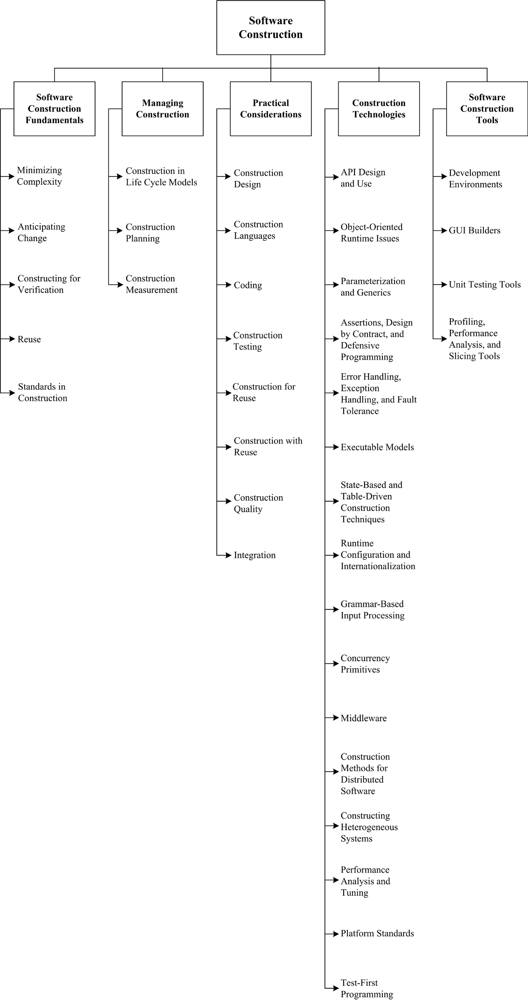

\#### 1.1. Minimizing Complexity

<!-- [1] -->

Most people are limited in their ability to hold complex structures and

information in their working memories, especially over long periods of time.

This proves to be a major factor influencing how people convey intent to

computers and leads to one of the strongest drives in software construction:

\\_minimizing\\_ complexity. The need to reduce complexity applies to essentially

every aspect of software construction and is particularly critical to testing

of software constructions.

In software construction, reduced complexity is achieved through emphasizing

code creation that is simple and readable rather than clever. It is

accomplished through making use of standards (see section 1.5, Standards in

Construction), modular design (see section 3.1, Construction Design), and

numerous other specific techniques (see section 3.3, Coding). It is also

supported by construction-focused quality techniques (see section 3.7,

Construction Quality).

\#### 1.2. Anticipating Change

<!-- [1] -->

Most software will change over time, and the anticipation of \\_change\\_ drives

many aspects of software construction; changes in the environments in which

software operates also affect software in diverse ways. Anticipating change

helps software engineers build extensible software, which means they can

enhance a software product without disrupting the underlying structure.

Anticipating change is supported by many specific techniques (see section 3.3,

Coding).

\#### 1.3. Constructing for Verification

<!-- [1] -->

Constructing for verification means building software in such a way that faults

can be readily found by the software engineers writing the software as well as

by the testers and users during independent testing and operational activities.

Specific techniques that support constructing for verification include

following coding standards to support code reviews and unit testing, organizing

code to support automated testing, and restricting the use of complex or

hard-to-understand language structures, among others.

\#### 1.4. Reuse

<!-- [2] -->

Reuse refers to using existing assets in solving different problems. In

software construction, typical assets that are reused include libraries,

modules, components, source code, and commercial off-the-shelf (COTS) assets.

Reuse is best practiced systematically, according to a well-defined, repeatable

process. Systematic reuse can enable significant software productivity,

quality, and cost improvements.

Reuse has two closely related facets: “construction for reuse” and

“construction with reuse.” The former means to create reusable software assets,

while the latter means to reuse software assets in the construction of a new

solution. Reuse often transcends the boundary of projects, which means

reused assets can be constructed in other projects or organizations.

\#### 1.5. Standards in Construction

<!-- [1] -->

Applying external or internal development standards during construction helps

achieve a project’s objectives for efficiency, quality, and cost. Specifically,

the choices of allowable programming language subsets and usage standards are

important aids in achieving higher security. Standards that directly affect

construction issues include

- communication methods (for example, standards for document formats and

contents)

- programming languages (for example, language standards for languages like

Java and C++)

- coding standards (for example, standards for naming conventions, layout, and

indentation)

- platforms (for example, interface standards for operating system calls)
- tools (for example, diagrammatic standards for notations like UML (Unified

Modeling Language)).

\\_Use of external standards.\\_ Construction depends on the use of external

standards for construction languages, construction tools, technical interfaces,

and interactions between the Software Construction KA and other KAs. Standards

come from numerous sources, including hardware and software interface

specifications (such as the Object Management Group (OMG)) and international

organizations (such as the IEEE or ISO).

\\_Use of internal standards.\\_ Standards may also be created on an organizational

basis at the corporate level or for use on specific projects. These standards

support coordination of group activities, minimizing complexity, anticipating

change, and constructing for verification.

\### 2. Managing Construction

\#### 2.1. Construction in Life Cycle Models

<!-- [1] -->

Numerous models have been created to develop software; some emphasize

construction more than others.

Some models are more linear from the construction point of view - such as the

waterfall and staged-delivery life cycle models. These models treat

construction as an activity that occurs only after significant prerequisite

work has been completed - including detailed requirements work, extensive

design work, and detailed planning. The more linear approaches tend to

emphasize the activities that precede construction (requirements and design)

and to create more distinct separations between activities. In these models,

the main emphasis of construction may be coding.

Other models are more iterative - such as evolutionary prototyping and agile

development. These approaches tend to treat construction as an activity that

occurs concurrently with other software development activities (including

requirements, design, and planning) or that overlaps them. These approaches

tend to mix design, coding, and testing activities, and they often treat the

combination of activities as construction (see the Software Management and

Software Process KAs).

Consequently, what is considered to be “construction” depends to some degree on

the life cycle model used. In general, software construction is mostly coding

and debugging, but it also involves construction planning, detailed design,

unit testing, integration testing, and other activities.

\#### 2.2. Construction Planning

<!-- [1] -->

The choice of construction method is a key aspect of the construction-planning

activity. The choice of construction method affects the extent to which

construction prerequisites are performed, the order in which they are

performed, and the degree to which they should be completed before construction

work begins.

The approach to construction affects the project team’s ability to reduce

complexity, anticipate change, and construct for verification. Each of these

objectives may also be addressed at the process, requirements, and design

levels - but they will be influenced by the choice of construction method.

Construction planning also defines the order in which components are created

and integrated, the integration strategy (for example, phased or incremental

integration), the software quality management processes, the allocation of task

assignments to specific software engineers, and other tasks, according to the

chosen method.

\#### 2.3. Construction Measurement

<!-- [1] -->

Numerous construction activities and artifacts can be measured - including code

developed, code modified, code reused, code destroyed, code complexity, code

inspection statistics, fault-fix and fault-find rates, effort, and scheduling.

These measurements can be useful for purposes of managing construction,

ensuring quality during construction, and improving the construction process,

among other uses (see the Software Engineering Process KA for more on

measurement).

\### 3. Practical Considerations

Construction is an activity in which the software engineer has to deal with

sometimes chaotic and changing real-world constraints, and he or she must do so

precisely. Due to the influence of real-world constraints, construction is more

driven by practical considerations than some other KAs, and software

engineering is perhaps most craft-like in the construction activities.

\#### 3.1. Construction Design

<!-- [1] -->

Some projects allocate considerable design activity to construction, while

others allocate design to a phase explicitly focused on design. Regardless of

the exact allocation, some detailed design work will occur at the construction

level, and that design work tends to be dictated by constraints imposed by the

real-world problem that is being addressed by the software.

Just as construction workers building a physical structure must make

small-scale modifications to account for unanticipated gaps in the builder’s

plans, software construction workers must make modifications on a smaller or

larger scale to flesh out details of the software design during construction.

The details of the design activity at the construction level are essentially

the same as described in the Software Design KA, but they are applied on a

smaller scale of algorithms, data structures, and interfaces.

\#### 3.2. Construction Languages

<!-- [1] -->

Construction languages include all forms of communication by which a human can

specify an executable problem solution to a problem. Construction languages and

their implementations (for example, compilers) can affect software quality

attributes of performance, reliability, portability, and so forth. They can be

serious contributors to security vulnerabilities.

The simplest type of construction language is a \\_configuration language,\\_ in

which software engineers choose from a limited set of pre-defined options to

create new or custom software installations. The text-based configuration files

used in both the Windows and Unix operating systems are examples of this, and

the menu-style selection lists of some program generators constitute another

example of a configuration language. Toolkit languages are used to build

applications out of elements in toolkits (integrated sets of

application-specific reusable parts); they are more complex than configuration

languages.

\\_Toolkit languages\\_ may be explicitly defined as application programming

languages, or the applications may simply be implied by a toolkit’s set of

interfaces.

\\_Scripting languages\\_ are commonly used kinds of application programming

languages. In some scripting languages, scripts are called batch files or

macros.

\\_Programming languages\\_ are the most flexible type of construction languages.

They also contain the least amount of information about specific application

areas and development processes - therefore, they require the most training and

skill to use effectively. The choice of programming language can have a large

effect on the likelihood of vulnerabilities being introduced during coding -

for example, uncritical usage of C and C++ are questionable choices from a

security viewpoint.

There are three general kinds of notation used for programming languages,

namely

- linguistic (e.g., C/C++, Java)
- formal (e.g., Event-B)
- visual (e.g., MatLab).

\\_Linguistic notations\\_ are distinguished in particular by the use of textual

strings to represent complex software constructions. The combination of textual

strings into patterns may have a sentence-like syntax. Properly used, each such

string should have a strong semantic connotation providing an immediate

intuitive understanding of what will happen when the software construction is

executed.

\\_Formal notations\\_ rely less on intuitive, everyday meanings of words and text

strings and more on definitions backed up by precise, unambiguous, and formal

(or mathematical) definitions. Formal construction notations and formal methods

are at the semantic base of most forms of system programming notations, where

accuracy, time behavior, and testability are more important than ease of

mapping into natural language. Formal constructions also use precisely defined

ways of combining symbols that avoid the ambiguity of many natural language

constructions.

\\_Visual notations\\_ rely much less on the textual notations of linguistic and

formal construction and instead rely on direct visual interpretation and

placement of visual entities that represent the underlying software. Visual

construction tends to be somewhat limited by the difficulty of making “complex”

statements using only the arrangement of icons on a display. However, these

icons can be powerful tools in cases where the primary programming task is

simply to build and “adjust” a visual interface to a program, the detailed

behavior of which has an underlying definition.

\#### 3.3. Coding

<!-- [1] -->

The following considerations apply to the software construction coding

activity:

- Techniques for creating understandable source code, including naming

conventions and source code layout;

- Use of classes, enumerated types, variables, named constants, and other

similar entities;

- Use of control structures;
- Handling of error conditions - both anticipated and exceptional (input of bad

data, for example);

- Prevention of code-level security breaches (buffer overflows or array index

bounds, for example);

- Resource usage via use of exclusion mechanisms and discipline in accessing

serially reusable resources (including threads and database locks);

- Source code organization (into statements, routines, classes, packages, or

other structures);

- Code documentation;
- Code tuning,

\#### 3.4. Construction Testing

<!-- [1] -->

Construction involves two forms of testing, which are often performed by the

software engineer who wrote the code:

- Unit testing
- Integration testing.

The purpose of construction testing is to reduce the gap between the time when

faults are inserted into the code and the time when those faults are detected,

thereby reducing the cost incurred to fix them. In some instances, test cases

are written after code has been written. In other instances, test cases may be

created before code is written.

Construction testing typically involves a subset of the various types of

testing, which are described in the Software Testing KA. For instance,

construction testing does not typically include system testing, alpha testing,

beta testing, stress testing, configuration testing, usability testing, or

other more specialized kinds of testing. Two standards have been published on

the topic of construction testing: IEEE Standard 829-1998, \\_IEEE Standard for

Software Test Documentation\\_, and \\_IEEE Standard 1008-1987, IEEE Standard for

Software Unit Testing\\_.

(See sections 2.1.1., Unit Testing, and 2.1.2., Integration Testing, in the

Software Testing KA for more specialized reference material.)

\#### 3.5. Construction for Reuse

<!-- [2] -->

Construction for reuse creates software that has the potential to be reused in

the future for the present project or other projects taking a broad-based,

multisystem perspective. Construction for reuse is usually based on variability

analysis and design. To avoid the problem of code clones, it is desired to

encapsulate reusable code fragments into well-structured libraries or

components. The tasks related to software construction for reuse during coding

and testing are as follows:

- Variability implementation with mechanisms such as parameterization,

conditional compilation, design patterns, and so forth.

- Variability encapsulation to make the software assets easy to configure and

customize.

- Testing the variability provided by the reusable software assets.
- Description and publication of reusable software assets.

\#### 3.6. Construction with Reuse

<!-- [2] -->

Construction with reuse means to create new software with the reuse of existing

software assets. The most popular method of reuse is to reuse code from the

libraries provided by the language, platform, tools being used, or an

organizational repository. Asides from these, the applications developed

today widely make use of many open-source libraries. Reused and off-the-shelf

software often have the same - or better - quality requirements as newly

developed software (for example, security level).

The tasks related to software construction with reuse during coding and testing

are as follows:

- The selection of the reusable units, databases, test procedures, or test

data.

- The evaluation of code or test reusability.
- The integration of reusable software assets into the current software.
- The reporting of reuse information on new code, test procedures, or test

data.

\#### 3.7. Construction Quality

<!-- [1] -->

In addition to faults resulting from requirements and design, faults introduced

during construction can result in serious quality problems - for example,

security vulnerabilities. This includes not only faults in security

functionality but also faults elsewhere that allow bypassing of this

functionality and other security weaknesses or violations. Numerous techniques

exist to ensure the quality of code as it is constructed. The primary

techniques used for construction quality include

- unit testing and integration testing (see section 3.4, Construction

Testing)

- test-first development (see section 2.2 in the Software Testing KA)
- use of assertions and defensive programming
- debugging
- inspections
- technical reviews, including security-oriented reviews (see section 2.3.2 in

the Software Quality KA)

- static analysis (see section 2.3 of the Software Quality KA)

The specific technique or techniques selected depend on the nature of the

software being constructed as well as on the skillset of the software engineers

performing the construction activities. Programmers should know good practices

and common vulnerabilities - for example, from widely recognized lists about

common vulnerabilities. Automated static analysis of code for security

weaknesses is available for several common programming languages and can be

used in security-critical projects.

Construction quality activities are differentiated from other quality

activities by their focus. Construction quality activities focus on code and

artifacts that are closely related to code - such as detailed design - as

opposed to other artifacts that are less directly connected to the code, such

as requirements, high-level designs, and plans.

\#### 3.8. Integration

<!-- [1] -->

A key activity during construction is the integration of individually

constructed routines, classes, components, and subsystems into a single system.

In addition, a particular software system may need to be integrated with other

software or hardware systems.

Concerns related to construction integration include planning the sequence in

which components will be integrated, identifying what hardware is needed,

creating scaffolding to support interim versions of the software, determining

the degree of testing and quality work performed on components before they are

integrated, and determining points in the project at which interim versions of

the software are tested.

Programs can be integrated by means of either the phased or the incremental

approach. Phased integration, also called “big bang” integration, entails

delaying the integration of component software parts until all parts intended

for release in a version are complete. Incremental integration is thought to

offer many advantages over the traditional phased integration - for

example, easier error location, improved progress monitoring, earlier

product delivery, and improved customer relations. In incremental

integration, the developers write and test a program in small pieces and

then combine the pieces one at a time. Additional test infrastructure, such

as stubs, drivers, and mock objects, are usually needed to enable

incremental integration. By building and integrating one unit at a time

(for example, a class or component), the construction process can provide

early feedback to developers and customers. Other advantages of incremental

integration include easier error location, improved progress monitoring,

more fully tested units, and so forth.

\### 4. Construction Technologies

\#### 4.1. API Design and Use

<!-- [3] -->

An application programming interface (API) is the set of signatures that are

exported and available to the users of a library or a framework to write their

applications. Besides signatures, an API should always include statements about

the program’s effects and/or behaviors (i.e., its semantics).

API design should try to make the API easy to learn and memorize, lead to

readable code, be hard to misuse, be easy to extend, be complete, and maintain

backward compatibility. As the APIs usually outlast their implementations for a

widely used library or framework, it is desired that the API be straightforward

and kept stable to facilitate the development and maintenance of the client

applications.

API use involves the processes of selecting, learning, testing, integrating,

and possibly extending APIs provided by a library or framework (see section

3\.6, Construction with Reuse).

\#### 4.2. Object-Oriented Runtime Issues

<!-- [1] -->

Object-oriented languages support a series of runtime mechanisms including

polymorphism and reflection. These runtime mechanisms increase the flexibility

and adaptability of object-oriented programs. Polymorphism is the ability of a

language to support general operations without knowing until runtime what kind

of concrete objects the software will include. Because the program does not

know the exact types of the objects in advance, the exact behaviour is

determined at runtime (called dynamic binding).

Reflection is the ability of a program to observe and modify its own structure

and behavior at runtime. Reflection allows inspection of classes, interfaces,

fields, and methods at runtime without knowing their names at compile time. It

also allows instantiation at runtime of new objects and invocation of methods

using parameterized class and method names.

\#### 4.3. Parameterization and Generics

<!-- [4] -->

Parameterized types, also known as generics (Ada, Eiffel) and templates (C++),

enable the definition of a type or class without specifying all the other types

it uses. The unspecified types are supplied as parameters at the point of use.

Parameterized types provide a third way (in addition to class inheritance and

object composition) to compose behaviors in object-oriented software.

\#### 4.4. Assertions, Design by Contract, and Defensive Programming

<!-- [1] -->

An assertion is an executable predicate that’s placed in a program - usually a

routine or macro - that allows runtime checks of the program. Assertions are

especially useful in high-reliability programs. They enable programmers to more

quickly flush out mismatched interface assumptions, errors that creep in when

code is modified, and so on. Assertions are normally compiled into the code at

development time and are later compiled out of the code so that they don’t

degrade the performance.

Design by contract is a development approach in which preconditions and

postconditions are included for each routine. When preconditions and

postconditions are used, each routine or class is said to form a contract with

the rest of the program. Furthermore, a contract provides a precise

specification of the semantics of a routine, and thus helps the understanding

of its behavior. Design by contract is thought to improve the quality of

software construction.

\\_Defensive programming\\_ means to protect a routine from being broken by invalid

inputs. Common ways to handle invalid inputs include checking the values of all

the input parameters and deciding how to handle bad inputs. Assertions are

often used in defensive programming to check input values.

\#### 4.5. Error Handling, Exception Handling, and Fault Tolerance

<!-- [1] -->

The way that errors are handled affects software’s ability to meet requirements

related to correctness, robustness, and other nonfunctional attributes.

Assertions are sometimes used to check for errors. Other error handling

techniques - such as returning a neutral value, substituting the next piece of

valid data, logging a warning message, returning an error code, or shutting

down the software - are also used.

Exceptions are used to detect and process errors or exceptional events. The

basic structure of an exception is that a routine uses \\_throw\\_ to throw a

detected exception and an exception handling block will \\_catch\\_ the exception

in a \\_try-catch\\_ block. The try-catch block may process the erroneous

condition in the routine or it may return control to the calling routine.

Exception handling policies should be carefully designed following common

principles such as including in the exception message all information that led

to the exception, avoiding empty catch blocks, knowing the exceptions the

library code throws, perhaps building a centralized exception reporter, and

standardizing the program’s use of exceptions. Fault tolerance is a collection

of techniques that increase software reliability by detecting errors and then

recovering from them if possible or containing their effects if recovery is not

possible. The most common fault tolerance strategies include backing up and

retrying, using auxiliary code, using voting algorithms, and replacing an

erroneous value with a phony value that will have a benign effect.

\#### 4.6. Executable Models

<!-- [5] -->

Executable models abstract away the details of specific programming languages

and decisions about the organization of the software. Different from

traditional software models, a specification built in an executable modeling

language like xUML (executable UML) can be deployed in various software

environments without change. An executable-model compiler (transformer) can

turn an executable model into an implementation using a set of decisions about

the target hardware and software environment. Thus, constructing executable

models can be regarded as a way of constructing executable software.

Executable models are one foundation supporting the Model-Driven Architecture

(MDA) initiative of the Object Management Group (OMG). An executable model is a

way to completely specify a Platform Independent Model (PIM); a PIM is a model

of a solution to a problem that does not rely on any implementation

technologies. Then a Platform Specific Model (PSM), which is a model that

contains the details of the implementation, can be produced by weaving together

the PIM and the platform on which it relies.

\#### 4.7. State-Based and Table-Driven Construction Techniques

<!-- [1] -->

State-based programming, or automata-based programming, is a programming

technology using finite state machines to describe program behaviours. The

transition graphs of a state machine are used in all stages of software

development (specification, implementation, debugging, and documentation). The

main idea is to construct computer programs the same way the automation of

technological processes is done. State-based programming is usually combined

with object-oriented programming, forming a new composite approach called

\\_state-based, object-oriented programming.\\_

A table-driven method is a schema that uses tables to look up information

rather than using logic statements (such as \\_if\\_ and \\_case\\_ ). Used in

appropriate circumstances, table-driven code is simpler than complicated logic

and easier to modify. When using table-driven methods, the programmer addresses

two issues: what information to store in the table or tables, and how to

efficiently access information in the table.

\#### 4.8. Runtime Configuration and Internationalization

<!-- [1] -->

To achieve more flexibility, a program is often constructed to support late

binding time of its variables. Runtime configuration is a technique that binds

variable values and program settings when the program is running, usually by

updating and reading configuration files in a just-in-time mode.

Internationalization is the technical activity of preparing a program, usually

interactive software, to support multiple locales. The corresponding activity,

\\_localization,\\_ is the activity of modifying a program to support a specific

local language. Interactive software may contain dozens or hundreds of prompts,

status displays, help messages, error messages, and so on. The design and

construction processes should accommodate string and character-set issues

including which character set is to be used, what kinds of strings are used,

how to maintain the strings without changing the code, and translating the

strings into different languages with minimal impact on the processing code and

the user interface.

\#### 4.9. Grammar-Based Input Processing

<!-- [1] [6] -->

Grammar-based input processing involves syntax analysis, or \\_parsing\\_, of the

input token stream. It involves the creation of a data structure (called a

\\_parse tree\\_ or \\_syntax tree\\_ ) representing the input data. The inorder

traversal of the parse tree usually gives the expression just parsed. The

parser checks the symbol table for the presence of programmer-defined variables

that populate the tree. After building the parse tree, the program uses it as

input to the computational processes.

\#### 4.10. Concurrency Primitives

<!-- [7] -->

A synchronization primitive is a programming abstraction provided by a

programming language or the operating system that facilitates concurrency and

synchronization. Well-known concurrency primitives include semaphores,

monitors, and mutexes.

A semaphore is a protected variable or abstract data type that provides a

simple but useful abstraction for controlling access to a common resource by

multiple processes or threads in a concurrent programming environment.

A monitor is an abstract data type that presents a set of programmer-defined

operations that are executed with mutual exclusion. A monitor contains the

declaration of shared variables and procedures or functions that operate on

those variables. The monitor construct ensures that only one process at a time

is active within the monitor. A mutex (mutual exclusion) is a synchronization

primitive that grants exclusive access to a shared resource by only one process

or thread at a time.

\#### 4.11. Middleware

<!-- [3] [6] -->

Middleware is a broad classification for software that provides services above

the operating system layer yet below the application program layer. Middleware

can provide runtime containers for software components to provide message

passing, persistence, and a transparent location across a network. Middleware

can be viewed as a connector between the components that use the middleware.

Modern message-oriented middleware usually provides an Enterprise Service Bus

(ESB), which supports service-oriented interaction and communication between

multiple software applications.

\#### 4.12. Construction Methods for Distributed Software

<!-- [7] -->

A distributed system is a collection of physically separate, possibly

heterogeneous computer systems that are networked to provide the users with

access to the various resources that the system maintains. Construction of

distributed software is distinguished from traditional software construction

by issues such as parallelism, communication, and fault tolerance.

Distributed programming typically falls into one of several basic architectural

categories: client-server, 3-tier architecture, n-tier architecture,

distributed objects, loose coupling, or tight coupling (see section 14.3 of the

Computing Foundations KA and section 3.2 of the Software Design KA).

\#### 4.13. Constructing Heterogeneous Systems

<!-- [6] -->

Heterogeneous systems consist of a variety of specialized computational units

of different types, such as Digital Signal Processors (DSPs), microcontrollers,

and peripheral processors. These computational units are independently

controlled and communicate with one another. Embedded systems are typically

heterogeneous systems. The design of heterogeneous systems may require the

combination of several specification languages in order to design different

parts of the system - in other words, hardware/software codesign. The key

issues include multilanguage validation, cosimulation, and interfacing. During

the hardware/software codesign, software development and virtual hardware

development proceed concurrently through stepwise decomposition. The hardware

part is usually simulated in field programmable gate arrays (FPGAs) or

application-specific integrated circuits (ASICs). The software part is

translated into a low-level programming language.

\#### 4.14. Performance Analysis and Tuning

<!-- [1] -->

Code efficiency - determined by architecture, detailed design decisions, and

data-structure and algorithm selection - influences an execution speed and

size. Performance analysis is the investigation of a program’s behavior using

information gathered as the program executes, with the goal of identifying

possible hot spots in the program to be improved.

Code tuning, which improves performance at the code level, is the practice of

modifying correct code in ways that make it run more efficiently. Code tuning

usually involves only small-scale changes that affect a single class, a single

routine, or, more commonly, a few lines of code. A rich set of code tuning

techniques is available, including those for tuning logic expressions, loops,

data transformations, expressions, and routines. Using a low-level language is

another common technique for improving some hot spots in a program.

\#### 4.15. Platform Standards

<!-- [6] [7] -->

Platform standards enable programmers to develop portable applications that can

be executed in compatible environments without changes. Platform standards

usually involve a set of standard services and APIs that compatible platform

implementations must implement. Typical examples of platform standards are Java

2 Platform Enterprise Edition (J2EE) and the POSIX standard for operating

systems (Portable Operating System Interface), which represents a set of

standards implemented primarily for UNIX-based operating systems.

\#### 4.16. Test-First Programming

<!-- [1] -->

Test-first programming (also known as Test-Driven Development - TDD) is a

popular development style in which test cases are written prior to writing any

code. Test-first programming can usually detect defects earlier and correct

them more easily than traditional programming styles. Furthermore, writing test

cases first forces programmers to think about requirements and design before

coding, thus exposing requirements and design problems sooner.

\### 5. Software Construction Tools

\#### 5.1. Development Environments

<!-- [1] -->

A development environment, or integrated development environment (IDE),

provides comprehensive facilities to programmers for software construction by

integrating a set of development tools. The choices of development environments

can affect the efficiency and quality of software construction.

In additional to basic code editing functions, modern IDEs often offer other

features like compilation and error detection from within the editor,

integration with source code control, build/test/debugging tools, compressed

or outline views of programs, automated code transforms, and support for

refactoring.

\#### 5.2. GUI Builders

<!-- [1] -->

A GUI (Graphical User Interface) builder is a software development tool that

enables the developer to create and maintain GUIs in a WYSIWYG (what you see is

what you get) mode. A GUI builder usually includes a visual editor for the

developer to design forms and windows and manage the layout of the widgets by

dragging, dropping, and parameter setting. Some GUI builders can automatically

generate the source code corresponding to the visual GUI design. Because

current GUI applications usually follow the event-driven style (in which the

flow of the program is determined by events and event handling), GUI builder

tools usually provide code generation assistants, which automate the most

repetitive tasks required for event handling. The supporting code connects

widgets with the outgoing and incoming events that trigger the functions

providing the application logic. Some modern IDEs provide integrated GUI

builders or GUI builder plug-ins. There are also many standalone GUI builders.

\#### 5.3. Unit Testing Tools

<!-- [1] [2] -->

Unit testing verifies the functioning of software modules in isolation from

other software elements that are separately testable (for example, classes,

routines, components). Unit testing is often automated. Developers can use

unit testing tools and frameworks to extend and create automated testing

environment. With unit testing tools and frameworks, the developer can code

criteria into the test to verify the unit’s correctness under various data

sets. Each individual test is implemented as an object, and a test runner runs

all of the tests. During the test execution, those failed test cases will be

automatically flagged and reported.

\#### 5.4. Profiling, Performance Analysis, and Slicing Tools

<!-- [1] -->

Performance analysis tools are usually used to support code tuning. The most

common performance analysis tools are profiling tools. An execution profiling

tool monitors the code while it runs and records how many times each statement

is executed or how much time the program spends on each statement or execution

path. Profiling the code while it is running gives insight into how the program

works, where the hot spots are, and where the developers should focus the code

tuning efforts.

Program slicing involves computation of the set of program statements (i.e.,

the program slice) that may affect the values of specified variables at some

point of interest, which is referred to as a slicing criterion. Program slicing

can be used for locating the source of errors, program understanding, and

optimization analysis. Program slicing tools compute program slices for various

programming languages using static or dynamic analysis methods.

\### Matrix Of Topics vs. Reference Material

McConnell 2004

[1]

Sommerville 2011

[2]

Clements et al. 2010

[3]

Gamma et al. 1994

[4]

Mellor and Balcer 2002

[5]

Null and Lobur 2006

[6]

Silberschatz et al. 2008

[7]

\\*\\*1. Software Construction Fundamentals\\*\\*

1\.1. Minimizing Complexity c2, c3, c7-c9, c24, c27, c28, c31, c32, c34

1\.2. Anticipating Change c3–c5, c24, c31, c32, c34

1\.3. Constructing for Verification c8, c20– c23, c31, c34

1\.4. Reuse c16

1\.5. Standards in Construction c4

\\*\\*2. Managing

Construction\\*\\*

2\.1. Construction in Life Cycle Models c2, c3, c27, c29

2\.2. Construction Planning c3, c4, c21, c27–c29

2\.3. Construction Measurement c25, c28

\\*\\*3. Practical Considerations\\*\\*

3\.1. Construction Design c3, c5, c24

3\.2. Construction Languages c4

3\.3. Coding c5–c19, c25–c26

McConnell 2004

[1]

Sommerville 2011

[2]

Clements et al. 2010

[3]

Gamma et al. 1994

[4]

Mellor and Balcer 2002

[5]

Null and Lobur 2006

[6]

Silberschatz et al. 2008

[7]

3\.4. Construction Testing c22, c23

3\.5. Construction for Reuse c16

3\.6. Construction with Reuse c16

3\.7. Construction Quality c8, c20–c25

3\.8. Integration c29

\\*\\*4. Construction Technologies\\*\\*

4\.1. API Design and Use c7

4\.2. Object-Oriented Runtime Issues c6, c7

4\.3. Parameterization and Generics c1

4\.4. Assertions, Design by Contract, and Defensive Programming c8, c9

4\.5. Error Handling, Exception Handling, and Fault Tolerance c3, c8

4\.6. Executable Models c1

4\.7. State-Based and Table-Driven Construction Techniques c18

4\.8. Runtime Configuration and Internationalization c3, c10

4\.9. Grammar-Based Input Processing c5 c8

Software Construction 3-15

McConnell 2004

[1]

Sommerville 2011

[2]

Clements et al. 2010

[3]

Gamma et al. 1994

[4]

Mellor and Balcer 2002

[5]

Null and Lobur 2006

[6]

Silberschatz et al. 2008

[7]

4\.10. Concurrency Primitives c6

4\.11. Middleware c1 c8

4\.12. Construction Methods for Distributed Software c2

4\.13. Constructing Heterogeneous Systems c9

4\.14. Performance Analysis and Tuning c25, c26

4\.15. Platform Standards c10 c1

4\.16. Test-First Programming c22

\\*\\*5. Construction Tools\\*\\*

5\.1. Development Environments c30

5\.2. GUI Builders c30

5\.3. Unit Testing Tools c22 c8

5\.4. Profiling, Performance Analysis, and Slicing Tools c25, c26

\\*\\*Further Readings\\*\\*

\\_IEEE Std. 1517-2010 Standard for Information Technology - System and Software

Life Cycle Processes - Reuse Processes\\_, IEEE, 2010 [8].

This standard specifies the processes, activities, and tasks to be applied

during each phase of the software life cycle to enable a software product to be

constructed from reusable assets. It covers the concept of reuse-based

development and the processes of construction for reuse and construction with

reuse.

\\_IEEE Std. 12207-2008 (a.k.a. ISO/IEC 12207:2008) Standard for Systems and

Software Engineering - Software Life Cycle Processes\\_, IEEE, 2008 [9].

This standard defines a series of software development processes, including

software construction process, software integration process, and software reuse

process.

\\*\\*References\\*\\*

[1] S. McConnell, Code Complete, 2nd ed., Microsoft Press, 2004.

[2] I. Sommerville, Software Engineering, 9th ed., Addison-Wesley, 2011.

[3] P. Clements et al., Documenting Software Architectures: Views and Beyond,

2nd ed., Pearson Education, 2010.

[4] E. Gamma et al., Design Patterns: Elements of Reusable Object-Oriented

Software, 1st ed., Addison-Wesley Professional, 1994.

[5] S.J. Mellor and M.J. Balcer, Executable UML: A Foundation for Model-Driven

Architecture, 1st ed., Addison-Wesley, 2002.

[6] L. Null and J. Lobur, The Essentials of Computer Organization and

Architecture, 2nd ed., Jones and Bartlett Publishers, 2006.

[7] A. Silberschatz, P.B. Galvin, and G. Gagne, Operating System Concepts, 8th

ed., Wiley, 2008.

[8] IEEE Std. 1517-2010 Standard for Information Technology—System and Software

Life Cycle Processes—Reuse Processes, IEEE, 2010.

[9] IEEE Std. 12207-2008 (a.k.a. ISO/IEC 12207:2008) Standard for Systems and

\## Chapter 4: Software Testing

\\*\\*Acronyms\\*\\*

- API Application Program Interface
- TDD Test-Driven Development
- TTCN3 Testing and Test Control Notation Version 3
- XP Extreme Programming

\\*\\*Introduction\\*\\*

Software testing consists of the \\_dynamic\\_ verification that a program provides

\\_expected\\_ behaviors on a \\_finite\\_ set of test cases, suitably \\_selected\\_ from

the usually infinite execution domain.  In the above definition, italicized

words correspond to key issues in describing the Software Testing knowledge

area (KA):

- \\_Dynamic:\\_ This term means that testing always implies executing the program

on selected inputs. To be precise, the input value alone is not always

sufficient to specify a test, since a complex, nondeterministic system might

react to the same input with different behaviors, depending on the system

state. In this KA, however, the term “input” will be maintained, with the

implied convention that its meaning also includes a specified input state in

those cases for which it is important. Static techniques are different from

and complementary to dynamic testing.  Static techniques are covered in the

Software Quality KA. It is worth noting that terminology is not uniform among

different communities and some use the term “testing” also in reference to

static techniques.

- \\_Finite:\\_ Even in simple programs, so many test cases are theoretically

possible that exhaustive testing could require months or years to execute.

This is why, in practice, a complete set of tests can generally be considered

infinite, and testing is conducted on a subset of all possible tests, which

is determined by risk and prioritization criteria. Testing always implies a

tradeoff between limited resources and schedules on the one hand and

inherently unlimited test requirements on the other.

- \\_Selected:\\_ The many proposed test techniques differ essentially in how the

test set is selected, and software engineers must be aware that different

selection criteria may yield vastly different degrees of effectiveness. How

to identify the most suitable selection criterion under given conditions is a

complex problem; in practice, risk analysis techniques and software

engineering expertise are applied.

- \\_Expected:\\_ It must be possible, although not always easy, to decide whether

the observed outcomes of program testing are acceptable or not; otherwise,

the testing effort is useless. The observed behavior may be checked against

user needs (commonly referred to as testing for validation), against a

specification (testing for verification), or, perhaps, against the

anticipated behavior from implicit requirements or expectations (see

Acceptance Tests in the Software Requirements KA).

In recent years, the view of software testing has matured into a constructive

one. Testing is no longer seen as an activity that starts only after the coding

phase is complete with the limited purpose of detecting failures. Software

testing is, or should be, pervasive throughout the entire development and

maintenance life cycle. Indeed, planning for software testing should start with

the early stages of the software requirements process, and test plans and

procedures should be systematically and continuously developed - and possibly

refined - as software development proceeds.  These test planning and test

designing activities provide useful input for software designers and help to

highlight potential weaknesses, such as design oversights/contradictions, or

omissions/ ambiguities in the documentation.

For many organizations, the approach to software quality is one of prevention:

it is obviously much better to prevent problems than to correct them. Testing

can be seen, then, as a means for providing information about the functionality

and quality attributes of the software and also for identifying faults in those

cases where error prevention has not been effective. It is perhaps obvious but

worth recognizing that software can still contain faults, even after completion

of an extensive testing activity. Software failures experienced after delivery

are addressed by corrective maintenance. Software maintenance topics are

covered in the Software Maintenance KA. In the Software Quality KA (see

Software Quality Management Techniques), software quality management techniques

are notably categorized into static techniques (no code execution) and dynamic

techniques (code execution). Both categories are useful. This KA focuses on

dynamic techniques.

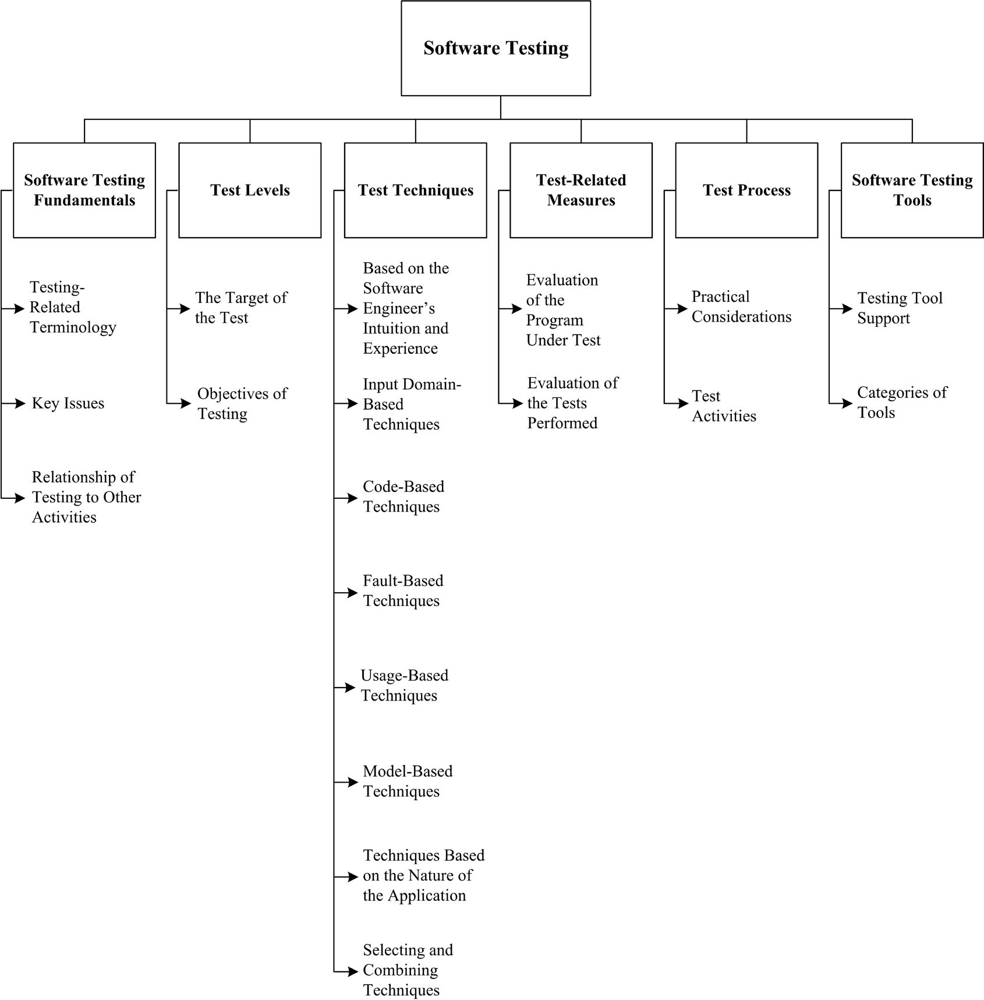

Software testing is also related to software construction (see Construction

Testing in the Software Construction KA). In particular, unit and integration

testing are intimately related to software construction, if not part of it.

\\*\\*Breakdown Of Topics For Software Testing\\*\\*

The breakdown of topics for the Software Testing KA is shown in Figure 4.1. A

more detailed breakdown is provided in the Matrix of Topics vs. Reference

Material at the end of this KA.  The first topic describes Software Testing

Fundamentals. It covers the basic definitions in the field of software testing,

the basic terminology and key issues, and software testing’s relationship with

other activities.

The second topic, Test Levels, consists of two (orthogonal) subtopics: the

first subtopic lists the levels in which the testing of large software is

traditionally subdivided, and the second subtopic considers testing for

specific conditions or properties and is referred to as Objectives of Testing.

Not all types of testing apply to every software product, nor has every

possible type been listed.  The test target and test objective together

determine how the test set is identified, both with regard to its consistency -

\\_how much testing is enough for achieving the stated objective\\_  - and to its

composition - \\_which test cases should be selected for achieving the stated

objective\\_ (although usually “for achieving the stated objective” remains

implicit and only the first part of the two italicized questions above is

posed). Criteria for addressing the first question are referred to as \\_test

adequacy criteria\\_, while those addressing the second question are the test

\\_selection criteria\\_. Several Test Techniques have been developed in the past

few decades, and new ones are still being proposed. Generally accepted

techniques are covered in the third topic.

Test-Related Measures are dealt with in the fourth topic, while the issues

relative to Test Process are covered in the fifth. Finally, Software Testing

Tools are presented in topic six.

\### 1. Software Testing Fundamentals

\#### 1.1. Testing-Related Terminology

\##### 1.1.1. Definitions of Testing and Related Terminology

<!-- [1\\*, c1, c2] [2\\*, c8] -->

Definitions of testing and testing-related terminology are provided in the

cited references and summarized as follows.

\##### 1.1.2. Faults vs. Failures

<!-- [1\\*, c1s5] [2\\*, c11] -->

Many terms are used in the software engineering literature to describe a

malfunction: notably fault, failure, and error, among others. This terminology

is precisely defined in [3, c2]. It is essential to clearly distinguish between

the cause of a malfunction (for which the term fault will be used here) and an

undesired effect observed in the system’s delivered service (which will be

called a failure). Indeed there may well be faults in the software that never

manifest themselves as failures (see Theoretical and Practical Limitations of

Testing in section 1.2, Key Issues). Thus testing can reveal failures, but it

is the faults that can and must be removed [3]. The more generic term defect

can be used to refer to either a fault or a failure, when the distinction is

not important [3].  However, it should be recognized that the cause of a

failure cannot always be unequivocally identified. No theoretical criteria

exist to definitively determine, in general, the fault that caused an observed

failure. It might be said that it was the fault that had to be modified to

remove the failure, but other modifications might have worked just as well. To

avoid ambiguity, one could refer to failure-causing inputs instead of

faults - that is, those sets of inputs that cause a failure to appear.

\#### 1.2. Key Issues

\##### 1.2.1. Test Selection Criteria / Test Adequacy Criteria (Stopping Rules)

<!-- [1, c1s14, c6s6, c12s7] -->

A test selection criterion is a means of selecting test cases or determining

that a set of test cases is sufficient for a specified purpose. Test adequacy

criteria can be used to decide when sufficient testing will be, or has been

accomplished [4] (see Termination in section 5.1, Practical Considerations).

\##### 1.2.2. Testing Effectiveness / Objectives for Testing

<!-- [1, c11s4, c13s11] -->

Testing effectiveness is determined by analyzing a set of program executions.

Selection of tests to be executed can be guided by different objectives: it is

only in light of the objective pursued that the effectiveness of the test set

can be evaluated.

\##### 1.2.3. Testing for Defect Discovery

<!-- [1, c1s14] -->

In testing for defect discovery, a successful test is one that causes the

system to fail. This is quite different from testing to demonstrate that the

software meets its specifications or other desired properties, in which case

testing is successful if no failures are observed under realistic test cases

and test environments.

\##### 1.2.4. The Oracle Problem

<!-- [1, c1s9, c9s7] -->

An oracle is any human or mechanical agent that decides whether a program

behaved correctly in a given test and accordingly results in a verdict of

“pass” or “fail.” There exist many different kinds of oracles; for example,

unambiguous requirements specifications, behavioral models, and code

annotations. Automation of mechanized oracles can be difficult and expensive.

\##### 1.2.5. Theoretical and Practical Limitations of Testing

<!-- [1, c2s7] -->

Testing theory warns against ascribing an unjustified level of confidence to a

series of successful tests. Unfortunately, most established results of testing

theory are negative ones, in that they state what testing can never achieve as

opposed to what is actually achieved. The most famous quotation in this regard

is the Dijkstra aphorism that “program testing can be used to show the presence

of bugs, but never to show their absence” [5]. The obvious reason for this is

that complete testing is not feasible in realistic software. Because of this,

testing must be driven based on risk [6, part 1] and can be seen as a risk

management strategy.

\##### 1.2.6. The Problem of Infeasible Paths

<!-- [1, c4s7] -->

Infeasible paths are control flow paths that cannot be exercised by any input

data. They are a significant problem in path-based testing, particularly in

automated derivation of test inputs to exercise control flow paths.

\##### 1.2.7. Testability

<!-- [1, c17s2] -->

The term “software testability” has two related but different meanings: on the

one hand, it refers to the ease with which a given test coverage criterion can

be satisfied; on the other hand, it is defined as the likelihood, possibly

measured statistically, that a set of test cases will expose a failure if the

software is faulty. Both meanings are important.

\#### 1.3. Relationship of Testing to Other Activities

Software testing is related to, but different from, static software quality

management techniques, proofs of correctness, debugging, and program

construction. However, it is informative to consider testing from the point

of view of software quality analysts and of certifiers.

- Testing vs. Static Software Quality Management Techniques (see Software

Quality Management Techniques in the Software Quality KA [1, c12]).

- Testing vs. Correctness Proofs and Formal Verification (see the Software

Engineering Models and Methods KA [1, c17s2]).

- Testing vs. Debugging (see Construction Testing in the Software Construction

KA and Debugging Tools and Techniques in the Computing Foundations KA [1,

c3s6]).

- Testing vs. Program Construction (see Construction Testing in the Software

Construction KA [1, c3s2]).

\### 2. Test Levels

Software testing is usually performed at different \\_levels\\_ throughout the

development and maintenance processes. Levels can be distinguished based on the

object of testing, which is called the \\_target\\_, or on the purpose, which is

called the \\_objective\\_ (of the test level).

\#### 2.1. The Target of the Test

<!-- [1, c1s13] [2, c8s1] -->

The target of the test can vary: a single module, a group of such modules

(related by purpose, use, behavior, or structure), or an entire system. Three

test stages can be distinguished: unit, integration, and system. These three

test stages do not imply any process model, nor is any one of them assumed to

be more important than the other two.

\##### 2.1.1. Unit Testing

<!-- [1, c3] [2, c8] -->

Unit testing verifies the functioning in isolation of software elements that

are separately testable. Depending on the context, these could be the

individual subprograms or a larger component made of highly cohesive units.

Typically, unit testing occurs with access to the code being tested and with

the support of debugging tools. The programmers who wrote the code typically,

but not always, conduct unit testing.

\##### 2.1.2. Integration Testing

<!-- [1, c7] [2, c8] -->

Integration testing is the process of verifying the interactions among software

components. Classical integration testing strategies, such as top-down and

bottom-up, are often used with hierarchically structured software.

Modern, systematic integration strategies are typically architecture-driven,

which involves incrementally integrating the software components or subsystems

based on identified functional threads. Integration testing is often an ongoing

activity at each stage of development during which software engineers abstract

away lower-level perspectives and concentrate on the perspectives of the level

at which they are integrating. For other than small, simple software,

incremental integration testing strategies are usually preferred to putting all

of the components together at once - which is often called “big bang” testing.

\##### 2.1.3. System Testing

<!-- [1, c8] [2, c8] -->

System testing is concerned with testing the behavior of an entire system.

Effective unit and integration testing will have identified many of the

software defects. System testing is usually considered appropriate for

assessing the non-functional system requirements - such as security, speed,

accuracy, and reliability (see Functional and Non-Functional Requirements in

the Software Requirements KA and Software Quality Requirements in the Software

Quality KA). External interfaces to other applications, utilities, hardware

devices, or the operating environments are also usually evaluated at this

level.

\#### 2.2. Objectives of Testing

<!-- [1, c1s7] -->

Testing is conducted in view of specific objectives, which are stated more or

less explicitly and with varying degrees of precision. Stating the objectives

of testing in precise, quantitative terms supports measurement and control of

the test process.

Testing can be aimed at verifying different properties. Test cases can be

designed to check that the functional specifications are correctly implemented,

which is variously referred to in the literature as conformance testing,

correctness testing, or functional testing. However, several other

nonfunctional properties may be tested as well - including performance,

reliability, and usability, among many others (see Models and Quality

Characteristics in the Software Quality KA). Other important objectives for

testing include but are not limited to reliability measurement, identification

of security vulnerabilities, usability evaluation, and software acceptance, for

which different approaches would be taken. Note that, in general, the test

objectives vary with the test target; different purposes are addressed at

different levels of testing.

The subtopics listed below are those most often cited in the literature. Note

that some kinds of testing are more appropriate for custom-made software

packages - installation testing, for example - and others for consumer

products, like beta testing.

\##### 2.2.1. Acceptance / Qualification Testing

<!-- [1, c1s7] [2, c8s4] -->

Acceptance / qualification testing determines whether a system satisfies its

acceptance criteria, usually by checking desired system behaviors against the

customer’s requirements. The customer or a customer’s representative thus

specifies or directly undertakes activities to check that their requirements

have been met, or in the case of a consumer product, that the organization has

satisfied the stated requirements for the target market. This testing activity

may or may not involve the developers of the system.

\##### 2.2.2. Installation Testing

<!-- [1, c12s2] -->

Often, after completion of system and acceptance testing, the software is

verified upon installation in the target environment. Installation testing can

be viewed as system testing conducted in the operational environment of

hardware configurations and other operational constraints. Installation

procedures may also be verified.

\##### 2.2.3. Alpha and Beta Testing

<!-- [1, c13s7, c16s6] [2, c8s4] -->

Before software is released, it is sometimes given to a small, selected group

of potential users for trial use (\\_alpha\\_ testing) and/or to a larger set of

representative users (\\_beta\\_ testing). These users report problems with the

product. Alpha and beta testing are often uncontrolled and are not always

referred to in a test plan.

\##### 2.2.4. Reliability Achievement and Evaluation

<!-- [1, c15] [2, c15s2] -->

Testing improves reliability by identifying and correcting faults. In addition,

statistical measures of reliability can be derived by randomly generating

test cases according to the operational profile of the software (see

Operational Profile in section 3.5, Usage-Based Techniques). The latter

approach is called operational testing. Using reliability growth models, both

objectives can be pursued together [3] (see L ife Test, Reliability Evaluation

in section 4.1, Evaluation of the Program under Test).

\##### 2.2.5. Regression Testing

<!-- [1, c8s11, c13s3] -->

According to [7], regression testing is the “selective retesting of a system or

component to verify that modifications have not caused unintended effects and

that the system or component still complies with its specified requirements.”

In practice, the approach is to show that software still passes previously

passed tests in a test suite (in fact, it is also sometimes referred to as

nonregression testing). For incremental development, the purpose of regression

testing is to show that software behavior is unchanged by incremental changes

to the software, except insofar as it should. In some cases, a tradeoff must be

made between the assurance given by regression testing every time a change is

made and the resources required to perform the regression tests, which can be

quite time consuming due to the large number of tests that may be executed.

Regression testing involves selecting, minimizing, and/or prioritizing a subset

of the test cases in an existing test suite [8].  Regression testing can be

conducted at each of the test levels described in section 2.1, The Target of

the Test, and may apply to functional and nonfunctional testing.

\##### 2.2.6. Performance Testing

<!-- [1, c8s6] -->

Performance testing verifies that the software meets the specified performance

requirements and assesses performance characteristics - for instance, capacity

and response time.

\##### 2.2.7. Security Testing

<!-- [1, c8s3] [2, c11s4] -->

Security testing is focused on the verification that the software is protected

from external attacks. In particular, security testing verifies the

confidentiality, integrity, and availability of the systems and its data.

Usually, security testing includes verification against misuse and abuse of the

software or system (negative testing).

\##### 2.2.8. Stress Testing

<!-- [1, c8s8] -->

Stress testing exercises software at the maximum design load, as well as beyond

it, with the goal of determining the behavioral limits, and to test defense

mechanisms in critical systems.

\##### 2.2.9. Back-to-Back Testing

<!-- [7] -->

IEEE/ISO/IEC Standard 24765 defines back-to-back testing as “testing in which

two or more variants of a program are executed with the same inputs, the

outputs are compared, and errors are analyzed in case of discrepancies.”

\##### 2.2.10. Recovery Testing

<!-- [1, c14s2] -->

Recovery testing is aimed at verifying software restart capabilities after a

system crash or other “disaster.”

\##### 2.2.11. Interface Testing

<!-- [2, c8s1.3] [9, c4s4.5] -->

Interface defects are common in complex systems. Interface testing aims at

verifying whether the components interface correctly to provide the correct

exchange of data and control information. Usually the test cases are

generated from the interface specification. A specific objective of interface

testing is to simulate the use of APIs by end-user applications. This involves

the generation of parameters of the API calls, the setting of external

environment conditions, and the definition of internal data that affect the

API.

\##### 2.2.12. Configuration Testing

<!-- [1, c8s5] -->

In cases where software is built to serve different users, configuration

testing verifies the software under different specified configurations.

\##### 2.2.13. Usability and Human Computer Interaction Testing

<!-- [10, c6] -->

The main task of usability and human computer interaction testing is to

evaluate how easy it is for end users to learn and to use the software. In

general, it may involve testing the software functions that supports user

tasks, documentation that aids users, and the ability of the system to recover

from user errors (see User Interface Design in the Software Design KA).

\### 3. Test Techniques

One of the aims of testing is to detect as many failures as possible. Many

techniques have been developed to do this [6, part 4]. These techniques attempt

to “break” a program by being as systematic as possible in identifying inputs

that will produce representative program behaviors; for instance, by

considering subclasses of the input domain, scenarios, states, and data flows.

The classification of testing techniques presented here is based on how tests

are generated: from the software engineer’s intuition and experience, the

specifications, the code structure, the real or imagined faults to be

discovered, predicted usage, models, or the nature of the application.  One

category deals with the combined use of two or more techniques.  Sometimes

these techniques are classified as white-box (also called glass-box ), if the

tests are based on information about how the software has been designed or

coded, or as black-box if the test cases rely only on the input/output behavior

of the software. The following list includes those testing techniques that are

commonly used, but some practitioners rely on some of the techniques more than

others.

\#### 3.1. Based on the Software Engineer’s Intuition and Experience

\##### 3.1.1. Ad Hoc

Perhaps the most widely practiced technique is ad hoc testing: tests are

derived relying on the software engineer’s skill, intuition, and experience

with similar programs. Ad hoc testing can be useful for identifying tests cases

that not easily generated by more formalized techniques.

\##### 3.1.2. Exploratory Testing

Exploratory testing is defined as simultaneous learning, test design, and test

execution [6, part 1]; that is, the tests are not defined in advance in an

established test plan, but are dynamically designed, executed, and modified.

The effectiveness of exploratory testing relies on the software engineer’s

knowledge, which can be derived from various sources: observed product behavior

during testing, familiarity with the application, the platform, the failure

process, the type of possible faults and failures, the risk associated with a

particular product, and so on.

\#### 3.2. Input Domain-Based Techniques

\##### 3.2.1. Equivalence Partitioning

<!-- [1, c9s4] -->

Equivalence partitioning involves partitioning the input domain into a

collection of subsets (or equivalent classes) based on a specified criterion or

relation. This criterion or relation may be different computational results, a

relation based on control flow or data flow, or a distinction made between

valid inputs that are accepted and processed by the system and invalid inputs,

such as out of range values, that are not accepted and should generate an error

message or initiate error processing. A representative set of tests (sometimes

only one) is usually taken from each equivalency class.

\##### 3.2.2. Pairwise Testing

<!-- [1, c9s3] -->

Test cases are derived by combining interesting values for every pair of a set

of input variables instead of considering all possible combinations.  Pairwise

testing belongs to combinatorial testing, which in general also includes

higher-level combinations than pairs: these techniques are referred to as

t-wise, whereby every possible combination of t input variables is considered.

\##### 3.2.3. Boundary-Value Analysis

<!-- [1, c9s5] -->

Test cases are chosen on or near the boundaries of the input domain of

variables, with the underly ing rationale that many faults tend to concentrate

near the extreme values of inputs. An extension of this technique is robustness

testing, wherein test cases are also chosen outside the input domain of

variables to test program robustness in processing unexpected or erroneous

inputs.

\##### 3.2.4. Random Testing

<!-- [1, c9s7] -->

Tests are generated purely at random (not to be confused with statistical

testing from the operational profile, as described in Operational Profile in

section 3.5). This form of testing falls under the heading of input domain

testing since the input domain must be known in order to be able to pick random

points within it. Random testing provides a relatively simple approach for test

automation; recently, enhanced forms of random testing have been proposed in

which the random input sampling is directed by other input selection criteria

[11]. Fuzz testing or fuzzing is a special form of random testing aimed at

breaking the software; it is most often used for security testing.

\#### 3.3. Code-Based Techniques

\##### 3.3.1. Control Flow-Based Criteria

<!-- [1, c4] -->

Control flow-based coverage criteria are aimed at covering all the statements,

blocks of statements, or specified combinations of statements in a program.

The strongest of the control flow-based criteria is path testing, which aims to

execute all entry-to-exit control flow paths in a program’s control flow graph.

Since exhaustive path testing is generally not feasible because of loops, other

less stringent criteria focus on coverage of paths that limit loop iterations

such as statement coverage, branch coverage, and condition/decision testing.

The adequacy of such tests is measured in percentages; for example, when all

branches have been executed at least once by the tests, 100% branch coverage

has been achieved.

\##### 3.3.2. Data Flow-Based Criteria

<!-- [1, c5] -->

In data flow-based testing, the control flow graph is annotated with

information about how the program variables are defined, used, and killed

(undefined). The strongest criterion, all definition-use paths, requires

that, for each variable, every control flow path segment from a definition of

that variable to a use of that definition is executed. In order to reduce the

number of paths required, weaker strategies such as all-definitions and

all-uses are employed.

\##### 3.3.3. Reference Models for Code-Based Testing

<!-- [1, c4] -->

Although not a technique in itself, the control structure of a program can be

graphically represented using a flow graph to visualize code-based testing

techniques. A flow graph is a directed graph, the nodes and arcs of which

correspond to program elements (see Graphs and Trees in the Mathematical

Foundations KA).  For instance, nodes may represent statements or uninterrupted

sequences of statements, and arcs may represent the transfer of control between

nodes.

\#### 3.4. Fault-Based Techniques

<!-- [1, c1s14] -->

With different degrees of formalization, fault-based testing techniques devise

test cases specifically aimed at revealing categories of likely or predefined

faults. To better focus the test case generation or selection, a \\_fault model\\_

can be introduced that classifies the different types of faults.

\##### 3.4.1. Error Guessing

<!-- [1, c9s8] -->

In error guessing, test cases are specifically designed by software engineers

who try to anticipate the most plausible faults in a given program.  A good

source of information is the history of faults discovered in earlier projects,

as well as the software engineer’s expertise.

\##### 3.4.2. Mutation Testing

<!-- [1, c3s5] -->

A mutant is a slightly modified version of the program under test, differing

from it by a small syntactic change. Every test case exercises both the

original program and all generated mutants: if a test case is successful in

identifying the difference between the program and a mutant, the latter is said

to be “killed.” Originally conceived as a technique to evaluate test sets (see

section 4.2. Evaluation of the Tests Performed), mutation testing is also a

testing criterion in itself: either tests are randomly generated until enough

mutants have been killed, or tests are specifically designed to kill surviving

mutants. In the latter case, mutation testing can also be categorized as a

code-based technique. The underlying assumption of mutation testing, the

coupling effect, is that by looking for simple syntactic faults, more complex

but real faults will be found. For the technique to be effective, a large

number of mutants must be automatically generated and executed in a systematic

way [12].

\#### 3.5. Usage-Based Techniques

\##### 3.5.1. Operational Profile

<!-- [1, c15s5] -->

In testing for reliability evaluation (also called operational testing), the

test environment reproduces the operational environment of the software, or the

operational profile, as closely as possible. The goal is to infer from the

observed test results the future reliability of the software when in actual

use. To do this, inputs are assigned probabilities, or profiles, according to

their frequency of occurrence in actual operation. Operational profiles can be

used during system testing to guide derivation of test cases that will assess

the achievement of reliability objectives and exercise relative usage and

criticality of different functions similar to what will be encountered in the

operational environment [3].

\##### 3.5.2. User Observation Heuristics

<!-- [10, c5, c7] -->

Usability principles can provide guidelines for discovering problems in the

design of the user interface [10, c1s4] (see User Interface Design in the

Software Design KA). Specialized heuristics, also called usability inspection

methods, are applied for the systematic observation of system usage under

controlled conditions in order to determine how well people can use the

system and its interfaces. Usability heuristics include cognitive walkthroughs,

claims analysis, field observations, thinking aloud, and even indirect

approaches such as user questionnaires and interviews.

\#### 3.6. Model-Based Testing Techniques

A model in this context is an abstract (formal) representation of the software

under test or of its software requirements (see Modeling in the Software

Engineering Models and Methods KA). Model-based testing is used to validate

requirements, check their consistency, and generate test cases focused on the

behavioral aspects of the software. The key components of model-based testing

are [13]: the notation used to represent the model of the software or its

requirements; workflow models or similar models; the test strategy or

algorithm used for test case generation; the supporting infrastructure for the

test execution; and the evaluation of test results compared to expected

results. Due to the complexity of the techniques, model-based testing

approaches are often used in conjunction with test automation harnesses.

Model-based testing techniques include the following.

\##### 3.6.1. Decision Tables

<!-- [1, c9s6] -->

Decision tables represent logical relationships between conditions (roughly,

inputs) and actions (roughly, outputs). Test cases are systematically derived

by considering every possible combination of conditions and their corresponding

resultant actions. A related technique is cause-effect graphing [1, c13s6].

\##### 3.6.2. Finite-State Machines

<!-- [1, c10] -->

By modeling a program as a finite state machine, tests can be selected in order

to cover the states and transitions.

\##### 3.6.3. Formal Specifications

<!-- [1, c10s11] [2, c15] -->

Stating the specifications in a formal language (see Formal Methods in the

Software Engineering Models and Methods KA) permits automatic derivation of

functional test cases, and, at the same time, provides an oracle for checking

test results.

TTCN3 (Testing and Test Control Notation version 3) is a language developed for

writing test cases. The notation was conceived for the specific needs of

testing telecommunication systems, so it is particularly suitable for testing

complex communication protocols.

\##### 3.6.4. Workflow Models

<!-- [2, c8s3.2, c19s3.1] -->

Workflow models specify a sequence of activities performed by humans and/or

software applications, usually represented through graphical notations. Each

sequence of actions constitutes one workflow (also called a scenario). Both

typical and alternate workflows should be tested [6, part 4]. A special focus

on the roles in a workflow specification is targeted in business process

testing.

\#### 3.7. Techniques Based on the Nature of the Application

The above techniques apply to all kinds of software. Additional techniques

for test derivation and execution are based on the nature of the software

being tested; for example,

- object-oriented software
- component-based software
- web-based software
- concurrent programs
- protocol-based software
- real-time systems
- safety-critical systems
- service-oriented software
- open-source software
- embedded software

\#### 3.8. Selecting and Combining Techniques

\##### 3.8.1. Combining Functional and Structural

<!-- [1, c9] -->

Model-based and code-based test techniques are often contrasted as functional

vs. structural testing. These two approaches to test selection are not to be

seen as alternatives but rather as complements; in fact, they use different

sources of information and have been shown to highlight different kinds of

problems. They could be used in combination, depending on budgetary

considerations.

\##### 3.8.2. Deterministic vs. Random

<!-- [1, c9s6] -->

Test cases can be selected in a deterministic way, according to one of many

techniques, or randomly drawn from some distribution of inputs, such as is

usually done in reliability testing. Several analytical and empirical

comparisons have been conducted to analyze the conditions that make one

approach more effective than the other.

\### 4. Test-Related Measures

Sometimes testing techniques are confused with testing objectives. Testing

techniques can be viewed as aids that help to ensure the achievement of test

objectives [6, part 4]. For instance, branch coverage is a popular testing

technique.  Achieving a specified branch coverage measure (e.g., 95% branch

coverage) should not be the objective of testing per se: it is a way of

improving the chances of finding failures by attempting to systematically

exercise every program branch at every decision point. To avoid such

misunderstandings, a clear distinction should be made between test-related

measures that provide an evaluation of the program under test, based on the

observed test outputs, and the measures that evaluate the thoroughness of the

test set.  (See Software Engineering Measurement in the Software Engineering

Management KA for information on measurement programs. See Software Process and

Product Measurement in the Software Engineering Process KA for information on

measures.)

Measurement is usually considered fundamental to quality analysis.

Measurement may also be used to optimize the planning and execution of the

tests. Test management can use several different process measures to monitor

progress. (See section 5.1, Practical Considerations, for a discussion of

measures of the testing process useful for management purposes.)

\#### 4.1. Evaluation of the Program Under Test

\##### 4.1.1. Program Measurements That Aid in Planning and Designing Tests

<!-- [9, c11] -->

Measures based on software size (for example, source lines of code or

functional size; see Measuring Requirements in the Software Requirements KA) or

on program structure can be used to guide testing. Structural measures also

include measurements that determine the frequency with which modules call one

another.

\##### 4.1.2. Fault Types, Classification, and Statistics

<!-- [9, c4] -->

The testing literature is rich in classifications and taxonomies of faults. To

make testing more effective, it is important to know which types of faults

may be found in the software under test and the relative frequency with which

these faults have occurred in the past. This information can be useful in

making quality predictions as well as in process improvement (see Defect

Characterization in the Software Quality KA).

\##### 4.1.3. Fault Density

<!-- [1, c13s4] [9, c4] -->

A program under test can be evaluated by counting discovered faults as the

ratio between the number of faults found and the size of the program.

\##### 4.1.4. Life Test, Reliability Evaluation

<!-- [1, c15] [9, c3] -->

A statistical estimate of software reliability, which can be obtained by

observing reliability achieved, can be used to evaluate a software product and

decide whether or not testing can be stopped (see section 2.2, Reliability

Achievement and Evaluation).

\##### 4.1.5. Reliability Growth Models

<!-- [1, c15] [9, c8] -->

Reliability growth models provide a prediction of reliability based on

failures. They assume, in general, that when the faults that caused the

observed failures have been fixed (although some models also accept imperfect

fixes), the estimated product’s reliability exhibits, on average, an

increasing trend. There are many published reliability growth models. Notably,

these models are divided into \\_failure-count\\_ and \\_time-between-failure\\_

models.

\#### 3.2. Evaluation of the Tests Performed

\##### 4.2.1. Coverage / Thoroughness Measures

<!-- [9, c11] -->

Several test adequacy criteria require that the test cases systematically

exercise a set of elements identified in the program or in the specifications

(see topic 3, Test Techniques). To evaluate the thoroughness of the executed

tests, software engineers can monitor the elements covered so that they can

dynamically measure the ratio between covered elements and the total number.

For example, it is possible to measure the percentage of branches covered in

the program flow graph or the percentage of functional requirements exercised

among those listed in the specifications document. Code-based adequacy

criteria require appropriate instrumentation of the program under test.

\##### 4.2.2. Fault Seeding

<!-- [1, c2s5] [9, c6] -->

In fault seeding, some faults are artificially introduced into a program before

testing. When the tests are executed, some of these seeded faults will be

revealed as well as, possibly, some faults that were already there. In theory,

depending on which and how many of the artificial faults are discovered,

testing effectiveness can be evaluated and the remaining number of genuine

faults can be estimated. In practice, statisticians question the distribution

and representativeness of seeded faults relative to genuine faults and the

small sample size on which any extrapolations are based. Some also argue that

this technique should be used with great care since inserting faults into

software involves the obvious risk of leaving them there.

\##### 4.2.3. Mutation Score

<!-- [1, c3s5] -->

In mutation testing (see Mutation Testing in section 3.4, Fault-Based

Techniques), the ratio of killed mutants to the total number of generated

mutants can be a measure of the effectiveness of the executed test set.

\##### 4.2.4. Comparison and Relative Effectiveness of Different Techniques

Several studies have been conducted to compare the relative effectiveness of

different testing techniques. It is important to be precise as to the property

against which the techniques are being assessed; what, for instance, is the

exact meaning given to the term “effectiveness”? Possible interpretations

include the number of tests needed to find the first failure, the ratio of the

number of faults found through testing to all the faults found during and after

testing, and how much reliability was improved. Analytical and empirical

comparisons between different techniques have been conducted according to each

of the notions of effectiveness specified above.

\### 5. Test Process

Testing concepts, strategies, techniques, and measures need to be integrated

into a defined and controlled process. The test process supports testing

activities and provides guidance to testers and testing teams, from test

planning to test output evaluation, in such a way as to provide assurance that

the test objectives will be met in a cost-effective way.

\#### 5.1. Practical Considerations

\##### 5.1.1. Attitudes / Egoless Programming

<!-- [1c16] [9, c15] -->

An important element of successful testing is a collaborative attitude towards

testing and quality assurance activities. Managers have a key role in fostering

a generally favorable reception towards failure discovery and correction during

software development and maintenance; for instance, by overcoming the mindset

of individual code ownership among programmers and by promoting a collaborative

environment with team responsibility for anomalies in the code.

\##### 5.1.2. Test Guides

<!-- [1, c12s1] [9, c15s1] -->

The testing phases can be guided by various aims - for example, risk-based

testing uses the product risks to prioritize and focus the test strategy, and

scenario-based testing defines test cases based on specified software

scenarios.

\##### 5.1.3. Test Process Management

<!-- [1, c12] [9, c15] -->

Test activities conducted at different levels (see topic 2, Test Levels) must

be organized - together with people, tools, policies, and measures - into a

well-defined process that is an integral part of the life cycle.

\##### 5.1.4. Test Documentation and Work Products

<!-- [1, c8s12] [9, c4s5] -->

Documentation is an integral part of the formalization of the test process [6,

part 3]. Test documents may include, among others, the test plan, test design

specification, test procedure specification, test case specification, test log,

and test incident report. The software under test is documented as the test

item. Test documentation should be produced and continually updated to the same

level of quality as other types of documentation in software engineering. Test

documentation should also be under the control of software configuration

management (see the Software Configuration Management KA). Moreover, test

documentation includes work products that can provide material for user manuals

and user training.

\###### 5.1.5. Test-Driven Development

<!-- [1, c1s16] -->

Test-driven development (TDD) originated as one of the core XP (extreme

programming) practices and consists of writing unit tests prior to writing the

code to be tested (see Agile Methods in the Software Engineering Models and

Method KA).  In this way, TDD develops the test cases as a surrogate for a

software requirements specification document rather than as an independent

check that the software has correctly implemented the requirements. Rather than

a testing strategy, TDD is a practice that requires software developers to

define and maintain unit tests; it thus can also have a positive impact on

elaborating user needs and software requirements specifications.

\###### 5.1.6. Internal vs. Independent Test Team

<!-- [1, c16] -->

Formalizing the testing process may also involve formalizing the organization

of the testing team.  The testing team can be composed of internal members

(that is, on the project team, involved or not in software construction), of

external members (in the hope of bringing an unbiased, independent

perspective), or of both internal and external members. Considerations of

cost, schedule, maturity levels of the involved organizations, and criticality

of the application can guide the decision.

\##### 5.1.7. Cost/Effort Estimation and Test Process Measures

<!-- [1, c18s3] [9, c5s7] -->

Several measures related to the resources spent on testing, as well as to the

relative fault-finding effectiveness of the various test phases, are used by

managers to control and improve the testing process. These test measures may

cover such aspects as number of test cases specified, number of test cases

executed, number of test cases passed, and number of test cases failed, among

others.

Evaluation of test phase reports can be combined with root-cause analysis to

evaluate test-process effectiveness in finding faults as early as possible.

Such an evaluation can be associated with the analysis of risks. Moreover, the

resources that are worth spending on testing should be commensurate with the

use/criticality of the application: different techniques have different costs

and yield different levels of confidence in product reliability.

\###### 5.1.8. Termination

<!-- [9, c10s4] -->

A decision must be made as to how much testing is enough and when a test

stage can be terminated. Thoroughness measures, such as achieved code

coverage or functional coverage, as well as estimates of fault density or of

operational reliability, provide useful support but are not sufficient in

themselves. The decision also involves considerations about the costs and risks

incurred by possible remaining failures, as opposed to the costs incurred by

continuing to test (see Test Selection Criteria / Test Adequacy Criteria in

section 1.2, Key Issues).

\##### 5.1.9. Test Reuse and Test Patterns

<!-- [9, c2s5] -->

To carry out testing or maintenance in an organized and cost-effective way,

the means used to test each part of the software should be reused

systematically. A repository of test materials should be under the control of

software configuration management so that changes to software requirements

or design can be reflected in changes to the tests conducted.

The test solutions adopted for testing some application types under certain

circumstances, with the motivations behind the decisions taken, form a test

pattern that can itself be documented for later reuse in similar projects.

\#### 5.2. Test Activities

As shown in the following description, successful management of test activities

strongly depends on the software configuration management process (see the

Software Configuration Management KA).

\##### 5.2.1. Planning

<!-- [1, c12s1, c12s8] -->

Like all other aspects of project management, testing activities must be

planned. Key aspects of test planning include coordination of personnel,

availability of test facilities and equipment, creation and maintenance of all

test-related documentation, and planning for possible undesirable outcomes. If

more than one baseline of the software is being maintained, then a major

planning consideration is the time and effort needed to ensure that the test

environment is set to the proper configuration.

\##### 5.2.2. Test-Case Generation

<!-- [1, c12s1, c12s3] -->

Generation of test cases is based on the level of testing to be performed and

the particular testing techniques. Test cases should be under the control of

software configuration management and include the expected results for each

test.

\##### 5.2.3. Test Environment Development

<!-- [1, c12s6] -->

The environment used for testing should be compatible with the other adopted

software engineering tools. It should facilitate development and control of

test cases, as well as logging and recovery of expected results, scripts, and

other testing materials.

\##### 5.2.4. Execution

<!-- [1, c12s7] -->

Execution of tests should embody a basic principle of scientific

experimentation: everything done during testing should be performed and

documented clearly enough that another person could replicate the results.

Hence, testing should be performed in accordance with documented procedures

using a clearly defined version of the software under test.

\##### 5.2.5. Test Results Evaluation

<!-- [9, c15] -->

The results of testing should be evaluated to determine whether or not the

testing has been successful. In most cases, “successful” means that the

software performed as expected and did not have any major unexpected outcomes.

Not all unexpected outcomes are necessarily faults but are sometime determined

to be simply noise.  Before a fault can be removed, an analysis and debugging

effort is needed to isolate, identify, and describe it. When test results are

particularly important, a formal review board may be convened to evaluate

them.

\##### 5.2.6. Problem Reporting / Test Log

<!-- [1, c13s9] -->

Testing activities can be entered into a testing log to identify when a test

was conducted, who performed the test, what software configuration was used,

and other relevant identification information. Unexpected or incorrect test

results can be recorded in a problem reporting system, the data for which forms

the basis for later debugging and fixing the problems that were observed as

failures during testing. Also, anomalies not classified as faults could be

documented in case they later turn out to be more serious than first thought.

Test reports are also inputs to the change management request process (see

Software Configuration Control in the Software Configuration Management KA).

\##### 5.2.7. Defect Tracking

<!-- [9, c9] -->

Defects can be tracked and analyzed to determine when they were introduced into

the software, why they were created (for example, poorly defined requirements,

incorrect variable declaration, memory leak, programming syntax error), and

when they could have been first observed in the software. Defect tracking

information is used to determine what aspects of software testing and other

processes need improvement and how effective previous approaches have been.

\### 6. Software Testing Tools

\##### 6.1. Testing Tool Support

<!-- [1, c12s11] [9\\*, c5] -->

Testing requires many labor-intensive tasks, running numerous program

executions, and handling a great amount of information. Appropriate tools can

alleviate the burden of clerical, tedious operations and make them less

error-prone. Sophisticated tools can support test design and test case

generation, making it more effective.

\##### 6.1.1. Selecting Tools

<!-- [1, c12s11] -->

Guidance to managers and testers on how to select testing tools that will be

most useful to their organization and processes is a very important topic, as

tool selection greatly affects testing efficiency and effectiveness. Tool

selection depends on diverse evidence, such as development choices, evaluation

objectives, execution facilities, and so on. In general, there may not be a

unique tool that will satisfy particular needs, so a suite of tools could be an

appropriate choice.

\#### 6.2. Categories of Tools

We categorize the available tools according to their functionality:

- \\_Test harnesses\\_ (drivers, stubs) [1, c3s9] provide a controlled environment

in which tests can be launched and the test outputs can be logged. In order

to execute parts of a program, drivers and stubs are provided to simulate

calling and called modules, respectively.

- \\_Test generators\\_ [1, c12s11] provide assistance in the generation test

cases. The generation can be random, path-based, model-based, or a mix

thereof.

- \\_Capture/replay tools\\_ [1, c12s11] auto-matically reexecute, or replay,

previously executed tests which have recorded inputs and outputs (e.g.,

screens).

- \\_Oracle/file comparators/assertion checking\\_ \\_tools\\_ [1, c9s7] assist in

deciding whether a test outcome is successful or not.

- \\_Coverage analyzers and instrumenters\\_ [1, c4] work together. Coverage

analyzers assess which and how many entities of the program flow graph have

been exercised amongst all those required by the selected test coverage

criterion. The analysis can be done thanks to program instrumenters that

insert recording probes into the code.

- \\_Tracers\\_ [1\\*, c1s7] record the history of a program’s execution paths.
- \\_Regression testing tools\\_ [1\\*, c12s16] support the reexecution of a test

suite after a section of software has been modified. They can also help to

select a test subset according to the change made.

- \\_Reliability evaluation tools\\_ [9\\*, c8] support test results analysis and

graphical visualization in order to assess reliability-related measures

according to selected models.

\### Matrix of topics vs. Reference material

Naik and Tripathy 2008

[1\\*]

Sommerville 2011

[2\\*]

Kan 2003

[9\\*]

Nielsen 1993

[10\\*]

\\*\\*1. Software Testing Fundamentals\\*\\*

1\.1. Testing-Related Terminology

1\.1.1. Definitions of Testing and Related Terminology c1,c2 c8

1\.1.2. Faults vs. Failures c1s5 c11

1\.2. Key Issues

1\.2.1. Test Selection Criteria / Test Adequacy Criteria (Stopping Rules) c1s14, c6s6, c12s7

1\.2.2. Testing Effectiveness / Objectives for Testing c13s11, c11s4

1\.2.3. Testing for Defect Identification c1s14

1\.2.4. The Oracle Problem c1s9, c9s7

1\.2.5. Theoretical and Practical Limitations of Testing c2s7

1\.2.6. The Problem of Infeasible Paths c4s7

1\.2.7. Testability c17s2

1\.3. Relationship of Testing to Other Activities

1\.3.1. Testing vs. Static Software Quality Management Techniques c12

1\.3.2. Testing vs. Correctness Proofs and Formal Verification c17s2

1\.3.3. Testing vs. Debugging c3s6

1\.3.4. Testing vs. Programming c3s2

\\*\\*2. Test Levels\\*\\*

2\.1. The Target of the Test c1s13 c8s1

2\.1.1. Unit Testing c3 c8

2\.1.2. Integration Testing c7 c8

2\.1.3. System Testing c8 c8

Naik and Tripathy 2008

[1\\*]

Sommerville 2011

[2\\*]

Kan 2003

[9\\*]


Nielsen 1993

[10\\*]

2\.2. Objectives of Testing c1s7

2\.2.1. Acceptance / Qualification c1s7 c8s4

2\.2.2. Installation Testing c12s2

2\.2.3. Alpha and Beta Testing c13s7, c16s6 c8s4

2\.2.4. Reliability Achievement and Evaluation c15 c15s2

2\.2.5. Regression Testing c8s11, c13s3

2\.2.6. Performance Testing c8s6

2\.2.7. Security Testing c8s3 c11s4

2\.2.8. Stress Testing c8s8

2\.2.9. Back-to-Back Testing

2\.2.10. Recovery Testing c14s2

2\.2.11. Interface Testing c8s1.3 c4s4.5

2\.2.12. Configuration Testing c8s5

2\.2.13. Usability and Human Computer Interaction Testing c6

\\*\\*3. Test Techniques\\*\\*

3\.1. Based on the Software Engineer’s Intuition and Experience

3\.1.1. Ad Hoc

3\.1.2. Exploratory Testing

3\.2. Input Domain-Based Techniques

3\.2.1. Equivalence Partitioning c9s4

3\.2.2. Pairwise Testing c9s3

3\.2.3. Boundary-Value Analysis c9s5

3\.2.4. Random Testing c9s7

3\.3. Code-Based Techniques

3\.3.1. Control Flow-Based Criteria c4

Naik and Tripathy 2008

[1\\*]

Sommerville 2011

[2\\*]

Kan 2003

[9\\*]

Nielsen 1993

[10\\*]

3\.3.2. Data Flow-Based Criteria c5

3\.3.3. Reference Models for Code-Based Testing c4

3\.4. Fault-Based Techniques c1s14

3\.4.1. Error Guessing c9s8

3\.4.2. Mutation Testing c3s5

3\.5. Usage-Based Techniques

3\.5.1. Operational Profile c15s5

3\.5.2. User Observation Heuristics c5, c7

3\.6. Model-Based Testing Techniques

3\.6.1. Decision Table c9s6

3\.6.2. Finite-State Machines c10

3\.6.3. Testing from Formal Specifications c10 s11 c15

3\.7. Techniques Based on the Nature of the Application

3\.8. Selecting and Combining Techniques

3\.8.1. Functional and Structural c9

3\.8.2. Deterministic vs. Random c9s6

\\*\\*4. Test-Related Measures\\*\\*

4\.1. Evaluation of the Program Under Test

4\.1.1. Program Measurements That Aid in Planning and Designing Testing c11

4\.1.2. Fault Types, Classification, and Statistics c4

4\.1.3. Fault Density c13s4 c4

4\.1.4. Life Test, Reliability Evaluation c15 c3

4\.1.5. Reliability Growth Models c15 c8

Naik and Tripathy 2008

[1\\*]

Sommerville 2011

[2\\*]

Kan 2003

[9\\*]

Nielsen 1993

[10\\*]

4\.2. Evaluation of the Tests Performed

4\.2.1. Coverage / Thoroughness Measures c11

4\.2.2. Fault Seeding c2s5 c6

4\.2.3. Mutation Score c3s5

4\.2.4. Comparison and Relative Effectiveness of Different Techniques

\\*\\*5. Test Process\\*\\*

5\.1. Practical Considerations

5\.1.1. Attitudes / Egoless Programming c16 c15

5\.1.2. Test Guides c12s1 c15s1

5\.1.3. Test Process Management c12 c15

5\.1.4. Test Documentation and Work Products c8s12 c4s5

5\.1.5. Test-Driven Development c1s16

5\.1.6. Internal vs. Independent Test Team c16

5\.1.7. Cost/Effort Estimation and Other Process Measures c18s3 c5s7

5\.1.8. Termination c10s4

5\.1.9. Test Reuse and Patterns c2s5

5\.2. Test Activities

5\.2.1. Planning c12s1 c12s8

5\.2.2. Test-Case Generation c12s1 c12s3

5\.2.3. Test Environment Development c12s6

5\.2.4. Execution c12s7

5\.2.5. Test Results Evaluation c15

Naik and Tripathy 2008

[1\\*]

Sommerville 2011

[2\\*]

Kan 2003

[9\\*]

Nielsen 1993

[10\\*]

5\.2.6. Problem Reporting / Test Log c13s9

5\.2.7. Defect Tracking c9

\\*\\*6. Software Testing Tools\\*\\*

6\.1. Testing Tool Support c12 s11 c5

6\.1.1. Selecting Tools c12 s11

6\.2. Categories of Tools c1s7, c3s9, c4, c9s7, c12 s11, c12s16 c8

\\*\\*References\\*\\*

[1] S. Naik and P. Tripathy, \\_Software Testing and Quality Assurance: Theory

and Practice\\_, Wiley-Spektrum, 2008.

[2] I. Sommerville, \\_Software Engineering\\_, 9th ed., Addison-Wesley, 2011.

[3] M.R. Lyu, ed., \\_Handbook of Software Reliability Engineering\\_, McGraw-Hill

and IEEE Computer Society Press, 1996.

[4] H. Zhu, P.A.V. Hall, and J.H.R. May, “Software Unit Test Coverage and

Adequacy,” \\_ACM Computing Surveys,\\_ vol.  29, no. 4, Dec. 1997, pp. 366–427.

[5] E.W. Dijkstra, “Notes on Structured Programming,” T.H.-Report 70-WSE-03,

Technological University, Eindhoven, 1970;

[http://www.cs.utexas.edu/users/EWD/](http://www.cs.utexas.edu/users/EWD/)

ewd02xx/EWD249.PDF.

[6] \\_ISO/IEC/IEEE P29119-1/DIS Draft Standard for Software and Systems

Engineering - Software Testing - Part 1: Concepts and Definitions\\_, ISO/IEC/IEEE,

2012\.

[7] \\_ISO/IEC/IEEE 24765:2010 Systems and Software Engineering - Vocabulary\\_,

ISO/ IEC/IEEE, 2010.

[8] S. Yoo and M. Harman, “Regression Testing Minimization, Selection and

Prioritization: A Survey,” Software Testing Verification and Reliability, vol.

22, no. 2, Mar. 2012, pp. 67–120.

[9] S.H. Kan, Metrics and Models in Software Quality Engineering, 2nd ed.,

Addison-Wesley, 2002.

[10] J. Nielsen, Usability Engineering, Morgan Kaufmann, 1993.

[11] T.Y. Chen et al., “Adaptive Random Testing: The ART of Test Case

Diversity,” Journal of Systems and Software, vol. 83, no. 1, Jan.  2010, pp.

60–66.

[12] Y. Jia and M. Harman, “An Analysis and Survey of the Development of

Mutation Testing,” IEEE Trans. Software Engineering, vol. 37, no. 5, Sep.–Oct.

2011, pp. 649–678.

[13] M. Utting and B. Legeard, Practical Model-Based Testing: A Tools Approach

, Morgan Kaufmann, 2007.

\## Chapter 5: Software Maintenance

\\*\\*Acronyms\\*\\*

- MR Modification Request
- PR Problem Report
- SCM Software Configuration Management
- SLA Service-Level Agreement
- SQA Software Quality Assurance
- V&V Verification and Validation

\\*\\*Introduction\\*\\*

Software development efforts result in the delivery of a software product that

satisfies user requirements. Accordingly, the software product must change or

evolve. Once in operation, defects are uncovered, operating environments

change, and new user requirements surface. The maintenance phase of the life

cycle begins following a warranty period or postimplementation support

delivery, but maintenance activities occur much earlier.

Software maintenance is an integral part of a software life cycle. However, it

has not received the same degree of attention that the other phases have.

Historically, software development has had a much higher profile than software

maintenance in most organizations. This is now changing, as organizations

strive to squeeze the most out of their software development investment by

keeping software operating as long as possible. The open source paradigm has

brought further attention to the issue of maintaining software artifacts

developed by others.

In this \\_Guide\\_, software maintenance is defined as the totality of activities

required to provide cost-effective support to software. Activities are

performed during the predelivery stage as well as during the postdelivery

stage. Predelivery activities include planning for postdelivery operations,

maintainability, and logistics determination for transition activities [1\\*,

c6s9]. Postdelivery activities include software modification, training, and

operating or interfacing to a help desk. The Software Maintenance knowledge

area (KA) is related to all other aspects of software engineering. Therefore,

this KA description is linked to all other software engineering KAs of the

Guide.

\\*\\*Breakdown Of Topics For Software Maintenance\\*\\*

The breakdown of topics for the Software Maintenance KA is shown in Figure

5\.1.

\### 1. Software Maintenance Fundamentals

This first section introduces the concepts and terminology that form an

underlying basis to understanding the role and scope of software maintenance.

The topics provide definitions and emphasize why there is a need for

maintenance. Categories of software maintenance are critical to understanding

its underlying meaning.

\#### 1.1. Definitions and Terminology

<!-- [1\\*, c3] [2\\*, c1s2, c2s2] -->

The purpose of software maintenance is defined in the international standard

for software maintenance: ISO/IEC/IEEE 14764 [1].^1 In the context of software

engineering, software maintenance is essentially one of the many technical

processes.

<!-- FIXME: footnote -->

1. For the purpose of conciseness and ease of reading, this standard is

referred to simply as IEEE 14764 in the subsequent text of this KA.

The objective of software maintenance is to modify existing software while

preserving its integrity. The international standard also states the importance

of having some maintenance activities prior to the final delivery of software

(predelivery activities). Notably, IEEE 14764 emphasizes the importance of the

predelivery aspects of maintenance - planning, for example.

\#### 1.2. Nature of Maintenance

<!-- [2\\*, c1s3] -->

Software maintenance sustains the software product throughout its life cycle

(from development to operations). Modification requests are logged and tracked,

the impact of proposed changes is determined, code and other software artifacts

are modified, testing is conducted, and a new version of the software product

is released. Also, training and daily support are provided to users. The term

maintainer is defined as an organization that performs maintenance activities.

In this KA, the term will sometimes refer to individuals who perform those

activities, contrasting them with the developers.

IEEE 14764 identifies the primary activities of software maintenance as process

implementation, problem and modification analysis, modification implementation,

maintenance review/acceptance, migration, and retirement. These activities are

discussed in section 3.2, Maintenance Activities. Maintainers can learn from

the developers’ knowledge of the software. Contact with the developers and

early involvement by the maintainer helps reduce the overall maintenance

effort. In some instances, the initial developer cannot be reached or has moved

on to other tasks, which creates an additional challenge for maintainers.

Maintenance must take software artifacts from development (for example, code or

documentation) and support them immediately, then progressively

evolve/maintain them over a software life cycle.

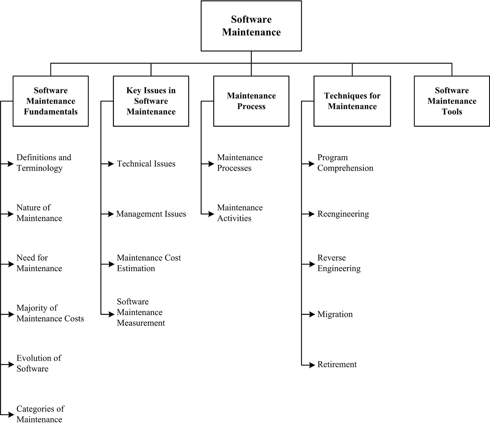

\#### 1.3. Need for Maintenance

<!-- [2\\*, c1s5] -->

Maintenance is needed to ensure that the software continues to satisfy user

requirements. Maintenance is applicable to software that is developed using any

software life cycle model (for example, spiral or linear). Software products

change due to corrective and noncorrective software actions. Maintenance must

be performed in order to

- correct faults;
- improve the design;
- implement enhancements;
- interface with other software;
- adapt programs so that different hardware, software, system features, and

telecommunications facilities can be used;

- migrate legacy software; and
- retire software.

Five key characteristics comprise the maintainer’s activities:

- maintaining control over the software’s day-to-day functions;
- maintaining control over software modification;
- perfecting existing functions;
- identifying security threats and fixing security vulnerabilities; and
- preventing software performance from degrading to unacceptable levels.

\#### 1.4. Majority of Maintenance Costs

<!-- [2\\*, c4s3, c5s5.2] -->

Maintenance consumes a major share of the financial resources in a software

life cycle. A common perception of software maintenance is that it merely fixes

faults. However, studies and surveys over the years have indicated that the

majority, over 80 percent, of software maintenance is used for noncorrective

actions [2\\*, figure 4.1]. Grouping enhancements and corrections together in

management reports contributes to some misconceptions regarding the high cost

of corrections. Understanding the categories of software maintenance helps to

understand the structure of software maintenance costs. Also, understanding the

factors that influence the maintainability of software can help to contain

costs. Some environmental factors and their relationship to software

maintenance costs include the following:

- Operating environment refers to hardware and software.
- Organizational environment refers to policies, competition, process, product,

and personnel.

\#### 1.5. Evolution of Software

<!-- [2\\*, c3s5] -->

Software maintenance in terms of evolution was first addressed in the late

1960s. Over a period of twenty years, research led to the formulation of eight

“Laws of Evolution.” Key findings include a proposal that maintenance is

evolutionary development and that maintenance decisions are aided by

understanding what happens to software over time. Some state that maintenance

is continued development, except that there is an extra input (or constraint) –

in other words, existing large software is never complete and continues to

evolve; as it evolves, it grows more complex unless some action is taken to

reduce this complexity.

\#### 1.6. Categories of Maintenance

<!-- [1\\*, c3, c6s2] [2\\*, c3s3.1] -->

Three categories (types) of maintenance have been defined: corrective,

adaptive, and perfective [2\\*, c4s3]. IEEE 14764 includes a fourth

category–preventative.

- Corrective maintenance: reactive modification (or repairs) of a software

product performed after delivery to correct discovered problems. Included in

this category is emergency maintenance, which is an unscheduled modification

performed to temporarily keep a software product operational pending

corrective maintenance.

- Adaptive maintenance: modification of a software product performed after

delivery to keep a software product usable in a changed or changing

environment. For example, the operating system might be upgraded and some

changes to the software may be necessary.

- Perfective maintenance: modification of a software product after delivery to

provide enhancements for users, improvement of program documentation, and

recoding to improve software performance, maintainability, or other software

attributes.

- Preventive maintenance: modification of a software product after delivery to

detect and correct latent faults in the software product before they become

operational faults.

IEEE 14764 classifies adaptive and perfective maintenance as maintenance

enhancements. It also groups together the corrective and preventive maintenance

categories into a correction category, as shown in Table 5.1.

|            | Correction  | Enhancement |

\|-----------:|:------------|-------------|

|  Proactive |  Preventive | Perfective  |

|  Reactive  |  Corrective | Adaptive    |

Table 5.1. Software Maintenance Categories

\### 2. Key Issues in Software Maintenance

A number of key issues must be dealt with to ensure the effective maintenance

of software. Software maintenance provides unique technical and management

challenges for software engineers—for example, trying to find a fault in

software containing a large number of lines of code that another software

engineer developed. Similarly, competing with software developers for resources

is a constant battle. Planning for a future release, which often includes

coding the next release while sending out emergency patches for the current

release, also creates a challenge. The following section presents some of the

technical and management issues related to software maintenance. They have been

grouped under the following topic headings:

- technical issues,
- management issues,
- cost estimation, and
- measurement.

\#### 2.1. Technical Issues

\##### 2.1.1. Limited Understanding

<!-- [2\\*, c6] -->

Limited understanding refers to how quickly a software engineer can understand

where to make a change or correction in software that he or she did not

develop. Research indicates that about half of the total maintenance effort is

devoted to understanding the software to be modified. Thus, the topic of

software comprehension is of great interest to software engineers.

Comprehension is more difficult in text-oriented representation - in source

code, for example - where it is often difficult to trace the evolution of

software through its releases/ versions if changes are not documented and if

the developers are not available to explain it, which is often the case. Thus,

software engineers may initially have a limited understanding of the software;

much has to be done to remedy this.

\##### 2.1.2. Testing

<!-- [1\\*, c6s2.2.2] [2\\*, c9] -->

The cost of repeating full testing on a major piece of software is significant

in terms of time and money. In order to ensure that the requested problem

reports are valid, the maintainer should replicate or verify problems by

running the appropriate tests. Regression testing (the selective retesting of

software or a component to verify that the modifications have not caused

unintended effects) is an important testing concept in maintenance.

Additionally, finding time to test is often difficult. Coordinating tests when

different members of the maintenance team are working on different problems at

the same time remains a challenge. When software performs critical functions,

it may be difficult to bring it offline to test. Tests cannot be executed in

the most meaningful place - the production system. The Software Testing KA

provides additional information and references on this matter in its subtopic

on regression testing.

\##### 2.1.3. Impact Analysis

<!-- [1\\*, c5s2.5] [2\\*, c13s3] -->

Impact analysis describes how to conduct, costeffectively, a complete analysis

of the impact of a change in existing software. Maintainers must possess an

intimate knowledge of the software’s structure and content. They use that

knowledge to perform impact analysis, which identifies all systems and software

products affected by a software change request and develops an estimate of the

resources needed to accomplish the change. Additionally, the risk of making the

change is determined. The change request, sometimes called a modification

request (MR) and often called a problem report (PR), must first be analyzed and

translated into software terms. Impact analysis is performed after a change

request enters the software configuration management process. IEEE 14764 states

the impact analysis tasks:

- analyze MRs/PRs;
- replicate or verify the problem;
- develop options for implementing the modification;
- document the MR/PR, the results, and the execution options;
- obtain approval for the selected modification option.

The severity of a problem is often used to decide how and when it will be

fixed. The software engineer then identifies the affected components. Several

potential solutions are provided, followed by a recommendation as to the best

course of action.

Software designed with maintainability in mind greatly facilitates impact

analysis. More information can be found in the Software Configuration

Management KA.

\##### 2.1.4. Maintainability

<!-- [1\\*, c6s8] [2\\*, c12s5.5] -->

IEEE 14764 [1\\*, c3s4] defines maintainability as the capability of the software

product to be modified. Modifications may include corrections, improvements, or

adaptation of the software to changes in environment as well as changes in

requirements and functional specifications. As a primary software quality

characteristic, maintainability should be specified, reviewed, and controlled

during software development activities in order to reduce maintenance costs.

When done successfully, the software’s maintainability will improve.

Maintainability is often difficult to achieve because the subcharacteristics

are often not an important focus during the process of software development.

The developers are, typically, more preoccupied with many other activities and

frequently prone to disregard the maintainer’s requirements. This in turn can,

and often does, result in a lack of software documentation and test

environments, which is a leading cause of difficulties in program comprehension

and subsequent impact analysis. The presence of systematic and mature

processes, techniques, and tools helps to enhance the maintainability of

software.

\#### 2.2. Management Issues

\##### 2.2.1. Alignment with Organizational Objectives

<!-- [2\\*, c4] -->

Organizational objectives describe how to demonstrate the return on investment

of software maintenance activities. Initial software development is usually

project-based, with a defined time scale and budget. The main emphasis is to

deliver a product that meets user needs on time and within budget. In contrast,

software maintenance often has the objective of extending the life of software

for as long as possible. In addition, it may be driven by the need to meet user

demand for software updates and enhancements. In both cases, the return on

investment is much less clear, so that the view at the senior management

level is often that of a major activity consuming significant resources

with no clear quantifiable benefit for the organization.

\##### 2.2.2. Staffing

<!-- [2\\*, c4s5, c10s4] -->

Staffing refers to how to attract and keep software maintenance staff.

Maintenance is not often viewed as glamorous work. As a result, software

maintenance personnel are frequently viewed as “second-class citizens,” and

morale therefore suffers.

\##### 2.2.3. Process

<!-- [1\\*, c5] [2\\*, c5] -->

The software life cycle process is a set of activities, methods, practices, and

transformations that people use to develop and maintain software and its

associated products. At the process level, software maintenance activities

share much in common with software development (for example, software

configuration management is a crucial activity in both). Maintenance also

requires several activities that are not found in software development (see

section 3.2 on unique activities for details). These activities present

challenges to management.

\##### 2.2.4. Organizational Aspects of Maintenance

<!-- [1\\*, c7s2.3] [2\\*, c10] -->

Organizational aspects describe how to identify which organization and/or

function will be responsible for the maintenance of software. The team that

develops the software is not necessarily assigned to maintain the software once

it is operational.

In deciding where the software maintenance function will be located, software

engineering organizations may, for example, stay with the original developer or

go to a permanent maintenance-specific team (or maintainer). Having a permanent

maintenance team has many benefits:

- allows for specialization;
- creates communication channels;
- promotes an egoless, collegiate atmosphere;
- reduces dependency on individuals;
- allows for periodic audit checks.

Since there are many pros and cons to each option, the decision should be made

on a case-by-case basis. What is important is the delegation or assignment of

the maintenance responsibility to a single group or person, regardless of the

organization’s structure.

\##### 2.2.5. Outsourcing

<!-- [3] -->

Outsourcing and offshoring software maintenance has become a major industry.

Organizations are outsourcing entire portfolios of software, including software

maintenance. More often, the outsourcing option is selected for less

mission-critical software, as organizations are unwilling to lose control of

the software used in their core business. One of the major challenges for

outsourcers is to determine the scope of the maintenance services required, the

terms of a service-level agreement, and the contractual details. Outsourcers

will need to invest in a maintenance infrastructure, and the help desk at the

remote site should be staffed with native-language speakers. Outsourcing

requires a significant initial investment and the setup of a maintenance

process that will require automation.

\#### 2.3. Maintenance Cost Estimation

Software engineers must understand the different categories of software

maintenance, discussed above, in order to address the question of estimating

the cost of software maintenance. For planning purposes, cost estimation is an

important aspect of planning for software maintenance.

\##### 2.3.1. Cost Estimation

<!-- [2\\*, c7s2.4] -->

Section 2.1.3 describes how impact analysis identifies all systems and software

products affected by a software change request and develops an estimate of the

resources needed to accomplish that change.

Maintenance cost estimates are affected by many technical and nontechnical

factors. IEEE 14764 states that “the two most popular approaches to estimating

resources for software maintenance are the use of parametric models and the use

of experience” [1\\*, c7s4.1]. A combination of these two can also be used.

\##### 2.3.2. Parametric Models

<!-- [2\\*, c12s5.6] -->

Parametric cost modeling (mathematical models) has been applied to software

maintenance. Of significance is that historical data from past maintenance are

needed in order to use and calibrate the mathematical models. Cost driver

attributes affect the estimates.

\##### 2.3.3. Experience

<!-- [2\\*, c12s5.5] -->

Experience, in the form of expert judgment, is often used to estimate

maintenance effort. Clearly, the best approach to maintenance estimation is to

combine historical data and experience. The cost to conduct a modification (in

terms of number of people and amount of time) is then derived. Maintenance

estimation historical data should be provided as a result of a measurement

program.

\#### 2.4. Software Maintenance Measurement

<!-- [1\\*, c6s5] [2\\*, c12] -->

Entities related to software maintenance, whose attributes can be subjected to

measurement, include process, resource, and product [2\\*, c12s3.1].

There are several software measures that can be derived from the attributes of

the software, the maintenance process, and personnel, including size,

complexity, quality, understandability, maintainability, and effort. Complexity

measures of software can also be obtained using available commercial tools.

These measures constitute a good starting point for the maintainer’s

measurement program. Discussion of software process and product measurement is

also presented in the Software Engineering Process KA. The topic of a software

measurement program is described in the Software Engineering Management KA.

\##### 2.4.1. Specific Measures

<!-- [2\\*, c12] -->

The maintainer must determine which measures are appropriate for a specific

organization based on that organization’s own context. The software quality

model suggests measures that are specific for software maintenance. Measures

for subcharacteristics of maintainability include the following [4\\*, p. 60]:

- Analyzability: measures of the maintainer’s effort or resources expended in

trying either to diagnose deficiencies or causes of failure or to identify

parts to be modified.

- Changeability: measures of the maintainer’s effort associated with

implementing a specified modification.

- Stability: measures of the unexpected behav- ior of software, including that

encountered during testing.

- Testability: measures of the maintainer’s and users’ effort in trying to test

the modified software.

- Other measures that maintainers use include
- size of the software,
- complexity of the software,
- understandability, and
- maintainability.

Providing software maintenance effort, by categories, for different

applications provides business information to users and their organizations. It

can also enable the comparison of software maintenance profiles internally

within an organization.

\### 3. Maintenance Process

In addition to standard software engineering processes and activities described

in IEEE 14764, there are a number of activities that are unique to maintainers.

\#### 3.1. Maintenance Processes

<!-- [1\\*, c5] [2\\*, c5] [5, s5.5] -->

Maintenance processes provide needed activities and detailed inputs/outputs to

those activities as described in IEEE 14764. The maintenance process activities

of IEEE 14764 are shown in Figure 5.2. Software maintenance activities include

- process implementation,
- problem and modification analysis,
- modification implementation,
- maintenance review/acceptance,
- migration, and
- software retirement.

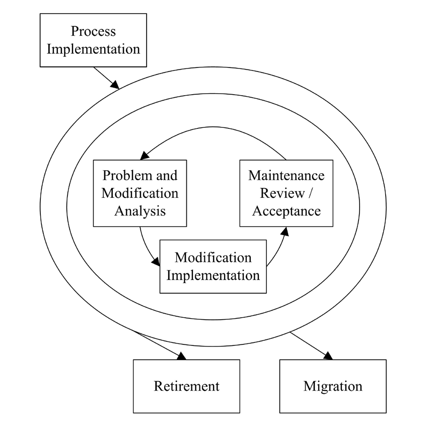

Other maintenance process models include:

- quick fix,
- spiral,
- Osborne’s,
- iterative enhancement, and
- reuse-oriented.

Recently, agile methodologies, which promote light processes, have been also

adapted to maintenance. This requirement emerges from the everincreasing

demand for fast turnaround of maintenance services. Improvement to the software

maintenance process is supported by specialized software maintenance capability

maturity models (see [6] and [7], which are briefly annotated in the Further

Readings section).

\#### 3.2. Maintenance Activities

<!-- [1\\*, c5, c6s8.2, c7s3.3] -->

The maintenance process contains the activities and tasks necessary to modify

an existing software product while preserving its integrity. These activities

and tasks are the responsibility of the maintainer. As already noted, many

maintenance activities are similar to those of software development.

Maintainers perform analysis, design, coding, testing, and documentation.

They must track requirements in their activities - just as is done in

development - and update documentation as baselines change. IEEE 14764

recommends that when a maintainer uses a development process, it must be

tailored to meet specific needs [1\\*, c5s3.2.2]. However, for software

maintenance, some activities involve processes unique to software maintenance.

\##### 3.2.1. Unique Activities

<!-- [1\\*, c3s10, c6s9, c7s2, c7s3] [2\\*, c6, c7] -->

There are a number of processes, activities, and practices that are unique to

software maintenance:

- Program understanding: activities needed to obtain a general knowledge of

what a software product does and how the parts work together.

- Transition: a controlled and coordinated sequence of activities during which

software is transferred progressively from the developer to the maintainer.

- Modification request acceptance/rejection: modifications requesting work

beyond a certain size/effort/complexity may be rejected by maintainers and

rerouted to a developer.

- Maintenance help desk: an end-user and maintenance coordinated support

function that triggers the assessment, prioritization, and costing of

modification requests.

- Impact analysis: a technique to identify areas impacted by a potential

change;

- Maintenance Service-Level Agreements (SLAs) and maintenance licenses and

contracts: contractual agreements that describe the services and quality

objectives.

\##### 3.2.2. Supporting Activities

<!-- [1\\*, c4s1, c5, c6s7] [2\\*, c9] -->

Maintainers may also perform support activities, such as documentation,

software configuration management, verification and validation, problem

resolution, software quality assurance, reviews, and audits. Another important

support activity consists of training the maintainers and users.

\##### 3.2.3. Maintenance Planning Activities

<!-- [1\\*, c7s3] -->

An important activity for software maintenance is planning, and maintainers

must address the issues associated with a number of planning perspectives,

including

- business planning (organizational level),
- maintenance planning (transition level),
- release/version planning (software level), and
- individual software change request planning (request level).

At the individual request level, planning is carried out during the impact

analysis (see section 2.1.3, Impact Analysis). The release/version planning

activity requires that the maintainer:

- collect the dates of availability of individual requests,
- agree with users on the content of subsequent releases/versions,
- identify potential conflicts and develop alternatives,
- assess the risk of a given release and develop a back-out plan in case

problems should arise, and

- inform all the stakeholders.

Whereas software development projects can typically last from some months to a

few years, the maintenance phase usually lasts for many years. Making estimates

of resources is a key element of maintenance planning. Software maintenance

planning should begin with the decision to develop a new software product and

should consider quality objectives. A concept document should be developed,

followed by a maintenance plan. The maintenance concept for each software

product needs to be documented in the plan [1\\*, c7s2] and should address the

- scope of the software maintenance,
- adaptation of the software maintenance process,
- identification of the software maintenance organization, and
- estimate of software maintenance costs.

The next step is to develop a corresponding software maintenance plan. This

plan should be prepared during software development and should specify how

users will request software modifications or report problems. Software

maintenance planning is addressed in IEEE 14764. It provides guidelines for a

maintenance plan. Finally, at the highest level, the maintenance organization

will have to conduct business planning activities (budgetary, financial, and

human resources) just like all the other divisions of the organization.

Management is discussed in the chapter Related Disciplines of Software

Engineering.

\##### 3.2.4. Software Configuration Management

<!-- [1\\*, c5s1.2.3] [2\\*, c11] -->

IEEE 14764 describes software configuration management as a critical element of

the maintenance process. Software configuration management procedures should

provide for the verification, validation, and audit of each step required to

identify, authorize, implement, and release the software product.

It is not sufficient to simply track modification requests or problem reports.

The software product and any changes made to it must be controlled. This

control is established by implementing and enforcing an approved software

configuration management (SCM) process. The Software Configuration Management

KA provides details of SCM and discusses the process by which software change

requests are submitted, evaluated, and approved. SCM for software maintenance

is different from SCM for software development in the number of small changes

that must be controlled on operational software. The SCM process is implemented

by developing and following a software configuration management plan and

operating procedures. Maintainers participate in Configuration Control Boards

to determine the content of the next release/version.

\##### 3.2.5. Software Quality

<!-- [1\\*, c6s5, c6s7, c6s8] [2\\*, c12s5.3] -->

It is not sufficient to simply hope that increased quality will result from the

maintenance of software. Maintainers should have a software quality program. It

must be planned and processes must be implemented to support the maintenance

process. The activities and techniques for Software Quality Assurance (SQA),

V&V, reviews, and audits must be selected in concert with all the other

processes to achieve the desired level of quality. It is also recommended that

the maintainer adapt the software development processes, techniques and

deliverables (for instance, testing documentation), and test results. More

details can be found in the Software Quality KA.

\### 4. Techniques for Maintenance

This topic introduces some of the generally accepted techniques used in

software maintenance.

\#### 4.1. Program Comprehension

<!-- [2\\*, c6, c14s5] -->

Programmers spend considerable time reading and understanding programs in order

to implement changes. Code browsers are key tools for program comprehension and

are used to organize and present source code. Clear and concise documentation

can also aid in program comprehension.

\#### 4.2. Reengineering

<!-- [2\\*, c7] -->

Reengineering is defined as the examination and alteration of software to

reconstitute it in a new form, and includes the subsequent implementation of

the new form. It is often not undertaken to improve maintainability but to

replace aging legacy software. Refactoring is a reengineering technique that

aims at reorganizing a program without changing its behavior. It seeks to

improve a program structure and its maintainability. Refactoring techniques can

be used during minor changes.

\#### 4.3. Reverse Engineering

<!-- [1\\*, c6s2] [2\\*, c7, c14s5] -->

Reverse engineering is the process of analyzing software to identify the

software’s components and their inter-relationships and to create

representations of the software in another form or at higher levels of

abstraction. Reverse engineering is passive; it does not change the software or

result in new software. Reverse engineering efforts produce call graphs and

control flow graphs from source code. One type of reverse engineering is

redocumentation. Another type is design recovery. Finally, data reverse

engineering, where logical schemas are recovered from physical databases, has

grown in importance over the last few years. Tools are key for reverse

engineering and related tasks such as redocumentation and design recovery.

\#### 4.4. Migration

<!-- [1\\*, c5s5] -->

During software’s life, it may have to be modified to run in different

environments. In order to migrate it to a new environment, the maintainer needs

to determine the actions needed to accomplish the migration, and then develop

and document the steps required to effect the migration in a migration plan

that covers migration requirements, migration tools, conversion of product and

data, execution, verification, and support. Migrating software can also entail

a number of additional activities such as

- notification of intent: a statement of why the old environment is no longer

to be supported, followed by a description of the new environment and its

date of availability;

- parallel operations: make available the old and new environments so that the

user experiences a smooth transition to the new environment;

- notification of completion: when the scheduled migration is completed, a

notification is sent to all concerned;

- postoperation review: an assessment of parallel operation and the impact of

changing to the new environment;

- data archival: storing the old software data.

\#### 4.5. Retirement

<!-- [1\\*, c5s6] -->

Once software has reached the end of its useful life, it must be retired. An

analysis should be performed to assist in making the retirement decision. This

analysis should be included in the retirement plan, which covers retirement

requirements, impact, replacement, schedule, and effort. Accessibility of

archive copies of data may also be included. Retiring software entails a number

of activities similar to migration.

\### 5. Software Maintenance Tools

<!-- [1\\*, c6s4] [2\\*, c14] -->

This topic encompasses tools that are particularly important in software

maintenance where existing software is being modified. Examples regarding

program comprehension include

- program slicers, which select only parts of a program affected by a change;
- static analyzers, which allow general viewing and summaries of a program content;
- dynamic analyzers, which allow the maintainer to trace the execution path of

a program;

- data flow analyzers, which allow the maintainer to track all possible data

flows of a program;

- cross-referencers, which generate indices of program components; and
- dependency analyzers, which help maintainers analyze and understand the

interrelationships between components of a program.

Reverse engineering tools assist the process by working backwards from an

existing product to create artifacts such as specification and design

descriptions, which can then be transformed to generate a new product from an

old one. Maintainers also use software test, software configuration management,

software documentation, and software measurement tools.

\### Matrix Of Topics vs. Reference Material

IEEE/ISO/IEC 14764 2006

[1]

Grubb and Takang 2003

[2]

Sneed 2008

[3]

\\*\\*1. Software Maintenance Fundamentals\\*\\*

1\.1. Definitions and Terminology c3 c1s2, c2s2

1\.2. Nature of Maintenance c1s3

1\.3. Need for Maintenance c1s5

1\.4. Majority of Maintenance Costs c4s3, c5s5.2

1\.5. Evolution of Software c3s5

1\.6. Categories of Maintenance c3, c6s2 c3s3.1, c4s3

\\*\\*2. Key Issues in Software Maintenance\\*\\*

2\.1. Technical Issues

2\.1.1. Limited Understanding c6

2\.1.2. Testing c6s2.2.2 c9

2\.1.3. Impact Analysis c5s2.5 c13s3

2\.1.4. Maintainability c6s8, c3s4 c12s5.5

2\.2. Management Issues

2\.2.1. Alignment with Organizational objectives c4

2\.2.2. Staffing c4s5, c10s4

2\.2.3. Process c5 c5

2\.2.4. Organizational Aspects of Maintenance c7s.2.3 c10

2\.2.5. Outsourcing/Offshoring all

2\.3. Maintenance Cost Estimation

2\.3.1. Cost Estimation c7s4.1 c7s2.4

IEEE/ISO/IEC 14764 2006

[1]

Grubb and Takang 2003

[2]

Sneed 2008

[3]

2\.3.2. Parametric Models c12s5.6

2\.3.3. Experience c12s5.5

2\.4. Software Maintenance Measurement c6s5 c12, c12s3.1

2\.4.1. Specific Measures c12

\\*\\*3. Maintenance Process\\*\\*

3\.1. Maintenance Processes c5 c5

3\.2. Maintenance Activities c5, c5s3.2.2, c6s8.2, c7s3.3

3\.2.1. Unique Activities c3s10, c6s9, c7s2, c7s3 c6,c7

3\.2.2. Supporting Activities c4s1, c5, c6s7 c9

3\.2.3. Maintenance Planning Activities c7s2, c7s.3

3\.2.4. Software Configuration Management c5s1.2.3 c11

3\.2.5. Software Quality c6s5, c6s7, c6s8 c12s5.3

\\*\\*4. Techniques for Maintenance\\*\\*

4\.1. Program Comprehension c6,c14s5

4\.2. Reengineering c7

4\.3. Reverse Engineering c6s2 c7, c14s5

4\.4. Migration c5s5

4\.5. Retirement c5s6

\\*\\*5. Software Maintenance Tools\\*\\* c6s4 c14

\\*\\*Further Readings\\*\\*

1. April and A. Abran, \\_Software Maintenance Management: Evaluation and

Continuous Improvement\\_ [6].

This book explores the domain of small software maintenance processes (S3M). It

provides roadmaps for improving software maintenance processes in

organizations. It describes a software maintenance specific maturity model

organized by levels which allow for benchmarking and continuous improvement.

Goals for each key practice area are provided, and the process model presented

is fully aligned with the architecture and framework of international standards

ISO12207, ISO14764 and ISO15504 and popular maturity models like ITIL, CoBIT,

CMMI and CM3.

M. Kajko-Mattsson, “Towards a Business Maintenance Model,” IEEE Int’l Conf.

Software Maintenance [7].

This paper presents an overview of the Corrective Maintenance Maturity Model

(CM3). In contrast to other process models, CM3 is a specialized model,

entirely dedicated to corrective maintenance of software. It views maintenance

in terms of the activities to be performed and their order, in terms of the

information used by these activities, goals, rules and motivations for their

execution, and organizational levels and roles involved at various stages of a

typical corrective maintenance process.

\\*\\*References\\*\\*

[1] IEEE Std. 14764-2006 (a.k.a. ISO/IEC 14764:2006) Standard for Software

Engineering—Software Life Cycle Processes—Maintenance, IEEE, 2006.

[2] P. Grubb and A.A. Takang, Software Maintenance: Concepts and Practice, 2nd

ed., World Scientific Publishing, 2003.

[3] H.M. Sneed, “Offering Software Maintenance as an Offshore Service,” Proc.

IEEE Int’l Conf. Software Maintenance (ICSM 08), IEEE, 2008, pp. 1–5.

[4] J.W. Moore, The Road Map to Software Engineering: A Standards-Based Guide,

Wiley-IEEE Computer Society Press, 2006.

[5] ISO/IEC/IEEE 24765:2010 Systems and Software Engineering—Vocabulary, ISO/

IEC/IEEE, 2010.

[6] A. April and A. Abran, Software Maintenance Management: Evaluation and

Continuous Improvement, Wiley-IEEE Computer Society Press, 2008.

[7] M. Kajko-Mattsson, “Towards a Business Maintenance Model,” Proc. Int’l

Conf.  Software Maintenance, IEEE, 2001, pp.  500–509.

\## Chapter 6: Software Configuration Management

\\*\\*Acronyms\\*\\*

- CCB Configuration Control Board
- CM Configuration Management
- FCA Functional Configuration Audit
- PCA Physical Configuration Audit
- SCCB Software Configuration Control Board
- SCI Software Configuration Item
- SCM Software Configuration Management
- SCMP Software Configuration Management Plan
- SCR Software Change Request
- SCSA Software Configuration Status Accounting
- SDD Software Design Document
- SEI/ CMMI Software Engineering Institute’s Capability Maturity Model

Integration

- SQA Software Quality Assurance
- SRS Software Requirement Specification

\\*\\*Introduction\\*\\*

A system can be defined as the combination of interacting elements organized to

achieve one or more stated purposes [1]. The configuration of a system is the

functional and physical characteristics of hardware or software as set forth in

technical documentation or achieved in a product [1]; it can also be thought of

as a collection of specific versions of hardware, firmware, or software items

combined according to specific build procedures to serve a particular purpose.

Configuration management (CM), then, is the discipline of identifying the

configuration of a system at distinct points in time for the purpose of

systematically controlling changes to the configuration and maintaining the

integrity and traceability of the configuration throughout the system life

cycle. It is formally defined as a discipline applying technical and

administrative direction and surveillance to: identify and document the

functional and physical characteristics of a configuration item, control

changes to those characteristics, record and report change processing and

implementation status, and verify compliance with specified requirements. [1]

Software configuration management (SCM) is a supporting-software life cycle

process that benefits project management, development and maintenance

activities, quality assurance activities, as well as the customers and users of

the end product.  The concepts of configuration management apply to all items

to be controlled, although there are some differences in implementation between

hardware CM and software CM.  SCM is closely related to the software quality

assurance (SQA) activity. As defined in the Software Quality knowledge area

(KA), SQA processes provide assurance that the software products and processes

in the project life cycle conform to their specified requirements by planning,

enacting, and performing a set of activities to provide adequate confidence

that quality is being built into the software. SCM activities help in

accomplishing these SQA goals. In some project contexts, specific SQA

requirements prescribe certain SCM activities.

The SCM activities are management and planning of the SCM process, software

configuration identification, software configuration control, software

configuration status accounting, software configuration auditing, and software

release management and delivery.

The Software Configuration Management KA is related to all the other KAs, since

the object of configuration management is the artifact produced and used

throughout the software engineering process.

\\*\\*Breakdown Of Topics For Software Configuration Management\\*\\*

The breakdown of topics for the Software Configuration Management KA is shown

in Figure 6.1.

\### 1. Management of the SCM Process

SCM controls the evolution and integrity of a product by identifying its

elements; managing and controlling change; and verifying, recording, and

reporting on configuration information. From the software engineer’s

perspective, SCM facilitates development and change implementation activi ties.

A successful SCM implementation requires careful planning and management.

This, in turn, requires an understanding of the organizational context for, and

the constraints placed on, the design and implementation of the SCM process.

\#### 1.1. Organizational Context for SCM

<!-- [2\\*, c6, ann. D] [3\\*, introduction] [4\\*, c29] -->

To plan an SCM process for a project, it is necessary to understand the

organizational context and the relationships among organizational elements.

SCM interacts with several other activities or organizational elements.

The organizational elements responsible for the software engineering supporting

processes may be structured in various ways. Although the responsibility for

performing certain SCM tasks might be assigned to other parts of the

organization (such as the development organization), the overall responsibility

for SCM often rests with a distinct organizational element or designated

individual.  Software is frequently developed as part of a larger system

containing hardware and firmware elements. In this case, SCM activities take

place

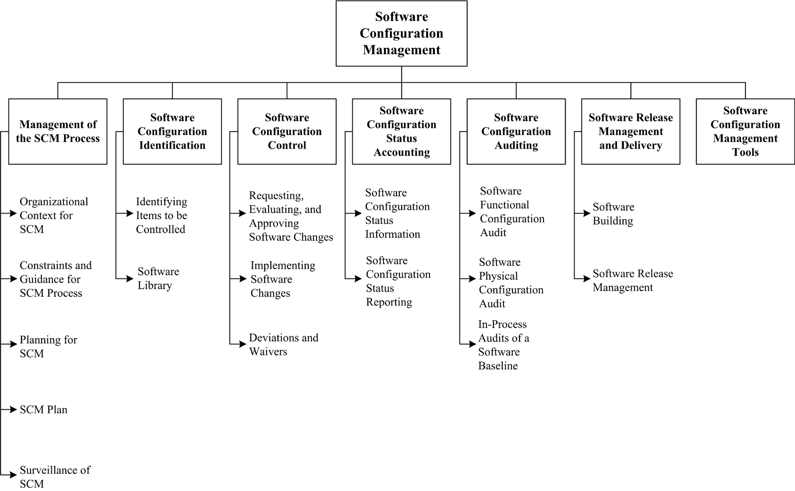

in parallel with hardware and firmware CM activities and must be consistent

with system-level CM. Note that firmware contains hardware and software;

therefore, both hardware and software CM concepts are applicable.

SCM might interface with an organization’s quality assurance activity on issues

such as records management and nonconforming items.  Regarding the former, some

items under SCM control might also be project records subject to provisions of

the organization’s quality assurance program. Managing nonconforming items is

usually the responsibility of the quality assurance activity; however, SCM

might assist with tracking and reporting on software configuration items

falling into this category.

Perhaps the closest relationship is with the software development and

maintenance organizations. It is within this context that many of the

software configuration control tasks are conducted. Frequently, the same

tools support development, maintenance, and SCM purposes.

\#### 1.2. Constraints and Guidance for the SCM Process

<!-- [2, c6, ann. D, ann. E] [3, c2, c5] [5, c19s2.2] -->

Constraints affecting, and guidance for, the SCM process come from a number of

sources. Policies and procedures set forth at corporate or other organizational

levels might influence or prescribe the design and implementation of the SCM

process for a given project. In addition, the contract between the acquirer and

the supplier might contain provisions affecting the SCM process. For example,

certain configuration audits might be required, or it might be specified that

certain items be placed under CM. When software products to be developed have

the potential to affect public safety, external regulatory bodies may impose

constraints. Finally, the particular software life cycle process chosen for a

software project and the level of formalism selected to implement the software

affect the design and implementation of the SCM process.

Guidance for designing and implementing an SCM process can also be obtained

from “best practice,” as reflected in the standards on software engineering

issued by the various standards organizations (see Appendix B on standards).

\#### 1.3. Planning for SCM

<!-- [2, c6, ann. D, ann. E] [3, c23] [4, c29] -->

The planning of an SCM process for a given project should be consistent with

the organizational context, applicable constraints, commonly accepted

guidance, and the nature of the project (for example, size, safety criticality,

and security). The major activities covered are software configuration

identification, software configuration control, software configuration status

accounting, software configuration auditing, and software release management

and delivery. In addition, issues such as organization and responsibilities,

resources and schedules, tool selection and implementation, vendor and

subcontractor control, and interface control are typically considered. The

results of the planning activity are recorded in an SCM Plan (SCMP), which is

typically subject to SQA review and audit.  Branching and merging strategies

should be carefully planned and communicated, since they impact many SCM

activities. From an SCM standpoint, a branch is defined as a set of evolving

source file versions [1]. Merging consists in combining different changes to

the same file [1]. This typically occurs when more than one person changes a

configuration item. There are many branching and merging strategies in common

use (see the Further Readings section for additional discussion).  The software

development life cycle model (see Software Life Cycle Models in the Software

Engineering Process KA) also impacts SCM activities, and SCM planning should

take this into account. For instance, continuous integration is a common

practice in many software development approaches. It is typically

characterized by frequent build-test-deploy cycles. SCM activities must be

planned accordingly.

\##### 1.3.1. SCM Organization and Responsibilities

<!-- [2, ann. Ds5, ann. Ds6] [3, c10-11] [4, introduction, c29] -->

To prevent confusion about who will perform given SCM activities or tasks,

organizational roles to be involved in the SCM process need to be clearly

identified. Specific responsibilities for given SCM activities or tasks also

need to be assigned to organizational entities, either by title or by

organizational element. The overall authority and reporting channels for SCM

should also be identified, although this might be accomplished at the project

management or quality assurance planning stage.

\##### 1.3.2. SCM Resources and Schedules

<!-- [2, ann. Ds8] [3, c23] -->

Planning for SCM identifies the staff and tools involved in carrying out SCM

activities and tasks.  It addresses scheduling questions by establishing

necessary sequences of SCM tasks and identifying their relationships to the

project schedules and milestones established at the project management planning

stage. Any training requirements necessary for implementing the plans and

training new staff members are also specified.

\##### 1.3.3. Tool Selection and Implementation

<!-- [3, c26s2, c26s6] [4, c29s5] -->

As for any area of software engineering, the selection and implementation of

SCM tools should be carefully planned. The following questions should be

considered:

- Organization: what motivates tool acquisition from an organizational

perspective?

- Tools: can we use commercial tools or develop them ourselves?
- Environment: what are the constraints imposed by the organization and its

technical context?

- Legacy: how will projects use (or not) the new tools?
- Financing: who will pay for the tools’ acquisition, maintenance, training,

and customization?

- Scope: how will the new tools be deployed - for instance, through the entire

organization or only on specific projects?

- Ownership: who is responsible for the introduction of new tools?
- Future: what is the plan for the tools’ use in the future?
- Change: how adaptable are the tools?
- Branching and merging: are the tools’ capabilities compatible with the

planned branching and merging strategies?

- Integration: do the various SCM tools integrate among themselves? With other

tools in use in the organization?

- Migration: can the repository maintained by the version control tool be

ported to another version control tool while maintaining complete history of

the configuration items it contains?

SCM typically requires a set of tools, as opposed to a single tool. Such tool

sets are sometimes referred to as workbenches. In such a context, another

important consideration in planning for tool selection is determining if the

SCM workbench will be open (in other words, tools from different suppliers will

be used in different activities of the SCM process) or integrated (where

elements of the workbench are designed to work together).

The size of the organization and the type of projects involved may also impact

tool selection (see topic 7, Software Configuration Management Tools).

\##### 1.3.4. Vendor/Subcontractor Control

<!-- [2, c13] [3, c13s9, c14s2] -->

A software project might acquire or make use of purchased software products,

such as compilers or other tools. SCM planning considers if and how these items

will be taken under configuration control (for example, integrated into the

project libraries) and how changes or updates will be evaluated and managed.

Similar considerations apply to subcontracted software. When using

subcontracted software, both the SCM requirements to be imposed on the

subcontractor’s SCM process as part of the subcontract and the means for

monitoring compliance need to be established. The latter includes consideration

of what SCM information must be available for effective compliance monitoring.

\##### 1.3.5. Interface Control

<!-- [2, c12] [3, c24s4] -->

When a software item will interface with another software or hardware item, a

change to either item can affect the other. Planning for the SCM process

considers how the interfacing items will be identified and how changes to the

items will be managed and communicated. The SCM role may be part of a larger,

system-level process for interface specification and control; it may involve

interface specifications, interface control plans, and interface control

documents.  In this case, SCM planning for interface control takes place within

the context of the system-level process.

\#### 1.4. SCM Plan

<!-- [2, ann. D] [3, c23] [4, c29s1] -->

The results of SCM planning for a given project are recorded in a software

configuration management plan (SCMP), a “living document” which serves as a

reference for the SCM process. It is maintained (that is, updated and approved)

as necessary during the software life cycle. In implementing the SCMP, it is

typically necessary to develop a number of more detailed, subordinate

procedures defining how specific requirements will be carried out during

day-to-day activities - for example, which branching strategies will be used and

how frequently builds occur and automated tests of all kinds are run.

Guidance on the creation and maintenance of an SCMP, based on the information

produced by the planning activity, is available from a number of sources, such

as [2]. This reference provides requirements for the information to be

contained in an SCMP; it also defines and describes six categories of SCM

information to be included in an SCMP:

- Introduction (purpose, scope, terms used)
- SCM Management (organization, responsibilities, authorities, applicable

policies, directives, and procedures)

- SCM Activities (configuration identification, configuration control, and so

on)

- SCM Schedules (coordination with other project activities)
- SCM Resources (tools, physical resources, and human resources)
- SCMP Maintenance.

\#### 1.5. Surveillance of Software Configuration Management

<!--[3, c11s3]  -->

After the SCM process has been implemented, some degree of surveillance may be

necessary to ensure that the provisions of the SCMP are properly carried out.

There are likely to be specific SQA requirements for ensuring compliance with

specified SCM processes and procedures.  The person responsible for SCM ensures

that those with the assigned responsibility perform the defined SCM tasks

correctly. The software quality assurance authority, as part of a compliance

auditing activity, might also perform this surveillance.

The use of integrated SCM tools with process control capability can make the

surveillance task easier. Some tools facilitate process compliance while

providing flexibility for the software engineer to adapt procedures. Other

tools enforce process, leaving the software engineer with less flexibility.

Surveillance requirements and the level of flexibility to be provided to the

software engineer are important considerations in tool selection.

\##### 1.5.1. SCM Measures and Measurement

<!-- [3, c9s2, c25s2–s3] -->

SCM measures can be designed to provide specific information on the evolving

product or to provide insight into the functioning of the SCM process. A

related goal of monitoring the SCM process is to discover opportunities for

process improvement. Measurements of SCM processes provide a good means for

monitoring the effectiveness of SCM activities on an ongoing basis.  These

measurements are useful in characterizing the current state of the process as

well as in providing a basis for making comparisons over time. Analysis of the

measurements may produce insights leading to process changes and corresponding

updates to the SCMP.  Software libraries and the various SCM tool capabilities

provide sources for extracting information about the characteristics of the SCM

process (as well as providing project and management information). For example,

information about the time required to accomplish various types of changes

would be useful in an evaluation of the criteria for determining what levels of

authority are optimal for authorizing certain types of changes and for

estimating future changes.  Care must be taken to keep the focus of the

surveillance on the insights that can be gained from the measurements, not on

the measurements themselves. Discussion of software process and product

measurement is presented in the Software Engineering Process KA. Software

measurement programs are described in the Software Engineering Management KA.

\##### 1.5.2. In-Process Audits of SCM

<!-- [3, c1s1] -->

Audits can be carried out during the software engineering process to

investigate the current status of specific elements of the configuration or to

assess the implementation of the SCM process.  Inprocess auditing of SCM

provides a more formal mechanism for monitoring selected aspects of the process

and may be coordinated with the SQA function (see topic 5, Software

Configuration Auditing).

\### 2. Software Configuration Identification

<!-- [2\\*, c8] [4\\*, c29s1.1] -->

Software configuration identification identifies items to be controlled,

establishes identification schemes for the items and their versions, and

establishes the tools and techniques to be used in acquiring and managing

controlled items. These activities provide the basis for the other SCM

activities.

\#### 2.1. Identifying Items to Be Controlled

<!-- [2, c8s2.2] [4, c29s1.1] -->

One of the first steps in controlling change is identifying the software items

to be controlled.

This involves understanding the software configuration within the context of

the system configuration, selecting software configuration items, developing

a strategy for labeling software items and describing their relationships, and

identifying both the baselines to be used and the procedure for a baseline’s

acquisition of the items.

\##### 2.1.1. Software Configuration

<!-- [1, c3] -->

Software configuration is the functional and physical characteristics of

hardware or software as set forth in technical documentation or achieved in a

product. It can be viewed as part of an overall system configuration.

\##### 2.1.2. Software Configuration Item

<!-- [4, c29s1.1] -->

A configuration item (CI) is an item or aggregation of hardware or software or

both that is designed to be managed as a single entity. A software

configuration item (SCI) is a software entity that has been established as a

configuration item [1]. The SCM typically controls a variety of items in

addition to the code itself. Software items with potential to become SCIs

include plans, specifications and design documentation, testing materials,

software tools, source and executable code, code libraries, data and data

dictionaries, and documentation for installation, maintenance, operations, and

software use.

Selecting SCIs is an important process in which a balance must be achieved

between providing adequate visibility for project control purposes and

providing a manageable number of controlled items.

\##### 2.1.3. Software Configuration Item Relationships

<!-- [3, c7s4] -->

Structural relationships among the selected SCIs, and their constituent parts,

affect other SCM activities or tasks, such as software building or analyzing

the impact of proposed changes. Proper tracking of these relationships is also

important for supporting traceability.  The design of the identification scheme

for SCIs should consider the need to map identified items to the software

structure, as well as the need to support the evolution of the software

items and their relationships.

\##### 2.1.4. Software Version

<!-- [1, c3] [4, c29s3] -->

Software items evolve as a software project proceeds. A version of a software

item is an identified instance of an item. It can be thought of as a state of

an evolving item. A variant is a version of a program resulting from the

application of software diversity.

\##### 2.1.5. Baseline

<!-- [1, c3] -->

A software baseline is a formally approved version of a configuration item

(regardless of media) that is formally designated and fixed at a specific time

during the configuration item’s life cycle.  The term is also used to refer to

a particular version of a software configuration item that has been agreed on.

In either case, the baseline can only be changed through formal change control

procedures. A baseline, together with all approved changes to the baseline,

represents the current approved configuration.  Commonly used baselines include

functional, allocated, developmental, and product baselines. The functional

baseline corresponds to the reviewed system requirements. The allocated

baseline corresponds to the reviewed software requirements specification and

software interface requirements specification.  The developmental baseline

represents the evolving software configuration at selected times during the

software life cycle. Change authority for this baseline typically rests

primarily with the development organization but may be shared with other

organizations (for example, SCM or Test). The product baseline corresponds to

the completed software product delivered for system integration. The

baselines to be used for a given project, along with the associated levels of

authority needed for change approval, are typically identified in the SCMP.

\##### 2.1.6. Acquiring Software Configuration Items

<!-- [3, c18] -->

Software configuration items are placed under SCM control at different times;

that is, they are incorporated into a particular baseline at a particular

point in the software life cycle. The triggering event is the completion of

some form of formal acceptance task, such as a formal review. Figure 6.2

characterizes the growth of baselined items as the life cycle proceeds. This

figure is based on the waterfall model for purposes of illustration only; the

subscripts used in the figure indicate versions

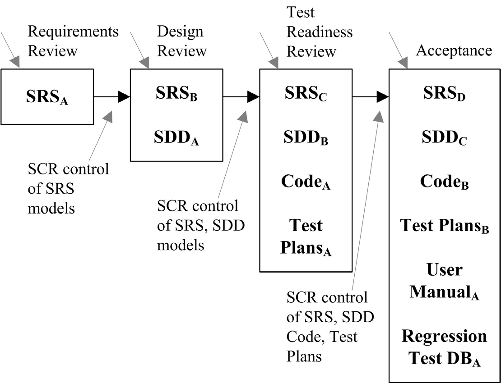

of the evolving items. The software change request (SCR) is described in

section 3.1.  In acquiring an SCI, its origin and initial integrity must be

established. Following the acquisition of an SCI, changes to the item must be

formally approved as appropriate for the SCI and the baseline involved, as

defined in the SCMP.  Following approval, the item is incorporated into the

software baseline according to the appropriate procedure.

\#### 2.2. Software Library

<!-- [3, c1s3] [4, c29s1.2] -->

A software library is a controlled collection of software and related

documentation designed to aid in software development, use, or maintenance [1].

It is also instrumental in software release management and delivery activities.

Several types of libraries might be used, each corresponding to the software

item’s particular level of maturity. For example, a working library could

support coding and a project support library could support testing, while a

master library could be used for finished products. An appropriate level of SCM

control (associated baseline and level of authority for change) is associated

with each library. Security, in terms of access control and the backup

facilities, is a key aspect of library management.  The tool(s) used for each

library must support the SCM control needs for that library—both in terms of

controlling SCIs and controlling access to the library. At the working library

level, this is a code management capability serving developers, maintainers,

and SCM. It is focused on managing the versions of software items while

supporting the activities of multiple developers. At higher levels of control,

access is more restricted and SCM is the primary user.

These libraries are also an important source of information for measurements of

work and progress.

\### 3. Software Configuration Control

<!-- [2, c9] [4, c29s2] -->

Software configuration control is concerned with managing changes during the

software life cycle. It covers the process for determining what changes to

make, the authority for approving certain changes, support for the

implementation of those changes, and the concept of formal deviations from

project requirements as well as waivers of them. Information derived from these

activities is useful in measuring change traffic and breakage as well as

aspects of rework.

\#### 3.1. Requesting, Evaluating, and Approving Software Changes

<!-- [2\\*, c9s2.4] [4\\*, c29s2] -->

The first step in managing changes to controlled items is determining what

changes to make. The software change request process (see a typical flow of a

change request process in Figure 6.3) provides formal procedures for submitting

and recording change requests, evaluating the potential cost and impact of a

proposed change, and accepting, modifying, deferring, or rejecting the proposed

change. A change request (CR) is a request to expand or reduce the project

scope; modify policies, processes, plans, or procedures; modify costs or

budgets; or revise schedules [1]. Requests for changes to software

configuration items may be originated by anyone at any point in the software

life cycle and may include a suggested solution and requested priority. One

source of a CR is the initiation of corrective action in response to problem

reports.  Regardless of the source, the type of change (for example, defect or

enhancement) is usually recorded on the Software CR (SCR).

This provides an opportunity for tracking defects and collecting change

activity measurements by change type. Once an SCR is received, a technical

evaluation (also known as an impact analysis) is performed to determine the

extent of the modifications that would be necessary should the change request

be accepted. A good understanding of the relationships among software (and,

possibly, hardware) items is important for this task. Finally, an established

authority - commensurate with the affected baseline, the SCI involved, and the

nature of the change - will evaluate the technical and managerial aspects of

the change request and either accept, modify, reject, or defer the proposed

change.

\##### 3.1.1. Software Configuration Control Board

<!-- [2, c9s2.2] [3, c11s1] [4, c29s2] -->

The authority for accepting or rejecting proposed changes rests with an entity

typically known as a Configuration Control Board (CCB). In smaller projects,

this authority may actually reside with the leader or an assigned individual

rather than a multiperson board. There can be multiple levels of change

authority depending on a variety of criteria - such as the criticality of the

item involved, the nature of the change (for example, impact on budget and

schedule), or the project’s current point in the life cycle. The composition of

the CCBs used for a given system varies depending on these criteria (an SCM

representative would always be present). All stakeholders, appropriate to the

level of the CCB, are represented. When the scope of authority of a CCB is

strictly software, it is known as a Software Configuration Control Board

(SCCB). The activities of the CCB are typically subject to software quality

audit or review.

\##### 3.1.2. Software Change Request Process

<!-- [3, c1s4, c8s4] -->

An effective software change request (SCR) process requires the use of

supporting tools and procedures for originating change requests, enforcing

the flow of the change process, capturing CCB decisions, and reporting change

process information. A link between this tool capability and the

problem-reporting system can facilitate the tracking of solutions for reported

problems.

\#### 3.2. Implementing Software Changes

<!-- [4, c29] -->

Approved SCRs are implemented using the defined software procedures in

accordance with the applicable schedule requirements. Since a number of

approved SCRs might be implemented simultaneously, it is necessary to provide a

means for tracking which SCRs are incorporated into particular software

versions and baselines. As part of the closure of the change process, completed

changes may undergo configuration audits and software quality verification -

this includes ensuring that only approved changes have been made.  The software

change request process described above will typically document the SCM (and

other) approval information for the change.

Changes may be supported by source code version control tools. These tools

allow a team of software engineers, or a single software engineer, to track and

document changes to the source code.  These tools provide a single repository

for storing the source code, can prevent more than one software engineer from

editing the same module at the same time, and record all changes made to the

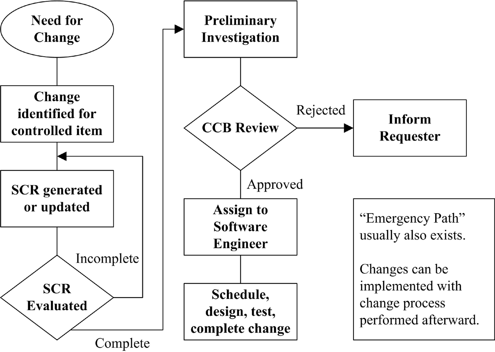

source code. Software engineers check modules out of the repository, make

changes, document the changes, and then save the edited modules in the

repository. If needed, changes can also be discarded, restoring a previous

baseline. More powerful tools can support parallel development and

geographically distributed environments.  These tools may be manifested as

separate, specialized applications under the control of an independent SCM

group. They may also appear as an integrated part of the software engineering

environment. Finally, they may be as elementary as a rudimentary change control

system provided with an operating system.

\#### 3.3. Deviations and Waivers

<!-- [1, c3] -->

The constraints imposed on a software engineering effort or the

specifications produced during the development activities might contain

provisions that cannot be satisfied at the designated point in the life cycle.

A deviation is a written authorization, granted prior to the manufacture of

an item, to depart from a particular performance or design requirement for a

specific number of units or a specific period of time. A waiver is a written

authorization to accept a configuration item or other designated item that is

found, during production or after having been submitted for inspection, to

depart from specified requirements but is nevertheless considered suitable

for use as-is or after rework by an approved method. In these cases, a formal

process is used for gaining approval for deviations from, or waivers of, the

provisions.

\### 4. Software Configuration Status Accounting

<!-- [2\\*, c10] -->

Software configuration status accounting (SCSA) is an element of configuration

management consisting of the recording and reporting of information needed to

manage a configuration effectively.

\#### 4.1. Software Configuration Status Information

<!-- [2, c10s2.1] -->

The SCSA activity designs and operates a system for the capture and reporting

of necessary information as the life cycle proceeds. As in any information

system, the configuration status information to be managed for the evolving

configurations must be identified, collected, and maintained.  Various

information and measurements are needed to support the SCM process and to meet

the configuration status reporting needs of management, software engineering,

and other related activities.  The types of information available include the

approved configuration identification as well as the identification and current

implementation status of changes, deviations, and waivers.  Some form of

automated tool support is necessary to accomplish the SCSA data collection

and reporting tasks; this could be a database capability, a standalone tool,

or a capability of a larger, integrated tool environment.

\#### 4.2. Software Configuration Status Reporting

<!-- [2, c10s2.4] [3, c1s5, c9s1, c17] -->

Reported information can be used by various organizational and project

elements - including the development team, the maintenance team, project

management, and software quality activities. Reporting can take the form of

ad hoc queries to answer specific questions or the periodic production of

predesigned reports. Some information produced by the status accounting

activity during the course of the life cycle might become quality assurance

records.

In addition to reporting the current status of the configuration, the

information obtained by the SCSA can serve as a basis of various measurements.

Examples include the number of change requests per SCI and the average time

needed to implement a change request.

\### 5. Software Configuration Auditing

<!-- [2, c11] -->

A software audit is an independent examination of a work product or set of work

products to assess compliance with specifications, standards, contractual

agreements, or other criteria [1].  Audits are conducted according to a

well-defined process consisting of various auditor roles and responsibilities.

Consequently, each audit must be carefully planned. An audit can require a

number of individuals to perform a variety of tasks over a fairly short period

of time. Tools to support the planning and conduct of an audit can greatly

facilitate the process.

Software configuration auditing determines the extent to which an item

satisfies the required functional and physical characteristics. Informal audits

of this type can be conducted at key points in the life cycle. Two types of

formal audits might be required by the governing contract (for example, in

contracts covering critical software): the Functional Configuration Audit (FCA)

and the Physical Configuration Audit (PCA). Successful completion of these

audits can be a prerequisite for the establishment of the product baseline.

\#### 5.1. Software Functional Configuration Audit

<!-- [2, c11s2.1] -->

The purpose of the software FCA is to ensure that the audited software item is

consistent with its governing specifications. The output of the software

verification and validation activities (see Verification and Validation in the

Software Quality KA) is a key input to this audit.

\#### 5.2. Software Physical Configuration Audit

<!--[2, c11s2.2]  -->

The purpose of the software physical configuration audit (PCA) is to ensure

that the design and reference documentation is consistent with the as-built

software product.

\#### 5.3. In-Process Audits of a Software Baseline

<!-- [2, c11s2.3] -->

As mentioned above, audits can be carried out during the development process to

investigate the current status of specific elements of the configuration. In

this case, an audit could be applied to sampled baseline items to ensure that

performance is consistent with specifications or to ensure that evolving

documentation continues to be consistent with the developing baseline item.

\### 6. Software Release Management and Delivery

<!-- [2, c14] [3, c8s2] -->

In this context, \\_release\\_ refers to the distribution of a software

configuration item outside the development activity; this includes internal

releases as well as distribution to customers. When different versions of a

software item are available for delivery (such as versions for different

platforms or versions with varying capabilities), it is frequently necessary to

recreate specific versions and package the correct materials for delivery of

the version. The software library is a key element in accomplishing release and

delivery tasks.

\#### 6.1. Software Building

<!-- [4, c29s4] -->

Software building is the activity of combining the correct versions of software

configuration items, using the appropriate configuration data, into an

executable program for delivery to a customer or other recipient, such as the

testing activity. For systems with hardware or firmware, the executable program

is delivered to the system-building activity. Build instructions ensure that

the proper build steps are taken in the correct sequence. In addition to

building software for new releases, it is usually also necessary for SCM to

have the capability to reproduce previous releases for recovery, testing,

maintenance, or additional release purposes.  Software is built using

particular versions of supporting tools, such as compilers (see Compiler Basics

in the Computing Foundations KA).  It might be necessary to rebuild an exact

copy of a previously built software configuration item. In this case,

supporting tools and associated build instructions need to be under SCM control

to ensure availability of the correct versions of the tools.

A tool capability is useful for selecting the correct versions of software

items for a given target environment and for automating the process of building

the software from the selected versions and appropriate configuration data. For

projects with parallel or distributed development environments, this tool

capability is necessary. Most software engineering environments provide this

capability. These tools vary in complexity from requiring the software engineer

to learn a specialized scripting language to graphics-oriented approaches

that hide much of the complexity of an “intelligent” build facility.

The build process and products are often subject to software quality

verification. Outputs of the build process might be needed for future reference

and may become quality assurance records.

\#### 6.2. Software Release Management

<!--[4, c29s3.2] -->

Software release management encompasses the identification, packaging, and

delivery of the elements of a product—for example, an executable program,

documentation, release notes, and configuration data. Given that product

changes can occur on a continuing basis, one concern for release management is

determining when to issue a release. The severity of the problems addressed by

the release and measurements of the fault densities of prior releases affect

this decision. The packaging task must identify which product items are to be

delivered and then select the correct variants of those items, given the

intended application of the product. The information documenting the

physical contents of a release is known as a version description document.

The release notes typically describe new capabilities, known problems, and

platform requirements necessary for proper product operation. The package to be

released also contains installation or upgrading instructions. The latter can

be complicated by the fact that some current users might have versions that are

several releases old. In some cases, release management might be required in

order to track distribution of the product to various customers or target

systems - for example, in a case where the supplier was required to notify a

customer of newly reported problems. Finally, a mechanism to ensure the

integrity of the released item can be implemented - for example by releasing a

digital signature with it.

A tool capability is needed for supporting these release management functions.

It is useful to have a connection with the tool capability supporting the

change request process in order to map release contents to the SCRs that have

been received. This tool capability might also maintain information on various

target platforms and on various customer environments.

\### 7. Software Configuration Management Tools

<!-- [3, c26s1] [4, c8s2] -->

When discussing software configuration management tools, it is helpful to

classify them. SCM tools can be divided into three classes in terms of the

scope at which they provide support: individual support, project-related

support, and companywide-process support.

\\_Individual support tools\\_ are appropriate and typically sufficient for small

organizations or development groups without variants of their software products

or other complex SCM requirements. They include:

- Version control tools: track, document, and store individual configuration

items such as source code and external documentation.

- Build handling tools: in their simplest form, such tools compile and link an

executable version of the software. More advanced building tools extract the

latest version from the version control software, perform quality checks, run

regression tests, and produce various forms of reports, among other tasks.

- Change control tools: mainly support the control of change requests and

events notification (for example, change request status changes, milestones

reached).

\\_Project-related support tools\\_ mainly support workspace management for

development teams and integrators; they are typically able to support

distributed development environments. Such tools are appropriate for medium to

large organizations with variants of their software products and parallel

development but no certification requirements.

\\_Companywide-process support tools\\_ can typically automate portions of a

companywide process, providing support for workflow managements, roles, and

responsibilities. They are able to handle many items, data, and life cycles.

Such tools add to project-related support by supporting a more formal

development process, including certification requirements.

\### Matrix of topics vs. Reference material

IEEE 828-2012

[2]

Hass 2003

[3]

Moore 2006

[5]

Sommerville 2011

[4]

\\*\\*1. Management of the SCM Process\\*\\*

1\.1. Organizational Context for SCM c6, ann.D introduction c29

1\.2. Constraints and Guidance for the SCM Process c6, ann.D, ann.E c2 c19s2.2 c29 intro

1\.3. Planning for SCM c6, ann.D, ann.E c23 c29

1\.3.1. SCM Organization and Responsibilities ann.Ds5–6 c10–11 c29 intro

1\.3.2. SCM Resources and Schedules ann.Ds8 c23

1\.3.3. Tool Selection and Implementation c26s2; s6 c29s5

1\.3.4. Vendor/Subcontractor Control c13 c13s9–c14s2

1\.3.5. Interface Control c12 c24s4

1\.4. SCM Plan ann.D c23 c29s1

1\.5. Surveillance of Software Configuration Management c11s3

1\.5.1. SCM Measures and Measurement c9s2; c25s2–s3

1\.5.2. In-Process Audits of SCM c1s1

\\*\\*2. Software Configuration Identification\\*\\* c29s1.1

2\.1. Identifying Items to Be Controlled c8s2.2 c29s1.1

2\.1.1. Software Configuration

2\.1.2. Software Configuration Item c29s1.1

2\.1.3. Software Configuration Item Relationships c7s4

2\.1.4. Software Version c29s3

IEEE 828-2012

[2]

Hass 2003

[3]

Moore 2006

[5]

Sommerville 2011

[4]

2\.1.5. Baseline

2\.1.6. Acquiring Software Configuration Items c18

2\.2. Software Library c1s3 c29s1.2

\\*\\*3. Software Configuration Control\\*\\* c9 c29s2

3\.1. Requesting, Evaluating, and Approving Software Changes c9s2.4 c29s2

3\.1.1. Software Configuration Control Board c9s2.2 c11s1 c29s2

3\.1.2. Software Change Request Process c1s4, c8s4

3\.2. Implementing Software Changes c29

3\.3. Deviations and Waivers

\\*\\*4. Software Configuration Status Accounting\\*\\* c10

4\.1. Software Configuration Status Information c10 s2.1

4\.2. Software Configuration Status Reporting c10s2.4 c1s5, c9s1, c17

\\*\\*5. Software Configuration Auditing\\*\\* c11

5\.1. Software Functional Configuration Audit c11s 2 .1

5\.2. Software Physical Configuration Audit c11s 2. 2

5\.3. In-Process Audits of a Software Baseline c11s2.3

\\*\\*6. Software Release Management and Delivery\\*\\* c14 c8s2 c29s3

6\.1. Software Building c29s4

6\.2. Software Release Management c29s3.2

\\*\\*7. Software Configuration Management Tools\\*\\* c26s1

\\*\\*Further Readings\\*\\*

Stephen P. Berczuk and Brad Appleton, \\_Software Configuration Management

Patterns: Effective Teamwork, Practical Integration\\_ [6].

This book expresses useful SCM practices and strategies as patterns. The

patterns can be implemented using various tools, but they are expressed in a

tool-agnostic fashion.

“CMMI for Development,” Version 1.3, pp.  137–147 [7].

This model presents a collection of best practices to help software

development organizations improve their processes. At maturity level 2, it

suggests configuration management activities.

\\*\\*References\\*\\*

[1] ISO/IEC/IEEE 24765:2010 Systems and Software Engineering-Vocabulary, ISO/

IEC/IEEE, 2010.

[2] IEEE Std. 828-2012, Standard for Configuration Management in Systems and

Software Engineering, IEEE, 2012.

[3] A.M.J. Hass, Configuration Management Principles and Practices, 1st ed.,

Addison-Wesley, 2003.

[4] I. Sommerville, Software Engineering, 9th ed., Addison-Wesley, 2011.

[5] J.W. Moore, The Road Map to Software Engineering: A Standards-Based Guide,

Wiley-IEEE Computer Society Press, 2006.

[6] S.P. Berczuk and B. Appleton, Software Configuration Management Patterns:

Effective Teamwork, Practical Integration, Addison-Wesley Professional, 2003.

[7] CMMI Product Team, “CMMI for Development, Version 1.3,” Software

Engineering Institute, 2010; http:// resources.sei.cmu.edu/library/asset-view.

cfm?assetID=9661.

\## Chapter 7: Software Engineering Management

\\*\\*Acronyms\\*\\*

- PMBOK® Guide Guide to the Project Management Body of Knowledge
- SDLC Software Development Life Cycle
- SEM Software Engineering Management
- SQA Software Quality Assurance
- SWX Software Extension to the PMBOK ® Guide
- WBS Work Breakdown Structure

\\*\\*Introduction\\*\\*

Software engineering management can be defined as the application of management

activities - planning, coordinating, measuring, monitoring, controlling, and

reporting^1 - to ensure that software products and software engineering

services are delivered efficiently, effectively, and to the benefit of

stakeholders. The related discipline of management is an important element of

all the knowledge areas (KAs), but it is of course more relevant to this KA

than to other KAs. Measurement is also an important aspect of all KAs; the

topic of measurement programs is presented in this KA.

In one sense, it should be possible to manage a software engineering project in

the same way other complex endeavors are managed. However, there are aspects

specific to software projects and software life cycle processes that complicate

effective management, including these:

<!-- FIXME: footnote -->

1. The terms Initiating, Planning, Executing, Monitoring and Controlling, and

Closing are used to describe process groups in the \\_PMBOK\\_ ® \\_Guide\\_ and \\_SWX\\_.

- Clients often don’t know what is needed or what is feasible.
- Clients often lack appreciation for the complexities inherent in software

engineering, particularly regarding the impact of changing requirements.

- It is likely that increased understanding and changing conditions will

generate new or changed software requirements.

- As a result of changing requirements, software is often built using an

iterative process rather than as a sequence of closed tasks.

- Software engineering necessarily incorporates creativity and discipline.

Maintaining an appropriate balance between the two is sometimes difficult.

- The degree of novelty and complexity is often high.
- There is often a rapid rate of change in the underlying technology.

Software engineering management activities occur at three levels:

organizational and infrastructure management, project management, and

management of the measurement program. The last two are covered in detail in

this KA description. However, this is not to diminish the importance of

organizational and infrastructure management issues. It is generally agreed

that software organizational engineering managers should be conversant with the

project manage- ment and software measurement knowledge described in this KA.

They should also possess some target domain knowledge. Likewise, it is also

helpful if managers of complex projects and programs in which software is a

component of the system architecture are aware of the differences that software

processes introduce into project management and project measurement.

Other aspects of organizational management exert an impact on software

engineering (for example, organizational policies and procedures that provide

the framework in which software engineering projects are undertaken). These

policies and procedures may need to be adjusted by the requirements for

effective software development and maintenance. In addition, a number of

policies specific to software engineering may need to be in place or

established for effective management of software engineering at the

organizational level. For example, policies are usually necessary to establish

specific organization-wide processes or procedures for software engineering

tasks such as software design, software construction, estimating, monitoring,

and reporting. Such policies are important for effective long-term management

of software engineering projects across an organization (for example,

establishing a consistent basis by which to analyze past project performance

and implement improvements).

Another important aspect of organizational management is personnel management

policies and procedures for hiring, training, and mentoring personnel for

career development, not only at the project level, but also to the longer-term

success of an organization. Software engineering personnel may present unique

training or personnel management challenges (for example, maintaining currency

in a context where the underlying technology undergoes rapid and continuous

change). Communication management is also often mentioned as an overlooked but

important aspect of the performance of individuals in a field where precise

understanding of user needs, software requirements, and software designs is

necessary. Furthermore, portfolio management, which provides an overall view,

not only of software currently under development in various projects and

programs (integrated projects), but also of software planned and currently in

use in an organization, is desirable. Also, software reuse is a key

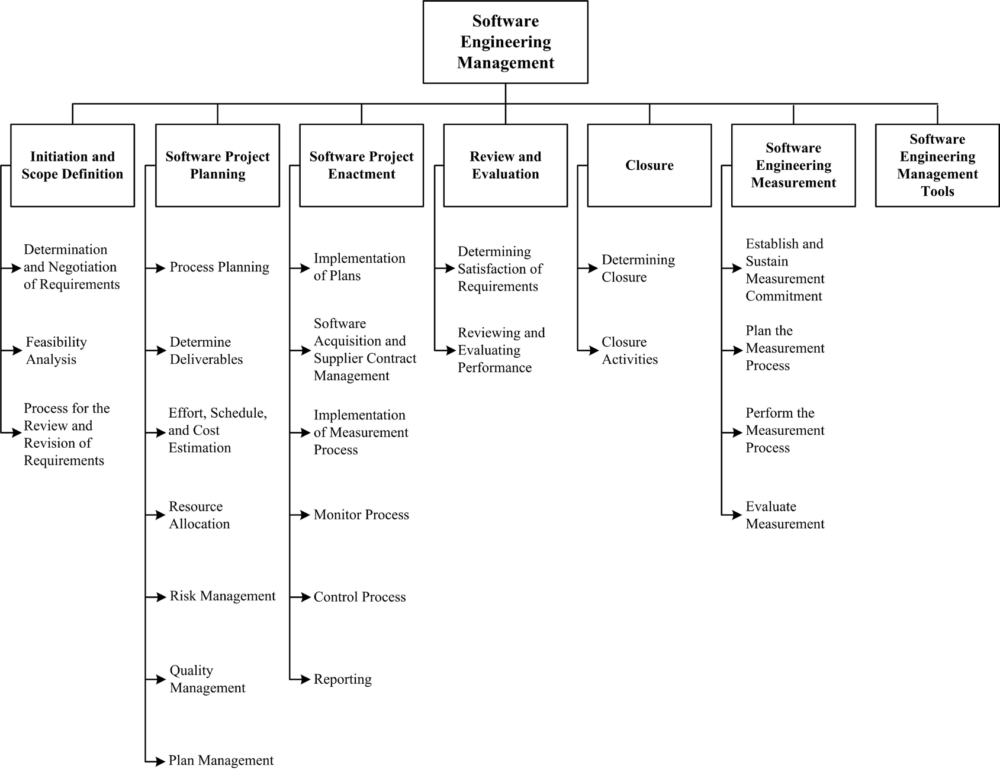

factor in maintaining and improving productivity and competitiveness. Effective

reuse requires a strategic vision that reflects the advantages and

disadvantages of reuse.

In addition to understanding the aspects of management that are uniquely

influenced by software projects, software engineers should have some knowledge

of the more general aspects of management that are discussed in this KA (even

in the first few years after graduation). Attributes of organizational culture

and behavior, plus management of other functional areas of the enterprise, have

an influence, albeit indirectly, on an organization’s software engineering

processes.

Extensive information concerning software project management can be found in

the \\_Guide to the Project Management Body of Knowledge (PMBOK\\_ ® \\_Guide)\\_ and

the \\_Software Extension to the PMBOK\\_ ® \\_Guide\\_ ( \\_SWX\\_ ) [1] [2]. Each of

these guides includes ten project management KAs: project integration

management, project scope management, project time management, project cost

management, project quality management, project human resource management,

project communications management, project risk management, project

procurement management, and project stakeholder management. Each KA has direct

relevance to this Software Engineering Management KA.

Additional information is also provided in the other references and further

readings for this KA. This Software Engineering Management KA consists of the

software project management processes in the first five topics in Figure 7.1

(Initiation and Scope Definition, Software Project Planning, Software Project

Enactment, Review and Evaluation, Closure), plus Software Engineering

Measurement in the sixth topic and Software Engineering Management Tools in the

seventh topic. While project management and measurement management are often

regarded as being separate, and indeed each does possess many unique

attributes, the close relationship has led to combined treatment in this KA.

Unfortunately, a common perception of the software industry is that software

products are delivered late, over budget, of poor quality, and with incomplete

functionality. Measurement-informed managementa - basic principle of any true

engineering discipline (see Measurement in the Engineering Foundations KA) -

can help improve the perception and the reality. In essence, management without

measurement (qualitative and quantitative) suggests a lack of discipline, and

measurement without management suggests a lack of purpose or context. Effective

management requires a combination of both measurement and experience.

The following working definitions are adopted here:

- \\_Management\\_ is a system of processes and controls required to achieve the

strategic objectives set by the organization.

- \\_Measurement\\_ refers to the assignment of values and labels to software

engineering work products, processes, and resources plus the models that are

derived from them, whether these models are developed using statistical or

other techniques [3\\*, c7, c8].

The software engineering project management sections in this KA make extensive

use of the software engineering measurement section. This KA is closely related

to others in the SWEBOK Guide, and reading the following KA descriptions in

conjunction with this one will be particularly helpful:

- The Engineering Foundations KA describes some general concepts of measurement

that are directly applicable to the Software Engineering Measurement section

of this KA. In addition, the concepts and techniques presented in the

Statistical Analysis section of the Engineering Foundations KA apply directly

to many topics in this KA.

- The Software Requirements KA describes some of the activities that should be

performed during the Initiation and Scope definition phase of the project.

- The Software Configuration Management KA deals with identification, control,

status accounting, and auditing of software configurations along with

software release man- agement and delivery and software configuration

management tools.

- The Software Engineering Process KA describes software life cycle models and

the relationships between processes and work products.

- The Software Quality KA emphasizes quality as a goal of management and as an

aim of many software engineering activities.

- The Software Engineering Economics KA discusses how to make software-related

decisions in a business context.

\\*\\*Breakdown Of Topics For Software Engineering Management\\*\\*

Because most software development life cycle models require similar activities

that may be executed in different ways, the breakdown of topics is

activity-based. That breakdown is shown in Figure 7.1. The elements of the

top-level breakdown shown in that figure are the activities that are usually

performed when a software development project is being managed, independent of

the software development life cycle model (see Software Life Cycle Models in

the Software Engineering Process KA) that has been chosen for a specific

project. There is no intent in this breakdown to recommend a specific life

cycle model. The breakdown implies only what happens and does not imply when,

how, or how many times each activity occurs. The seven topics are:

- Initiation and Scope Definition, which deal with the decision to embark on a

software engineering project;

- Software Project Planning, which addresses the activities undertaken to

prepare for a successful software engineering project from the management

perspective;

- Software Project Enactment, which deals with generally accepted software

engineering management activities that occur during the execution of a

software engineering project;

- Review and Evaluation, which deal with ensuring that technical, schedule,

cost, and quality engineering activities are satisfactory;

- Closure, which addresses the activities accomplished to complete a project;
- Software Engineering Measurement, which deals with the effective development

and implementation of measurement programs in software engineering

organizations;

- Software Engineering Management Tools, which describes the selection and use

of tools for managing a software engineering project.

\### 1. Initiation and Scope Definition

The focus of these activities is on effective determination of software

requirements using various elicitation methods and the assessment of project

feasibility from a variety of standpoints. Once project feasibility has been

established, the remaining tasks within this section are the specification of

requirements and selection of the processes for revision and review of

requirements.

\#### 1.1. Determination and Negotiation of Requirements

<!-- [3\\*, c3] -->

Determining and negotiating requirements set the visible boundaries for the set

of tasks being undertaken (see the Software Requirements KA). Activities

include requirements elicitation, analysis, specification, and validation.

Methods and techniques should be selected and applied, taking into account the

various stakeholder perspectives. This leads to the determination of project

scope in order to meet objectives and satisfy constraints.

\#### 1.2. Feasibility Analysis

<!-- [4\\*, c4] -->

The purpose of feasibility analysis is to develop a clear description of

project objectives and evaluate alternative approaches in order to determine

whether the proposed project is the best alternative given the constraints of

technology, resources, finances, and social/political considerations. An

initial project and product scope statement, project deliverables, project

duration constraints, and an estimate of resources needed should be prepared.

Resources include a sufficient number of people who have the needed skills,

facilities, infrastructure, and support (either internally or externally).

Feasibility analysis often requires approximate estimations of effort and cost

based on appropriate methods (see section 2.3, Effort, Schedule, and Cost

Estimation).

\#### 1.3. Process for the Review and Revision of Requirements\\_

<!-- [3\\*, c3] -->

Given the inevitability of change, stakeholders should agree on the means by

which requirements and scope are to be reviewed and revised (for example,

change management procedures, iterative cycle retrospectives). This clearly

implies that scope and requirements will not be “set in stone” but can and

should be revisited at predetermined points as the project unfolds (for

example, at the time when backlog priorities are created or at milestone

reviews). If changes are accepted, then some form of traceability analysis and

risk analysis should be used to ascertain the impact of those changes (see

section 2.5, Risk Management, and Software Configuration Control in the

Software Configuration Management KA).

A managed-change approach can also form the basis for evaluation of success

during closure of an incremental cycle or an entire project, based on changes

that have occurred along the way (see topic 5, Closure).

\### 2. Software Project Planning

The first step in software project planning should be selection of an

appropriate software development life cycle model and perhaps tailoring it

based on project scope, software requirements, and a risk assessment. Other

factors to be considered include the nature of the application domain,

functional and technical complexity, and software quality requirements (see

Software Quality Requirements in the Software Quality KA). In all SDLCs, risk

assessment should be an element of initial project planning, and the “risk

profile” of the project should be discussed and accepted by all relevant

stakeholders. Software quality management processes (see Software Quality

Management Processes in the Software Quality KA) should be determined as part

of the planning process and result in procedures and responsibilities for

software quality assurance, verification and validation, reviews, and audits

(see the Software Quality KA). Processes and responsibilities for ongoing

review and revision of the project plan and related plans should also be

clearly stated and agreed upon.

\#### 2.1. Process Planning

<!-- [3\\*, c3, c4, c5] [5\\*, c1] -->

Software development life cycle (SDLC) models span a continuum from predictive

to adaptive (see Software Life Cycle Models in the Software Engineering Process

KA). Predictive SDLCs are characterized by development of detailed software

requirements, detailed project planning, and minimal planning for iteration

among development phases. Adaptive SDLCs are designed to accommodate emergent

software requirements and iterative adjustment of plans. A highly predictive

SDLC executes the first five processes listed in Figure 7.1 in a linear

sequence with revisions to earlier phases only as necessary. Adaptive SDLCs are

characterized by iterative development cycles. SDLCs in the mid-range of the

SDLC continuum produce increments of functionality on either a preplanned

schedule (on the predictive side of the continuum) or as the prod- ucts of

frequently updated development cycles (on the adaptive side of the continuum).

Well-known SDLCs include the waterfall, incremental, and spiral models plus

various forms of agile software development [2] [3\\*, c2]. Relevant methods (see

the Software Engineering Models and Methods KA) and tools should be selected as

part of planning. Automated tools that will be used throughout the project

should also be planned for and acquired. Tools may include tools for project

scheduling, software requirements, software design, software construction,

software maintenance, software configuration management, software engineering

process, software quality, and others. While many of these tools should be

selected based primarily on the technical considerations discussed in other

KAs, some of them are closely related to the management considerations

discussed in this chapter.

\#### 2.2. Determine Deliverables

<!-- [3\\*, c4, c5, c6] -->

The work product(s) of each project activity (for example, software

architecture design documents, inspection reports, tested software) should be

identified and characterized. Opportunities to reuse software components from

previous projects or to utilize off-the-shelf software products should be

evaluated. Procurement of software and use of third parties to develop

deliverables should be planned and suppliers selected (see section 3.2,

Software Acquisition and Supplier Contract Management).

\#### 2.3. Effort, Schedule, and Cost Estimation

<!-- [3\\*, c6] -->

The estimated range of effort required for a project, or parts of a project,

can be determined using a calibrated estimation model based on historical size

and effort data (when available) and other relevant methods such as expert

judgment and analogy. Task dependencies can be established and potential

opportunities for completing tasks concurrently and sequentially can be

identified and documented using a Gantt chart, for example. For predictive SDLC

projects, the expected schedule of tasks with projected start times, durations,

and end times is typically produced during planning. For adaptive SDLC

projects, an overall estimate of effort and schedule is typically developed

from the initial understanding of the requirements, or, alternatively,

constraints on overall effort and schedule may be specified and used to

determine an initial estimate of the number of iterative cycles and estimates

of effort and other resources allocated to each cycle.

Resource requirements (for example, people and tools) can be translated into

cost estimates. Initial estimation of effort, schedule, and cost is an

iterative activity that should be negotiated and revised among affected

stakeholders until consensus is reached on resources and time available for

project completion.

\#### 2.4. Resource Allocation

<!-- [3\\*, c5, c10, c11] -->

Equipment, facilities, and people should be allocated to the identified tasks,

including the allocation of responsibilities for completion of various elements

of a project and the overall project. A matrix that shows who is responsible

for, accountable for, consulted about, and informed about each of the tasks can

be used. Resource allocation is based on, and constrained by, the

availability of resources and their optimal use, as well as by issues

relating to personnel (for example, productivity of individuals and teams,

team dynamics, and team structures).

\#### 2.5. Risk Management

<!-- [3\\*, c9] [5\\*, c5] -->

Risk and uncertainty are related but distinct concepts. Uncertainty results

from lack of information. Risk is characterized by the probability of an event

that will result in a negative impact plus a characterization of the negative

impact on a project. Risk is often the result of uncertainty. The converse of

risk is opportunity, which is characterized by the probability that an event

having a positive outcome might occur.

Risk management entails identification of risk factors and analysis of the

probability and potential impact of each risk factor, prioritization of risk

factors, and development of risk mitigation strategies to reduce the

probability and minimize the negative impact if a risk factor becomes a

problem. Risk assessment methods (for example, expert judgment, historical

data, decision trees, and process simulations) can sometimes be used in order

to identify and evaluate risk factors.

Project abandonment conditions can also be determined at this point in

discussion with all relevant stakeholders. Software-unique aspects of risk,

such as software engineers’ tendency to add unneeded features, or the risks

related to software’s intangible nature, can influence risk management of a

software project. Particular attention should be paid to the management of

risks related to software quality requirements such as safety or security (see

the Software Quality KA). Risk management should be done not only at the

beginning of a project, but also at periodic intervals throughout the project

life cycle.

\#### 2.6. Quality Management

<!-- [3\\*, c4] [4\\*, c24] -->

Software quality requirements should be identified, perhaps in both

quantitative and qualitative terms, for a software project and the associated

work products. Thresholds for acceptable quality measurements should be set for

each software quality requirement based on stakeholder needs and expectations.

Procedures concerned with ongoing Software Quality Assurance (SQA) and quality

improvement throughout the development process, and for verification and

validation of the deliverable software product, should also be specified during

quality planning (for example, technical reviews and inspections or

demonstrations of completed functionality; see the Software Quality KA).

\#### 2.7. Plan Management

<!--[3\\*, c4] -->

For software projects, where change is an expectation, plans should be managed.

Managing the project plan should thus be planned. Plans and processes selected

for software development should be systematically monitored, reviewed,

reported, and, when appropriate, revised. Plans associated with supporting

processes (for example, documentation, software configuration management,

and problem resolution) also should be managed. Reporting, monitoring, and

controlling a project should fit within the selected SDLC and the realities

of the project; plans should account for the various artifacts that will be

used to manage the project.

\### 3. Software Project Enactment

During software project enactment (also known as project execution) plans are

implemented and the processes embodied in the plans are enacted. Throughout,

there should be a focus on adherence to the selected SDLC processes, with an

overriding expectation that adherence will lead to the successful satisfaction

of stakeholder requirements and achievement of the project’s objectives.

Fundamental to enactment are the ongoing management activities of monitoring,

controlling, and reporting.

\#### 3.1. Implementation of Plans

<!-- [4\\*, c2] -->

Project activities should be undertaken in accordance with the project plan

and supporting plans. Resources (for example, personnel, technology, and

funding) are utilized and work products (for example, software design, software

code, and software test cases) are generated.

\#### 3.2. Software Acquisition and Supplier Contract Management

<!-- [3\\*, c3, c4] -->

Software acquisition and supplier contract man agement is concerned with issues

involved in contracting with customers of the software development organization

who acquire the deliverable work products and with suppliers who supply

products or services to the software engineering organization.

This may involve selection of appropriate kinds of contracts, such as fixed

price, time and materials, cost plus fixed fee, or cost plus incentive fee.

Agreements with customers and suppliers typically specify the scope of work and

the deliverables and include clauses such as penalties for late delivery or

nondelivery and intellectual property agreements that specify what the supplier

or suppliers are providing and what the acquirer is paying for, plus what will

be delivered to and owned by the acquirer. For software being developed by

suppliers (both internal to or external to the software development

organization), agreements commonly indicate software quality requirements for

acceptance of the delivered software.

After the agreement has been put in place, execution of the project in

compliance with the terms of the agreement should be managed (see chapter 12 of

SWX, Software Procurement Management, for more information on this topic [2]).

\#### 3.3. Implementation of Measurement Process

<!-- [3\\*, c7] -->

The measurement process should be enacted during the software project to ensure

that relevant and useful data are collected (see sections 6.2, Plan the

Measurement Process, and 6.3, Perform the Measurement Process).

\#### 3.4. Monitor Process

<!-- [3\\*, c8] -->

Adherence to the project plan and related plans should be assessed continually

and at predetermined intervals. Also, outputs and completion criteria for each

task should be assessed. Deliverables should be evaluated in terms of their

required characteristics (for example, via inspections or by demonstrating

working functionality). Effort expenditure, schedule adherence, and costs to

date should be analyzed, and resource usage examined. The project risk profile

(see section 2.5, Risk Management) should be revisited, and adherence to

software quality requirements evaluated (see Software Quality Requirements in

the Software Quality KA).

Measurement data should be analyzed (see Statistical Analysis in the

Engineering Foundations KA). Variance analysis based on the deviation of actual

from expected outcomes and values should be determined. This may include cost

overruns, schedule slippage, or other similar measures. Outlier identification

and analysis of quality and other measurement data should be performed (for

example, defect analysis; see Software Quality Measurement in the Software

Quality KA). Risk exposures should be recalculated (see section 2.5, Risk

Management). These activities can enable problem detection and exception

identification based on thresholds that have been exceeded. Outcomes should be

reported when thresholds have been exceeded, or as necessary.

\#### 3.5. Control Process

<!-- [3\\*, c7, c8] -->

The outcomes of project monitoring activities provide the basis on which

decisions can be made. Where appropriate, and when the probability and impact

of risk factors are understood, changes can be made to the project. This may

take the form of corrective action (for example, retesting certain software

components); it may involve incorporating additional actions (for example,

deciding to use prototyping to assist in software requirements validation; see

Prototyping in the Software Requirements KA); and/or it may entail revision of

the project plan and other project documents (for example, the software

requirements specification) to accommodate unanticipated events and their

implications.

In some instances, the control process may lead to abandonment of the project.

In all cases, software configuration control and software configuration

management procedures should be adhered to (see the Software Configuration

Management KA), decisions should be documented and communicated to all relevant

parties, plans should be revisited and revised when necessary, and relevant

data recorded (see section 6.3, Perform the Measurement Process).

\#### 3.6. Reporting

<!-- [3\\*, c11] -->

At specified and agreed-upon times, progress to date should be reported - both

within the organization (for example, to a project steering committee) and to

external stakeholders (for example, clients or users). Reports should focus on

the information needs of the target audience as opposed to the detailed status

reporting within the project team.

\### 4. Review and Evaluation

At prespecified times and as needed, overall progress towards achievement of

the stated objectives and satisfaction of stakeholder (user and customer)

requirements should be evaluated. Similarly, assessments of the effectiveness

of the software process, the personnel involved, and the tools and methods

employed should also be undertaken regularly and as determined by

circumstances.

\#### 4.1. Determining Satisfaction of Requirements

<!-- [4\\*, c8] -->

Because achieving stakeholder satisfaction is a principal goal of the software

engineering manager, progress towards this goal should be assessed

periodically. Progress should be assessed on achievement of major project

milestones (for example, completion of software design architecture or

completion of a software technical review), or upon completion of an iterative

development cycle that results in a product increment. Variances from software

requirements should be identified and appropriate actions should be taken. As

in the control process activity above (see section 3.5, Control Process),

software configuration control and software configuration management procedures

should be followed (see the Software Configuration Management KA), decisions

documented and communicated to all relevant parties, plans revisited and

revised where necessary, and relevant data recorded (see section 6.3, Perform

the Measurement Process).

\#### 4.2. Reviewing and Evaluating Performance

<!-- [3\\*, c8, c10] -->

Periodic performance reviews for project personnel can provide insights as to

the likelihood of adherence to plans and processes as well as possible areas of

difficulty (for example, team member conflicts). The various methods, tools,

and techniques employed should be evaluated for their effectiveness and

appropriateness, and the process being used by the project should also be

systematically and periodically assessed for relevance, utility, and efficacy

in the project context. Where appropriate, changes should be made and managed.

\### 5. Closure

An entire project, a major phase of a project, or an iterative development

cycle reaches closure when all the plans and processes have been enacted and

completed. The criteria for project, phase, or iteration success should be

evaluated. Once closure is established, archival, retrospective, and process

improvement activities can be performed.

\#### 5.1. Determining Closure

<!-- [1, s3.7, s4.6] -->

Closure occurs when the specified tasks for a project, a phase, or an iteration

have been completed and satisfactory achievement of the completion criteria has

been confirmed. Software requirements can be confirmed as satisfied or not, and

the degree of achieving the objectives can be determined. Closure processes

should involve relevant stakeholders and result in documentation of relevant

stakeholders’ acceptance; any known problems should be documented.

\#### 5.2. Closure Activities

<!-- [2, s3.7, s4.8] -->

After closure has been confirmed, archiving of project materials should be

accomplished in accordance with stakeholder agreed-upon methods, location, and

duration - possibly including destruction of sensitive information, software,

and the medium on which copies are resident. The organization’s measurement

database should be updated with relevant project data. A project, phase, or

iteration retrospective analysis should be undertaken so that issues, problems,

risks, and opportunities encountered can be analyzed (see topic 4, Review and

Evaluation). Lessons learned should be drawn from the project and fed into

organizational learning and improvement endeavors.

\### 6. Software Engineering Measurement

The importance of measurement and its role in better management and engineering

practices is widely acknowledged (see Measurement in the Engineering

Foundations KA). Effective mea- surement has become one of the cornerstones of

organizational maturity. Measurement can be applied to organizations, projects,

processes, and work products. In this section the focus is on the application

of measurement at the levels of projects, processes, and work products. This

section follows the IEEE 15939:2008 standard [6], which describes a process to

define the activities and tasks necessary to implement a software measurement

process. The standard also includes a measurement information model.

\#### 6.1. Establish and Sustain Measurement Commitment

<!-- [7\\*, c1, c2]^2 -->

- Requirements for measurement. Each measurement endeavor should be guided by

organizational objectives and driven by a set of measurement requirements

established by the organization and the project (for example, an

organizational objective might be “first-to-market with new products”).

- Scope of measurement. The organizational unit to which each measurement

requirement is to be applied should be established. This may consist of a

functional area, a single project, a single site, or an entire enterprise.

The temporal scope of the measurement effort should also be considered

because time series of some measurements may be required; for example, to

calibrate estimation models (see section 2.3, Effort, Schedule, and Cost

Estimation).

- Team commitment to measurement. The commitment should be formally

established, communicated, and supported by resources (see next item).

- Resources for measurement. An organization’s commitment to measurement is an

essential factor for success, as evidenced by the assignment of resources for

implementing the measurement process. Assigning resources includes allocation

of responsibility for the various tasks of the measurement process (such as

analyst and librarian). Adequate funding, training, tools, and support to

conduct the process should also be allocated.

<!-- FIXME: footnote -->

2 Please note that these two chapters can be downloaded free of charge from

http://www.psmsc.com/PSMBook.asp.

\#### 6.2. Plan the Measurement Process

<!-- [7\\*, c1, c2] -->

- Characterize the organizational unit. The organizational unit provides the

context for measurement, so the organizational context should be made

explicit, including the constraints that the organization imposes on the

measurement process. The characterization can be stated in terms of

organizational processes, application domains, technology, organizational

interfaces, and organizational structure.

- Identify information needs. Information needs are based on the goals,

constraints, risks, and problems of the organizational unit. They may be

derived from business, organizational, regulatory, and/or product objectives.

They should be identified and prioritized. Then a subset of objectives to be

addressed can be selected, documented, communicated, and reviewed by

stakeholders.

- Select measures. Candidate measures should be selected, with clear links to

the information needs. Measures should be selected based on the priorities of

the information needs and other criteria such as cost of collection, degree

of process disruption during collection, ease of obtaining accurate,

consistent data, and ease of analysis and reporting. Because internal quality

characteristics (see Models and Quality Characteristics in the Software

Quality KA) are often not contained in the contractually binding software

requirements, it is important to consider measuring the internal quality of

the software to provide an early indicator of potential issues that may

impact external stakeholders.

- Define data collection, analysis, and reporting procedures. This encompasses

collection procedures and schedules, storage, verification, analysis,

reporting, and configuration management of data.

- Select criteria for evaluating the information products. Criteria for

evaluation are influenced by the technical and business objectives of the

organizational unit. Information products include those associated with the

product being produced, as well as those associated with the processes being

used to manage and measure the project.

- Provide resources for measurement tasks. The measurement plan should be

reviewed and approved by the appropriate stakeholders to include all data

collection procedures; storage, analysis, and reporting procedures;

evaluation criteria; schedules; and responsibilities. Criteria for reviewing

these artifacts should have been established at the organizational-unit level

or higher and should be used as the basis for these reviews. Such criteria

should take into consideration previous experience, availability of

resources, and potential disruptions to projects when changes from current

practices are proposed. Approval demonstrates commitment to the measurement

process.

- Identify resources to be made available for implementing the planned and

approved measurement tasks. Resource availability may be staged in cases

where changes are to be piloted before widespread deployment. Consideration

should be paid to the resources necessary for successful deployment of new

procedures or measures.

- Acquire and deploy supporting technologies. This includes evaluation of

available supporting technologies, selection of the most appropriate

technologies, acquisition of those technologies, and deployment of those

technologies.

\#### 6.3. Perform the Measurement Process

<!-- [7\\*, c1, c2] -->

- Integrate measurement procedures with relevant software processes. The

measurement procedures, such as data collection, should be integrated into

the software processes they are measuring. This may involve changing current

software processes to accommodate data collection or generation activities.

It may also involve analysis of current software processes to minimize

additional effort and evaluation of the effect on employees to ensure that

the measurement procedures will be accepted. Morale issues and other human

factors should be considered. In addition, the measurement procedures should

be communicated to those providing the data. Training and support may also

need to be provided. Data analysis and reporting procedures are typically

integrated into organizational and/ or project processes in a similar manner.

- Collect data. Data should be collected, verified, and stored. Collection can

sometimes be automated by using software engineering management tools (see

topic 7, Software Engineering Management Tools) to analyze data and develop

reports. Data may be aggregated, transformed, or recoded as part of the

analysis process, using a degree of rigor appropriate to the nature of the

data and the information needs. The results of this analysis are typically

indicators such as graphs, numbers, or other indications that will be

interpreted, resulting in conclusions and recommendations to be presented to

stakeholders (see Statistical Analysis in the Engineering Foundations KA).

The results and conclusions are usually reviewed, using a process defined by

the organization (which may be formal or informal). Data providers and

measurement users should participate in reviewing the data to ensure that

they are meaningful and accurate and that they can result in reasonable

actions.

- Communicate results. Information products should be documented and

communicated to users and stakeholders.

\#### 6.4. Evaluate Measurement

<!-- [7\\*, c1, c2] -->

- Evaluate information products and the measurement process against specified

evaluation criteria and determine strengths and weaknesses of the information

products or process, respectively. Evaluation may be performed by an internal

process or an external audit; it should include feedback from measurement

users. Lessons learned should be recorded in an appropriate database.

- Identify potential improvements. Such improvements may be changes in the

format of indicators, changes in units measured, or reclassification of

measurement categories. The costs and benefits of potential improvements

should be determined and appropriate improvement actions should be reported.

- Communicate proposed improvements to the measurement process owner and

stakeholders for review and approval. Also, lack of potential improvements

should be communicated if the analysis fails to identify any improvements.

\### 7. Software Engineering Management Tools

<!-- [3\\*, c5, c6, c7] -->

Software engineering management tools are often used to provide visibility and

control of software engineering management processes. Some tools are automated

while others are manually implemented. There has been a recent trend towards

the use of integrated suites of software engineering tools that are used

throughout a project to plan, collect and record, monitor and control, and

report project and product information. Tools can be divided into the

following categories:

- \\_Project Planning and Tracking Tools.\\_ Project planning and tracking tools

can be used to estimate project effort and cost and to prepare project

schedules. Some projects use automated estimation tools that accept as input

the estimated size and other characteristics of a software product and

produce estimates of the required total effort, schedule, and cost. Planning

tools also include automated scheduling tools that analyze the tasks within a

work breakdown structure, their estimated durations, their precedence

relationships, and the resources assigned to each task to produce a schedule

in the form of a Gantt chart.

- Tracking tools can be used to track project milestones, regularly scheduled

project status meetings, scheduled iteration cycles, product demonstrations,

and/or action items.

- \\_Risk Management Tools.\\_ Risk management tools (see section 2.5, Risk

Management) can be used to track risk identification, estimation, and

monitoring. These tools include the use of approaches such as simulation or

decision trees to analyze the effect of costs versus payoffs and subjective

estimates of the probabilities of risk events. Monte Carlo simulation tools

can be used to produce probability distributions of effort, schedule, and

risk by combining multiple input probability distributions in an algorithmic

manner.

- \\_Communications Tools.\\_ Communication tools can assist in providing timely

and consistent information to relevant stakeholders involved in a project.

These tools can include things like email notifications and broadcasts to

team members and stakeholders. They also include communication of minutes

from regularly scheduled project meetings, daily stand-up meetings, plus

charts showing progress, backlogs, and maintenance request resolutions.

- \\_Measurement Tools.\\_ Measurement tools support activities related to the

software measurement program (see topic 6, Software Engineering Measurement).

There are few completely automated tools in this category. Measurement tools

used to gather, analyze, and report project measurement data may be based on

spreadsheets developed by project team members or organizational employees.

\### Matrix Of Topics vs. Reference Material

Fairley 2009

[3]

Sommerville 2011

[4]

Boehm and Turner 2003

[5]

McGarry et al. 2001

[7]

\\*\\*1. Initiation and Scope Definition\\*\\*

1\.1. Determination and Negotiation of Requirements c3

1\.2. Feasibility Analysis c4

1\.3. Process for the Review and Revision of Requirements c3

\\*\\*2. Software Project Planning\\*\\*

2\.1. Process Planning c2, c3, c4, c5 c1

2\.2. Determine Deliverables c4, c5, c6

2\.3. Effort, Schedule, and Cost Estimation c6

2\.4. Resource Allocation c5, c10, c11

2\.5. Risk Management c9 c5

2\.6. Quality Management c4 c24

2\.7. Plan Management c4

\\*\\*3. Software Project Enactment\\*\\*

3\.1. Implementation of Plans c2

3\.2. Software Acquisition and Supplier Contract Management c3, c4

3\.3. Implementation of Measurement Process c7

3\.4. Monitor Process c8

3\.5. Control Process c7, c8

3\.6. Reporting c11

\\*\\*4. Review and Evaluation\\*\\*

4\.1. Determining Satisfaction of Requirements

4\.2. Reviewing and Evaluating Performance c8, c10

Fairley 2009

[3]

Sommerville 2011

[4]

Boehm and Turner 2003

[5]

McGarry et al. 2001

[7]

\\*\\*5. Closure\\*\\*

5\.1. Determining Closure

5\.2. Closure Activities

\\*\\*6. Software Engineering Measurement\\*\\*

6\.1. Establish and Sustain Measurement Commitment c1, c2

6\.2. Plan the Measurement Process c1, c2

6\.3. Perform the Measurement Process c1, c2

6\.4. Evaluate Measurement c1, c2

\\*\\*7. Software Engineering Management Tools\\*\\* c5, c6, c7

\\*\\*Further Readings\\*\\*

\\_A Guide to the Project Management Body of Knowledge (PMBOK\\_ ® \\_Guide)\\_ [1].

The \\_PMBOK\\_ ® \\_Guide\\_ provides guidelines for managing individual projects and

defines project management-related concepts. It also describes the project

management life cycle and its related processes, as well as the project life

cycle. It is a globally recognized guide for the project management profession.

\\_Software Extension to the Guide to the Project Management Body of Knowledge

(PMBOK® Guide)\\_ [2].

SWX provides adaptations and extensions to the generic practices of project

management documented in the \\_PMBOK® Guide\\_ for managing software projects. The

primary contribution of this extension to the \\_PMBOK® Guide\\_ is a description

of processes that are applicable for managing adaptive life cycle software

projects.

\\_IEEE Standard Adoption of ISO/IEC 15939\\_ [6].

This international standard identifies a process that supports defining a

suitable set of measures to address specific information needs. It identifies

the activities and tasks that are necessary to successfully identify, define,

select, apply, and improve measurement within an overall project or

organizational measurement structure.

J. McDonald, \\_Managing the Development of Software Intensive Systems\\_, Wiley,

2010 [8].

This textbook provides an introduction to project management for beginning

software and hard- ware developers plus unique advanced material for

experienced project managers. Case studies are included for planning and

managing verification and validation for large software projects, complex

software, and hardware systems, as well as inspection results and testing

metrics to monitor project status.

\\*\\*References\\*\\*

[1] Project Management Institute, A Guide to the Project Management Body of

Knowledge (PMBOK(R) Guide), 5th ed., Project Management Institute, 2013.

[2] Project Management Institute and IEEE Computer Society, Software Extension

to the PMBOK® Guide Fifth Edition, Project Management Institute, 2013.

[3] R.E. Fairley, Managing and Leading Software Projects, Wiley-IEEE Computer

Society Press, 2009.

[4] I. Sommerville, Software Engineering, 9th ed., Addison-Wesley, 2011.

[5] B. Boehm and R. Turner, Balancing Agility and Discipline: A Guide for the

Perplexed, Addison-Wesley, 2003.

[6] IEEE Std. 15939-2008 Standard Adoption of ISO/IEC 15939:2007 Systems and

Software Engineering - Measurement Process, IEEE, 2008.

[7] J. McGarry et al., Practical Software Measurement: Objective Information

for Decision Makers, Addison-Wesley Professional, 2001.

[8] J. McDonald, Managing the Development of Software Intensive Systems, John

Wiley and Sons, Inc., 2010.

\## Chapter 8: Software Engineering Process

\\*\\*Acronyms\\*\\*

- BPMN Business Process Modeling Notation
- CASE Computer-Assisted Software Engineering
- CM Configuration Management
- CMMI Capability Maturity Model Integration
- GQM Goal-Question-Metric
- IDEF0 Integration Definition
- LOE Level of Effort
- ODC Orthogonal Defect Classification
- SDLC Software Development Life Cycle
- SPLC Software Product Life Cycle
- UML Unified Modeling Language

\\*\\*Introduction\\*\\*

An engineering process consists of a set of interrelated activities that

transform one or more inputs into outputs while consuming resources to

accomplish the transformation. Many of the processes of traditional engineering

disciplines (e.g., electrical, mechanical, civil, chemical) are concerned with

transforming energy and physical entities from one form into another, as in a

hydroelectric dam that transforms potential energy into electrical energy or a

petroleum refinery that uses chemical processes to transform crude oil into

gasoline. In this knowledge area (KA), software engineering processes are

concerned with work activities accomplished by software engineers to develop,

maintain, and operate software, such as requirements, design, construction,

testing, configuration management, and other software engineering processes.

For readability, “software engineering process” will be referred to as

“software process” in this KA. In addition, please note that “software process”

denotes work activities - not the execution process for implemented software.

Software processes are specified for a number of reasons: to facilitate human

understanding, communication, and coordination; to aid management of software

projects; to measure and improve the quality of software products in an

efficient manner; to support process improvement; and to provide a basis for

automated support of process execution.

SWEBOK KAs closely related to this Software Engineering Process KA include

Software Engineering Management, Software Engineering Models and Methods, and

Software Quality; the Measurement and Root Cause Analysis topic found in the

Engineering Foundations KA is also closely related. Software Engineering

Management is concerned with tailoring, adapting, and implementing software

processes for a specific software project (see Process Planning in the Software

Engineering Management KA). Models and methods support a systematic approach

to software development and modification.

The Software Quality KA is concerned with the planning, assurance, and control

processes for project and product quality. Measurement and measurement results

in the Engineering Foundations KA are essential for evaluating and control-

ling software processes.

\\*\\*Breakdown Of Topics For Software Engineering Process\\*\\*

As illustrated in Figure 8.1, this KA is concerned with software process

definition, software life cycles, software process assessment and improve-

ment, software measurement, and software engineering process tools.

\### 1. Software Process Definition

<!-- [1\\*, p177] [2\\*, p295] [3\\*, p28–29, p36, c5] -->

This topic is concerned with a definition of software process, software

process management, and software process infrastructure.

As stated above, a software process is a set of interrelated activities and

tasks that transform input work products into output work products. At minimum,

the description of a software process includes required inputs, transforming

work activities, and outputs generated. As illustrated in Figure 8.2, a

software process may also include its entry and exit criteria and decomposition

of the work activities into tasks, which are the smallest units of work subject

to management accountability. A process input may be a triggering event or

the output of another process. Entry criteria should be satisfied before a

process can commence. All specified conditions should be satisfied before a

process can be successfully concluded, including the acceptance criteria for

the output work product or work products.

A software process may include subprocesses. For example, software requirements

validation is a process used to determine whether the requirements will

provide an adequate basis for software development; it is a subprocess of the

software requirements process. Inputs for requirements validation are

typically a software requirements specification and the resources needed to

perform validation (personnel, validation tools, sufficient time). The tasks

of the requirements validation activity might include requirements reviews,

prototyping, and model validation. These tasks involve work assignments for

individuals and teams. The output of requirements validation is typically a

validated software requirements specification that provides inputs to the

software design and software testing processes. Requirements validation and

other subprocesses of the software requirements process are often interleaved

and iterated in various ways;

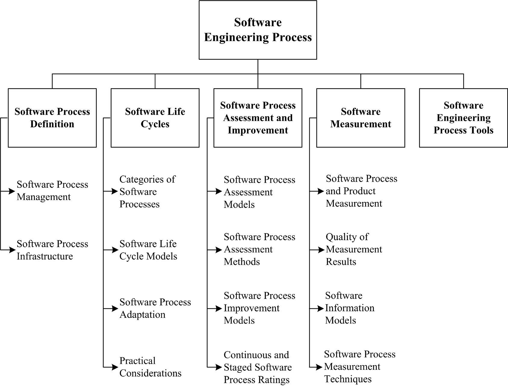

the software requirements process and its subprocesses may be entered and

exited multiple times during software development or modification.

Complete definition of a software process may also include the roles and

competencies, IT support, software engineering techniques and tools, and work

environment needed to perform the process, as well as the approaches and

measures (Key Performance Indicators) used to determine the efficiency and

effectiveness of performing the process.

In addition, a software process may include interleaved technical,

collaborative, and administrative activities.

Notations for defining software processes include textual lists of constituent

activities and tasks described in natural language; data-flow diagrams; state

charts; BPMN; IDEF0; Petri nets; and UML activity diagrams. The transforming

tasks within a process may be defined as procedures; a procedure may be

specified as an ordered set of steps or, alternatively, as a checklist of the

work to be accomplished in performing a task.

It must be emphasized that there is no best software process or set of

software processes. Software processes must be selected, adapted, and applied

as appropriate for each project and each organizational context. No ideal

process, or set of processes, exists.

\#### 1.1. Software Process Management

<!-- [3\\*, s26.1] [4\\*, p453–454] -->

Two objectives of software process management are to realize the efficiency and

effectiveness that result from a systematic approach to accomplishing

software processes and producing work products - be it at the individual,

project, or organizational level - and to introduce new or improved processes.

Processes are changed with the expectation that a new or modified process will

improve the efficiency and/or effectiveness of the process and the quality of

the resulting work products. Changing to a new process, improving an existing

process, organizational change, and infrastructure change (technology insertion

or changes in tools) are closely related, as all are usually initiated with the

goal of improving the cost, development schedule, or quality of the software

products. Process change has impacts not only for the software product; they

often lead to organizational change. Changing a process or introducing a new

process can have ripple effects throughout an organization. For example,

changes in IT infrastructure tools and technology often require process

changes.

Existing processes may be modified when other new processes are deployed for

the first time (for example, introducing an inspection activity within a

software development project will likely impact the software testing process -

see Reviews and Audits in the Software Quality KA and in the Software Testing

KA). These situations can also be termed “process evolution.” If the

modifications are extensive, then changes in the organizational culture and

business model will likely be necessary to accommodate the process changes.

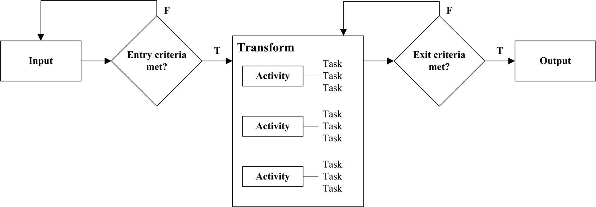

\#### 1.2. Software Process Infrastructure

<!-- [2\\*, p183, p186] [4\\*, p437–438] -->

Establishing, implementing, and managing software processes and software life

cycle models often occurs at the level of individual software projects.

However, systematic application of software processes and software life cycle

models across an organization can provide benefits to all software work

within the organization, although it requires commitment at the organi-

zational level. A software process infrastructure can provide process

definitions, policies for interpreting and applying the processes, and

descriptions of the procedures to be used to implement the processes.

Additionally, a software process infrastructure may provide funding, tools,

training, and staff members who have been assigned responsibilities for

establishing and maintaining the software process infrastructure.

Software process infrastructure varies, depending on the size and complexity

of the organization and the projects undertaken within the organization.

Small, simple organizations and projects have small, simple infrastructure

needs. Large, complex organizations and projects, by necessity, have larger

and more complex software process infrastructures. In the latter case, various

organizational units may be established (such as a software engineering process

group or a steering committee) to oversee implementation and improvement of

the software processes.

A common misperception is that establishing a software process infrastructure

and implementing repeatable software processes will add time and cost to

software development and maintenance. There is a cost associated with

introducing or improving a software process; however, experience has shown

that implementing systematic improvement of software processes tends to result

in lower cost through improved efficiency, avoidance of rework, and more

reliable and affordable software. Process performance thus influences software

product quality.

\### 2. Software Life Cycles

<!-- [1\\*, c2] [2\\*, p190] -->

This topic addresses categories of software processes, software life cycle

models, software process adaptation, and practical considerations. A software

development life cycle (SDLC) includes the software processes used to specify

and transform software requirements into a deliverable software product. A

software product life cycle (SPLC) includes a software development life cycle

plus additional software processes that provide for deployment, maintenance,

support, evolution, retirement, and all other inception-to-retirement

processes for a software product, including the software configuration

management and software quality assurance processes that are applied throughout

a software product life cycle. A software product life cycle may include multi-

ple software development life cycles for evolving and enhancing the software.

Individual software processes have no temporal ordering among them. The

temporal relationships among software processes are provided by a software

life cycle model: either an SDLC or SPLC. Life cycle models typically emphasize

the key software processes within the model and their temporal and logical

interdependencies and relationships. Detailed definitions of the software

processes in a life cycle model may be provided directly or by reference to

other documents.

In addition to conveying the temporal and logical relationships among software

processes, the software development life cycle model (or models used within an

organization) includes the control mechanisms for applying entry and exit

criteria (e.g., project reviews, customer approvals, software testing,

quality thresholds, demonstrations, team consensus). The output of one

software process often provides the input for others (e.g., software

requirements provide input for a software architectural design process and the

software construction and software testing processes). Concurrent execution

of several software process activities may produce a shared output (e.g., the

interface specifications for interfaces among multiple software components

developed by different teams). Some software processes may be regarded as less

effective unless other software processes are being performed at the same time

(e.g., software test planning during software requirements analysis can improve

the software requirements).

\#### 2.1. Categories of Software Processes

<!-- [1\\*, Preface] [2\\*, p294–295] [3\\*, c22–c24] -->

Many distinct software processes have been defined for use in the various parts

of the software development and software maintenance life cycles. These

processes can be categorized as follows:

1. \\_Primary processes\\_ include software processes for development, operation,

and maintenance of software.

1. \\_Supporting processes\\_ are applied intermittently or continuously

throughout a software product life cycle to support primary processes;

they include software processes such as configuration management, quality

assurance, and verification and validation.

1. \\_Organizational processes\\_ provide support for software engineering; they

include training, process measurement analysis, infrastructure management,

portfolio and reuse management, organizational process improvement, and

management of software life cycle models.

1. \\_Cross-project processes,\\_ such as reuse, software product line, and

domain engineering; they involve more than a single software project in an

organization.

Software processes in addition to those listed above include the following.

Project management processes include processes for planning and estimating,

resource management, measuring and controlling, leading, managing risk,

managing stakeholders, and coordinating the primary, supporting,

organizational, and cross-project processes of software development and

maintenance projects.

Software processes are also developed for particular needs, such as process

activities that address software quality characteristics (see the Software

Quality KA). For example, security concerns during software development may

necessitate one or more software processes to protect the security of the

development environment and reduce the risk of malicious acts. Software

processes may also be developed to provide adequate grounds for establishing

confidence in the integrity of the software.

\#### 2.2. Software Life Cycle Models

<!-- [1\\*, c2] [2\\*, s3.2] [3\\*, s2.1] [5] -->

The intangible and malleable nature of software permits a wide variety of

software development life cycle models, ranging from linear models in which the

phases of software development are accomplished sequentially with feedback and

iteration as needed followed by integration, testing, and delivery of a

single product; to iterative models in which software is developed in incre-

ments of increasing functionality on iterative cycles; to agile models that

typically involve frequent demonstrations of working software to a customer or

user representative who directs development of the software in short iterative

cycles that produce small increments of working, deliverable software.

Incremental, iterative, and agile models can deliver early subsets of working

software into the user environment, if desired.

Linear SDLC models are sometimes referred to as predictive software development

life cycle models, while iterative and agile SDLCs are referred to as adaptive

software development life cycle models. It should be noted that various

maintenance activities during an SPLC can be conducted using different SDLC

models, as appropriate to the maintenance activities.

A distinguishing feature of the various software development life cycle

models is the way in which software requirements are managed. Linear

development models typically develop a complete set of software requirements,

to the extent possible, during project initiation and planning. The software

requirements are then rigorously controlled. Changes to the software

requirements are based on change requests that are processed by a change

control board (see Requesting, Evaluating and Approving Software Changes in the

Change Control Board in the Software Configuration Management KA). An

incremental model produces successive increments of working, deliverable

software based on partitioning of the software requirements to be implemented

in each of the increments. The software requirements may be rigorously

controlled, as in a linear model, or there may be some flexibility in revising

the software requirements as the software product evolves. Agile models may

define product scope and high-level features initially; however, agile models

are designed to facilitate evolution of the software requirements during the

project.

It must be emphasized that the continuum of SDLCs from linear to agile is not a

thin, straight line. Elements of different approaches may be incorporated into

a specific model; for example, an incremental software development life cycle

model may incorporate sequential software requirements and design phases but

permit considerable flexibility in revising the software requirements and

architecture during software construction.

\#### 2.3. Software Process Adaptation

<!-- [1\\*, s2.7] [2\\*, p51] -->

Predefined SDLCs, SPLCs, and individual software processes often need to be

adapted (or “tailored”) to better serve local needs. Organizational context,

innovations in technology, project size, product criticality, regulatory

requirements, industry practices, and corporate culture may determine needed

adaptations. Adaptation of individual software processes and software life

cycle models (development and product) may consist of adding more details to

software processes, activities, tasks, and procedures to address critical

concerns. It may consist of using an alternate set of activities that

achieves the purpose and outcomes of the software process. Adaptation may also

include omitting software processes or activities from a development or product

life cycle model that are clearly inapplicable to the scope of work to be

accomplished.

\#### 2.4. Practical Considerations

<!-- [2\\*, p188–190] -->

In practice, software processes and activities are often interleaved,

overlapped, and applied concurrently. Software life cycle models that specify

discrete software processes, with rigorously specified entry and exit

criteria and prescribed boundaries and interfaces, should be recognized as

idealizations that must be adapted to reflect the realities of software

development and maintenance within the organizational context and business

environment. Another practical consideration: software processes (such as

configuration management, construction, and testing) can be adapted to facili-

tate operation, support, maintenance, migration, and retirement of the

software.

Additional factors to be considered when defining and tailoring a software life

cycle model include required conformance to standards, directives, and

policies; customer demands; criticality of the software product; and

organizational maturity and competencies. Other factors include the nature of

the work (e.g., modification of existing software versus new development) and

the application domain (e.g., aerospace versus hotel management).

\### 3. Software Process Assessment and Improvement

<!-- [2\\*, p188, p194] [3\\*, c26] [4\\*, p397, c15] -->

This topic addresses software process assessment models, software process

assessment methods, software process improvement models, and continuous and

staged process ratings. Software process assessments are used to evaluate the

form and content of a software process, which may be specified by a

standardized set of criteria. In some instances, the terms “process appraisal”

and “capability evaluation” are used instead of process assessment. Capability

evaluations are typically performed by an acquirer (or potential acquirer) or

by an external agent on behalf of an acquirer (or potential acquirer). The

results are used as an indicator of whether the software processes used by a

supplier (or potential supplier) are acceptable to the acquirer. Performance

appraisals are typically performed within an organization to identify

software processes in need of improvement or to determine whether a process (or

processes) satisfies the criteria at a given level of process capability or

maturity.

Process assessments are performed at the levels of entire organizations,

organizational units within organizations, and individual projects. Assessment

may involve issues such as assessing whether software process entry and exit

criteria are being met, to review risk factors and risk management, or to

identify lessons learned. Process assessment is carried out using both an

assessment model and an assessment method. The model can provide a norm for a

benchmarking comparison among projects within an organization and among

organizations.

A process audit differs from a process assessment. Assessments are performed

to determine levels of capability or maturity and to identify software

processes to be improved. Audits are typically conducted to ascertain

compliance with policies and standards. Audits provide management visibility

into the actual operations being performed in the organization so that accurate

and meaningful decisions can be made concerning issues that are impacting a

development project, a maintenance activity, or a software-related topic.

Success factors for software process assessment and improvement within

software engineering organizations include management sponsorship,

planning, training, experienced and capable leaders, team commitment,

expectation management, the use of change agents, plus pilot projects and

experimentation with tools. Additional factors include independence of the

assessor and the timeliness of the assessment.

\#### 3.1. Software Process Assessment Models

<!-- [2\\*, s4.5, s4.6] [3\\*, s26.5] [4\\*, p44–48] -->

Software process assessment models typically include assessment criteria for

software processes that are regarded as constituting good practices. These

practices may address software development processes only, or they may also

include topics such as software maintenance, software project management,

systems engineering, or human resources management.

\#### 3.2. Software Process Assessment Methods

<!-- [1\\*, p322–331] [3\\*, s26.3] [4\\*, p44–48, s16.4] [6] -->

A software process assessment method can be qualitative or quantitative.

Qualitative assessments rely on the judgment of experts; quantitative

assessments assign numerical scores to software processes based on analysis of

objective evidence that indicates attainment of the goals and outcomes of a

defined software process. For example, a quantitative assessment of the soft-

ware inspection process might be performed by examining the procedural steps

followed and results obtained plus data concerning defects found and time

required to find and fix the defects as compared to software testing.

A typical method of software process assessment includes planning,

fact-finding (by collecting evidence through questionnaires, interviews, and

observation of work practices), collection and validation of process data, and

analysis and reporting. Process assessments may rely on the subjective,

qualitative judgment of the assessor, or on the objective presence or absence

of defined artifacts, records, and other evidence.

The activities performed during a software process assessment and the

distribution of effort for assessment activities are different depending on the

purpose of the software process assessment. Software process assessments may be

undertaken to develop capability ratings used to make recommendations for

process improvements or may be undertaken to obtain a process maturity rating

in order to qualify for a contract or award.

The quality of assessment results depends on the software process assessment

method, the integrity and quality of the obtained data, the assessment team’s

capability and objectivity, and the evidence examined during the assessment.

The goal of a software process assessment is to gain insight that will

establish the current status of a process or processes and provide a basis for

process improvement; performing a software process assessment by following a

checklist for conformance without gaining insight adds little value.

\#### 3.3. Software Process Improvement Models

<!-- [2\\*, p187–188] [3\\*, s26.5] [4\\*, s2.7] -->

Software process improvement models emphasize iterative cycles of continuous

improvement. A software process improvement cycle typically involves the

subprocesses of measuring, analyzing, and changing. The Plan-Do-Check-Act

model is a well-known iterative approach to software process improvement.

Improvement activities include identifying and prioritizing desired

improvements (planning); introducing an improvement, including change

management and training (doing); evaluating the improvement as compared to

previous or exemplary process results and costs (checking); and making further

modifications (acting). The Plan-Do-Check-Act process improvement model can be

applied, for example, to improve software processes that enhance defect

prevention.

\#### 3.4. Continuous and Staged Software Process Ratings

<!-- [1\\*, p28–34] [3\\*, s26.5] [4\\*, p39–45] -->

Software process capability and software process maturity are typically rated

using five or six levels to characterize the capability or maturity of the

software processes used within an organization. A \\_continuous\\_ rating system

involves assigning a rating to each software process of interest; a \\_staged\\_

rating system is established by assigning the same maturity rating to all of

the software processes within a specified process level. A representation of

continuous and staged process levels is provided in Table 8.1. Continuous

models typically use a level 0 rating; staged models typically do not.

| Level  | Continuous Representation of Capability Levels | Staged Representation of Maturity Levels |

\|-------:|:-----------------------------------------------|------------------------------------------|

| 0      |  Incomplete                                    |                                          |

| 1      |  Performed                                     | Initial                                  |

| 2      |  Managed                                       | Managed                                  |

| 3      |  Defined                                       | Defined                                  |

| 4      |                                                | Quantitatively Managed                   |

| 5      |                                                | Optimizing                               |

Table 8.1. Software Process Rating Levels

In Table 8.1, level 0 indicates that a software process is incompletely

performed or may not be performed. At level 1, a software process is being

performed (capability rating), or the software processes in a maturity level 1

group are being performed but on an ad hoc, informal basis. At level 2, a

software process (capability rating) or the processes in maturity level 2 are

being performed in a manner that provides management visibility into

intermediate work products and can exert some control over transitions between

processes. At level 3, a single software process or the processes in a maturity

level 3 group plus the process or processes in maturity level 2 are well

defined (perhaps in organizational policies and procedures) and are being

repeated across different projects. Level 3 of process capability or maturity

provides the basis for process improvement across an organization because the

process is (or processes are) conducted in a similar manner. This allows

collection of performance data in a uniform manner across multiple projects. At

maturity level 4, quantitative measures can be applied and used for process

assessment; statistical analysis may be used. At maturity level 5, the

mechanisms for continuous process improvements are applied.

Continuous and staged representations can be used to determine the order in

which software processes are to be improved. In the continuous representation,

the different capability levels for different software processes provide a

guideline for determining the order in which software processes will be

improved. In the staged representation, satisfying the goals of a set of

software processes within a maturity level is accomplished for that maturity

level, which provides a foundation for improving all of the software processes

at the next higher level.

\### 4. Software Measurement

<!-- [3\\*, s26.2] [4\\*, s18.1.1] -->

This topic addresses software process and product measurement, quality of

measurement results, software information models, and software process

measurement techniques (see Measurement in the Engineering Foundations KA).

Before a new process is implemented or a current process is modified,

measurement results for the current situation should be obtained to provide a

baseline for comparison between the current situation and the new situation.

For example, before introducing the software inspection process, effort

required to fix defects discovered by testing should be measured. Following an

initial start-up period after the inspection process is introduced, the

combined effort of inspection plus testing can be compared to the previous

amount of effort required for testing alone. Similar considerations apply if

a process is changed.

\#### 4.1. Software Process and Product Measurement

<!-- [1\\*, s6.3, p273] [3\\*, s26.2, p638] -->

Software process and product measurement are concerned with determining the

efficiency and effectiveness of a software process, activity, or task. The

\\_efficiency\\_ of a software process, activity, or task is the ratio of resources

actually consumed to resources expected or desired to be consumed in

accomplishing a software process, activity, or task (see Efficiency in the

Software Engineering Economics KA). Effort (or equivalent cost) is the primary

measure of resources for most software processes, activities, and tasks; it is

measured in units such as person-hours, person-days, staff-weeks, or

staff-months of effort or in equivalent monetary units - such as euros or

dollars.

\\_Effectiveness\\_ is the ratio of actual output to expected output produced by a

software process, activity, or task; for example, actual number of defects

detected and corrected during software testing to expected number of defects to

be detected and corrected - perhaps based on historical data for similar

projects (see Effectiveness in the Software Engineering Economics KA). Note

that measurement of software process effectiveness requires measurement of

the relevant product attributes; for example, measurement of software defects

discovered and corrected during software testing.

One must take care when measuring product attributes for the purpose of

determining process effectiveness. For example, the number of defects detected

and corrected by testing may not achieve the expected number of defects and

thus provide a misleadingly low effectiveness measure, either because the

software being tested is of better-than-usual quality or perhaps because

introduction of a newly introduced upstream inspection process has reduced

the remaining number of defects in the software.

Product measures that may be important in determining the effectiveness of

software processes include product complexity, total defects, defect density,

and the quality of requirements, design documentation, and other related work

products.

Also note that efficiency and effectiveness are independent concepts. An

effective software process can be inefficient in achieving a desired software

process result; for example, the amount of effort expended to find and fix

software defects could be very high and result in low efficiency, as compared

to expectations.

An efficient process can be ineffective in accomplishing the desired

transformation of input work products into output work products; for example,

failure to find and correct a sufficient number of software defects during the

testing process.

Causes of low efficiency and/or low effectiveness in the way a software

process, activity, or task is executed might include one or more of the

following problems: deficient input work products, inexperienced personnel,

lack of adequate tools and infrastructure, learning a new process, a complex

product, or an unfamiliar product domain. The efficiency and effectiveness of

software process execution are also affected (either positively or

negatively) by factors such as turnover in software personnel, schedule

changes, a new customer representative, or a new organizational policy.

In software engineering, productivity in performing a process, activity, or

task is the ratio of output produced divided by resources consumed; for

example, the number of software defects discovered and corrected divided by

person-hours of effort (see Productivity in the Software Engineering

Economics KA). Accurate measurement of productivity must include total effort

used to satisfy the exit criteria of a software process, activity, or task;

for example, the effort required to correct defects discovered during software

testing must be included in software development productivity.

Calculation of productivity must account for the context in which the work is

accomplished. For example, the effort to correct discovered defects will be

included in the productivity calculation of a software team if team members

correct the defects they find—as in unit testing by software developers or in a

cross-functional agile team. Or the productivity calculation may include either

the effort of the software developers or the effort of an independent testing

team, depending on who fixes the defects found by the independent testers. Note

that this example refers to the effort of teams of developers or teams of

testers and not to individuals. Software productivity calculated at the level

of individuals can be misleading because of the many factors that can affect

the individual productivity of software engineers.

Standardized definitions and counting rules for measurement of software

processes and work products are necessary to provide standardized measurement

results across projects within an organization, to populate a repository of

historical data that can be analyzed to identify software processes that need

to be improved, and to build predictive models based on accumulated data. In

the example above, definitions of software defects and staff-hours of testing

effort plus counting rules for defects and effort would be necessary to obtain

satisfactory measurement results.

The extent to which the software process is institutionalized is important;

failure to institutionalize a software process may explain why “good”

software processes do not always produce anticipated results. Software

processes may be institutionalized by adoption within the local organizational

unit or across larger units of an enterprise.

\#### 4.2. Quality of Measurement Results

<!-- [4\\*, s3.4–3.7] -->

The quality of process and product measurement results is primarily determined

by the reliability and validity of the measured results. Measurements that do

not satisfy these quality criteria can result in incorrect interpretations and

faulty software process improvement initiatives. Other desirable properties of

software measurements include ease of collection, analysis, and presentation

plus a strong correlation between cause and effect.

The Software Engineering Measurement topic in the Software Engineering

Management KA describes a process for implementing a software measurement

program.

\#### 4.3. Software Information Models

<!-- [1\\*, p310–311] [3\\*, p712–713] [4\\*, s19.2] -->

Software information models allow modeling, analysis, and prediction of

software process and software product attributes to provide answers to relevant

questions and achieve process and product improvement goals. Needed data can be

collected and retained in a repository; the data can be analyzed and models

can be constructed. Validation and refinement of software information models

occur during software projects and after projects are completed to ensure that

the level of accuracy is sufficient and that their limitations are known and

understood. Software information models may also be developed for contexts

other than software projects; for example, a software information model might

be developed for processes that apply across an organization, such as software

configuration management or software quality assurance processes at the

organizational level.

Analysis-driven software information model building involves the development,

calibration, and evaluation of a model. A software information model is

developed by establishing a hypothesized transformation of input variables into

desired outputs; for example, product size and complexity might be transformed

into estimated effort needed to develop a software product using a

regression equation developed from observed data from past projects. A model is

calibrated by adjusting parameters in the model to match observed results from

past projects; for example, the exponent in a nonlinear regression model might

be changed by applying the regression equation to a different set of past

projects other than the projects used to develop the model.

A model is evaluated by comparing computed results to actual outcomes for a

different set of similar data. There are three possible evaluation outcomes:

- results computed for a different data set vary widely from actual outcomes

for that data set, in which case the derived model is not applicable for the

new data set and should not be applied to analyze or make predictions

for future projects;

- results computed for a new data set are close to actual outcomes for that

data set, in which case minor adjustments are made to the parameters of the

model to improve agreement;

- results computed for the new data set and subsequent data sets are very

close and no adjustments to the model are needed.

Continuous evaluation of the model may indicate a need for adjustments over

time as the context in which the model is applied changes.

The Goals/Questions/Metrics (GQM) method was originally intended for

establishing measurement activities, but it can also be used to guide

analysis and improvement of software processes.

It can be used to guide analysis-driven software information model building;

results obtained from the software information model can be used to guide

process improvement.

The following example illustrates application of the GQM method:

1. Goal: Reduce the average change request processing time by 10% within six

months.

1. Question 1-1: What is the baseline change request processing time?
1. Metric 1-1-1: Average of change request processing times on starting date
1. Metric 1-1-2: Standard deviation of change request processing times on

starting date

1. Question 1-2: What is the current change request processing time?
1. Metric 1-2-1: Average of change request processing times currently
1. Metric 1-2-2: Standard deviation of change request processing times currently

\#### 4.4. Software Process Measurement Techniques

<!-- [1\\*, c8] -->

Software process measurement techniques are used to collect process data and

work product data, transform the data into useful information, and analyze the

information to identify process activities that are candidates for improvement.

In some cases, new software processes may be needed.

Process measurement techniques also provide the information needed to measure

the effects of process improvement initiatives. Process measurement

techniques can be used to collect both quantitative and qualitative data.

\##### 4.4.1. Quantitative Process Measurement Techniques

<!-- [4\\*, s5.1, s5.7, s9.8] -->

The purpose of quantitative process measurement techniques is to collect,

transform, and analyze quantitative process and work product data that can be

used to indicate where process improvements are needed and to assess the

results of process improvement initiatives. Quantitative process measurement

techniques are used to collect and analyze data in numerical form to which

mathematical and statistical techniques can be applied.

Quantitative process data can be collected as a byproduct of software

processes. For example, the number of defects discovered during software

testing and the staff-hours expended can be collected by direct measurement,

and the productivity of defect discovery can be derived by calculating

defects discovered per staff-hour.

Basic tools for quality control can be used to analyze quantitative process

measurement data (e.g., check sheets, Pareto diagrams, histograms, scatter

diagrams, run charts, control charts, and cause-and-effect diagrams) (see Root

Cause Analysis in the Engineering Foundations KA). In addition, various

statistical techniques can be used that range from calculation of medians and

means to multivariate analysis methods (see Statistical Analysis in the

Engineering Foundations KA). Data collected using quantitative process

measurement techniques can also be used as inputs to simulation models (see

Modeling, Prototyping, and Simulation in the Engineering Foundations KA);

these models can be used to assess the impact of various approaches to software

process improvement.

Orthogonal Defect Classification (ODC) can be used to analyze quantitative

process measurement data. ODC can be used to group detected defects into

categories and link the defects in each category to the software process or

software processes where a group of defects originated (see Defect

Characterization in the Software Quality KA). Software interface defects, for

example, may have originated during an inadequate software design process;

improving the software design process will reduce the number of software

interface defects. ODC can provide quantitative data for applying root cause

analysis. Statistical Process Control can be used to track process stability,

or the lack of process stability, using control charts.

\##### 4.4.2. Qualitative Process Measurement Techniques

<!-- [1\\*, s6.4] -->

Qualitative process measurement techniques - including interviews,

questionnaires, and expert judgment - can be used to augment quantitative process

measurement techniques. Group consensus techniques, including the Delphi

technique, can be used to obtain consensus among groups of stakeholders.

\### 5. Software Engineering Process Tools

<!-- [1\\*, s8.7] -->

Software process tools support many of the notations used to define,

implement, and manage individual software processes and software life cycle

models. They include editors for notations such as data-flow diagrams, state

charts, BPMN, IDEF0 diagrams, Petri nets, and UML activity diagrams. In some

cases, software process tools allow different types of analyses and simula-

tions (for example, discrete event simulation). In addition, general purpose

business tools, such as a spreadsheet, may be useful.

Computer-Assisted Software Engineering (CASE) tools can reinforce the use of

integrated processes, support the execution of process definitions, and

provide guidance to humans in performing well-defined processes. Simple tools

such as word processors and spreadsheets can be used to prepare textual

descriptions of processes, activities, and tasks; these tools also support

traceability among the inputs and outputs of multiple software processes (such

as stakeholder needs analysis, software requirements specification, software

architecture, and software detailed design) as well as the results of software

processes such as documentation, software components, test cases, and

problem reports.

Most of the knowledge areas in this Guide describe specialized tools that can

be used to manage the processes within that KA. In particular, see the

Software Configuration Management KA for a discussion of software configuration

management tools that can be used to manage the construction, integration, and

release processes for software products. Other tools, such as those for

requirements management and testing, are described in the appropriate KAs.

Software process tools can support projects that involve geographically

dispersed (virtual) teams. Increasingly, software process tools are available

through cloud computing facilities as well as through dedicated

infrastructures.

A project control panel or dashboard can display selected process and product

attributes for software projects and indicate measurements that are within

control limits and those needing corrective action.

\### Matrix Of Topics vs. Reference Material

Fairley 2009 [1]

Moore 2009 [2]

Sommerville 2011 [3]

Kan 2003 [4]

1. Software Process Definition p177 p295 p28–29, p36, c5

Software Process Management s26.1 p453–454

Software Process Infrastructure p183, p186 p437–438

1. Software Life Cycles c2 p190

Categories of Software Processes preface p294–295 c22, c23, c24

Software Life Cycle Models c2 s3.2 s2.1

Software Process Adaptation s2.7 p51

Practical Considerations p188–190

1. Software Process Assessment and Improvement p188, p194 c26 p397, c15

Software Process Assessment Models s4.5, s4.6 s26.5 p44–48

Software Process Assessment Methods p322–331 s26.3 p44–48, s16.4

Software Process Improvement Models p187–188 s26.5 s2.7

Continuous and Staged Ratings p28–34 s26.5 p39–45

1. Software Measurement s26.2 s18.1.1

Software Process and Product Measurement s6.3, p273 s26.2, p638

Quality of Measurement Results s3.4, s3.5, s3.6, s3.7

Software Information Models p310–311 p. 712–713 s19.2

Software Process Measurement Techniques s6.4, c8 s5.1, s5.7, s9.8

1. Software Engineering Process Tools s8.7

\\*\\*Further Readings\\*\\*

\\_Software Extension to the Guide to the Project Management Body of Knowledge®\\_

(SWX) [5].

SWX provides adaptations and extensions to the generic practices of project

management documented in the \\_PMBOK® Guide\\_ for managing software projects.

The primary contribution of this extension to the \\_PMBOK® Guide\\_ is descrip-

tion of processes that are applicable for managing adaptive life cycle software

projects.

D. Gibson, D. Goldenson, and K. Kost, “Performance Results of CMMI-Based

Process Improvement” [6].

This technical report summarizes publicly available empirical evidence about

the performance results that can occur as a consequence of CMMI-based process

improvement. The report contains a series of brief case descriptions that were

created with collaboration from representatives from 10 organizations that

have achieved notable quantitative performance results through their CMMI-based

improvement efforts.

\\_CMMI\\_ ® \\_for Development, Version 1.3\\_ [7].

\\_CMMI\\_ ® \\_for Development, Version 1.3\\_ provides an integrated set of process

guidelines for developing and improving products and services. These

guidelines include best practices for developing and improving products and

services to meet the needs of customers and end users.

\\_ISO/IEC 15504-1:2004 Information technology - Process assessment—Part 1:

Concepts and vocabulary\\_ [8].

This standard, commonly known as SPICE (Software Process Improvement and

Capability Determination), includes multiple parts. Part 1 provides concepts

and vocabulary for software development processes and related business-

management functions. Other parts of 15504 define the requirements and

procedures for performing process assessments.

\\*\\*References\\*\\*

[1] R.E. Fairley, Managing and Leading Software Projects, Wiley-IEEE Computer

Society Press, 2009.

[2] J.W. Moore, The Road Map to Software Engineering: A Standards-Based Guide,

Wiley-IEEE Computer Society Press, 2006.

[3] I. Sommerville, Software Engineering, 9th ed., Addison-Wesley, 2011.

[4] S.H. Kan, Metrics and Models in Software Quality Engineering, 2nd ed.,

Addison-Wesley, 2002.

[5] Project Management Institute and IEEE Computer Society, Software Extension

to the PMBOK® Guide Fifth Edition, ed: Project Management Institute, 2013.

[6] D. Gibson, D. Goldenson, and K. Kost, “Performance Results of CMMI-Based

Process Improvement,” Software Engineering Institute, 2006; http://

resources.sei.cmu.edu/library/asset-view.cfm?assetID=8065.

[7] CMMI Product Team, “CMMI for Development, Version 1.3,” Software

Engineering Institute, 2010; http:// resources.sei.cmu.edu/library/asset-view.

cfm?assetID=9661.

[8] ISO/IEC 15504-1:2004, Information Technology—Process Assessment—Part 1:

Concepts and Vocabulary, ISO/IEC, 2004.

\## Chapter 9: Software Engineering Models And Methods

\\*\\*Acronyms\\*\\*

- 3GL 3rd Generation Language
- BNF Backus-Naur Form
- FDD Feature-Driven Development
- IDE Integrated Development Environment
- PBI Product Backlog Item
- RAD Rapid Application Development
- UML Unified Modeling Language
- XP eXtreme Programming

\\*\\*Introduction\\*\\*

Software engineering models and methods impose structure on software

engineering with the goal of making that activity systematic, repeatable, and

ultimately more success-oriented.  Using models provides an approach to problem

solving, a notation, and procedures for model construction and analysis.

Methods provide an approach to the systematic specification, design,

construction, test, and verification of the end-item software and associated

work products. Software engineering models and methods vary widely in

scope - from addressing a single software life cycle phase to covering the

complete software life cycle. The emphasis in this knowledge area (KA) is on

software engineering models and methods that encompass multiple software life

cycle phases, since methods specific for single life cycle phases are covered

by other KAs.

\\*\\*Breakdown Of Topics For Software Engineering Models And Methods\\*\\*

This chapter on software engineering models and methods is divided into four

main topic areas:

- \\_Modeling\\_: discusses the general practice of modeling and presents topics

in modeling principles; properties and expression of models; modeling

syntax, semantics, and pragmatics; and preconditions, postconditions, and

invariants.

- \\_Types of Models\\_: briefly discusses models and aggregation of submodels and

provides some general characteristics of model types commonly found in the

software engineering practice.

- \\_Analysis of Models\\_: presents some of the common analysis techniques used

in modeling to verify completeness, consistency, correctness,

traceability, and interaction.

- \\_Software Engineering Methods\\_: presents a brief summary of commonly used

software engineering methods. The discussion guides the reader through a

summary of heuristic methods, formal methods, prototyping, and agile methods.

The breakdown of topics for the Software Engineering Models and Methods KA is

shown in Figure 9.1.

\### 1. Modeling

Modeling of software is becoming a pervasive technique to help software

engineers understand, engineer, and communicate aspects of the software to

appropriate stakeholders. Stakeholders are those persons or parties who have a

stated or implied interest in the software (for example, user, buyer, supplier,

architect, certifying authority, evaluator, developer, software engineer, and

perhaps others).

While there are many modeling languages, notations, techniques, and tools in

the literature and in practice, there are unifying general concepts that

apply in some form to them all. The following sections provide background on

these general concepts.

\#### 1.1. Modeling Principles

<!-- [1\\*, c2s2, c5s1, c5s2] [2\\*, c2s2] [3\\*, c5s0] -->

Modeling provides the software engineer with an organized and systematic

approach for representing significant aspects of the software under study,

facilitating decision-making about the software or elements of it, and

communicating those significant decisions to others in the stakeholder

communities. There are three general principles guiding such modeling

activities:

- \\_Model the Essentials\\_: good models do not usually represent every aspect or

feature of the software under every possible condition. Modeling typically

involves developing only those aspects or features of the software that need

specific answers, abstracting away any nonessential information. This

approach keeps the models manageable and useful.

- \\_Provide Perspective\\_: modeling provides views of the software under study

using a defined set of rules for expression of the model within each view.

This perspective-driven approach provides dimensionality to the model (for

example, a structural view, behavioral view, temporal view, organizational

view, and other views as relevant). Organizing information into views focuses

the software modeling efforts on specific concerns relevant to that view

using the appropriate notation, vocabulary, methods, and tools.

- \\_Enable Effective Communications\\_: modeling employs the application domain

vocabulary of the software, a modeling language, and semantic expression (in

other words, meaning within context). When used rigorously and

systematically, this modeling results in a reporting approach that

facilitates effective communication of software information to project

stakeholders.

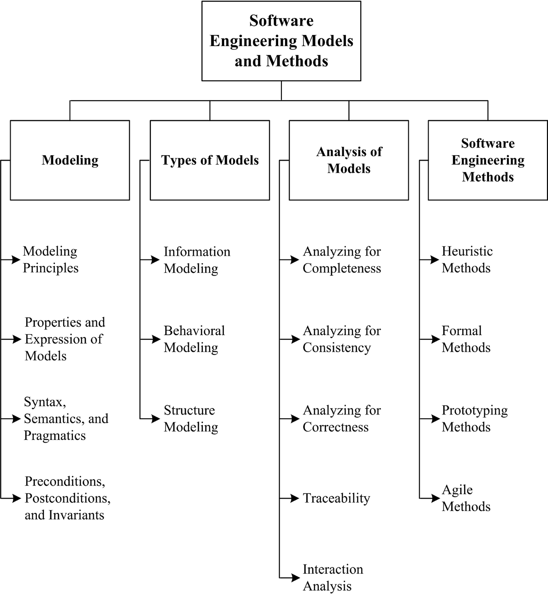

A model is an \\_abstraction\\_ or simplification of a software component. A

consequence of using abstraction is that no single abstraction completely

describes a software component. Rather, the model of the software is

represented as an aggregation of abstractions, which - when taken together -

describe only selected aspects, perspectives, or views - only those that are

needed to make informed decisions and respond to the reasons for creating the

model in the first place. This simplification leads to a set of assumptions

about the context within which the model is placed that should also be captured

in the model. Then, when reusing the model, these assumptions can be validated

first to establish the relevancy of the reused model within its new use and

context.

\#### 1.2. Properties and Expression of Models

<!-- [1\\*, c5s2, c5s3] [3\\*, c4s1.1p7, c4s6p3, c5s0p3] -->

Properties of models are those distinguishing features of a particular model

used to characterize its completeness, consistency, and correctness within the

chosen modeling notation and tooling used. Properties of models include the

following:

- \\_Completeness\\_: the degree to which all requirements have been implemented

and verified within the model.

- \\_Consistency\\_: the degree to which the model contains no conflicting

requirements, assertions, constraints, functions, or component

descriptions.

- \\_Correctness\\_: the degree to which the model satisfies its requirements and

design specifications and is free of defects.

Models are constructed to represent real-world objects and their behaviors to

answer specific questions about how the software is expected to operate.

Interrogating the models - either through exploration, simulation, or review -

may expose areas of uncertainty within the model and the software to which the

model refers. These uncertainties or unanswered questions regarding the

requirements, design, and/or implementation can then be handled appropriately.

The primary expression element of a model is an entity. An entity may represent

concrete artifacts (for example, processors, sensors, or robots) or abstract

artifacts (for example, software modules or communication protocols). Model

entities are connected to other entities using relations (in other words,

lines or textual operators on target entities). Expression of model entities

may be accomplished using textual or graphical modeling languages; both

modeling language types connect model entities through specific language

constructs. The meaning of an entity may be represented by its shape, textual

attributes, or both. Generally, textual information adheres to

language-specific syntactic structure. The precise meanings related to the

modeling of context, structure, or behavior using these entities and relations

is dependent on the modeling language used, the design rigor applied to the

modeling effort, the specific view being constructed, and the entity to which

the specific notation element may be attached. Multiple views of the model may

be required to capture the needed semantics of the software.

When using models supported with automation, models may be checked for

completeness and consistency. The usefulness of these checks depends greatly on

the level of semantic and syntactic rigor applied to the modeling effort in

addition to explicit tool support. Correctness is typically checked through

simulation and/or review.

\#### 1.3. Syntax, Semantics, and Pragmatics

<!-- [2\\* c2s2.2.2p6] [3\\*, c5s0] -->

Models can be surprisingly deceptive. The fact that a model is an abstraction

with missing information can lead one into a false sense of completely

understanding the software from a single model. A complete model (“complete”

being relative to the modeling effort) may be a union of multiple submodels and

any special function models. Examination and decision-making relative to a

single model within this collection of submodels may be problematic.

Understanding the precise meanings of modeling constructs can also be

difficult. Modeling languages are defined by syntactic and semantic rules. For

textual languages, syntax is defined using a notation grammar that defines

valid language constructs (for example, Backus-Naur Form (BNF)). For graphical

languages, syntax is defined using graphical models called metamod- els. As

with BNF, metamodels define the valid syntactical constructs of a graphical

modeling language; the metamodel defines how these constructs can be composed

to produce valid models. Semantics for modeling languages specify the meaning

attached to the entities and relations captured within the model. For example,

a simple diagram of two boxes connected by a line is open to a variety of

interpretations. Knowing that the diagram on which the boxes are placed and

connected is an object diagram or an activity diagram can assist in the

interpretation of this model.

As a practical matter, there is usually a good understanding of the semantics

of a specific software model due to the modeling language selected, how that

modeling language is used to express entities and relations within that model,

the experience base of the modeler(s), and the context within which the

modeling has been undertaken and so represented. Meaning is communicated

through the model even in the presence of incomplete information through

abstraction; pragmatics explains how meaning is embodied in the model and its

context and communicated effectively to other software engineers.

There are still instances, however, where caution is needed regarding

modeling and semantics. For example, any model parts imported from another

model or library must be examined for semantic assumptions that conflict in the

new modeling environment; this may not be obvious. The model should be checked

for documented assumptions. While modeling syntax may be identical, the model

may mean something quite different in the new environment, which is a dif-

ferent context. Also, consider that as software matures and changes are

made, semantic discord can be introduced, leading to errors. With many

software engineers working on a model part over time coupled with tool

updates and perhaps new requirements, there are opportunities for portions

of the model to represent something different from the original author’s

intent and initial model context.

\#### 1.4. Preconditions, Postconditions, and Invariants

<!-- [2\\*, c4s4] [4\\*, c10s4p2, c10s5p2p4] -->

When modeling functions or methods, the software engineer typically starts

with a set of assumptions about the state of the software prior to, during, and

after the function or method executes. These assumptions are essential to the

correct operation of the function or method and are grouped, for discussion,

as a set of preconditions, postconditions, and invariants.

- \\_Preconditions\\_: a set of conditions that must be satisfied prior to

execution of the function or method. If these preconditions do not hold prior

to execution of the function or method, the function or method may produce

erroneous results.

- \\_Postconditions\\_: a set of conditions that is guaranteed to be true after

the function or method has executed successfully. Typically, the

postconditions represent how the state of the software has changed, how

parameters passed to the function or method have changed, how data values

have changed, or how the return value has been affected.

- \\_Invariants\\_: a set of conditions within the operational environment that

persist (in other words, do not change) before and after execution of the

function or method. These invariants are relevant and necessary to the

software and the correct operation of the function or method.

\### 2. Types of Models

A typical model consists of an aggregation of submodels. Each submodel is a

partial description and is created for a specific purpose; it may be

comprised of one or more diagrams. The collection of submodels may employ

multiple modeling languages or a single modeling language. The Unified

Modeling Language (UML) recognizes a rich collection of modeling diagrams.

Use of these diagrams, along with the modeling language constructs, brings

about three broad model types commonly used: information models, behavioral

models, and structure models (see section 1.1).

\#### 2.1. Information Modeling

<!-- [1\\*, c7s2.2] [3\\*, c8s1] -->

Information models provide a central focus on data and information. An

information model is an abstract representation that identifies and defines a

set of concepts, properties, relations, and constraints on data entities. The

semantic or conceptual information model is often used to provide some

formalism and context to the software being modeled as viewed from the problem

perspective, without concern for how this model is actually mapped to the

implementation of the software. The semantic or conceptual information model is

an abstraction and, as such, includes only the concepts, properties, relations,

and constraints needed to conceptualize the real-world view of the information.

Subsequent transformations of the semantic or conceptual information model lead

to the elaboration of logical and then physical data models as implemented in

the software.

\#### 2.2. Behavioral Modeling

<!-- [1\\*, c7s2.1, c7s2.3, c7s2.4] [2\\*, c9s2] [3\\*, c5s4] -->

Behavioral models identify and define the functions of the software being

modeled. Behavioral models generally take three basic forms: state machines,

control-flow models, and dataflow models. State machines provide a model of

the software as a collection of defined states, events, and transitions. The

software transitions from one state to the next by way of a guarded or

unguarded triggering event that occurs in the modeled environment. Control-flow

models depict how a sequence of events causes processes to be activated or

deactivated. Data-flow behavior is typified as a sequence of steps where data

moves through processes toward data stores or data sinks.

\#### 2.3. Structure Modeling

<!-- [1\\*, c7s2.5, c7s3.1, c7s3.2] [3\\*, c5s3] [4\\*, c4] -->

Structure models illustrate the physical or logical composition of software

from its various component parts. Structure modeling establishes the defined

boundary between the software being implemented or modeled and the environment

in which it is to operate. Some common structural constructs used in

structure modeling are composition, decomposition, generalization, and

specialization of entities; identification of relevant relations and

cardinality between entities; and the definition of process or functional

interfaces. Structure diagrams provided by the UML for structure modeling

include class, component, object, deployment, and packaging diagrams.

\### 3. Analysis of Models

The development of models affords the software engineer an opportunity to

study, reason about, and understand the structure, function, operational

usage, and assembly considerations associated with software. Analysis of

constructed models is needed to ensure that these models are complete,

consistent, and correct enough to serve their intended purpose for the

stakeholders.

The sections that follow briefly describe the analysis techniques generally

used with software models to ensure that the software engineer and other

relevant stakeholders gain appropriate value from the development and use of

models.

\#### 3.1. Analyzing for Completeness

<!-- [3\\*, c4s1.1p7, c4s6] [5\\*, p8–11] -->

In order to have software that fully meets the needs of the stakeholders,

completeness is critical - from the requirements elicitation process to code

implementation. Completeness is the degree to which all of the specified

requirements have been implemented and verified. Models may be checked for

completeness by a modeling tool that uses techniques such as structural

analysis and state-space reachability analysis (which ensure that all paths in

the state models are reached by some set of correct inputs); models may also be

checked for completeness manually by using inspections or other review

techniques (see the Software Quality KA). Errors and warnings generated by

these analysis tools and found by inspection or review indicate probable needed

corrective actions to ensure completeness of the models.

\#### 3.2. Analyzing for Consistency

<!-- [3\\*, c4s1.1p7, c4s6] [5\\*, p8–11] -->

Consistency is the degree to which models contain no conflicting

requirements, assertions, constraints, functions, or component descriptions.

Typically, consistency checking is accomplished with the modeling tool using an

automated analysis function; models may also be checked for consistency

manually using inspections or other review techniques (see the Software Quality

KA). As with completeness, errors and warnings generated by these analysis

tools and found by inspection or review indicate the need for corrective

action.

\#### 3.3. Analyzing for Correctness

<!-- [5\\*, p8–11] -->

Correctness is the degree to which a model satisfies its software

requirements and software design specifications, is free of defects, and ulti-

mately meets the stakeholders’ needs. Analyzing for correctness includes

verifying syntactic correctness of the model (that is, correct use of the

modeling language grammar and constructs) and verifying semantic correctness of

the model (that is, use of the modeling language constructs to correctly

represent the meaning of that which is being modeled). To analyze a model for

syntactic and semantic correctness, one analyzes it - either automatically (for

example, using the modeling tool to check for model syntactic correctness) or

manually (using inspections or other review techniques) - searching for possible

defects and then removing or repairing the confirmed defects before the

software is released for use.

\#### 3.4. Traceability

<!-- [3\\*, c4s7.1, c4s7.2] -->

Developing software typically involves the use, creation, and modification of

many work products such as planning documents, process specifications,

software requirements, diagrams, designs and pseudo-code, handwritten and

tool-generated code, manual and automated test cases and reports, and files and

data. These work products may be related through various dependency

relationships (for example, uses, implements, and tests). As software is

being developed, managed, maintained, or extended, there is a need to map and

control these traceability relationships to demonstrate software requirements

consistency with the software model (see Requirements Tracing in the Software

Requirements KA) and the many work products.

Use of traceability typically improves the management of software work products

and software process quality; it also provides assurances to stakeholders that

all requirements have been satisfied. Traceability enables change analysis once

the software is developed and released, since relationships to software work

products can easily be traversed to assess change impact. Modeling tools

typically provide some automated or manual means to specify and manage

traceability links between requirements, design, code, and/or test entities

as may be represented in the models and other software work products. (For more

information on traceability, see the Software Configuration Management KA).

\#### 3.5. Interaction Analysis

<!-- [2\\*, c10, c11] [3\\*, c29s1.1, c29s5] [4\\*, c5] -->

Interaction analysis focuses on the communications or control flow relations

between entities used to accomplish a specific task or function within the

software model. This analysis examines the dynamic behavior of the interactions

between different portions of the software model, including other software

layers (such as the operating system, middleware, and applications). It may

also be important for some software applications to examine interactions

between the computer software application and the user interface software. Some

software modeling environments provide simulation facilities to study aspects

of the dynamic behavior of modeled software. Stepping through the simulation

provides an analysis option for the software engineer to review the interaction

design and verify that the different parts of the software work together to

provide the intended functions.

\### 4. Software Engineering Methods

Software engineering methods provide an organized and systematic approach to

developing software for a target computer. There are numerous methods from

which to choose, and it is important for the software engineer to choose an

appropriate method or methods for the software development task at hand; this

choice can have a dramatic effect on the success of the software project. Use

of these software engineering methods coupled with people of the right skill

set and tools enable the software engineers to visualize the details of the

software and ultimately transform the representation into a working set of code

and data.

Selected software engineering methods are discussed below. The topic areas

are organized into discussions of Heuristic Methods, Formal Methods,

Prototyping Methods, and Agile Methods.

\#### 4.1. Heuristic Methods

<!-- [1\\*, c13, c15, c16] [3\\*, c2s2.2, c5s4.1, c7s1,] -->

Heuristic methods are those experience-based software engineering methods that

have been and are fairly widely practiced in the software industry. This

topic area contains three broad discussion categories: structured analysis

and design methods, data modeling methods, and object-oriented analysis and

design methods.

- \\_Structured Analysis and Design Methods\\_: The software model is developed

primarily from a functional or behavioral viewpoint, starting from a

high-level view of the software (including data and control elements) and

then progressively decomposing or refining the model components through

increasingly detailed designs. The detailed design eventually converges to

very specific details or specifications of the software that must be coded

(by hand, automatically generated, or both), built, tested, and verified.

- \\_Data Modeling Methods\\_: The data model is constructed from the viewpoint of

the data or information used. Data tables and relationships define the data

models. This data modeling method is used primarily for defining and

analyzing data requirements supporting database designs or data repositories

typically found in business software, where data is actively managed as a

business systems resource or asset.

- \\_Object-Oriented Analysis and Design Methods\\_: The object-oriented model is

represented as a collection of objects that encapsulate data and

relationships and interact with other objects through methods. Objects may be

real-world items or virtual items. The software model is constructed using

diagrams to constitute selected views of the software. Progressive refinement

of the software models leads to a detailed design. The detailed design is

then either evolved through successive iteration or transformed (using some

mechanism) into the implementation view of the model, where the code and

packaging approach for eventual software product release and deployment is

expressed.

\#### 4.2. Formal Methods

<!-- [1\\*, c18] [3\\*, c27] [5\\*, p8–24] -->

Formal methods are software engineering methods used to specify, develop, and

verify the software through application of a rigorous mathematically based

notation and language. Through use of a specification language, the software

model can be checked for consistency (in other words, lack of ambiguity),

completeness, and correctness in a systematic and automated or semi-automated

fashion. This topic is related to the Formal Analysis section in the Software

Requirements KA.

This section addresses specification languages, program refinement and

derivation, formal verification, and logical inference.

- \\_Specification Languages\\_: Specification languages provide the mathematical

basis for a formal method; specification lan- guages are formal, higher level

computer languages (in other words, not a classic 3rd Generation Language

(3GL) program- ming language) used during the software specification,

requirements analysis, and/ or design stages to describe specific input/

output behavior. Specification languages are not directly executable

languages; they are typically comprised of a notation and syntax, semantics

for use of the notation, and a set of allowed relations for objects.

- \\_Program Refinement and Derivation\\_: Program refinement is the process of

creating a lower level (or more detailed) specification using a series of

transformations. It is through successive transformations that the software

engineer derives an executable representation of a program. Specifications

may be refined, adding details until the model can be formulated in a 3GL

programming language or in an executable portion of the chosen specifica-

tion language. This specification refinement is made possible by defining

specifications with precise semantic properties; the specifications must set

out not only the relationships between entities but also the exact runtime

meanings of those relationships and operations.

- \\_Formal Verification\\_: Model checking is a formal verification method; it

typically involves performing a state-space exploration or reachability

analysis to demonstrate that the represented software design has or preserves

certain model properties of interest. An example of model checking is an

analysis that verifies correct program behavior under all possible

interleaving of event or message arrivals. The use of formal verification

requires a rigorously specified model of the software and its operational

environment; this model often takes the form of a finite state machine or

other formally defined automaton.

- \\_Logical Inference\\_: Logical inference is a method of designing software

that involves specifying preconditions and postconditions around each

significant block of the design, and - using mathematical logic - developing the

proof that those preconditions and postconditions must hold under all

inputs. This provides a way for the software engineer to predict software

behavior without having to execute the software. Some Integrated Development

Environments (IDEs) include ways to represent these proofs along with the

design or code.

\#### 4.3. Prototyping Methods

<!-- [1\\*, c12s2] [3\\*, c2s3.1] [6\\*, c7s3p5] -->

Software prototyping is an activity that generally creates incomplete or

minimally functional versions of a software application, usually for trying

out specific new features, soliciting feedback on software requirements or user

interfaces, further exploring software requirements, software design, or

implementation options, and/or gaining some other useful insight into the

software. The software engineer selects a prototyping method to understand the

least understood aspects or components of the software first; this approach

is in contrast with other software engineering methods that usually begin

development with the most understood portions first. Typically, the proto-

typed product does not become the final software product without extensive

development rework or refactoring.

This section discusses prototyping styles, targets, and evaluation techniques

in brief.

- \\_Prototyping Style\\_: This addresses the various approaches to developing

prototypes. Prototypes can be developed as throwaway code or paper

products, as an evolution of a working design, or as an executable

specification. Different prototyping life cycle processes are typically used

for each style. The style chosen is based on the type of results the

project needs, the quality of the results needed, and the urgency of the

results.

- \\_Prototyping Target\\_: The target of the prototype activity is the specific

product being served by the prototyping effort. Examples of prototyping

targets include a requirements specification, an architectural design element

or component, an algorithm, or a human-machine user interface.

- \\_Prototyping Evaluation Techniques\\_: A prototype may be used or evaluated

in a number of ways by the software engineer or other project stakeholders,

driven primarily by the underlying reasons that led to prototype development

in the first place. Prototypes may be evaluated or tested against the actual

implemented software or against a target set of requirements (for example, a

requirements prototype); the prototype may also serve as a model for a future

software development effort (for example, as in a user interface

specification).

\#### 4.4. Agile Methods

<!-- [3\\*, c3] [6\\*, c7s3p7] [7\\*, c6, App. A] -->

Agile methods were born in the 1990s from the need to reduce the apparent large

overhead associated with heavyweight, plan-based methods used in large-scale

software-development projects. Agile methods are considered lightweight meth-

ods in that they are characterized by short, iterative development cycles,

self-organizing teams, simpler designs, code refactoring, test-driven

development, frequent customer involvement, and an emphasis on creating a

demonstrable working product with each development cycle.

Many agile methods are available in the literature; some of the more popular

approaches, which are discussed here in brief, include Rapid Application

Development (RAD), eXtreme Programming (XP), Scrum, and Feature-Driven

Development (FDD).

- \\_RAD:\\_ Rapid software development methods are used primarily in

data-intensive, business-systems application development. The RAD method is

enabled with special-purpose database development tools used by software

engineers to quickly develop, test, and deploy new or modified business

applications.

- \\_XP\\_: This approach uses stories or scenarios for requirements, develops

tests first, has direct customer involvement on the team (typically defining

acceptance tests), uses pair programming, and provides for continuous code

refactoring and integration. Stories are decomposed into tasks, prioritized,

estimated, developed, and tested. Each increment of software is tested

with automated and manual tests; an increment may be released frequently,

such as every couple of weeks or so.

- \\_Scrum\\_: This agile approach is more project management-friendly than the

others. The scrum master manages the activities within the project increment;

each increment is called a sprint and lasts no more than 30 days. A Product

Backlog Item (PBI) list is developed from which tasks are identified,

defined, prioritized, and estimated. A working version of the software is

tested and released in each increment. Daily scrum meetings ensure work is

managed to plan.

- \\_FDD:\\_ This is a model-driven, short, iterative software development

approach using a five-phase process: (1) develop a product model to scope the

breadth of the domain, (2) create the list of needs or features, (3) build

the feature development plan, (4) develop designs for iteration-specific

features, and (5) code, test, and then integrate the features. FDD is similar

to an incremental software development approach; it is also similar to XP,

except that code ownership is assigned to individuals rather than the team.

FDD emphasizes an overall architectural approach to the software, which

promotes building the feature correctly the first time rather than

emphasizing continual refactoring.

There are many more variations of agile methods in the literature and in

practice. Note that there will always be a place for heavyweight, plan-based

software engineering methods as well as places where agile methods shine. There

are new methods arising from combinations of agile and plan-based methods where

practitioners are defining new methods that balance the features needed in both

heavyweight and lightweight methods based primarily on prevailing

organizational business needs. These business needs, as typically represented

by some of the project stakeholders, should and do drive the choice in using

one software engineering method over another or in constructing a new method

from the best features of a combination of software engineering methods.

\### Matrix Of Topics vs. Reference Material

Budgen 2003 [1]

Mellor and Balcer 2002 [2]

Sommerville 2011 [3]

Page-Jones 1999 [4]

Wing 1990 [5]

Brookshear 2008 [6]

Boehm and Turner 2003 [7]

1. Modeling
1. Modeling Principles c2s2, c5s1, c5s2 c2s2 c5s0
1. Properties and Expression of Models c5s2, c5s3 c4s1.1p7, c4s6p3, c5s0p3
- Syntax, Semantics, and Pragmatics c2s2.2.2 p6 c5s0
1. Preconditions, Postconditions, and Invariants c4s4 c10s4p2, c10s5 p2p4
1. Types of Models
1. Information Modeling c7s2.2 c8s1
1. Behavioral Modeling c7s2.1, c7s2.3, c7s2.4 c9s2 c5s4
1. Structure Modeling c7s2.5, c7s3.1, c7s3.2 c5s3 c4
1. Analysis of Models
- Analyzing for Completeness c4s1.1p7, c4s6 pp8–11
1. Analyzing for Consistency c4s1.1p7, c4s6 pp8–11
- Analyzing for Correctness pp8–11
1. Traceability c4s7.1, c4s7.2
- Interaction Analysis c10, c11 c29s1.1, c29s5 c5

Budgen 2003 [1]

Mellor and Balcer 2002 [2]

Sommerville 2011 [3]

Page-Jones 1999 [4]

Wing 1990 [5]

Brookshear 2008 [6]

Boehm and Turner 2003 [7]

1. Software Engineering Methods
- Heuristic Methods c13, c15, c16 c2s2.2, c7s1, c5s4.1
1. Formal Methods c18 c27 pp8–24
- Prototyping Methods c12s2 c2s3.1 c7s3p5
1. Agile Methods c3 c7s3p7 c6, app. A

\\*\\*References\\*\\*

[1] D. Budgen, \\_Software Design\\_, 2nd ed., Addison-Wesley, 2003.

[2] S.J. Mellor and M.J. Balcer, \\_Executable UML: A Foundation for Model-Driven

Architecture\\_, 1st ed., Addison-Wesley, 2002.

[3] I. Sommerville, \\_Software Engineering\\_, 9th ed., Addison-Wesley, 2011.

[4] M. Page-Jones, \\_Fundamentals of Object- Oriented Design in UML\\_, 1st ed.,

Addison- Wesley, 1999.

[5] J.M. Wing, “A Specifier’s Introduction to Formal Methods,” Computer, vol.

23, no. 9, 1990, pp. 8, 10–23.

[6] J.G. Brookshear, Computer Science: An Overview, 10th ed., Addison-Wesley,

2008\.

[7] B. Boehm and R. Turner, Balancing Agility and Discipline: A Guide for the

Perplexed, Addison-Wesley, 2003.

\## Chapter 10: Software Quality

\\*\\*Acronyms\\*\\*

- CMMI - Capability Maturity Model Integration
- CoSQ Cost of Software Quality
- COTS Commercial Off-the-Shelf Software
- FMEA Failure Mode and Effects Analysis
- FTA Fault Tree Analysis
- PDCA Plan-Do-Check-Act
- PDSA Plan-Do-Study-Act
- QFD Quality Function Deployment
- SPI Software Process Improvement
- SQA Software Quality Assurance
- SQC Software Quality Control
- SQM Software Quality Management
- TQM Total Quality Management
- V&V Verification and Validation

\\*\\*Introduction\\*\\*

What is software quality, and why is it so important that it is included in

many knowledge areas (KAs) of the \\_SWEBOK Guide\\_?

One reason is that the term \\_software quality\\_ is overloaded. Software quality

may refer: to desirable characteristics of software products, to the extent to

which a particular software product possess those characteristics, and to

processes, tools, and techniques used to achieve those characteristics. Over

the years, authors and organizations have defined the term quality differently.

To Phil Crosby, it was “conformance to requirements” [1]. Watts Humphrey refers

to it as “achieving excellent levels of “fitness for use” [2]. Meanwhile, IBM

coined the phrase “market-driven quality,” where the “customer is the final

arbiter” [3, p8].

More recently, software quality is defined as the “capability of software

product to satisfy stated and implied needs under specified conditions” [4] and

as “the degree to which a software product meets established requirements;

however, quality depends upon the degree to which those established

requirements accurately represent stake holder needs, wants, and expectations”

[5]. Both definitions embrace the premise of conformance to requirements.

Neither refers to types of requirements (e.g., functional, reliability,

performance, dependability, or any other characteristic). Significantly,

however, these definitions emphasize that quality is dependent upon

requirements.

These definitions also illustrate another reason for the prevalence of software

quality throughout this Guide : a frequent ambiguity of software quality versus

software quality requirements (“the -ilities ” is a common shorthand). Software

quality requirements are actually attributes of (or constraints on) functional

requirements (what the system does). Software requirements may also specify

resource usage, a communication protocol, or many other characteristics. This

KA attempts clarity by using software quality in the broadest sense from the

definitions above and by using software quality requirements as constraints on

functional requirements. Software quality is achieved by conformance to all

requirements regardless of what characteristic is specified or how requirements

are grouped or named.

Software quality is also considered in many of the SWEBOK KAs because it is a

basic parameter of a software engineering effort. For all engineered products,

the primary goal is delivering maximum stakeholder value, while balancing the

constraints of development cost and schedule; this is sometimes characterized

as “fitness for use.” Stakeholder value is expressed in requirements. For

software products, stakeholders could value price (what they pay for the

product), lead time (how fast they get the product), and software quality.

This KA addresses definitions and provides an overview of practices, tools, and

techniques for defining software quality and for appraising the state of

software quality during development, maintenance, and deployment. Cited

references provide additional details.

\\*\\*Breakdown Of Topics For Software Quality\\*\\*

The breakdown of topics for the Software Quality KA is presented in Figure

10\.1.

\### 1. Software Quality Fundamentals

Reaching agreement on what constitutes quality for all stakeholders and clearly

communicating that agreement to software engineers require that the many

aspects of quality be formally defined and discussed.

A software engineer should understand quality concepts, characteristics,

values, and their application to the software under development or maintenance.

The important concept is that the software requirements define the required

quality attributes of the software. Software requirements influence the

measurement methods and acceptance criteria for assessing the degree to which

the software and related documentation achieve the desired quality levels.

\#### 1.1. Software Engineering Culture and Ethics

<!-- [3\\*, c1s4] [6\\*, c2s3.5] -->

Software engineers are expected to share a commitment to software quality as

part of their culture. A healthy software engineering culture includes many

characteristics, including the understanding that tradeoffs among cost,

schedule, and quality are a basic tenant of the engineering of any product. A

strong software engineering ethic assumes that engineers accurately report

information, conditions, and outcomes related to quality.

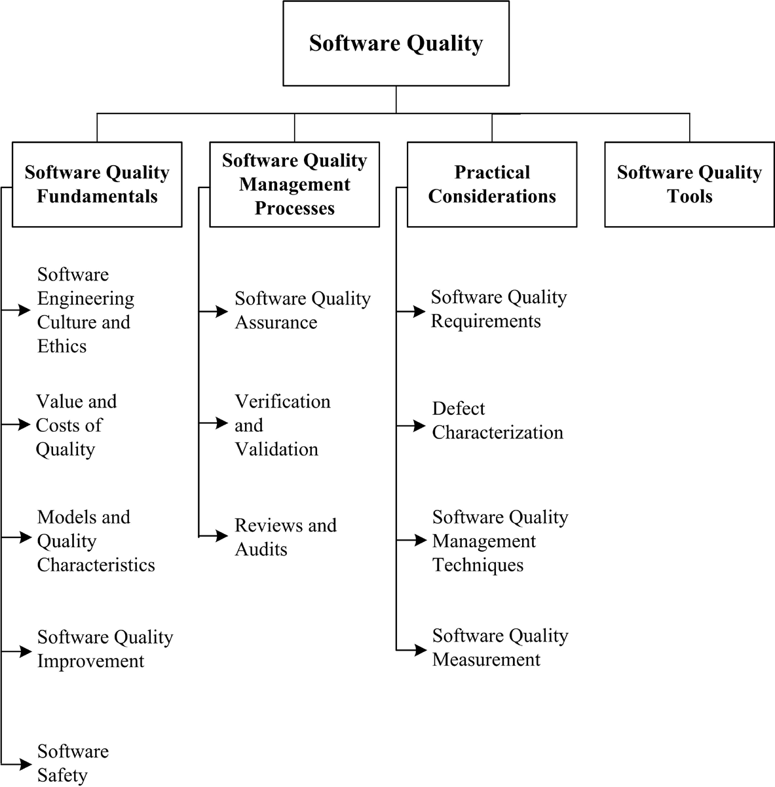

Ethics also play a significant role in software quality, the culture, and the

attitudes of software engineers. The IEEE Computer Society and the ACM have

developed a code of ethics and professional practice (see Codes of Ethics and

Professional Conduct in the Software Engineering Professional Practice KA).

\#### 1.2. Value and Costs of Quality

<!-- [7, c17, c22] -->

Defining and then achieving software quality is not simple. Quality

characteristics may or may not be required, or they may be required to a

greater or lesser degree, and tradeoffs may be made among them. To help

determine the level of software quality, i.e., achieving stakeholder value,

this section presents cost of software quality (CoSQ): a set of measurements

derived from the economic assessment of software quality development and

maintenance processes. The CoSQ measurements are examples of process

measurements that may be used to infer characteristics of a product.

The premise underlying the CoSQ is that the level of quality in a software

product can be inferred from the cost of activities related to dealing with the

consequences of poor quality. Poor quality means that the software product does

not fully “satisfy stated and implied needs” or “established requirements.”

There are four cost of quality categories: prevention, appraisal, internal

failure, and external failure.

Prevention costs include investments in software process improvement efforts,

quality infrastructure, quality tools, training, audits, and management

reviews. These costs are usually not specific to a project; they span the

organization. Appraisal costs arise from project activities that find defects.

These appraisal activities can be categorized into costs of reviews (design,

peer) and costs of testing (software unit testing, software integration, system

level testing, acceptance testing); appraisal costs would be extended to

subcontracted software suppliers. Costs of internal failures are those that are

incurred to fix defects found during appraisal activities and discovered prior

to delivery of the software product to the customer. External failure costs

include activities to respond to software problems discovered after delivery to

the customer.

Software engineers should be able to use CoSQ methods to ascertain levels of

software quality and should also be able to present quality alternatives and

their costs so that tradeoffs between cost, schedule, and delivery of

stakeholder value can be made.

\#### 1.3. Models and Quality Characteristics

<!-- [3, c24s1] [7\\*, c2s4] [8, c17] -->

Terminology for software quality characteristics differs from one taxonomy (or

model of software quality) to another, each model perhaps having a different

number of hierarchical levels and a different total number of characteristics.

Various authors have produced models of software quality characteristics or

attributes that can be useful for discussing, planning, and rating the quality

of software products. ISO/IEC 25010: 2011 [4] defines product quality and

quality in use as two related quality models. Appendix B in the SWEBOK Guide

provides a list of applicable standards for each KA. Standards for this KA

cover various ways of characterizing software quality.

\##### 1.3.1. Software Process Quality

Software quality management and software engineering process quality have a

direct bearing on the quality of the software product.

Models and criteria that evaluate the capabilities of software organizations

are primarily proj ect organization and management considerations and, as such,

are covered in the Software Engineering Management and Software Engineering

Process KAs.

It is not possible to completely distinguish process quality from product

quality because process outcomes include products. Determining whether a

process has the capability to consistently produce products of desired quality

is not simple.

The software engineering process, discussed in the Software Engineering Process

KA, influences the quality characteristics of software products, which in turn

affect quality as perceived by stakeholders.

\##### 1.3.2. Software Product Quality

The software engineer, first of all, must determine the real purpose of the

software. In this regard, stakeholder requirements are paramount, and they

include quality requirements in addition to functional requirements. Thus,

software engineers have a responsibility to elicit quality requirements that

may not be explicit at the outset and to understand their importance as well as

the level of difficulty in attaining them. All software development processes

(e.g., eliciting requirements, designing, constructing, building, checking,

improving quality) are designed with these quality requirements in mind and may

carry additional development costs if attributes such as safety, security, and

dependability are important. The additional development costs help ensure that

quality obtained can be traded off against the anticipated benefits.

The term work-product means any artifact that is the outcome of a process used

to create the final software product. Examples of a work-product include a

system/subsystem specification, a software requirements specification for a

software component of a system, a software design description, source code,

software test documentation, or reports. While some treatments of quality are

described in terms of final software and system performance, sound engineering

practice requires that intermediate work-products relevant to quality be

evaluated throughout the software engineering process.

\#### 1.4. Software Quality Improvement

<!-- [3, c1s4] [9, c24] [10, c11s2.4] -->

The quality of software products can be improved through preventative processes

or an iterative process of continual improvement, which requires management

control, coordination, and feedback from many concurrent processes: (1) the

software life cycle processes, (2) the process of fault/defect detection,

removal, and prevention, and (3) the quality improvement process.

The theory and concepts behind quality improvement - such as building in

quality through the prevention and early detection of defects, continual

improvement, and stakeholder focus - are pertinent to software engineering.

These concepts are based on the work of experts in quality who have stated that

the quality of a product is directly linked to the quality of the process used

to create it. Approaches such as the Deming improvement cycle of Plan-Do-Check

Act (PDCA), evolutionary delivery, kaizen, and quality function deployment

(QFD) offer techniques to specify quality objectives and determine whether they

are met. The Software Engineering Institute’s IDEAL is another method [7].

Quality management is now recognized by the \\*SWEBOK Guide\\* as an important

discipline.

Management sponsorship supports process and product evaluations and the

resulting findings.

Then an improvement program is developed identifying detailed actions and

improvement projects to be addressed in a feasible time frame.

Management support implies that each improvement project has enough resources

to achieve the goal defined for it. Management sponsorship is solicited

frequently by implementing proactive communication activities.

\#### 1.5. Software Safety

<!-- [9, c11s3] -->

Safety-critical systems are those in which a system failure could harm human

life, other living things, physical structures, or the environment. The

software in these systems is safety-critical. There are increasing numbers of

applications of safety-critical software in a growing number of industries.

Examples of systems with safety-critical software include mass transit systems,

chemical manufacturing plants, and medical devices. The failure of software in

these systems could have catastrophic effects. There are industry standards,

such as DO-178C [11], and emerging processes, tools, and techniques for

developing safetycritical software. The intent of these standards, tools, and

techniques is to reduce the risk of injecting faults into the software and thus

improve software reliability.

Safety-critical software can be categorized as direct or indirect. Direct is

that software embedded in a safety-critical system, such as the flight control

computer of an aircraft. Indirect includes software applications used to

develop safety-critical software. Indirect software is included in software

engineering environments and software test environments.

Three complementary techniques for reducing the risk of failure are avoidance,

detection and removal, and damage limitation. These techniques impact software

functional requirements, software performance requirements, and development

processes. Increasing levels of risk imply increasing levels of software

quality assurance and control techniques such as inspections. Higher risk

levels may necessitate more thorough inspections of requirements, design, and

code or the use of more formal analytical techniques. Another technique for

managing and controlling software risk is building assurance cases. An

assurance case is a reasoned, auditable artifact created to support the

contention that its claim or claims are satisfied. It contains the following

and their relationships: one or more claims about properties; arguments that

logically link the evidence and any assumptions to the claims; and a body of

evidence and assumptions supporting these arguments [12].

\### 2. Software Quality Management Processes

Software quality management is the collection of all processes that ensure that

software products, services, and life cycle process implementations meet

organizational software quality objectives and achieve stakeholder satisfaction

[13, 14]. SQM defines processes, process owners, requirements for the

processes, measurements of the processes and their outputs, and feedback

channels throughout the whole software life cycle.

SQM comprises four subcategories: software quality planning, software quality

assurance (SQA), software quality control (SQC), and software process

improvement (SPI). Software quality planning includes determining which quality

standards are to be used, defining specific quality goals, and estimating the

effort and schedule of software quality activities. In some cases, software

quality planning also includes defining the software quality processes to be

used. SQA activities define and assess the adequacy of software processes to

provide evidence that establishes confidence that the software processes are

appropriate for and produce software products of suitable quality for their

intended purposes [5]. SQC activities examine specific project artifacts

(documents and executables) to determine whether they comply with standards

established for the project (including requirements, constraints, designs,

contracts, and plans). SQC evaluates intermediate products as well as the final

products.

The fourth SQM category dealing with improvement has various names

within the software industry, including SPI, software quality improvement, and

software corrective and preventive action. The activities in this category seek

to improve process effectiveness, efficiency, and other characteristics with

the ultimate goal of improving software quality. Although SPI could be included

in any of the first three categories, an increasing number of organizations

organize SPI into a separate category that may span across many projects (see

the Software Engineering Process KA).

Software quality processes consist of tasks and techniques to indicate how

software plans (e.g., software management, development, quality management, or

configuration management plans) are being implemented and how well the

intermediate and final products are meeting their specified requirements.

Results from these tasks are assembled in reports for management before

corrective action is taken. The management of an SQM process is tasked with

ensuring that the results of these reports are accurate.

Risk management can also play an important role in delivering quality software.

Incorporating disciplined risk analysis and management techniques into the

software life cycle processes can help improve product quality (see the

Software Engineering Management KA for related material on risk management).

\#### 2.1. Software Quality Assurance

<!-- [7, c4–c6, c11, c12, c26–27] -->

To quell a widespread misunderstanding, software quality assurance is not

testing. software quality assurance (SQA) is a set of activities that define

and assess the adequacy of software processes to provide evidence that

establishes confidence that the software processes are appropriate and produce

software products of suitable quality for their intended purposes. A key

attribute of SQA is the objectivity of the SQA function with respect to the

project. The SQA function may also be organizationally independent of the

project; that is, free from technical, managerial, and financial pressures from

the project [5]. SQA has two aspects: product assurance and process assurance,

which are explained in section 2.3.

The software quality plan (in some industry sectors it is termed the software

quality assurance plan) defines the activities and tasks employed to ensure

that software developed for a specific product satisfies the project’s

established requirements and user needs within project cost and schedule

constraints and is commensurate with project risks. The SQAP first ensures that

quality targets are clearly defined and understood. The SQA plan’s quality

activities and tasks are specified with their costs, resource requirements,

objectives, and schedule in relation to related objectives in the software

engineering management, software development, and software maintenance plans.

The SQA plan should be consistent with the software configuration management

plan (see the Software Configuration Management KA). The SQA plan identifies

documents, standards, practices, and conventions governing the project and how

these items are checked and monitored to ensure adequacy and compliance.

The SQA plan also identifies measures; statistical techniques; procedures for

problem reporting and corrective action; resources such as tools, techniques,

and methodologies; security for physical media; training; and SQA reporting and

documentation. Moreover, the SQA plan addresses the software quality assurance

activities of any other type of activity described in the software plans—such

as procurement of supplier software for the project, commercial off-the-shelf

software (COTS) installation, and service after delivery of the software. It

can also contain acceptance criteria as well as reporting and management

activities that are critical to software quality.

\#### 2.2. Verification & Validation

<!-- [9, c2s2.3, c8, c15s1.1, c21s3.3] -->

As stated in [15],

\> The purpose of V&V is to help the development organization build quality into

\> the system during the life cycle. V&V processes provide an objective

\> assessment of products and processes throughout the life cycle. This

\> assessment demonstrates whether the requirements are correct, complete,

\> accurate, consistent, and testable.

\> The V&V processes determine whether the development products of a given

\> activity conform to the requirements of that activity and whether the product

\> satisfies its intended use and user needs.

Verification is an attempt to ensure that the product is built correctly, in

the sense that the output products of an activity meet the specifications

imposed on them in previous activities.

Validation is an attempt to ensure that the right product is built - that is,

the product fulfills its specific intended purpose. Both the verification

process and the validation process begin early in the development or

maintenance phase. They provide an examination of key product features in

relation to both the product’s immediate predecessor and the specifications to

be met.

The purpose of planning V&V is to ensure that each resource, role, and

responsibility is clearly assigned. The resulting V&V plan documents describe

the various resources and their roles and activities, as well as the techniques

and tools to be used. An understanding of the different purposes of each V&V

activity helps in the careful planning of the techniques and resources needed

to fulfill their purposes. The plan also addresses the management,

communication, policies, and procedures of the V&V activities and their

interaction, as well as defect reporting and documentation requirements.

\#### 2.3. Reviews and Audits

<!-- [9, c24s3] [16\\*] -->

Reviews and audit processes are broadly defined as static—meaning that no

software programs or models are executed—examination of software engineering

artifacts with respect to standards that have been established by the

organization or project for those artifacts. Different types of reviews and

audits are distinguished by their purpose, levels of independence, tools and

techniques, roles, and by the subject of the activity. Product assurance and

process assurance audits are typically conducted by software quality assurance

(SQA) personnel who are independent of development teams. Management reviews

are conducted by organizational or project management. The engineering staff

conducts technical reviews.

- Management reviews evaluate actual project results with respect to plans.
- Technical reviews (including inspections, walkthrough, and desk checking)

examine engineering work-products.

- Process assurance audits. SQA process assurance activities make certain that

the processes used to develop, install, operate, and maintain software

conform to contracts, comply with any imposed laws, rules, and regulations

and are adequate, efficient and effective for their intended purpose [5].

- Product assurance audits. SQA product assurance activities make certain to

provide evidence that software products and related documentation are

identified in and comply with contracts; and ensure that nonconformances are

identified and addressed [5].

\##### 2.3.1. Management Reviews

As stated in [16],

\> The purpose of a management review is to monitor progress, determine the status

\> of plans and schedules, and evaluate the effectiveness of management processes,

\> tools and techniques. Management reviews compare actual project results against

\> plans to determine the status of projects or maintenance efforts. The main

\> parameters of management reviews are project cost, schedule, scope, and

\> quality. Management reviews evaluate decisions about corrective actions,

\> changes in the allocation of resources, or changes to the scope of the project.

Inputs to management reviews may include audit reports, progress reports, V&V

reports, and plans of many types, including risk management, project

management, software configuration management, software safety, and risk

assessment, among others. (Refer to the Software Engineering Management and the

Software Configuration Management KAs for related material.)

\##### 2.3.2. Technical Reviews

As stated in [16],

\> The purpose of a technical review is to evaluate a software product by a team

\> of qualified personnel to determine its suitability for its intended use and

\> identify discrepancies from specifications and standards. It provides

\> management with evidence to confirm the technical status of the project.

Although any work-product can be reviewed, technical reviews are performed on

the main software engineering work-products of software requirements and

software design.

Purpose, roles, activities, and most importantly the level of formality

distinguish different types of technical reviews. Inspections are the most

formal, walkthroughs less, and pair reviews or desk checks are the least

formal.

Examples of specific roles include a decision maker (i.e., software lead), a

review leader, a recorder, and checkers (technical staff members who examine

the work-products). Reviews are also distinguished by whether meetings (face to

face or electronic) are included in the process. In some review methods

checkers solitarily examine work-products and send their results back to a

coordinator. In other methods checkers work cooperatively in meetings. A

technical review may require that mandatory inputs be in place in order to

proceed:

- Statement of objectives
- Specific software product
- Specific project management plan
- Issues list associated with this product
- Technical review procedure.

The team follows the documented review procedure. The technical review is

completed once all the activities listed in the examination have been

completed.

Technical reviews of source code may include a wide variety of concerns such as

analysis of algorithms, utilization of critical computer resources, adherence

to coding standards, structure and organization of code for testability, and

safety-critical considerations.

Note that technical reviews of source code or design models such as UML are

also termed static analysis (see topic 3, Practical Considerations).

\##### 2.3.3. Inspections

“The purpose of an inspection is to detect and identify software product

anomalies” [16]. Some important differentiators of inspections as compared to

other types of technical reviews are these:

1. Rules. Inspections are based upon examining a work-product with respect to a

defined set of criteria specified by the organization. Sets of rules can be

defined for different types of workproducts (e.g., rules for requirements,

architecture descriptions, source code).

1. Sampling. Rather that attempt to examine every word and figure in a

document, the inspection process allows checkers to evaluate defined subsets

(samples) of the documents under review.

1. Peer. Individuals holding management positions over members of the

inspection team do not participate in the inspection. This is a key

distinction between peer review and management review.

1. Led. An impartial moderator who is trained in inspection techniques leads

inspection meetings.

- Meeting. The inspection process includes meetings (face to face or

electronic) conducted by a moderator according to a formal procedure in

which inspection team members report the anomalies they have found and other

issues.

Software inspections always involve the author of an intermediate or final

product; other reviews might not. Inspections also include an inspection

leader, a recorder, a reader, and a few (two to five) checkers (inspectors).

The members of an inspection team may possess different expertise, such as

domain expertise, software design method expertise, or programming language

expertise. Inspections are usually conducted on one relatively small section of

the product at a time (samples). Each team member examines the software product

and other review inputs prior to the review meeting, perhaps by applying an

analytical technique (see section 3.3.3) to a small section of the product or

to the entire product with a focus on only one aspect - e.g., interfaces.

During the inspection, the moderator conducts the session and verifies that

everyone has prepared for the inspection and conducts the session. The

inspection recorder documents anomalies found. A set of rules, with criteria

and questions germane to the issues of interest, is a common tool used in

inspections. The resulting list often classifies the anomalies (see section

1. 2, Defect Characterization) and is reviewed for completeness and accuracy by

the team. The inspection exit decision corresponds to one of the following

options:

1. Accept with no or, at most, minor reworking
1. Accept with rework verification
1. Reinspect.

\##### 2.3.4. Walkthroughs

As stated in [16],

\> The purpose of a systematic walk-through is to evaluate a software product. A

\> walk-through may be conducted for the purpose of educating an audience

\> regarding a software product.

Walkthroughs are distinguished from inspections. The main difference is that

the author presents the work-product to the other participants in a meeting

(face to face or electronic). Unlike an inspection, the meeting participants

may not have necessarily seen the material prior to the meeting. The meetings

may be conducted less formally. The author takes the role of explaining and

showing the material to participants and solicits feedback. Like inspections,

walkthroughs may be conducted on any type of work-product including project

plan, requirements, design, source code, and test reports.

\##### 2.3.5. Process Assurance and Product Assurance Audits

As stated in [16],

\> The purpose of a software audit is to provide an independent evaluation of

\> the conformance of software products and processes to applicable

\> regulations, standards, guidelines, plans, and procedures.

Process assurance audits determine the adequacy of plans, schedules, and

requirements to achieve project objectives [5]. The audit is a formally

organized activity with participants having specific roles - such as lead

auditor, another auditor, a recorder, or an initiator - and including a

representative of the audited organization. Audits identify instances of

nonconformance and produce a report requiring the team to take corrective

action.

While there may be many formal names for reviews and audits, such as those

identified in the standard [16], the important point is that they can occur on

almost any product at any stage of the development or maintenance process.

\### 3. Practical Considerations

\#### 3.1. Software Quality Requirements

<!--

[9, c11s1] [18, c12]

[17, c15s3.2.2, c15s3.3.1, c16s9.10]

-->

\##### 3.1.1. Influence Factors

Various factors influence planning, management, and selection of SQM activities

and techniques, including

1. the domain of the system in which the software resides; the system functions

could be safety-critical, mission-critical, business-critical,

security-critical

1. the physical environment in which the software system resides
1. system and software functional (what the system does) and quality (how well

the system performs its functions) requirements

1. the commercial (external) or standard (internal) components to be used in the

system

1. the specific software engineering standards applicable
1. the methods and software tools to be used for development and maintenance and

for quality evaluation and improvement

1. the budget, staff, project organization, plans, and scheduling of all

processes

1. the intended users and use of the system
1. the integrity level of the system.

Information on these factors influences how the SQM processes are organized and

documented, how specific SQM activities are selected, what resources are

needed, and which of those resources impose bounds on the efforts.

\##### 3.1.2. Dependability

In cases where system failure may have extremely severe consequences, overall

dependability (hardware, software, and human or operational) is the main

quality requirement over and above basic functionality. This is the case for

the following reasons: system failures affect a large number of people; users

often reject systems that are unreliable, unsafe, or insecure; system failure

costs may be enormous; and undependable systems may cause information loss.

System and software dependability include such characteristics as availability,

reliability, safety, and security.

When developing dependable software, tools and techniques can be applied to

reduce the risk of injecting faults into the intermediate deliverables or the

final software product. Verification, validation, and testing processes,

techniques, methods, and tools identify faults that impact dependability as

early as possible in the life cycle. Additionally, mechanisms may need to be in

place in the software to guard against external attacks and to tolerate faults.

\##### 3.1.3. Integrity Levels of Software

Defining integrity levels is a method of risk management.

Software integrity levels are a range of values that represent software

complexity, criticality, risk, safety level, security level, desired

performance, reliability, or other project-unique characteristics that define

the importance of the software to the user and acquirer. The characteristics

used to determine software integrity level vary depending on the intended

application and use of the system. The software is a part of the system, and

its integrity level is to be determined as a part of that system.

The assigned software integrity levels may change as the software evolves.

Design, coding, procedural, and technology features implemented in the system

or software can raise or lower the assigned software integrity levels. The

software integrity levels established for a project result from agreements

among the acquirer, supplier, developer, and independent assurance authorities.

A software integrity level scheme is a tool used in determining software

integrity levels. [5]

As noted in [17], “the integrity levels can be applied during development to

allocate additional verification and validation efforts to high-integrity

components.”

\#### 3.2. Defect Characterization

<!-- [3, c3s3, c8s8, c10s2] -->

Software quality evaluation (i.e., software quality control) techniques find

defects, faults and failures. Characterizing these techniques leads to an

understanding of the product, facilitates corrections to the process or the

product, and informs management and other stakeholders of the status of the

process or product. Many taxonomies exist and, while attempts have been made to

gain consensus, the literature indicates that there are quite a few in use.

Defect characterization is also used in audits and reviews, with the review

leader often presenting a list of issues provided by team members for

consideration at a review meeting.

As new design methods and languages evolve, along with advances in overall

software technologies, new classes of defects appear, and a great deal of

effort is required to interpret previously defined classes. When tracking

defects, the software engineer is interested in not only the number of defects

but also the types. Information alone, without some classification, may not be

sufficient to identify the underlying causes of the defects.

Specific types of problems need to be grouped to identify trends over time. The

point is to establish a defect taxonomy that is meaningful to the organization

and to software engineers.

Software quality control activities discover information at all stages of

software development and maintenance. In some cases, the word defect is

overloaded to refer to different types of anomalies. However, different

engineering cultures and standards may use somewhat different meanings for

these terms. The variety of terms prompts this section to provide a widely used

set of definitions [19]:

1. \\_Computational Error\\_ : “the difference between a computed, observed, or

measured value or condition and the true, specified, or theoretically correct

value or condition.”

1. \\_Error\\_ : “A human action that produces an incorrect result.” A slip or

mistake that a person makes. Also called human error.

1. \\_Defect\\_ : An “imperfection or deficiency in a work product where that work

product does not meet its requirements or specifications and needs to be

either repaired or replaced.” A defect is caused by a person committing an

error.

1. \\_Fault\\_ : A defect in source code. An “incorrect step, process, or data

definition in computer program.” The encoding of a human error in source

code. Fault is the formal name of a bug.

1. \\_Failure\\_ : An “event in which a system or system component does not perform

a required function within specified limits.” A failure is produced when a

fault is encountered by the processor under specified conditions.

Using these definitions three widely used software quality measurements are

defect density (number of defects per unit size of documents), fault density

(number of faults per 1K lines of code), and failure intensity (failures per

use-hour or per test-hour). Reliability models are built from failure data

collected during software testing or from software in service and thus can be

used to estimate the probability of future failures and to assist in decisions

on when to stop testing.

One probable action resulting from SQM findings is to remove the defects from

the product under examination (e.g., find and fix bugs, create new build).

Other activities attempt to eliminate the causes of the defects—for example,

root cause analysis (RCA). RCA activities include analyzing and summarizing the

findings to find root causes and using measurement techniques to improve the

product and the process as well as to track the defects and their removal.

Process improvement is primarily discussed in the Software Engineering Process

KA, with the SQM process being a source of information.

Data on inadequacies and defects found by software quality control techniques

may be lost unless they are recorded. For some techniques (e.g., technical

reviews, audits, inspections), recorders are present to set down such

information, along with issues and decisions. When automated tools are used

(see topic 4, Software Quality Tools), the tool output may provide the defect

information. Reports about defects are provided to the management of the

organization.

\#### 3.3. Software Quality Management Techniques

<!-- [7, c7s3] [8, c17] [9, c12s5, c15s1, p417] [16] -->

Software quality control techniques can be categorized in many ways, but a

straightforward approach uses just two categories: static and dynamic. Dynamic

techniques involve executing the software; static techniques involve analyzing

documents and source code but not executing the software.

\##### 3.3.1. Static Techniques

Static techniques examine software documentation (including requirements,

interface specifications, designs, and models) and software source code without

executing the code. There are many tools and techniques for statically

examining software work-products (see section 2.3.2). In addition, tools that

analyze source code control flow and search for dead code are considered to be

static analysis tools because they do not involve executing the software code.

Other, more formal, types of analytical techniques are known as formal

methods. They are notably used to verify software requirements and designs.

They have mostly been used in the verification of crucial parts of critical

systems, such as specific security and safety requirements. (See also Formal

Methods in the Software Engineering Models and Methods KA.)

\##### 3.3.2. Dynamic Techniques

Dynamic techniques involve executing the software code. Different kinds of

dynamic techniques are performed throughout the development and maintenance of

software. Generally, these are testing techniques, but techniques such as

simulation and model analysis may be considered dynamic (see the Software

Engineering Models and Methods KA). Code reading is considered a static

technique, but experienced software engineers may execute the code as they read

through it. Code reading may utilize dynamic techniques. This discrepancy in

categorizing indicates that people with different roles and experience in the

organization may consider and apply these techniques differently.

Different groups may perform testing during software development, including

groups independent of the development team. The Software Testing KA is

devoted entirely to this subject.

\##### 3.3.3. Testing

Two types of testing may fall under V&V because of their responsibility for the

quality of the materials used in the project:

1. Evaluation and tests of tools to be used on the project
1. Conformance tests (or review of conformance tests) of components and COTS

products to be used in the product.

Sometimes an independent (third-party or IV&V) organization may be tasked to

perform testing or to monitor the test process V&V may be called upon to

evaluate the testing itself: adequacy of plans, processes, and procedures,

and adequacy and accuracy of results.

The third party is not the developer, nor is it associated with the development

of the product. Instead, the third party is an independent facility, usually

accredited by some body of authority. Their purpose is to test a product for

conformance to a specific set of requirements (see the Software Testing KA).

\#### 3.4. Software Quality Measurement

<!-- [3, c4] [8, c17] [9, p90] -->

Software quality measurements are used to support decision-making. With the

increasing sophistication of software, questions of quality go beyond whether

or not the software works to how well it achieves measurable quality goals.

Decisions supported by software quality measurement include determining levels

of software quality (notably because models of software product quality include

measures to determine the degree to which the software product achieves quality

goals); managerial questions about effort, cost, and schedule; determining when

to stop testing and release a product (see Termination under section 5.1,

Practical Considerations, in the Software Testing KA); and determining the

efficacy of process improvement efforts.

The cost of SQM processes is an issue frequently raised in deciding how a

project or a software development and maintenance group should be organized.

Often, generic models of cost are used, which are based on when a defect is

found and how much effort it takes to fix the defect relative to finding the

defect earlier in the development process. Software quality measurement data

collected internally may give a better picture of cost within this project or

organization.

While the software quality measurement data may be useful in itself (e.g., the

number of defective requirements or the proportion of defective requirements),

mathematical and graphical techniques can be applied to aid in the

interpretation of the measures (see the Engineering Foundations KA). These

techniques include

1. descriptive statistics based (e.g., Pareto analysis, run charts, scatter

plots, normal distribution)

1. statistical tests (e.g., the binomial test, chisquared test)
1. trend analysis (e.g., control charts; see \\_The Quality Toolbox\\_ in the list

of further readings)

1. prediction (e.g., reliability models).

Descriptive statistics-based techniques and tests often provide a snapshot of

the more troublesome areas of the software product under examination. The

resulting charts and graphs are visualization aids, which the decision makers

can use to focus resources and conduct process improvements where they appear

to be most needed. Results from trend analysis may indicate that a schedule is

being met, such as in testing, or that certain classes of faults may become

more likely to occur unless some corrective action is taken in development. The

predictive techniques assist in estimating testing effort and schedule and in

predicting failures. More discussion on measurement in general appears in the

Software Engineering Process and Software Engineering Management KAs. More

specific information on testing measurement is presented in the Software

Testing KA.

Software quality measurement includes measuring defect occurrences and applying

statistical methods to understand the types of defects that occur most

frequently. This information may be used by software process improvement for

determining methods to prevent, reduce, or eliminate their recurrence. They

also aid in understanding trends, how well detection and containment techniques

are working, and how well the development and maintenance processes are

progressing.

From these measurement methods, defect profiles can be developed for a specific

application domain. Then, for the next software project within that

organization, the profiles can be used to guide the SQM processes—that is, to

expend the effort where problems are most likely to occur.

Similarly, benchmarks, or defect counts typical of that domain, may serve as

one aid in determining when the product is ready for delivery. Discussion on

using data from SQM to improve development and maintenance processes appears in

the Software Engineering Management and Software Engineering Process KAs.

\### 4. Software Quality Tools

Software quality tools include static and dynamic analysis tools. Static

analysis tools input source code, perform syntactical and semantic analysis

without executing the code, and present results to users. There is a large

variety in the depth, thoroughness, and scope of static analysis tools that

can be applied to artifacts including models, in addition to source code. (See

the Software Construction, Software Testing, and Software Maintenance KAs

for descriptions of dynamic analysis tools.)

Categories of static analysis tools include the following:

1. Tools that facilitate and partially automate reviews and inspections of

documents and code. These tools can route work to different participants in

order to partially automate and control a review process. They allow users to

enter defects found during inspections and reviews for later removal.

1. Some tools help organizations perform software safety hazard analysis. These

tools provide, e.g., automated support for failure mode and effects analysis

(FMEA) and fault tree analysis (FTA).

1. Tools that support tracking of software problems provide for entry of

anomalies discovered during software testing and subsequent analysis,

disposition, and resolution. Some tools include support for workflow and for

tracking the status of problem resolution.

1. Tools that analyze data captured from software engineering environments and

software test environments and produce visual displays of quantified data in

the form of graphs, charts, and tables. These tools sometimes include the

functionality to perform statistical analysis on data sets (for the purpose

of discerning trends and making forecasts). Some of these tools provide

defect and removal injection rates; defect densities; yields; distribution of

defect injection and removal for each of the life cycle phases.

\### Matrix Of Topics vs. Reference Material

Kan 2002

[3]

Bott et al. 2000

[6]

Galin 2004

[7]

Naik and Tripathy 2008

[8]

Sommerville 2011

[9]

Voland 2003

[10]

IEEE Std. 1028-2008

[16]

Moore 2006

[17]

Wiegers 2003

[18\\*]

\\*\\*1. Software Quality Fundamentals\\*\\*

1\.1. Software Engineering Culture and Ethics c1s4 c2s3.5

1\.2. Value and Cost of Quality c17, c22

1\.3. Models and Quality Characteristics c24s1 c2s4 c17

1\.4. Software Quality Improvement c1s4 c24 c11 s2.4

1\.5. Software Safety c11s3

\\*\\*2. Software Quality Management Processes\\*\\*

2\.1. Software Quality Assurance c4–c6, c11, c26–27

2\.2. Verification and Validation c2 s2.3, c8, c15 s1.1, c21 s3.3

2\.3. Reviews and Audits c24s3 \\*

Software Quality 10-15

Kan 2002

[3]

Bott et al. 2000

[6\\*]

Galin 2004

[7\\*]

Naik and Tripathy 2008

[8\\*]

Sommerville 2011

[9\\*]

Voland 2003

[10\\*]

IEEE Std. 1028-2008

[16\\*]

Moore 2006

[17\\*]


Wiegers 2003

[18\\*]

\\*\\*3. Software Quality Practical Considerations\\*\\*

3\.1. Software Quality Requirements c11s1 c15 s3.2.2, c15 s3.3.1, c16 s9.10 c12

3\.2. Defect Characterization c3s3, c8s8, c10 s2

3\.3. SQM Te c h n i q u e s c7s3 c17 c12s5, c15s1, p417

\\*

3\.4. Software Quality Measurement c4 c17 p90

\\*\\*4. Software Quality Tools\\*\\*

\\*\\*Further Readings\\*\\*

N. Leveson, \\_Safeware: System Safety and Computers\\_ [20].

This book describes the importance of software safety practices and how these

practices can be incorporated into software development projects.

T. Gilb, \\_Principles of Software Engineering Management\\_ [21].

This is one of the first books on iterative and incremental development

techniques. The Evo Method defines quantified goals, frequent timeboxed

iterations, measurements of progress toward goals, and adaptation of plans

based on actual results.

T. Gilb and D. Graham, \\_Software Inspection\\_ [22].

This book introduces measurement and statistical sampling for reviews and

defects. It presents techniques that produce quantified results for reducing

defects, improving productivity, tracking projects, and creating

documentation.

K.E. Wiegers, Peer Reviews in Software: A Practical Guide [23].

This book provides clear, succinct explanations of different peer review

methods distinguished by level of formality and effectiveness. Pragmatic

guidance for implementing the methods and how to select which methods are

appropriate for given circumstances is provided.

N.R. Tague, The Quality Toolbox, 2nd ed., [24].

Provides a pragmatic how-to explanation of a comprehensive set of methods,

tools, and techniques for solving quality improvement problems. Includes

the seven basic quality control tools and many others.

IEEE Std. P730-2013 Draft Standard for Software Quality Assurance Processes

[5].

This draft standard expands the SQA processes identified in IEEE/ISO/IEC

12207-2008. P730 establishes standards for initiating, planning, controlling,

and executing the software quality assurance processes of a software

development or maintenance project. Approval of this draft standard is expected

in 2014.

Software Quality 10-17

\\*\\*References\\*\\*

[1] P.B. Crosby, \\_Quality Is Free\\_, McGraw-Hill, 1979.

[2] W. Humphrey, \\_Managing the Software Process\\_, Addison-Wesley, 1989.

[3] S.H. Kan, \\_Metrics and Models in Software Quality Engineering\\_, 2nd ed.,

Addison-Wesley, 2002.

[4] \\_ISO/IEC 25010:2011 Systems and Software Engineering—Systems and Software

Quality Requirements and Evaluation (SQuaRE)—Systems and Software Quality

Models\\_, ISO/IEC, 2011.

[5] \\_IEEE P730™/D8 Draft Standard for Software Quality Assurance Processes\\_,

IEEE, 2012.

[6] F. Bott et al., \\_Professional Issues in Software Engineering\\_, 3rd ed.,

Taylor & Francis, 2000.

[7] D. Galin, \\_Software Quality Assurance: From Theory to Implementation\\_,

Pearson Education Limited, 2004.

[8] S. Naik and P. Tripathy, \\_Software Testing and Quality Assurance: Theory

and Practice\\_, Wiley-Spektrum, 2008.

[9] P. Clements et al., \\_Documenting Software Architectures: Views and Beyond\\_

, 2nd ed., Pearson Education, 2010.

[10] G. Voland, \\_Engineering by Design\\_, 2nd ed., Prentice Hall, 2003.

[11] \\_RTCA DO-178C, Software Considerations in Airborne Systems and Equipment

Certification\\_, Radio Technical Commission for Aeronautics, 2011.

[12] \\_IEEE Std. 15026.1-2011 Trial-Use Standard Adoption of ISO/IEC TR

15026-1:2010 Systems and Software Engineering— Systems and Software

Assurance—Part 1: Concepts and Vocabulary\\_, IEEE, 2011.

[13] IEEE Std. 12207-2008 (a.k.a. ISO/IEC 12207:2008) Standard for Systems and

Software Engineering—Software Life Cycle Processes, IEEE, 2008.

[14] ISO 9000:2005 Quality Management Systems—Fundamentals and Vocabulary,

ISO, 2005.

[15] IEEE Std. 1012-2012 Standard for System and Software Verification and

Validation, IEEE, 2012.

[16] IEEE Std. 1028-2008, Software Reviews and Audits, IEEE, 2008.

[17] J.W. Moore, The Road Map to Software Engineering: A Standards-Based Guide

, Wiley-IEEE Computer Society Press, 2006.

[18] K.E. Wiegers, Software Requirements, 2nd ed., Microsoft Press, 2003.

[19] ISO/IEC/IEEE 24765:2010 Systems and Software Engineering—Vocabulary, ISO/

IEC/IEEE, 2010.

[20] N. Leveson, Safeware: System Safety and Computers, Addison-Wesley

Professional, 1995.

[21] T. Gilb, Principles of Software Engineering Management, Addison-Wesley

Professional, 1988.

[22] T. Gilb and D. Graham, Software Inspection, Addison-Wesley Professional,

1993\.

[23] K. Wiegers, Peer Reviews in Software: A Practical Guide, Addison-Wesley

Professional, 2001.

[24] N.R. Tague, The Quality Toolbox, 2nd ed., ASQ Quality Press, 2010.

\## Chapter 11: Software Engineering: Professional Practice

\\*\\*Acronyms\\*\\*

1. ACM Association for Computing Machinery
1. BCS British Computer Society
1. CSDA Certified Software Development Associate
1. CSDP Certified Software Development Professional
1. IEC International Electrotechnical Commission IEEE CS IEEE Computer

SocietyIFIP International. Federation for Information Processing IP

Intellectual Property

1. ISO International Organization for Standardization N DA Non-Disclosure

Agreement

1. WIPO World Intellectual Property Organization
1. WTO World Trade Organization

\\*\\*Introduction\\*\\*

The Software Engineering Professional Practice knowledge area (KA) is

concerned with the knowledge, skills, and attitudes that software engineers

must possess to practice software engineering in a professional, responsible,

and ethical manner. Because of the widespread applications of software

products in social and personal life, the quality of software products can have

profound impact on our personal well-being and societal harmony. Software

engineers must handle unique engineering problems, producing software with

known characteristics and reliability. This requirement calls for software

engineers who possess a proper set of knowledge, skills, training, and

experience in professional practice.

The term “professional practice” refers to a way of conducting services so as

to achieve certain standards or criteria in both the process of performing a

service and the end product resulting from the service. These standards and

criteria can include both technical and nontechnical aspects. The concept of

professional practice can be viewed as being more applicable within those

professions that have a generally accepted body of knowledge; codes of ethics

and professional conduct with penalties for violations; accepted processes for

accreditation, certification, and licensing; and professional societies to

provide and administer all of these. Admission to these professional societies

is often predicated on a prescribed combination of education and experience.

A software engineer maintains a professional practice by performing all work in

accordance with generally accepted practices, standards, and guidelines notably

set forth by the applicable pro- fessional society. For example, the

Association for Computing Machinery (ACM) and IEEE Computer Society (IEEE CS)

have established a Software Engineering Code of Ethics and Professional

Practice. Both the British Computer Society (BCS) and the International

Federation for Information Processing (IFIP) have established similar

professional practice standards. ISO/IEC and IEEE have further provided

internationally accepted software engineering standards (see Appendix B of this

Guide ). IEEE CS has established two international certification programs

(CSDA, CSDP) and a corresponding Guide to the Software Engineering Body of

Knowledge ( SWEBOK Guide ). All of these are elements that lay the foundation

for of the professional practice of software engineering.

\\*\\*Breakdown Of Topics For Software Engineering Professional Practice\\*\\*

The Software Engineering Professional Practice KA’s breakdown of topics is

shown in Figure 11.1. The subareas presented in this KA are professionalism,

group dynamics and psychology, and communication skills.

\### 1. Professionalism

A software engineer displays professionalism notably through adherence to codes

of ethics and professional conduct and to standards and practices that are

established by the engineer’s professional community.

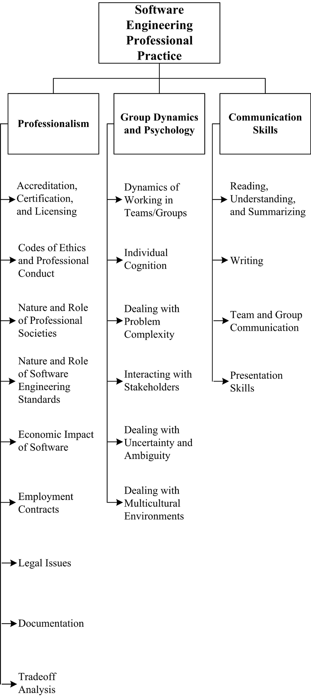

The professional community is often represented by one or more professional

societies; those societies publish codes of ethics and professional conduct

as well as criteria for admittance to the community. Those criteria form the

basis for accreditation and licensing activities and may be used as a measure

to determine engineering competence or negligence.

\#### 1.1. Accreditation, Certification, and Licensing

<!-- [1\\*, c1s4.1, c1s5.1–c1s5.4] -->

\##### 1.1.1. Accreditation

Accreditation is a process to certify the competency, authority, or

credibility of an organization. Accredited schools or programs are assured to

adhere to particular standards and maintain certain qualities. In many

countries, the basic means by which engineers acquire knowledge is through

completion of an accredited course of study. Often, engineering accreditation

is performed by a government organization, such as the ministry of education.

Such countries with government accreditations include China, France, Germany,

Israel, Italy, and Russia.

In other countries, however, the accreditation process is independent of

government and performed by private membership associations. For example, in

the United States, engineering accreditation is performed by an organiza-

tion known as ABET. An organization known as CSAB serving as a participating

body of ABET is the lead society within ABET for the accreditation of degree

programs in software engineering.

While the process of accreditation may be different for each country and

jurisdiction, the general meaning is the same. For an institution’s course of

study to be accredited means that “the accreditation body recognizes an

educational institution as maintaining standards that qualify the graduates for

admission to higher or more specialized institutions or for professional

practice” [2].

\##### 1.1.2. Certification

Certification refers to the confirmation of a person’s particular

characteristics. A common type of certification is professional certification,

where a person is certified as being able to complete an activity in a certain

discipline at a stated level of competency. Professional certification also can

also verify the holder’s ability to meet professional standards and to apply

professional judgment in solving or addressing problems. Professional

certification can also involve the verification of prescribed knowledge, the

mastering of best practice and proven methodologies, and the amount of

professional experience.

An engineer usually obtains certification by passing an examination in

conjunction with other experience-based criteria. These examinations are often

administered by nongovernmental organizations, such as professional societies.

In software engineering, certification testifies to one’s qualification as a

software engineer. For example, the IEEE CS has enacted two certification

programs (CSDA and CSDP) designed to confirm a software engineer’s knowledge of

standard software engineering practices and to advance one’s career. A lack of

certification does not exclude the individual from working as a software

engineer. Currently certification in software engineering is completely

voluntary. In fact, most software engineers are not certified under any

program.

\##### 1.1.3. Licensing

“Licensing” is the action of giving a person the authorization to perform

certain kinds of activities and take responsibility for resultant engineer-

ing products. The noun “license” refers to both that authorization and the

document recording that authorization. Governmental authorities or statutory

bodies usually issue licenses.

Obtaining a license to practice requires not only that an individual meets a

certain standard, but also that they do so with a certain ability to practice

or operate. Sometimes there is an entry-level requirement which sets the

minimum skills and capabilities to practice, but as the professional moves

through his or her career, the required skills and capabilities change and

evolve.

In general, engineers are licensed as a means of protecting the public from

unqualified individuals. In some countries, no one can practice as a pro-

fessional engineer unless licensed; or further, no company may offer

“engineering services” unless at least one licensed engineer is employed there.

\#### 1.2. Codes of Ethics and Professional Conduct

<!-- [1\\*, c1s6–c1s9] [3\\*, c8] [4\\*, c1s2] [5\\*, c33] [6] -->

Codes of ethics and professional conduct comprise the values and behavior

that an engineer’s professional practice and decisions should embody.

The professional community establishes codes of ethics and professional

conduct. They exist in the context of, and are adjusted to agree with, societal

norms and local laws. Therefore, codes of ethics and professional conduct

present guidance in the face of conflicting imperatives.

Once established, codes of ethics and professional conduct are enforced by the

profession, as represented by professional societies or by a statutory body.

Violations may be acts of commission, such as concealing inadequate work,

disclosing confidential information, falsifying information, or

misrepresenting one’s abilities. They may also occur through omission,

including failure to disclose risks or to provide important information,

failure to give proper credit or to acknowledge references, and failure to

represent client interests. Violations of codes of ethics and professional

conduct may result in penalties and possible expulsion from professional

status.

A code of ethics and professional conduct for software engineering was approved

by the ACM Council and the IEEE CS Board of Governors in 1999 [6]. According to

the short version of this code:

\> Software engineers shall commit themselves to making the analysis,

\> specification, design, development, testing and maintenance of software a

\> beneficial and respected profession. In accordance with their commitment to

\> the health, safety and welfare of the public, software engineers shall adhere

\> to the eight principles concerning the public, client and employer, product,

\> judgment, management, profession, colleagues, and self, respectively.

Since standards and codes of ethics and professional conduct may be

introduced, modified, or replaced at any time, individual software engineers

bear the responsibility for their own continuing study to stay current in

their professional practice.

\#### 1.3. Nature and Role of Professional Societies

<!-- [1\\*, c1s1–c1s2] [4\\*, c1s2] [5\\*, c35s1] -->

Professional societies are comprised of a mix of practitioners and academics.

These societies serve to define, advance, and regulate their corresponding

professions. Professional societies help to establish professional standards as

well as codes of ethics and professional conduct. For this reason, they also

engage in related activities, which include

1. establishing and promulgating a body of generally accepted knowledge;
1. accrediting, certifying, and licensing;
1. dispensing disciplinary actions;
1. advancing the profession through conferences, training, and publications.

Participation in professional societies assists the individual engineer in

maintaining and sharpening their professional knowledge and relevancy and in

expanding and maintaining their professional network.

\#### 1.4. Nature and Role of Software Engineering Standards

<!-- [1\\*, c5s3.2, c10s2.1] [5\\*, c32s6] [7\\*, c1s2] -->

Software engineering standards cover a remarkable variety of topics. They

provide guidelines for the practice of software engineering and processes to be

used during development, maintenance, and support of software. By establishing

a consensual body of knowledge and experience, software engineering standards

establish a basis upon which further guidelines may be developed. Appendix B

of this Guide provides guidance on IEEE and ISO/ IEC software engineering

standards that support the knowledge areas of this Guide.

The benefits of software engineering standards are many and include improving

software quality, helping avoid errors, protecting both software producers and

users, increasing professional discipline, and helping technology transition.

\#### 1.5. Economic Impact of Software

[3\\*, c10s8] [4\\*, c1s1.1] [8\\*, c1]

Software has economic effects at the individual, business, and societal levels.

Software “success” may be determined by the suitability of a product for a

recognized problem as well as by its effectiveness when applied to that

problem.

At the individual level, an engineer’s continuing employment may depend on

their ability and willingness to interpret and execute tasks in meeting

customers’ or employers’ needs and expectations. The customer or employer’s

financial situation may in turn be positively or negatively affected by the

purchase of software.

At the business level, software properly applied to a problem can eliminate

months of work and translate to elevated profits or more effective

organizations. Moreover, organizations that acquire or provide successful

software may be a boon to the society in which they operate by pro- viding both

employment and improved services. However, the development or acquisition costs

of software can also equate to those of any major acquisition.

At the societal level, direct impacts of software success or failure include or

exclude accidents, interruptions, and loss of service. Indirect impacts include

the success or failure of the organization that acquired or produced the

software, increased or decreased societal productivity, harmonious or

disruptive social order, and even the saving or loss of property and life.

\#### 1.6. Employment Contracts

<!-- [1\\*, c7] -->

Software engineering services may be provided under a variety of

client-engineer relationships. The software engineering work may be solicited

as company-to-customer supplier, engineer-to-customer consultancy, direct hire,

or even volunteering. In all of these situations, the customer and supplier

agree that a product or service will be provided in return for some sort of

consideration. Here, we are most concerned with the engineer-to-customer

arrangement and its attendant agreements or contracts, whether they are of the

direct-hire or consultant variety, and the issues they typically address.

A common concern in software engineering contracts is confidentiality.

Employers derive commercial advantage from intellectual property, so they

strive to protect that property from disclosure. Therefore, software

engineers are often required to sign non-disclosure (NDA) or intellectual

property (IP) agreements as a precondition to work. These agreements

typically apply to information the software engineer could only gain through

association with the customer. The terms of these agreements may extend past

termination of the association.

Another concern is IP ownership. Rights to software engineering

assets-products, innovations, inventions, discoveries, and ideas - may reside

with the employer or customer, either under explicit contract terms or relevant

laws, if those assets are obtained during the term of the software engineer’s

relationship with that employer or customer. Contracts differ in the ownership

of assets created using non-employer-owned equipment or information.

Finally, contracts can also specify among other elements the location at which

work is to be performed; standards to which that work will be held; the system

configuration to be used for development; limitations of the software engi-

neer’s and employer’s liability; a communication matrix and/or escalation plan;

and administrative details such as rates, frequency of compensation, working

hours, and working conditions.

\#### 1.7. Legal Issues

<!-- [1\\*, c6, c11] [3\\*, c5s3–c5s4] [9\\*, c1s10] -->

Legal issues surrounding software engineering professional practice notably

include matters related to standards, trademarks, patents, copyrights, trade

secrets, professional liability, legal requirements, trade compliance, and

cybercrime. It is therefore beneficial to possess knowledge of these issues and

their applicability.

Legal issues are jurisdictionally based; software engineers must consult

attorneys who specialize in the type and jurisdiction of any identified legal

issues.

\##### 1.7.1. Standards

Software engineering standards establish guidelines for generally accepted

practices and minimum requirements for products and services provided by a

software engineer. Appendix B of this \\_Guide\\_ provides guidance on software

engineering standards that are applicable to each KA.

Standards are valuable sources of requirements and assistance during the

everyday conduct of software engineering activities. Adherence to standards

facilitates discipline by enumerating minimal characteristics of products and

practice. That discipline helps to mitigate subconscious assumptions or

overconfidence in a design. For these reasons, organizations performing

software engineering activities often include conformance to standards as part

of their organizational policies. Further, adherence to standards is a major

component of defense from legal action or from allegations of malpractice.

\##### 1.7.2. Trademarks

A trademark relates to any word, name, symbol, or device that is used in

business transactions. It is used “to indicate the source or origin of the

goods” [2].

Trademark protection protects names, logos, images, and packaging. However, if

a name, image, or other trademarked asset becomes a generic term, then

trademark protection is nullified.

The World Intellectual Property Organization (WIPO) is the authority that

frames the rules and regulations on trademarks. WIPO is the United Nations

agency dedicated to the use of intellectual property as a means of stimulating

innovation and creativity.

\##### 1.7.3. Patents

Patents protect an inventor’s right to manufacture and sell an idea. A patent

consists of a set of exclusive rights granted by a sovereign government to an

individual, group of individuals, or organization for a limited period of time.

Patents are an old form of idea-ownership protection and

date back to the 15th century.

Application for a patent entails careful records of the process that led to the

invention. Patent attorneys are helpful in writing patent disclosure claims in

a manner most likely to protect the software engineer’s rights.

Note that, if inventions are made during the course of a software engineering

contract, ownership may belong to the employer or customer or be jointly held,

rather than belong to the software engineer.

There are rules concerning what is and is not patentable. In many countries,

software code is not patentable, although software algorithms may be. Existing

and filed patent applications can be searched at WIPO.

\##### 1.7.4. Copyrights

Most governments in the world give exclusive rights of an original work to its

creator, usually for a limited time, enacted as a copyright. Copyrights

protect the way an idea is presented—not the idea itself. For example, they may

protect the particular wording of an account of an historical event, whereas

the event itself is not protected. Copyrights are long-term and renewable; they

date back to the 17th century.

\##### 1.7.5. Trade Secrets

In many countries, an intellectual asset such as a formula, algorithm, process,

design, method, pattern, instrument, or compilation of information may be

considered a “trade secret,” provided that these assets are not generally known

and may provide a business some economic advantage.

The designation of “trade secret” provides legal protection if the asset is

stolen. This protection is not subject to a time limit. However, if another

party derives or discovers the same asset legally, then the asset is no longer

protected and the other party will also possess all rights to use it.

\##### 1.7.6. Professional Liability

It is common for software engineers to be concerned with matters of

professional liability. As an individual provides services to a client or

employer, it is vital to adhere to standards and generally accepted practices,

thereby protecting against allegations or proceedings of or related to

malpractice, negligence, or incompetence.

For engineers, including software engineers, professional liability is related

to product liability. Under the laws and rules governing in their jurisdiction,

engineers may be held to account for failing to fully and conscientiously

follow recommended practice; this is known as “negligence.” They may also be

subject to laws governing “strict liability” and either implied or express

warranty, where, by selling the product, the engineer is held to warrant that

the product is both suitable and safe for use. In some countries (for example,

in the US), “privity” (the idea that one could only sue the person selling the

product) is no longer a defense against liability actions.

Legal suits for liability can be brought under tort law in the US allowing

anyone who is harmed to recover their loss even if no guarantees were made.

Because it is difficult to measure the suitability or safety of software,

failure to take due care can be used to prove negligence on the part of

software engineers. A defense against such an allegation is to show that

standards and generally accepted practices were followed in the development of

the product.

\##### 1.7.7. Legal Requirements

Software engineers must operate within the confines of local, national, and

international legal frameworks. Therefore, software engineers must be aware of

legal requirements for

1. registration and licensing - including examination, education, experience,

and training requirements;

1. contractual agreements;
1. noncontractual legalities, such as those governing liability;
1. Basic information on the international legal framework can be accessed from

the World Trade Organization (WTO).

\##### 1.7.8. Trade Compliance

All software professionals must be aware of legal restrictions on import,

export, or reexport of goods, services, and technology in the jurisdictions

in which they work. The considerations include export controls and

classification, transfer of goods, acquisition of necessary governmental

licenses for foreign use of hardware and software, services and technology by

sanctioned nation, enterprise or individual entities, and import restrictions

and duties. Trade experts should be consulted for detailed compliance guidance.

\##### 1.7.9. Cybercrime

Cybercrime refers to any crime that involves a computer, computer software,

computer networks, or embedded software controlling a system. The computer

or software may have been used in the commission of a crime or it may have been

the target. This category of crime includes fraud, unauthorized access, spam,

obscene or offensive content, threats, harassment, theft of sensitive personal

data or trade secrets, and use of one computer to damage or infiltrate other

networked computers and automated system controls.

Computer and software users commit fraud by altering electronic data to

facilitate illegal activity. Forms of unauthorized access include hacking,

eavesdropping, and using computer systems in a way that is concealed from their

owners.

Many countries have separate laws to cover cybercrimes, but it has sometimes

been difficult to prosecute cybercrimes due to a lack of precisely framed

statutes. The software engineer has a professional obligation to consider the

threat of cybercrime and to understand how the software system will protect or

endanger software and user information from accidental or malicious access,

use, modification, destruction, or disclosure.

\#### 1.8. Documentation

<!-- [1\\*, c10s5.8] [3\\*, c1s5] [5\\*, c32] -->

Providing clear, thorough, and accurate documentation is the responsibility

of each software engineer. The adequacy of documentation is judged by different

criteria based on the needs of the various stakeholder audiences.

Good documentation complies with accepted standards and guidelines. In

particular, software engineers should document

1. relevant facts,
1. significant risks and tradeoffs, and
1. warnings of undesirable or dangerous consequences from use or misuse of the

software.

Software engineers should avoid

1. certifying or approving unacceptable products,
1. disclosing confidential information, or
1. falsifying facts or data.

In addition, software engineers and their managers should notably provide the

following documentation for use by other elements of the software

development organization:

1. software requirements specifications, software design documents, details on

the software engineering tools used, software test specifications and

results, and details on the adopted software engineering methods;

1. problems encountered during the development process.

For external stakeholders (customer, users, others) software documentation

should notably provide

1. information needed to determine if the software is likely to meet the

customer’s and users’ needs,

1. description of the safe, and unsafe, use of the software,
1. description of the protection of sensitive information created by or stored

using the software, and

1. clear identification of warnings and critical procedures.

Use of software may include installation, operation, administration, and

performance of other functions by various groups of users and support

personnel. If the customer will acquire ownership of the software source code

or the right to modify the code, the software engineer should provide

documentation of the functional specifications, the software design, the test

suite, and the necessary operating environment for the software. The minimum

length of time documents should be kept is the duration of the software

products’ life cycle or the time required by relevant organizational or

regulatory requirements.

\#### 1.9. Tradeoff Analysis

<!-- [3\\*, c1s2, c10] [9\\*, c9s5.10] -->

Within the practice of software engineering, a software engineer often has to

choose between alternative problem solutions. The outcome of these choices is

determined by the software engineer’s professional evaluation of the risks,

costs, and benefits of alternatives, in cooperation with stakeholders. The

software engineer’s evaluation is called “tradeoff analysis.” Tradeoff analysis

notably enables the identification of competing and complementary software

requirements in order to prioritize the final set of requirements defining

the software to be constructed (see Requirements Negotiation in the Software

Requirements KA and Determination and Negotiation of Requirements in the

Software Engineering Management KA).

In the case of an ongoing software development project that is late or over

budget, tradeoff analysis is often conducted to decide which software

requirements can be relaxed or dropped given the effects thereof.

A first step in a tradeoff analysis is establishing design goals (see

Engineering Design in the Engineering Foundations KA) and setting the relative

importance of those goals. This permits identification of the solution that

most nearly meets those goals; this means that the way the goals are stated is

critically important.

Design goals may include minimization of monetary cost and maximization of

reliability, performance, or some other criteria on a wide range of dimensions.

However, it is difficult to formulate a tradeoff analysis of cost against risk,

especially where primary production and secondary risk-based costs must be

traded against each other.

A software engineer must conduct a tradeoff analysis in an ethical manner -

notably by being objective and impartial when selecting criteria for comparison

of alternative problem solutions and when assigning weights or importance to

these criteria. Any conflict of interest must be disclosed up front.

\### 2. Group Dynamics and Psychology

Engineering work is very often conducted in the context of teamwork. A software

engineer must be able to interact cooperatively and constructively with

others to first determine and then meet both needs and expectations. Knowledge

of group dynamics and psychology is an asset when interacting with customers,

coworkers, suppliers, and subordinates to solve software engineering problems.

\#### 2.1. Dynamics of Working in Teams/Groups

<!-- [3\\*, c1s6] [9\\*, c1s3.5, c10] -->

Software engineers must work with others. On one hand, they work internally in

engineering teams; on the other hand, they work with customers, members of

the public, regulators, and other stakeholders. Performing teams those that

demonstrate consistent quality of work and progress toward goals are cohesive

and possess a cooperative, honest, and focused atmosphere. Individual and team

goals are aligned so that the members naturally commit to and feel ownership of

shared outcomes.

Team members facilitate this atmosphere by being intellectually honest, making

use of group thinking, admitting ignorance, and acknowledging mistakes. They

share responsibility, rewards, and workload fairly. They take care to

communicate clearly, directly to each other and in documents, as well as in

source code, so that information is accessible to everyone. Peer reviews about

work products are framed in a constructive and nonpersonal way (see Reviews and

Audits in the Software Quality KA). This allows all the members to pursue a

cycle of continuous improvement and growth without personal risk. In general,

members of cohesive teams demonstrate respect for each other and their leader.

One point to emphasize is that software engineers must be able to work in

multidisciplinary environments and in varied application domains. Since today

software is everywhere, from a phone to a car, software is impacting people’s

lives far beyond the more traditional concept of software made for information

management in a business environment.

\#### 2.2. Individual Cognition

<!-- [3\\*, c1s6.5] [5\\*, c33] -->

Engineers desire to solve problems. The ability to solve problems effectively

and efficiently is what every engineer strives for. However, the limits and

processes of individual cognition affect problem solving. In software

engineering, notably due to the highly abstract nature of software itself,

individual cognition plays a very prominent role in problem solving.

In general, an individual’s (in particular, a software engineer’s) ability to

decompose a problem and creatively develop a solution can be inhibited by

1. need for more knowledge,
1. subconscious assumptions,
1. volume of data,
1. fear of failure or consequence of failure,
1. culture, either application domain or organizational,
1. lack of ability to express the problem,
1. perceived working atmosphere, and
1. emotional status of the individual.

The impact of these inhibiting factors can be reduced by cultivating good

problem solving habits that minimize the impact of misleading assumptions. The

ability to focus is vital, as is intellectual humility: both allow a software

engineer to suspend personal considerations and consult with others freely,

which is especially important when working in teams.

There is a set of basic methods engineers use to facilitate problem solving

(see Problem Solving Techniques in the Computing Foundations KA). Breaking

down problems and solving them one piece at a time reduces cognitive overload.

Taking advantage of professional curiosity and pursuing continuous professional

development through training and study add skills and knowledge to the

software engineer’s portfolio; reading, networking, and experimenting with new

tools, techniques, and methods are all valid means of professional development.

\#### 2.3. Dealing with Problem Complexity

<!-- [3\\*, c3s2] [5\\*, c33] -->

Many, if not most, software engineering problems are too complex and

difficult to address as a whole or to be tackled by individual software

engineers. When such circumstances arise, the usual means to adopt is teamwork

and problem decomposition (see Problem Solving Techniques in the Computing

Foundations KA).

Teams work together to deal with complex and large problems by sharing burdens

and drawing upon each other’s knowledge and creativity. When software

engineers work in teams, different views and abilities of the individual

engineers complement each other and help build a solution that is otherwise

difficult to come by. Some specific teamwork examples to software engineering

are pair programming (see Agile Methods in the Software Engineering Models and

Methods KA) and code review (see Reviews and Audits in the Software Quality

KA).

\#### 2.4. Interacting with Stakeholders

<!-- [9\\*, c2s3.1] -->

Success of a software engineering endeavor depends upon positive interactions

with stakeholders. They should provide support, information, and feedback

at all stages of the software life cycle process. For example, during the early

stages, it is critical to identify all stakeholders and discover how the

product will affect them, so that sufficient definition of the stakeholder

requirements can be properly and completely captured.

During development, stakeholders may provide feedback on specifications and/or

early versions of the software, change of priority, as well as clarification of

detailed or new software requirements. Last, during software maintenance and

until the end of product life, stakeholders provide feedback on evolving or new

requirements as well problem reports so that the software may be extended and

improved.

Therefore, it is vital to maintain open and productive communication with

stakeholders for the duration of the software product’s lifetime.

\#### 2.5. Dealing with Uncertainty and Ambiguity

<!-- [4\\*, c24s4, c26s2] [9\\*, c9s4] -->

As with engineers of other fields, software engineers must often deal with

and resolve uncertainty and ambiguities while providing services and

developing products. The software engineer must attack and reduce or eliminate

any lack of clarity that is an obstacle to performing work.

Often, uncertainty is simply a reflection of lack of knowledge. In this case,

investigation through recourse to formal sources such as textbooks and

professional journals, interviews with stakeholders, or consultation with

teammates and peers can overcome it.

When uncertainty or ambiguity cannot be overcome easily, software engineers

or organizations may choose to regard it as a project risk. In this case, work

estimates or pricing are adjusted to mitigate the anticipated cost of

addressing it (see Risk Management in the Software Engineering Management KA).

\#### 2.6. Dealing with Multicultural Environments

<!-- [9\\*, c10s7]-->

Multicultural environments can have an impact on the dynamics of a group. This

is especially true when the group is geographically separated or communication

is infrequent, since such separation elevates the importance of each contact.

Intercultural communication is even more difficult if the difference in time

zones make oral communication less frequent.

Multicultural environments are quite prevalent in software engineering, perhaps

more than in other fields of engineering, due to the strong trend of

international outsourcing and the easy shipment of software components

instantaneously across the globe. For example, it is rather common for a

software project to be divided into pieces across national and cultural

borders, and it is also quite common for a software project team to consist of

people from diverse cultural backgrounds.

For a software project to be a success, team members must achieve a level of

tolerance, acknowledging that some rules depend on societal norms and that

not all societies derive the same solutions and expectations.

This tolerance and accompanying understanding can be facilitated by the

support of leadership and management. More frequent communication, including

face-to-face meetings, can help to mitigate geographical and cultural

divisions, promote cohesiveness, and raise productivity. Also, being able to

communicate with teammates in their native language could be very beneficial.

\### 3. Communication Skills

It is vital that a software engineer communicate well, both orally and in

reading and writing. Successful attainment of software requirements and

deadlines depends on developing clear understanding between the software

engineer and customers, supervisors, coworkers, and suppliers. Optimal

problem solving is made possible through the ability to investigate,

comprehend, and summarize information. Customer product acceptance and safe

product usage depend on the provision of relevant training and documentation.

It follows that the software engineer’s own career success is affected by the

ability to consistently provide oral and written communication effectively

and on time.

\#### 3.1. Reading, Understanding, and Summarizing

<!-- [5\\*, c33s3] -->

Software engineers are able to read and understand technical material.

Technical material includes reference books, manuals, research papers, and

program source code.

Reading is not only a primary way of improving skills, but also a way of

gathering information necessary for the completion of engineering goals. A

software engineer sifts through accumulated information, filtering out the

pieces that will be most helpful. Customers may request that a software

engineer summarize the results of such information gathering for them,

simplifying or explaining it so that they may make the final choice between

competing solutions.

Reading and comprehending source code is also a component of information

gathering and problem solving. When modifying, extending, or rewriting

software, it is critical to understand both its implementation directly derived

from the presented code and its design, which must often be inferred.

\#### 3.2. Writing

<!-- [3\\*, c1s5] -->

Software engineers are able to produce written products as required by customer

requests or generally accepted practice. These written products may include

source code, software project plans, software requirement documents, risk

analyses, software design documents, software test plans, user manuals,

technical reports and evaluations, justifications, diagrams and charts, and so

forth.

Writing clearly and concisely is very important because often it is the primary

method of communication among relevant parties. In all cases, written software

engineering products must be written so that they are accessible,

understandable and relevant for their intended audience(s).

\#### 3.3. Team and Group Communication

<!-- [3\\*, c1s6.8] [4\\*, c22s3] [5\\*, c27s1] [9\\*, c10s4] -->

Effective communication among team and group members is essential to a

collaborative software engineering effort. Stakeholders must be consulted,

decisions must be made, and plans must be generated. The greater the number of

team and group members, the greater the need to communicate.

The number of communication paths, however, grows quadratically with the

addition of each team member. Further, team members are unlikely to communicate

with anyone perceived to be removed from them by more than two degrees

(levels). This problem can be more serious when software engineering endeavors

or organizations are spread across national and continental borders.

Some communication can be accomplished in writing. Software documentation is a

common substitute for direct interaction. Email is another but, although it is

useful, it is not always enough; also, if one sends too many messages, it

becomes difficult to identify the important information. Increasingly,

organizations are using enterprise collaboration tools to share information. In

addition, the use of electronic information stores, accessible to all team

members, for organizational policies, standards, common engineering

procedures, and project-specific information, can be most beneficial.

Some software engineering teams focus on face-to-face interaction and promote

such interaction by office space arrangement. Although private offices

improve individual productivity, colocating team members in physical or virtual

forms and providing communal work areas is important to collaborative efforts.

\#### 3.4. Presentation Skills

<!-- [3\\*, c1s5] [4\\*, c22] [9\\*, c10s7–c10s8] -->

Software engineers rely on their presentation skills during software life cycle

processes. For example, during the software requirements phase, software

engineers may walk customers and teammates through software requirements and

conduct formal requirements reviews (see Requirement Reviews in the Software

Requirements KA). During and after software design, software construction,

and software maintenance, software engineers lead reviews, product walk-

throughs (see Review and Audits in the Software Quality KA), and training. All

of these require the ability to present technical information to groups and

solicit ideas or feedback.

The software engineer’s ability to convey concepts effectively in a

presentation therefore influences product acceptance, management, and customer

support; it also influences the ability of stakeholders to comprehend and

assist in the product effort. This knowledge needs to be archived in the form

of slides, knowledge writeup, technical whitepapers, and any other material

utilized for knowledge creation.

\### Matrix Of Topics vs. Reference Material

Bott et al. 2000 [1]

Voland 2003 [3]

Sommerville 2011 [4]

McConnell 2004 [5]

IEEE-CS/ACM 1999 [6]

Moore 2006 [7]

Tockey 2004 [8]

Fairley 2009 [9]

\\*\\*1. Professionalism\\*\\*

1\.1. Accreditation, Certification, and Licensing c1s4.1, c1s5.1– c1s5.4

1\.2. Codes of Ethics and Professional Conduct c1s6– c1s9 c8 c1s2 c33 \\*

1\.3. Nature and Role of Professional Societies c1s1– c1s2 c1s2 c35s1

1\.4. Nature and Role of Software Engineering Standards c5s3.2, c10 s2.1 c32s6 c1s2

1\.5. Economic Impact of Software c10 s8 c1s1.1 c1

1\.6. Employment Contracts c7

1\.7. Legal Issues c6, c11 c5s3– c5s4 c1s10

1\.8. Documentation c10s5.8 c1s5 c32

1\.9. Tradeoff Analysis c1s2, c10 c9s5.10

\\*\\*2. Group Dynamics and Psychology\\*\\*

2\.1. Dynamics of Working in Teams/ Groups c1s6 c1s3.5, c10

2\.2. Individual Cognition c1s6.5 c33

2\.3. 2.3 Dealing with Problem Complexity c3s2 c33

2\.4. Interacting with Stakeholders c2s3.1

Bott et al. 2000 [1]

Voland 2003 [3]

Sommerville 2011 [4]

McConnell 2004 [5]

IEEE-CS/ACM 1999 [6]

Moore 2006 [7]

Tockey 2004 [8]

Fairley 2009 [9]

2\.5. Dealing with Uncertainty and Ambiguity c24s4, c26s2 c9s4

2\.6. Dealing with Multicultural Environments c10s7

\\*\\*3. Communication Skills\\*\\*

3\.1. Reading, Understanding, and Summarizing c33s3

3\.2. Writing c1s5

3\.3. Team and Group Communication c1s6.8 c22s3 c27s1 c10s4

3\.4. Presentation Skills c1s5 c22 c10s7– c10 s8

\\*\\*Further Readings\\*\\*

Gerald M. Weinberg, \\_The Psychology of Computer Programming\\_ [10].

This was the first major book to address programming as an individual and

team effort and became a classic in the field.

Kinney and Lange, P.A., \\_Intellectual Property Law for Business Lawyers\\_ [11].

This book covers IP laws in the US. It not only talks about what the IP law is;

it also explains why it looks the way it does.

\\*\\*References\\*\\*

[1] F. Bott et al., Professional Issues in Software Engineering, 3rd ed.,

Taylor & Francis, 2000.

[2] Merriam-Webster’s Collegiate Dictionary, 11th ed., 2003.

[3] G. Voland, Engineering by Design, 2nd ed., Prentice Hall, 2003.

[4] I. Sommerville, Software Engineering, 9th ed., Addison-Wesley, 2011.

[5] S. McConnell, Code Complete, 2nd ed., Microsoft Press, 2004.

[6] IEEE CS/ACM Joint Task Force on Software Engineering Ethics and

Professional Practices, “Software Engineering Code of Ethics and Professional

Practice (Version 5.2),” 1999; http://www.acm.org/serving/se/code.htm.

[7] J.W. Moore, The Road Map to Software Engineering: A Standards-Based Guide,

Wiley-IEEE Computer Society Press, 2006.

[8] S. Tockey, Return on Software: Maximizing the Return on Your Software

Investment, Addison-Wesley, 2004.

[9] R.E. Fairley, Managing and Leading Software Projects, Wiley-IEEE Computer

Society Press, 2009.

[10] G.M. Weinberg, The Psychology of Computer Programming: Silver Anniversary

Edition, Dorset House, 1998.

[11] Kinney and Lange, P.A., Intellectual Property Law for Business Lawyers,

Thomson West, 2013.

\## Chapter 12: Software Engineering Economics

\\*\\*Acronyms\\*\\*

1. EVM Earned Value Management
1. IRR Internal Rate of Return
1. MARR Minimum Acceptable Rate of Return
1. SDLC Software Development Life Cycle
1. SPLC Software Product Life Cycle
1. ROI Return on Investment
1. ROCE Return on Capital Employed
1. TCO Total Cost of Ownership

\\*\\*Introduction\\*\\*

Software engineering economics is about making decisions related to software

engineering in a business context. The success of a software product,

service, and solution depends on good business management. Yet, in many

companies and organizations, software business relationships to software

development and engineering remain vague. This knowledge area (KA) provides an

overview on software engineering economics.

Economics is the study of value, costs, resources, and their relationship in a

given context or situation. In the discipline of software engineering,

activities have costs, but the resulting software itself has economic

attributes as well.

Software engineering economics provides a way to study the attributes of

software and software processes in a systematic way that relates them to

economic measures. These economic measures can be weighed and analyzed when

making decisions that are within the scope of a software organization and those

within the integrated scope of an entire producing or acquiring business.

Software engineering economics is concerned with aligning software technical

decisions with the business goals of the organization. In all types of

organizations—be it “for-profit,” “not-for-profit,” or governmental - this

translates into sustainably staying in business. In “for-profit” organizations

this additionally relates to achieving a tangible return on the invested

capital - both assets and capital employed. This KA has been formulated in a

way to address all types of organizations independent of focus, product and

service portfolio, or capital ownership and taxation restrictions.

Decisions like “Should we use a specific component?” may look easy from a

technical perspective, but can have serious implications on the business

viability of a software project and the resulting product. Often engineers

wonder whether such concerns apply at all, as they are “only engineers.”

Economic analysis and decision-making are important engineering considerations

because engineers are capable of evaluating decisions both technically and from

a business perspective. The contents of this knowledge area are important top-

ics for software engineers to be aware of even if they are never actually

involved in concrete business decisions; they will have a well-rounded view

of business issues and the role technical considerations play in making

business decisions. Many engineering proposals and decisions, such as make

versus buy, have deep intrinsic economic impacts that should be considered

explicitly.

This KA first covers the foundations, key terminology, basic concepts, and

common practices of software engineering economics to indicate how

decision-making in software engineering includes, or should include a business

perspective. It then provides a life cycle perspective, highlights risk and

uncertainty management, and shows how economic analysis methods are used. Some

practical considerations finalize the knowledge area.

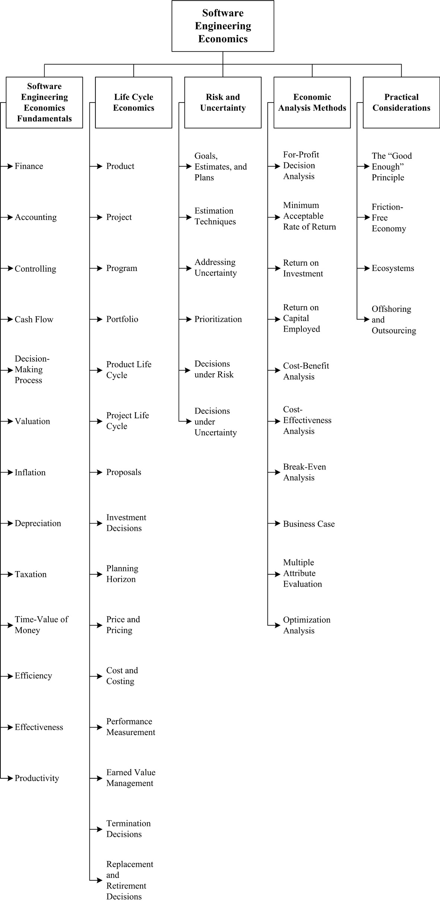

\\*\\*Breakdown Of Topics For Software Engineering Economics\\*\\*

The breakdown of topics for the Software Engineering Economics KA is shown in

Figure 12.1.

\### 1. Software Engineering Economics Fundamentals

\#### 1.1. Finance

<!-- [1\\*, c2] -->

Finance is the branch of economics concerned with issues such as allocation,

management, acquisition, and investment of resources. Finance is an element of

every organization, including software engineering organizations.

The field of finance deals with the concepts of time, money, risk, and how they

are interrelated. It also deals with how money is spent and budgeted.

Corporate finance is concerned with providing the funds for an organization’s

activities. Generally, this involves balancing risk and profitability, while

attempting to maximize an organization’s wealth and the value of its stock.

This holds primarily for “for-profit” organizations, but also applies to

“not-for-profit” organizations. The latter needs finances to ensure

sustainability, while not targeting tangible profit. To do this, an

organization must

1. identify organizational goals, time horizons, risk factors, tax

considerations, and financial constraints;

1. identify and implement the appropriate business strategy, such as which

portfolio and investment decisions to take, how to manage cash flow, and

where to get the funding;

1. measure financial performance, such as cash flow and ROI (see section 4.3,

Return on Investment), and take corrective actions in case of deviation from

objectives and strategy.

\#### 1.2. Accounting

<!-- [1\\*, c15] -->

Accounting is part of finance. It allows people whose money is being used to

run an organization to know the results of their investment: did they get the

profit they were expecting? In “for-profit” organizations, this relates to the

tangible ROI (see section 4.3, Return on Investment), while in “not-for-profit”

and governmental organizations as well as “for-profit” organizations, it

translates into sustainably staying in business. The primary role of accounting

is to measure the organization’s actual financial performance and to com-

municate financial information about a business entity to stakeholders, such as

shareholders, financial auditors, and investors. Communication is generally in

the form of financial statements that show in money terms the economic

resources to be controlled. It is important to select the right information

that is both relevant and reliable to the user. Information and its timing are

partially governed by risk management and governance policies. Accounting

systems are also a rich source of historical data for estimating.

\#### 1.3. Controlling

<!-- [1\\*, c15] -->

Controlling is an element of finance and accounting. Controlling involves

measuring and correcting the performance of finance and accounting. It

ensures that an organization’s objectives and plans are accomplished.

Controlling cost is a specialized branch of controlling used to detect vari-

ances of actual costs from planned costs.

\#### 1.4. Cash Flow

<!-- [1\\*, c3] -->

Cash flow is the movement of money into or out of a business, project, or

financial product over a given period. The concepts of cash flow instances and

cash flow streams are used to describe the business perspective of a proposal.

To make a meaningful business decision about any specific proposal, that

proposal will need to be evaluated from a business perspective. In a proposal

to develop and launch product X, the payment for new software licenses is an

example of an outgoing cash flow instance. Money would need to be spent to

carry out that proposal. The sales income from product X in the 11th month

after market launch is an example of an incoming cash flow instance. Money

would be coming in because of carrying out the proposal.

The term \\_cash flow stream\\_ refers to the set of cash flow instances over time

that are caused by carrying out some given proposal. The cash flow stream is,

in effect, the complete financial picture of that proposal. How much money goes

out? When does it go out? How much money comes in? When does it come in?

Simply, if the cash flow stream for Proposal A is more desirable than the cash

flow stream for Proposal B, then - all other things being equal - the organization

is better off carrying out Proposal A than Proposal B. Thus, the cash flow

stream is an important input for investment decision-making. A cash flow

instance is a specific amount of money flowing into or out of the organization

at a specific time as a direct result of some activity.

A cash flow diagram is a picture of a cash flow stream. It gives the reader a

quick overview of the financial picture of the subject organization or project.

Figure 12.2 shows an example of a cash flow diagram for a proposal.

\#### 1.5. Decision-Making Process

<!-- [1\\*, c2, c4] -->

If we assume that candidate solutions solve a given technical problem equally

well, why should the organization care which one is chosen? The answer is that

there is usually a large difference in the costs and incomes from the

different solutions. A commercial, off-the-shelf, object-request broker

product might cost a few thousand dollars, but the effort to develop a

homegrown service that gives the same functionality could easily cost several

hundred times that amount.

If the candidate solutions all adequately solve the problem from a technical

perspective, then the selection of the most appropriate alternative should be

based on commercial factors such as optimizing total cost of ownership (TCO) or

maximizing the short-term return on investment (ROI). Life cycle costs such as

defect correction, field service, and support duration are also relevant

considerations. These costs need to be factored in when selecting among

acceptable technical approaches, as they are part of the lifetime ROI (see

section 4.3, Return on Investment).

A systematic process for making decisions will achieve transparency and allow

later justification. Governance criteria in many organizations demand selection

from at least two alternatives. A systematic process is shown in Figure 12.3.

It starts with a business challenge at hand and describes the steps to identify

alternative solutions, define selection criteria, evaluate the solutions,

implement one selected solution, and monitor the performance of that solution.

Figure 12.3 shows the process as mostly stepwise and serial. The real process

is more fluid. Sometimes the steps can be done in a different order and often

several of the steps can be done in parallel. The important thing is to be sure

that

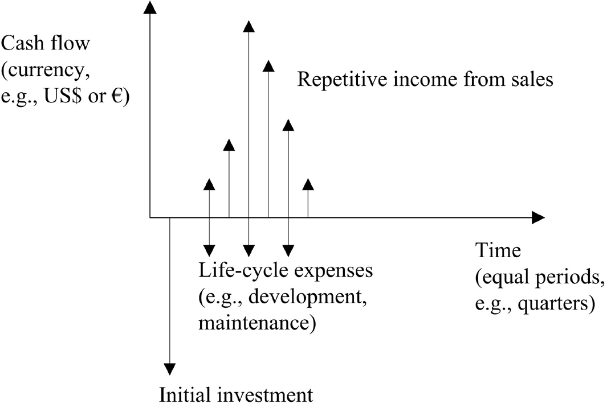

none of the steps are skipped or curtailed. It’s also important to understand

that this same process applies at all levels of decision making: from a

decision as big as determining whether a software project should be done at

all, to a deciding on an algorithm or data structure to use in a software

module. The difference is how financially significant the decision is and,

therefore, how much effort should be invested in making that decision. The

project-level decision is financially significant and probably warrants a

relatively high level of effort to make the decision. Selecting an algorithm is

often much less financially significant and warrants a much lower level of

effort to make the decision, even though the same basic decision-making process

is being used.

More often than not, an organization could carry out more than one proposal if

it wanted to, and usually there are important relationships among proposals.

Maybe Proposal Y can only be carried out if Proposal X is also carried out. Or

maybe Proposal P cannot be carried out if Proposal Q is carried out, nor

could Q be carried out if P were. Choices are much easier to make when there

are mutually exclusive paths - for example, either A or B or C or whatever is

chosen. In preparing decisions, it is recommended to turn any given set of

proposals, along with their various interrelationships, into a set of mutually

exclusive alternatives. The choice can then be made among these alternatives.

\#### 1.6. Valuation

<!-- [1\\*, c5, c8] -->

In an abstract sense, the decision-making process - be it financial decision

making or other - is about maximizing value. The alternative that maximizes

total value should always be chosen. A financial basis for value-based

comparison is comparing two or more cash flows. Several bases of comparison are

available, including

1. present worth
1. future worth
1. annual equivalent
1. internal rate of return
1. (discounted) payback period.

Based on the time-value of money, two or more cash flows are equivalent only

when they equal the same amount of money at a common point in time. Comparing

cash flows only makes sense when they are expressed in the same time frame.

Note that value can’t always be expressed in terms of money. For example,

whether an item is a brand name or not can significantly affect its perceived

value. Relevant values that can’t be expressed in terms of money still need to

be expressed in similar terms so that they can be evaluated objectively.

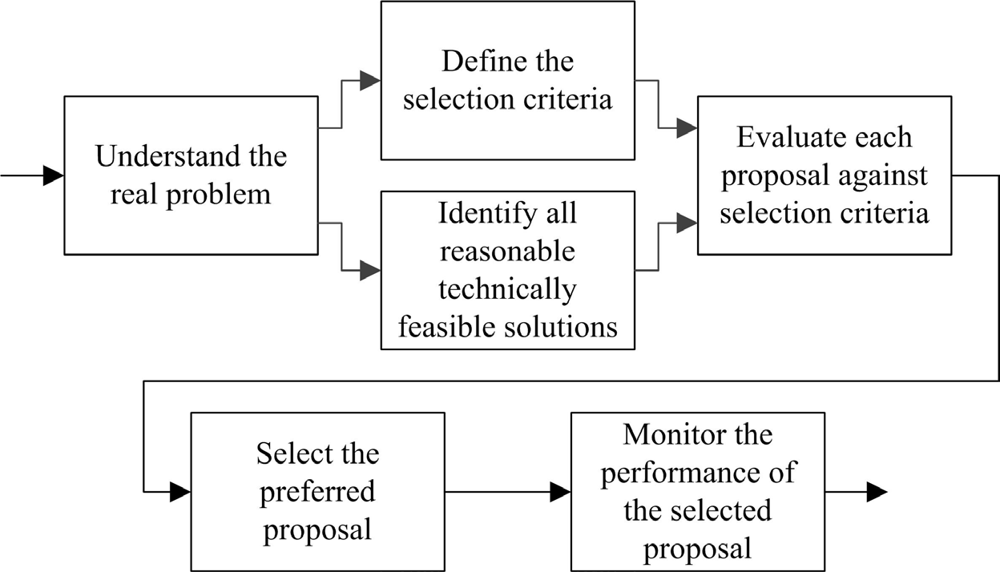

\#### 1.7. Inflation

<!-- [1\\*, c13] -->

Inflation describes long-term trends in prices. Inflation means that the same

things cost more than they did before. If the planning horizon of a business

decision is longer than a few years, or if the inflation rate is over a couple

of percentage points annually, it can cause noticeable changes in the value of

a proposal. The present time value therefore needs to be adjusted for inflation

rates and also for exchange rate fluctuations.

\#### 1.8. Depreciation

<!-- [1\\*, c14] -->

Depreciation involves spreading the cost of a tangible asset across a number of

time periods; it is used to determine how investments in capitalized assets

are charged against income over several years. Depreciation is an important

part of determining after-tax cash flow, which is critical for accurately

addressing profit and taxes. If a software product is to be sold after the

development costs are incurred, those costs should be capitalized and

depreciated over subsequent time periods. The depreciation expense for each

time period is the capitalized cost of developing the software divided across

the number of periods in which the software will be sold. A software project

proposal may be compared to other software and nonsoftware proposals or to

alternative investment options, so it is important to determine how those

other proposals would be depreciated and how profits would be estimated.

\#### 1.9. Taxation

<!-- [1\\*, c16, c17] -->

Governments charge taxes in order to finance expenses that society needs but

that no single organization would invest in. Companies have to pay income

taxes, which can take a substantial portion of a corporation’s gross profit. A

decision analysis that does not account for taxation can lead to the wrong

choice. A proposal with a high pretax profit won’t look nearly as profitable in

posttax terms. Not accounting for taxation can also lead to unrealistically

high expectations about how profitable a proposed product might be.

\#### 1.10. Time-Value of Money

<!-- [1\\*, c5, c11] -->

One of the most fundamental concepts in finance - and therefore, in business

decisions - is that money has time-value: its value changes over time. A

specific amount of money right now almost always has a different value than the

same amount of money at some other time. This concept has been around since

the earliest recorded human history and is commonly known as time-value. In

order to compare proposals or portfolio elements, they should be normalized

in cost, value, and risk to the net present value. Currency exchange variations

over time need to be taken into account based on historical data. This is

particularly important in cross-border developments of all kinds.

\#### 1.11. Efficiency

<!-- [2\\*, c1] -->

Economic efficiency of a process, activity, or task is the ratio of resources

actually consumed to resources expected to be consumed or desired to be

consumed in accomplishing the process, activity, or task. Efficiency means

“doing things right.” An efficient behavior, like an effective behavior,

delivers results - but keeps the necessary effort to a minimum. Factors that may

affect efficiency in software engineering include product complexity, quality

requirements, time pressure, process capability, team distribution, interrupts,

feature churn, tools, and programming language.

\#### 1.12. Effectiveness

<!-- [2\\*, c1] -->

Effectiveness is about having impact. It is the relationship between achieved

objectives to defined objectives. Effectiveness means “doing the right things.”

Effectiveness looks only at whether defined objectives are reached—not at how

they are reached.

\#### 1.13. Productivity

<!-- [2\\*, c23] -->

Productivity is the ratio of output over input from an economic perspective.

Output is the value delivered. Input covers all resources (e.g., effort) spent

to generate the output. Productivity combines efficiency and effectiveness

from a valueoriented perspective: maximizing productivity is about generating

highest value with lowest resource consumption.

\### 2. Life Cycle Economics

\#### 2.1. Product

<!-- [2\\*, c22] [3\\*, c6] -->

A product is an economic good (or output) that is created in a process that

transforms product factors (or inputs) to an output. When sold, a product

is a deliverable that creates both a value and an experience for its users. A

product can be a combination of systems, solutions, materials, and services

delivered internally (e.g., in-house IT solution) or externally (e.g., software

application), either as-is or as a component for another product (e.g.,

embedded software).

\#### 2.2. Project

<!-- [2\\*, c22] [3\\*, c1] -->

A project is “a temporary endeavor undertaken to create a unique product,

service, or result”.^1 In software engineering, different project types are

distinguished (e.g., product development, outsourced services, software

maintenance, service creation, and so on). During its life cycle, a software

product may require many projects. For example, during the product conception

phase, a project might be conducted to determine the customer need and market

requirements; during maintenance, a project might be conducted to produce a

next version of a product.

\#### 2.3. Program

A program is “a group of related projects, subprograms, and program

activities managed in a coordinated way to obtain benefits not available

<!-- FIXME: footnote -->

1. Project Management Institute, Inc., \\_PMI Lexicon of Project Management

Terms,\\_ 2012, [http://www.pmi.org/](http://www.pmi.org/)

PMBOK-Guide-and-Standards/~/media/Registered/ PMI\\_Lexicon\\_Final.ashx.

from managing them individually.”^2 Programs are often used to identify and

manage different deliveries to a single customer or market over a time horizon

of several years.

\#### 2.4. Portfolio

Portfolios are “projects, programs, subportfolios, and operations managed as a

group to achieve strategic objectives.”^3 Portfolios are used to group and then

manage simultaneously all assets within a business line or organization.

Looking to an entire portfolio makes sure that impacts of decisions are

considered, such as resource allocation to a specific project - which means

that the same resources are not available for other projects.

\#### 2.5. Product Life Cycle

<!-- [2\\*, c2] [3\\*, c2] -->

A software product life cycle (SPLC) includes all activities needed to define,

build, operate, maintain, and retire a software product or service and its

variants. The SPLC activities of “operate,” “maintain,” and “retire”

typically occur in a much longer time frame than initial software development

(the software development life cycle - SDLC - see Software Life Cycle Models in

the Software Engineering Process KA). Also the operate-maintain-retire

activities of an SPLC typically consume more total effort and other resources

than the SDLC activities (see Majority of Maintenance Costs in the Software

Maintenance KA). The value contributed by a software product or associated

services can be objectively determined during the “operate and maintain” time

frame. Software engineering economics should be concerned with all SPLC

activities, including the activities after initial product release.

\#### 2.6. Project Life Cycle

<!-- [2\\*, c2] [3\\*, c2] -->

Project life cycle activities typically involve five process groups—Initiating,

Planning, Executing, Monitoring and Controlling, and Closing [4]

<!-- FIXME: footnote -->

1. Ibid.
1. Ibid.

(see the Software Engineering Management KA). The activities within a software

project life cycle are often interleaved, overlapped, and iterated in various

ways [3\\*, c2] [5] (see the Software Engineering Process KA). For instance,

agile product development within an SPLC involves multiple iterations that

produce increments of deliverable software. An SPLC should include risk

management and synchronization with different suppliers (if any), while

providing auditable decision-making information (e.g., complying with

product liability needs or governance regulations). The software project life

cycle and the software product life cycle are interrelated; an SPLC may include

several SDLCs.

\#### 2.7. Proposals

<!-- [1\\*, c3] -->

Making a business decision begins with the notion of a \\_proposal\\_. Proposals

relate to reaching a business objective - at the project, product, or portfolio

level. A proposal is a single, separate option that is being considered, like

carrying out a particular software development project or not. Another proposal

could be to enhance an existing software component, and still another might

be to redevelop that same software from scratch. Each proposal represents a

unit of choice - either you can choose to carry out that proposal or you can

choose not to. The whole purpose of business decision-making is to figure out,

given the current business circumstances, which proposals should be carried out

and which shouldn’t.

\#### 2.8. Investment Decisions

<!-- [1\\*, c4] -->

Investors make investment decisions to spend money and resources on achieving a

target objective. Investors are either inside (e.g., finance, board) or

outside (e.g., banks) the organization. The target relates to some economic

criteria, such as achieving a high return on the investment, strengthening the

capabilities of the organization, or improving the value of the company.

Intangible aspects such as goodwill, culture, and competences should be

considered.

\#### 2.9. Planning Horizon

<!-- [1\\*, c11] -->

When an organization chooses to invest in a particular proposal, money gets

tied up in that proposal - so-called “frozen assets.” The economic impact of

frozen assets tends to start high and decreases over time. On the other hand,

operating and maintenance costs of elements associated with the proposal tend

to start low but increase over time. The total cost of the proposal—that is,

owning and operating a product—is the sum of those two costs. Early on, frozen

asset costs dominate; later, the operating and maintenance costs dominate.

There is a point in time where the sum of the costs is minimized; this is

called the minimum cost lifetime.

To properly compare a proposal with a four-year life span to a proposal with a

six-year life span, the economic effects of either cutting the six-year

proposal by two years or investing the profits from the four-year proposal for

another two years need to be addressed. The planning horizon, sometimes known

as the study period, is the consistent time frame over which proposals are

considered. Effects such as software lifetime will need to be factored into

establishing a planning horizon. Once the planning horizon is established,

several techniques are available for putting proposals with different life

spans into that planning horizon.

\#### 2.10. Price and Pricing

<!-- [1\\*, c13] -->

A price is what is paid in exchange for a good or service. Price is a

fundamental aspect of financial modeling and is one of the four Ps of the

marketing mix. The other three Ps are product, promotion, and place. Price is

the only revenue-generating element amongst the four Ps; the rest are costs.

Pricing is an element of finance and marketing. It is the process of

determining what a company will receive in exchange for its products. Pricing

factors include manufacturing cost, market placement, competition, market

condition, and quality of product. Pricing applies prices to products and

services based on factors such as fixed amount, quantity break, promotion or

sales campaign, specific vendor quote, shipment or invoice date, combination of

multiple orders, service offerings, and many others. The needs of the consumer

can be converted into demand only if the consumer has the willingness and

capacity to buy the product. Thus, pricing is very important in marketing.

Pricing is initially done during the project initiation phase and is a part

of “go” decision making.

\#### 2.11. Cost and Costing

<!-- [1\\*, c15] -->

A cost is the value of money that has been used up to produce something and,

hence, is not available for use anymore. In economics, a cost is an alter-

native that is given up as a result of a decision.

A sunk cost is the expenses before a certain time, typically used to abstract

decisions from expenses in the past, which can cause emotional hurdles in

looking forward. From a traditional economics point of view, sunk costs should

not be considered in decision making. Opportunity cost is the cost of an

alternative that must be for-gone in order to pursue another alternative.

Costing is part of finance and product management. It is the process to

determine the cost based on expenses (e.g., production, software

engineering, distribution, rework) and on the target cost to be competitive

and successful in a market. The target cost can be below the actual

estimated cost. The planning and controlling of these costs (called \\_cost

management\\_ ) is important and should always be included in costing.

An important concept in costing is the total cost of ownership (TCO). This

holds especially for software, because there are many not-so-obvious costs

related to SPLC activities after initial product development. TCO for a

software product is defined as the total cost for acquiring, activating, and

keeping that product running. These costs can be grouped as direct and indirect

costs. TCO is an accounting method that is crucial in making sound economic

decisions.

\#### 2.12. Performance Measurement

<!-- [3\\*, c7, c8] -->

Performance measurement is the process whereby an organization establishes and

measures the parameters used to determine whether programs, investments, and

acquisitions are achieving the desired results. It is used to evaluate whether

performance objectives are actually achieved; to control budgets, resources,

progress, and decisions; and to improve performance.

\#### 2.13. Earned Value Management

<!-- [3\\*, c8] -->

Earned value management (EVM) is a project management technique for measuring

progress based on created value. At a given moment, the results achieved to

date in a project are compared with the projected budget and the planned

schedule progress for that date. Progress relates already-consumed resources

and achieved results at a given point in time with the respective planned

values for the same date. It helps to identify possible performance problems at

an early stage. A key principle in EVM is tracking cost and schedule variances

via comparison of planned versus actual schedule and budget versus actual cost.

EVM tracking gives much earlier visibility to deviations and thus permits

corrections earlier than classic cost and schedule tracking that only looks at

delivered documents and products.

\#### 2.14. Termination Decisions

<!-- [1\\*, c11, c12] [2\\*, c9] -->

Termination means to end a project or product. Termination can be preplanned

for the end of a long product lifetime (e.g., when foreseeing that a product

will reach its lifetime) or can come rather spontaneously during product

development (e.g., when project performance targets are not achieved). In

both cases, the decision should be carefully prepared, considering always

the alternatives of continuing versus terminating. Costs of different

alternatives must be estimated - covering topics such as replacement,

information collection, suppliers, alternatives, assets, and utilizing

resources for other opportunities. Sunk costs should not be considered in

such decision making because they have been spent and will not reappear

as a value.

\#### 2.15. Replacement and Retirement Decisions

<!-- [1\\*, c12] [2\\*, c9] -->

A replacement decision is made when an organization already has a particular

asset and they are considering replacing it with something else; for example,

deciding between maintaining and supporting a legacy software product or

redeveloping it from the ground up. Replacement decisions use the same business

decision process as described above, but there are additional challenges: sunk

cost and salvage value. Retirement decisions are also about getting out of an

activity altogether, such as when a software company considers not selling a

software product anymore or a hardware manufacturer considers not building and

selling a particular model of computer any longer. Retirement decision can be

influenced by lock-in factors such as technology dependency and high exit

costs.

\### 3. Risk and Uncertainty

\#### 3.1. Goals, Estimates, and Plans

<!-- [3\\*, c6] -->

Goals in software engineering economics are mostly business goals (or business

objectives).

A business goal relates business needs (such as increasing profitability) to

investing resources (such as starting a project or launching a product with a

given budget, content, and timing). Goals apply to operational planning (for

instance, to reach a certain milestone at a given date or to extend software

testing by some time to achieve a desired quality level—see Key Issues in the

Software Testing KA) and to the strategic level (such as reaching a certain

profitability or market share in a stated time period).

An estimate is a well-founded evaluation of resources and time that will be

needed to achieve stated goals (see Effort, Schedule, and Cost Estimation in

the Software Engineering Management KA and Maintenance Cost Estimation in the

Software Maintenance KA). A software estimate is used to determine whether

the project goals can be achieved within the constraints on schedule, budget,

features, and quality attributes. Estimates are typically internally generated

and are not necessarily visible externally. Estimates should not be driven

exclusively by the project goals because this could make an estimate overly

optimistic. Estimation is a periodic activity; estimates should be

continually revised during a project.

A plan describes the activities and milestones that are necessary in order to

reach the goals of

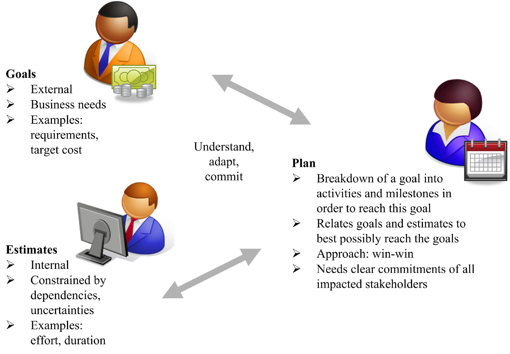

a project (see Software Project Planning in the Software Engineering Management

KA). The plan should be in line with the goal and the estimate, which is not

necessarily easy and obvious - such as when a software project with given

requirements would take longer than the target date foreseen by the client. In

such cases, plans demand a review of initial goals as well as estimates and

the underlying uncertainties and inaccuracies. Creative solutions with the

underlying rationale of achieving a win-win position are applied to resolve

conflicts.

To be of value, planning should involve consideration of the project

constraints and commitments to stakeholders. Figure 12.4 shows how goals are

initially defined. Estimates are done based on the initial goals. The plan

tries to match the goals and the estimates. This is an iterative process,

because an initial estimate typically does not meet the initial goals.

\#### 3.2. Estimation Techniques

<!-- [3\\*, c6] -->

Estimations are used to analyze and forecast the resources or time necessary to

implement requirements (see Effort, Schedule, and Cost Estimation in the

Software Engineering Management KA and Maintenance Cost Estimation in the

Software Maintenance KA). Five families of estimation techniques exist:

1. Expert judgment
1. Analogy
1. Estimation by parts
1. Parametric methods
1. Statistical methods.

No single estimation technique is perfect, so using multiple estimation

technique is useful. Convergence among the estimates produced by different

techniques indicates that the estimates are probably accurate. Spread among the

estimates indicates that certain factors might have been overlooked. Finding

the factors that caused the spread and then reestimating again to produce

results that converge could lead to a better estimate.

\#### 3.3. Addressing Uncertainty

<!-- [3\\*, c6] -->

Because of the many unknown factors during project initiation and planning,

estimates are inherently uncertain; that uncertainty should be addressed in

business decisions. Techniques for addressing uncertainty include

1. consider ranges of estimates
1. analyze sensitivity to changes of assumptions
1. delay final decisions.

\#### 3.4. Prioritization

<!-- [3\\*, c6] -->

Prioritization involves ranking alternatives based on common criteria to

deliver the best possible value. In software engineering projects, software

requirements are often prioritized in order to deliver the most value to the

client within constraints of schedule, budget, resources, and technology,

or to provide for building product increments, where the first increments

provide the highest value to the customer (see Requirements Classification and

Requirements Negotiation in the Software Requirements KA and Software Life

Cycle Models in the Software Engineering Process KA).

\#### 3.5. Decisions under Risk

<!-- [1\\*, c24] [3\\*, c9] -->

Decisions under risk techniques are used when the decision maker can assign

probabilities to the different possible outcomes (see Risk Management in the

Software Engineering Management KA). The specific techniques include

1. expected value decision making
1. expectation variance and decision making
1. Monte Carlo analysis
1. decision trees
1. expected value of perfect information.

\#### 3.6. Decisions under Uncertainty

<!-- [1\\*, c25] [3\\*, c9] -->

Decisions under uncertainty techniques are used when the decision maker cannot

assign probabilities to the different possible outcomes because needed

information is not available (see Risk Management in the Software Engineering

Management KA). Specific techniques include

1. Laplace Rule
1. Maximin Rule
1. Maximax Rule
1. Hurwicz Rule
1. Minimax Regret Rule.

\### 4. Economic Analysis Methods

\#### 4.1. For-Profit Decision Analysis

<!-- [1\\*, c10] -->

Figure 12.5 describes a process for identifying the best alternative from a set

of mutually exclusive alternatives. Decision criteria depend on the business

objectives and typically include ROI (see section 4.3, Return on Investment) or

Return on Capital Employed (ROCE) (see section 4.4, Return on Capital

Employed).

For-profit decision techniques don’t apply for government and nonprofit

organizations. In these cases, organizations have different goals—which means

that a different set of decision techniques are needed, such as cost-benefit or

cost-effectiveness analysis.

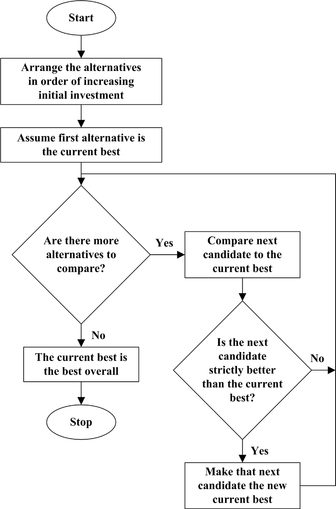

\#### 4.2. Minimum Acceptable Rate of Return

<!-- [1\\*, c10] -->

The minimum acceptable rate of return (MARR) is the lowest internal rate of

return the organization would consider to be a good investment. Generally

speaking, it wouldn’t be smart to invest in an activity with a return of 10%

when there’s another activity that’s known to return 20%. The MARR is a

statement that an organization is confident it can achieve at least that rate

of return. The MARR represents the organization’s opportunity cost for

investments. By choosing to invest in some activity, the organization is

explicitly deciding to not invest that same money somewhere else. If the

organization is already confident it can get some known rate of return, other

alternatives should be chosen only if their rate of return is at least that

high. A simple way to account for that opportunity cost is to use the MARR as

the interest rate in business decisions. An alternative’s present worth

evaluated at the MARR shows how much more or less (in present-day cash terms)

that alternative is worth than investing at the MARR.

\#### 4.3. Return on Investment

<!-- [1\\*, c10] -->

Return on investment (ROI) is a measure of the profitability of a company or

business unit. It is defined as the ratio of money gained or lost (whether

realized or unrealized) on an investment relative to the amount of money

invested. The purpose of ROI varies and includes, for instance, providing a

rationale for future investments and acquisition decisions.

\#### 4.4. Return on Capital Employed

The return on capital employed (ROCE) is a measure of the profitability of a

company or business unit. It is defined as the ratio of a gross profit before

taxes and interest (EBIT) to the total assets minus current liabilities. It

describes the return on the used capital.

\#### 4.5. Cost-Benefit Analysis

<!-- [1\\*, c18] -->

Cost-benefit analysis is one of the most widely used methods for evaluating

individual proposals. Any proposal with a benefit-cost ratio of less than 1.0

can usually be rejected without further analysis because it would cost more

than the benefit. Proposals with a higher ratio need to consider the

associated risk of an investment and compare the benefits with the option of

investing the money at a guaranteed interest rate (see section 4.2, Minimum

Acceptable Rate of Return).

\#### 4.6. Cost-Effectiveness Analysis

<!-- [1\\*, c18] -->

Cost-effectiveness analysis is similar to costbenefit analysis. There are two

versions of cost-effectiveness analysis: the fixed-cost version maximizes the

benefit given some upper bound on cost; the fixed-effectiveness version

minimizes the cost needed to achieve a fixed goal.

\#### 4.7. Break-Even Analysis

<!-- [1\\*, c19] -->

Break-even analysis identifies the point where the costs of developing a

product and the revenue to be generated are equal. Such an analysis can be used

to choose between different proposals at different estimated costs and revenue.

Given estimated costs and revenue of two or more proposals, break-even

analysis helps in choosing among them.

\#### 4.8. Business Case

<!-- [1\\*, c3] -->

The business case is the consolidated information summarizing and explaining a

business proposal from different perspectives for a decision maker (cost,

benefit, risk, and so on). It is often used to assess the potential value of a

product, which can be used as a basis in the investment decision-making

process. As opposed to a mere profit-loss calculation, the business case is a

“case” of plans and analyses that is owned by the product manager and used in

support of achieving the business objectives.

\#### 4.9. Multiple Attribute Evaluation

<!-- [1\\*, c26] -->

The topics discussed so far are used to make decisions based on a single

decision criterion: money. The alternative with the best present worth, the

best ROI, and so forth is the one selected. Aside from technical feasibility,

money is almost always the most important decision criterion, but it’s not

always the only one. Quite often there are other criteria, other “attributes,”

that need to be considered, and those attributes can’t be cast in terms of

money. Multiple attribute decision techniques allow other, nonfinancial

criteria to be factored into the decision.

There are two families of multiple attribute decision techniques that differ in

how they use the attributes in the decision. One family is the “compensatory,”

or single-dimensioned, techniques. This family collapses all of the

attributes onto a single figure of merit. The family is called compensatory

because, for any given alternative, a lower score in one attribute can be

compensated by - or traded off against - a higher score in other attributes. The

compensatory techniques include

1. nondimensional scaling
1. additive weighting
1. analytic hierarchy process.

In contrast, the other family is the “noncompensatory,” or fully dimensioned,

techniques. This family does not allow tradeoffs among the attributes. Each

attribute is treated as a separate entity in the decision process. The

noncompensatory techniques include

1. dominance
1. satisficing
1. lexicography.

\#### 4.10. Optimization Analysis

<!-- [1\\*, c20] -->

The typical use of optimization analysis is to study a cost function over a

range of values to find the point where overall performance is best. Software’s

classic space-time tradeoff is an example of optimization; an algorithm that

runs faster will often use more memory. Optimization balances the value of the

faster runtime against the cost of the additional memory.

Real options analysis can be used to quantify the value of project choices,

including the value of delaying a decision. Such options are difficult to

compute with precision. However, awareness that choices have a monetary value

provides insight in the timing of decisions such as increasing project staff

or lengthening time to market to improve quality.

\### 5. Practical Considerations

\#### 5.1. The “Good Enough” Principle

<!-- [1\\*, c21] -->

Often software engineering projects and products are not precise about the

targets that should be achieved. Software requirements are stated, but the

marginal value of adding a bit more functionality cannot be measured. The

result could be late delivery or too-high cost. The “good enough” principle

relates marginal value to marginal cost and provides guidance to determine

criteria when a deliverable is “good enough” to be delivered. These criteria

depend on business objectives and on prioritization of different alternatives,

such as ranking software requirements, measurable quality attributes, or

relating schedule to product content and cost.

The RACE principle (reduce accidents and control essence) is a popular rule

towards good enough software. Accidents imply unnecessary overheads such as

gold-plating and rework due to late defect removal or too many requirements

changes. Essence is what customers pay for. Software engineering economics

provides the mechanisms to define criteria that determine when a deliverable

is “good enough” to be delivered. It also highlights that both words are

relevant: “good” and “enough.” Insufficient quality or insufficient quantity is

not good enough. Agile methods are examples of “good enough” that try to

optimize value by reducing the overhead of delayed rework and the gold

plating that results from adding features that have low marginal value for

the users (see Agile Methods in the Software Engineering Models and Methods KA

and Software Life Cycle Models in the Software Engineering Process KA). In

agile methods, detailed planning and lengthy development phases are replaced

by incremental planning and frequent delivery of small increments of a deliv-

erable product that is tested and evaluated by user representatives.

\#### 5.2. Friction-Free Economy

Economic friction is everything that keeps markets from having perfect

competition. It involves distance, cost of delivery, restrictive regulations,

and/or imperfect information. In high-friction markets, customers don’t have

many suppliers from which to choose. Having been in a business for a while or

owning a store in a good location determines the economic position. It’s hard

for new competitors to start business and compete. The marketplace moves slowly

and predictably. Friction-free markets are just the reverse. New

competitors emerge and customers are quick to respond. The marketplace is

anything but predictable. Theoretically, software and IT are friction-

free. New companies can easily create products and often do so at a much

lower cost than established companies, since they need not consider any

legacies. Marketing and sales can be done via the Internet and social

networks, and basically free distribution mechanisms can enable a ramp up

to a global business. Software engineering economics aims to provide

foundations to judge how a software business performs and how friction-free

a market actually is. For instance, competition among software app

developers is inhibited when apps must be sold through an app store and

comply with that store’s rules.

\#### 5.3. Ecosystems

An ecosystem is an environment consisting of all the mutually dependent

stakeholders, business units, and companies working in a particular area.

In a typical ecosystem, there are producers and consumers, where the consumers

add value to the consumed resources. Note that a consumer is not the end user

but an organization that uses the product to enhance it. A software ecosystem

is, for instance, a supplier of an application working with companies doing the

installation and support in different regions. Neither one could exist

without the other. Ecosystems can be permanent or temporary. Software

engineering economics provides the mechanisms to evaluate alternatives in

establishing or extending an ecosystem - for instance, assessing whether to work

with a specific distributor or have the distribution done by a company doing

service in an area.

\#### 5.4. Offshoring and Outsourcing

Offshoring means executing a business activity beyond sales and marketing

outside the home country of an enterprise. Enterprises typically either have

their offshoring branches in low-cost countries or they ask specialized

companies abroad to execute the respective activity. Offshoring should

therefore not be confused with outsourcing. Offshoring within a company is

called captive offshoring. Outsourcing is the result-oriented relationship

with a supplier who executes business activities for an enterprise when, tra-

ditionally, those activities were executed inside the enterprise. Outsourcing

is site-independent. The supplier can reside in the neighborhood of the

enterprise or offshore (outsourced offshoring). Software engineering

economics provides the basic criteria and business tools to evaluate different

sourcing mechanisms and control their performance. For instance, using an

outsourcing supplier for software development and maintenance might reduce

the cost per hour of software development, but increase the number of hours and

capital expenses due to an increased need for monitoring and communication.

(For more information on offshoring and outsourcing, see “Outsourcing” in

Management Issues in the Software Maintenance KA.)

\### Matrix of topics vs. Reference material

Tockey 2005 [1]

Sommerville 2011 [2]

Fairley 2009 [3]

\\*\\*1. Software Engineering Economics

Fundamentals\\*\\*

1\.1. Finance c2

1\.2. Accounting c15

1\.3. Controlling c15

1\.4. Cash Flow c3

1\.5. Decision-Making Process c2, c4

1\.6. Valuation c5, c8

1\.7. Inflation c13

1\.8. Depreciation c14

1\.9. Taxation c16, c17

1\.10. Time-Value of Money c5, c11

1\.11. Efficiency c1

1\.12. Effectiveness c1

1\.13. Productivity c23

\\*\\*2. Life Cycle Economics\\*\\*

2\.1. Product c22 c6

2\.2. Project c22 c1

2\.3. Program

2\.4. Portfolio

2\.5. Product Life Cycle c2 c2

2\.6. Project Life Cycle c2 c2

2\.7. Proposals c3

2\.8. Investment Decisions c4

2\.9. Planning Horizon c11

2\.10. Price and Pricing c13

1. .11. Cost and Costing c15

2\.12. Performance Measurement c7, c8

2\.13. Earned Value Management c8

2\.14. Termination Decisions c11, c12 c9

2\.15. Replacement and Retirement Decisions c12 c9

Tockey 2005 [1]

Sommerville 2011 [2]

Fairley 2009 [3]

\\*\\*3. Risk and Uncertainty\\*\\*

3\.1. Goals, Estimates, and Plans c6

3\.2. Estimation Techniques c6

3\.3. Addressing Uncertainty c6

3\.4. Prioritization c6

3\.5. Decisions under Risk c24 c9

3\.6. Decisions under Uncertainty c25 c9

\\*\\*4. Economic Analysis Methods\\*\\*

4\.1. For-Profit Decision Analysis c10

4\.2. Minimum Acceptable Rate of Return c10

4\.3. Return on Investment c10

4\.4. Return on Capital Employed

4\.5. Cost-Benefit Analysis c18

4\.6. Cost-Effectiveness Analysis c18

4\.7. Break-Even Analysis c19

4\.8. Business Case c3

4\.9. Multiple Attribute Evaluation c26

4\.10. Optimization Analysis c20

\\*\\*5. Practical Considerations\\*\\*

5\.1. The “Good Enough” Principle c21

5\.2. Friction-Free Economy

5\.3. Ecosystems

5\.4. Offshoring and Outsourcing

\\*\\*Further Readings\\*\\*

\\_A Guide to the Project Management Body of Knowledge (PMBOK® Guide)\\_ [4].

The \\_PMBOK® Guide\\_ provides guidelines for managing individual projects and

defines project management related concepts. It also describes the project

management life cycle and its related processes, as well as the project life

cycle. It is a globally recognized guide for the project management

profession.

\\_Software Extension to the Guide to the Project Management Body of Knowledge

(SWX)\\_ [5].

\\_SWX\\_ provides adaptations and extensions to the generic practices of project

management documented in the \\_PMBOK® Guide\\_ for managing software projects.

The primary contribution of this extension to the \\_PMBOK® Guide\\_ is descrip-

tion of processes that are applicable for managing adaptive life cycle software

projects.

B.W. Boehm, \\_Software Engineering Economics\\_ [6].

This book is the classic reading on software engineering economics. It provides

an overview of business thinking in software engineering. Although the examples

and figures are dated, it still is worth reading.

C. Ebert and R. Dumke, \\_Software Measurement\\_ [7].

This book provides an overview on quantitative methods in software

engineering, starting with measurement theory and proceeding to performance

management and business decision making.

D.J. Reifer, \\_Making the Software Business Case: Improvement by the Numbers\\_

[8].

This book is a classic reading on making a business case in the software and

IT businesses. Many useful examples illustrate how the business case is

formulated and quantified.

\\*\\*References\\*\\*

[1] S. Tockey, Return on Software: Maximizing the Return on Your Software

Investment, Addison-Wesley, 2004.

[2] J.H. Allen et al., Software Security Engineering: A Guide for Project

Managers, Addison-Wesley, 2008.

[3] R.E. Fairley, Managing and Leading Software Projects, Wiley-IEEE Computer

Society Press, 2009.

[4] Project Management Institute, A Guide to the Project Management Body of

Knowledge (PMBOK(R) Guide), 5th ed., Project Management Institute, 2013.

[5] Project Management Institute and IEEE Computer Society, Software Extension

to the PMBOK® Guide Fifth Edition, ed: Project Management Institute, 2013.

[6] B.W. Boehm, Software Engineering Economics, Prentice-Hall, 1981.

[7] C. Ebert and R. Dumke, Software Measurement, Springer, 2007.

[8] D.J. Reifer, Making the Software Business Case: Improvement by the Numbers

, Addison Wesley, 2002.

\## Chapter 13: Computing Foundations

\\*\\*Acronyms\\*\\*

- AOP Aspect-Oriented Programming
- ALU Arithmetic and Logic Unit
- API Application Programming Interface
- ATM Asynchronous Transfer Mode
- B/S Browser-Server
- CERT Computer Emergency Response Team
- COTS Commercial Off-The-Shelf
- CRUD Create, Read, Update, Delete C/S Client-Server
- CS Computer Science
- DBMS Database Management System
- FPU Float Point Unit
- I/O Input and Output
- ISA Instruction Set Architecture
- ISO International Organization for Standardization
- ISP Internet Service Provider
- LAN Local Area Network
- MUX Multiplexer
- NIC Network Interface Card
- OOP Object-Oriented Programming
- OS Operating System
- OSI Open Systems Interconnection
- PC Personal Computer
- PDA Personal Digital Assistant
- PPP Point-to-Point Protocol
- RFID Radio Frequency Identification
- RAM Random Access Memory
- ROM Read Only Memory
- SCSI Small Computer System Interface
- SQL Structured Query Language
- TCP Transport Control Protocol
- UDP User Datagram Protocol
- VPN Virtual Private Network
- WAN Wide Area Network

\\*\\*Introduction\\*\\*

The scope of the Computing Foundations knowledge area (KA) encompasses the

development and operational environment in which software evolves and executes.

Because no software can exist in a vacuum or run without a computer, the core

of such an environment is the computer and its various components. Knowledge

about the computer and its underlying principles of hardware and software

serves as a framework on which software engineering is anchored. Thus, all

software engineers must have good understanding of the Computing Foundations

KA.

It is generally accepted that software engineering builds on top of computer

science. For example, “Software Engineering 2004: Curriculum Guidelines for

Undergraduate Degree Programs in Software Engineering” [1] clearly states, “One

particularly important aspect is that software engineering builds on computer

science and mathematics” (italics added).

Steve Tockey wrote in his book Return on Software:

\> Both computer science and software engineering deal with computers,

\> computing, and software. The science of computing, as a body of knowledge, is

\> at the core of both.

\> ...Software engineering is concerned with the application of computers,

\> computing, and software to practical purposes, specifically the design,

\> construction, and operation of efficient and economical software systems.

Thus, at the core of software engineering is an understanding of computer

science.

While few people will deny the role computer science plays in the development

of software engineering both as a discipline and as a body of knowledge, the

importance of computer science to software engineering cannot be

overemphasized; thus, this Computing Foundations KA is being written.

The majority of topics discussed in the Computing Foundations KA are also

topics of discussion in basic courses given in computer science undergraduate

and graduate programs. Such courses include programming, data structure,

algorithms, computer organization, operating systems, compilers, databases,

networking, distributed systems, and so forth. Thus, when breaking down

topics, it can be tempting to decompose the Computing Foundations KA according

to these often-found divisions in relevant courses.

However, a purely course-based division of topics suffers serious drawbacks.

For one, not all courses in computer science are related or equally important

to software engineering. Thus, some topics that would otherwise be covered in a

computer science course are not covered in this KA. For example, computer

graphics - while an important course in a computer science degree program - is

not included in this KA.

Second, some topics discussed in this guideline do not exist as standalone

courses in undergraduate or graduate computer science programs. Consequently,

such topics may not be adequately covered in a purely course-based breakdown.

For example, abstraction is a topic incorporated into several different

computer science courses; it is unclear which course abstraction should belong

to in a course-based breakdown of topics.

The Computing Foundations KA is divided into seventeen different topics. A

topic’s direct usefulness to software engineers is the criterion used for

selecting topics for inclusion in this KA (see Figure 13.1). The advantage of

this topic-based breakdown is its foundation on the belief that Computing

Foundations - if it is to be grasped firmly - must be considered as a

collection of logically connected topics undergirding software engineering in

general and software construction in particular.

The Computing Foundations KA is related closely to the Software Design,

Software Construction, Software Testing, Software Maintenance, Software

Quality, and Mathematical Foundations KAs.

\\*\\*Breakdown Of Topics For Computing Foundations\\*\\*

The breakdown of topics for the Computing Foundations KA is shown in Figure 13.1.

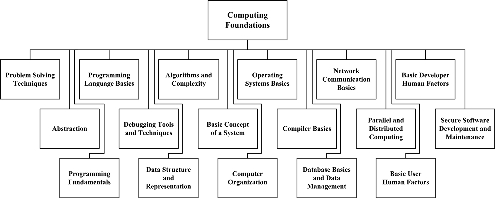

\### 1. Problem Solving Techniques

<!-- [2\\*, s3.2, c4] [3\\*, c5] -->

The concepts, notions, and terminology introduced here form an underlying basis

for understanding the role and scope of problem solving techniques.

\#### 1.1. Definition of Problem Solving

Problem solving refers to the thinking and activities conducted to answer or

derive a solution to a problem. There are many ways to approach a problem, and

each way employs different tools and uses different processes. These different

ways of approaching problems gradually expand and define themselves and finally

give rise to different disciplines. For example, software engineering

focuses on solving problems using computers and software.

While different problems warrant different solutions and may require different

tools and processes, the methodology and techniques used in solving problems do

follow some guidelines and can often be generalized as problem solving

techniques. For example, a general guideline for solving a generic engineering

problem is to use the three-step process given below [2].

- Formulate the real problem.
- Analyze the problem.
- Design a solution search strategy.

\#### 1.2. Formulating the Real Problem

Gerard Voland writes, “It is important to recognize that a specific problem

should be formulated if one is to develop a specific solution” [2]. This

formulation is called the problem statement, which explicitly specifies what

both the problem and the desired outcome are.

Although there is no universal way of stating a problem, in general a problem

should be expressed in such a way as to facilitate the development of

solutions. Some general techniques to help one formulate the real problem

include statement-restatement, determining the source and the cause, revising

the statement, analyzing present and desired state, and using the fresh eye

approach.

\#### 1.3. Analyze the Problem

Once the problem statement is available, the next step is to analyze the

problem statement or situation to help structure our search for a solution.

Four types of analysis include situation analysis, in which the most urgent or

critical aspects of a situation are identified first; problem analysis, in

which the cause of the problem must be determined; decision analysis, in

which the action(s) needed to correct the problem or eliminate its cause must

be determined; and potential problem analysis, in which the action(s) needed to

prevent any reoccurrences of the problem or the development of new problems

must be determined.

\#### 1.4. Design a Solution Search Strategy

Once the problem analysis is complete, we can focus on structuring a search

strategy to find the solution. In order to find the “best” solution (here,

“best” could mean different things to different people, such as faster,

cheaper, more usable, different capabilities, etc.), we need to eliminate

paths that do not lead to viable solutions, design tasks in a way that provides

the most guidance in searching for a solution, and use various attributes of

the final solution state to guide our choices in the problem solving process.

\#### 1.5. Problem Solving Using Programs

The uniqueness of computer software gives problem solving a flavor that is

distinct from general engineering problem solving. To solve a problem using

computers, we must answer the following questions.

- How do we figure out what to tell the computer to do?
- How do we convert the problem statement into an algorithm?
- How do we convert the algorithm into machine instructions?

The first task in solving a problem using a computer is to determine what to

tell the computer to do. There may be many ways to tell the story, but all

should take the perspective of a computer such that the computer can eventually

solve the problem. In general, a problem should be expressed in such a way as

to facilitate the development of algorithms and data structures for solving it.

The result of the first task is a problem statement. The next step is to

convert the problem statement into algorithms that solve the problem. Once an

algorithm is found, the final step converts the algorithm into machine

instructions that form the final solution: software that solves the problem.

Abstractly speaking, problem solving using a computer can be considered as a

process of problem transformation - in other words, the step-by-step

transformation of a problem statement into a problem solution. To the

discipline of software engineering, the ultimate objective of problem solving

is to transform a problem expressed in natural language into electrons running

around a circuit. In general, this transformation can be broken into three

phases:

1. Development of algorithms from the problem statement.
1. Application of algorithms to the problem.

c) Transformation of algorithms to program code.

The conversion of a problem statement into algorithms and algorithms into

program codes usually follows a “stepwise refinement” (a.k.a. systematic

decomposition) in which we start with a problem statement, rewrite it as a

task, and recursively decompose the task into a few simpler subtasks until the

task is so simple that solutions to it are straightforward. There are three

basic ways of decomposing: sequential, conditional, and iterative.

\### 2. Abstraction

<!-- [3\\*, s5.2–5.4] -->

Abstraction is an indispensible technique associated with problem solving. It

refers to both the process and result of generalization by reducing the

information of a concept, a problem, or an observable phenomenon so that one

can focus on the “big picture.” One of the most important skills in any

engineering undertaking is framing the levels of abstraction appropriately.

“Through abstraction,” according to Voland, “we view the problem and its

possible solution paths from a higher level of conceptual understanding. As a

result, we may become better prepared to recognize possible relationships

between different aspects of the problem and thereby generate more creative

design solutions” [2]. This is particularly true in computer science in general

(such as hardware vs. software) and in software engineering in particular (data

structure vs. data flow, and so forth).

\#### 2.1. Levels of Abstraction

When abstracting, we concentrate on one “level” of the big picture at a time

with confidence that we can then connect effectively with levels above and

below. Although we focus on one level, abstraction does not mean knowing

nothing about the neighboring levels. Abstraction levels do not necessarily

correspond to discrete components in reality or in the problem domain, but to

well-defined standard interfaces such as programming APIs. The advantages that

standard interfaces provide include portability, easier software/hardware

integration and wider usage.

\#### 2.2. Encapsulation

Encapsulation is a mechanism used to implement abstraction. When we are

dealing with one level of abstraction, the information concerning the levels

below and above that level is encapsulated. This information can be the

concept, problem, or observable phenomenon; or it may be the permissible

operations on these relevant entities. Encapsulation usually comes with some

degree of information hiding in which some or all of the underlying details are

hidden from the level above the interface provided by the abstraction. To an

object, information hiding means we don’t need to know the details of how the

object is represented or how the operations on those objects are implemented.

\#### 2.3. Hierarchy

When we use abstraction in our problem formulation and solution, we may use

different abstractions at different times - in other words, we work on dif-

ferent levels of abstraction as the situation calls. Most of the time, these

different levels of abstraction are organized in a hierarchy. There are many

ways to structure a particular hierarchy and the criteria used in determining

the specific content of each layer in the hierarchy varies depending on the

individuals performing the work.

Sometimes, a hierarchy of abstraction is sequential, which means that each

layer has one and only one predecessor (lower) layer and one and only one

successor (upper) layer - except the upmost layer (which has no successor) and

the bottommost layer (which has no predecessor). Sometimes, however, the

hierarchy is organized in a tree-like structure, which means each layer can

have more than one predecessor layer but only one successor layer.

Occasionally, a hierarchy can have a many-to-many structure, in which each

layer can have multiple predecessors and successors. At no time, shall there be

any loop in a hierarchy.

A hierarchy often forms naturally in task decomposition. Often, a task

analysis can be decomposed in a hierarchical fashion, starting with the larger

tasks and goals of the organization and breaking each of them down into smaller

subtasks that can again be further subdivided This continuous division of

tasks into smaller ones would produce a hierarchical structure of

tasks-subtasks.

\#### 2.4. Alternate Abstractions

Sometimes it is useful to have multiple alternate abstractions for the same

problem so that one can keep different perspectives in mind. For example, we

can have a class diagram, a state chart, and a sequence diagram for the same

software at the same level of abstraction. These alternate abstractions do not

form a hierarchy but rather complement each other in helping understanding the

problem and its solution. Though beneficial, it is as times difficult to keep

alternate abstractions in sync.

\### 3. Programming Fundamentals

<!-- [3\\*, c6–19] -->

Programming is composed of the methodologies or activities for creating

computer programs that perform a desired function. It is an indispensible part

in software construction. In general, programming can be considered as the

process of designing, writing, testing, debugging, and maintaining the source

code. This source code is written in a programming language.

The process of writing source code often requires expertise in many different

subject areas - including knowledge of the application domain, appropriate data

structures, specialized algorithms, various language constructs, good

programming techniques, and software engineering.

\#### 3.1. The Programming Process

Programming involves design, writing, testing, debugging, and maintenance.

Design is the conception or invention of a scheme for turning a customer

requirement for computer software into operational software. It is the activity

that links application requirements to coding and debugging. Writing is the

actual coding of the design in an appropriate programming language. Testing is

the activity to verify that the code one writes actually does what it is

supposed to do. Debugging is the activity to find and fix bugs (faults) in

the source code (or design). Maintenance is the activity to update, correct,

and enhance existing programs. Each of these activities is a huge topic and

often warrants the explanation of an entire KA in the SWEBOK Guide and many

books.

\#### 3.2. Programming Paradigms

Programming is highly creative and thus somewhat personal. Different people

often write different programs for the same requirements. This diversity of

programming causes much difficulty in the construction and maintenance of large

complex software. Various programming paradigms have been developed over the

years to put some standardization into this highly creative and personal

activity. When one programs, he or she can use one of several programming

paradigms to write the code. The major types of programming paradigms are

discussed below.

\\_Unstructured Programming\\_: In unstructured programming, a programmer follows

his/her hunch to write the code in whatever way he/she likes as long as the

function is operational. Often, the practice is to write code to fulfill a

specific utility without regard to anything else. Programs written this way

exhibit no particular structure— thus the name “unstructured programming.”

Unstructured programming is also sometimes called ad hoc programming.

\\_Structured/Procedural/Imperative Programming:\\_ A hallmark of structured

programming is the use of well-defined control structures, including

procedures (and/or functions) with each procedure (or function) performing a

specific task. Interfaces exist between procedures to facilitate correct and

smooth calling operations of the programs. Under structured programming,

programmers often follow established protocols and rules of thumb when

writing code. These protocols and rules can be numerous and cover almost the

entire scope of programming - ranging from the simplest issue (such as how to

name variables, functions, procedures, and so forth) to more complex issues

(such as how to structure an interface, how to handle exceptions, and so

forth).

\\_Object-Oriented Programming:\\_ While procedural programming organizes

programs around procedures, object-oriented programming (OOP) organize a

program around objects, which are abstract data structures that combine both

data and methods used to access or manipulate the data. The primary features of

OOP are that objects representing various abstract and concrete entities are

created and these objects interact with each other to collectively fulfill the

desired functions.

\\_Aspect-Oriented Programming:\\_ Aspect-oriented programming (AOP) is a

programming paradigm that is built on top of OOP. AOP aims to isolate secondary

or supporting functions from the main program’s business logic by focusing on

the cross sections (concerns) of the objects. The primary motivation for AOP is

to resolve the object tangling and scattering associated with OOP, in which the

interactions among objects become very complex. The essence of AOP is the

greatly emphasized separation of concerns, which separates noncore functional

concerns or logic into various aspects.

\\_Functional Programming\\_ : Though less popular, functional programming is as

viable as the other paradigms in solving programming problems. In functional

programming, all computations are treated as the evaluation of mathematical

functions. In contrast to the imperative programming that emphasizes changes in

state, functional programming emphasizes the application of functions, avoids

state and mutable data, and provides referential transparency.

\### 4. Programming Language Basics

<!-- [4\\*, c6] -->

Using computers to solve problems involves programming—which is writing and

organizing instructions telling the computer what to do at each step.

Programs must be written in some programming language with which and through

which we describe necessary computations. In other words, we use the facilities

provided by a programming language to describe problems, develop algorithms,

and reason about problem solutions. To write any program, one must understand

at least one programming language.

\#### 4.1. Programming Language Overview

A programming language is designed to express computations that can be

performed by a computer. In a practical sense, a programming language is a

notation for writing programs and thus should be able to express most data

structures and algorithms. Some, but not all, people restrict the term

“programming language” to those languages that can express all possible

algorithms.

Not all languages have the same importance and popularity. The most popular

ones are often defined by a specification document established by a well-known

and respected organization. For example, the C programming language is speci-

fied by an ISO standard named ISO/IEC 9899. Other languages, such as Perl and

Python, do not enjoy such treatment and often have a dominant implementation

that is used as a reference.

\#### 4.2. Syntax and Semantics of Programming Languages

Just like natural languages, many programming languages have some form of

written specification of their syntax (form) and semantics (meaning). Such

specifications include, for example, specific requirements for the definition

of variables and constants (in other words, declaration and types) and

format requirements for the instructions themselves.

In general, a programming language supports such constructs as variables, data

types, constants, literals, assignment statements, control statements,

procedures, functions, and comments. The syntax and semantics of each construct

must be clearly specified.

\#### 4.3. Low-Level Programming Languages

Programming language can be classified into two classes: low-level languages

and high-level languages. Low-level languages can be understood by a computer

with no or minimal assistance and typically include machine languages and

assembly languages. A machine language uses ones and zeros to represent

instructions and variables, and is directly understandable by a computer. An

assembly language contains the same instructions as a machine language but the

instructions and variables have symbolic names that are easier for humans to

remember.

Assembly languages cannot be directly understood by a computer and must be

translated into a machine language by a utility program called an \\_assembler.\\_

There often exists a correspondence between the instructions of an assembly

language and a machine language, and the translation from assembly code to

machine code is straightforward. For example, “add r1, r2, r3” is an assem-

bly instruction for adding the content of register r2 and r3 and storing the

sum into register r1. This instruction can be easily translated into machine

code “0001 0001 0010 0011\\*\\*.\\*\\* ” (Assume the operation code for addition is

0001, see Figure 13.2).

\```

add r1, r2, r3

0001 0001 0010 0 011

\```

Figure 13.2. Assembly-to-Binary Translations

One common trait shared by these two types of language is their close

association with the specifics of a type of computer or instruction set

architecture (ISA).

\#### 4.4. High-Level Programming Languages

A high-level programming language has a strong abstraction from the details of

the computer’s ISA. In comparison to low-level programming languages, it often

uses natural-language elements and is thus much easier for humans to

understand. Such languages allow symbolic naming of variables, provide

expressiveness, and enable abstraction of the underlying hardware. For example,

while each microprocessor has its own ISA, code written in a high-level

programming language is usually portable between many different hardware

platforms. For these reasons, most programmers use and most software are

written in high-level programming languages. Examples of high-level

programming languages include C, C++, C#, and Java.

\#### 4.5. Declarative vs. Imperative Programming Languages

Most programming languages (high-level or low-level) allow programmers to

specify the individual instructions that a computer is to execute. Such

programming languages are called imperative programming languages because one

has to specify every step clearly to the computer. But some programming

languages allow programmers to only describe the function to be performed

without specifying the exact instruction sequences to be executed. Such

programming languages are called declarative programming languages. Declarative

languages are high-level languages. The actual implementation of the

computation written in such a language is hidden from the programmers and thus

is not a concern for them.

The key point to note is that declarative programming only describes what the

program should accomplish without describing how to accomplish it. For this

reason, many people believe declarative programming facilitates easier software

development. Declarative programming languages include Lisp (also a func-

tional programming language) and Prolog, while imperative programming languages

include C, C++, and JAVA.

\### 5. Debugging Tools and Techniques

<!-- [3\\*, c23] -->

Once a program is coded and compiled (compilation will be discussed in

section 10), the next step is debugging, which is a methodical process of

finding and reducing the number of bugs or faults in a program. The purpose of

debugging is to find out why a program doesn’t work or produces a wrong result

or output. Except for very simple programs, debugging is always necessary.

\#### 5.1. Types of Errors

When a program does not work, it is often because the program contains bugs or

errors that can be either syntactic errors, logical errors, or data errors.

Logical errors and data errors are also known as two categories of “faults” in

software engineering terminology (see topic 1.1, Testing-Related Terminology,

in the Software Testing KA).

\\_Syntax errors\\_ are simply any error that prevents the translator

(compiler/interpreter) from successfully parsing the statement. Every state-

ment in a program must be parse-able before its meaning can be understood and

interpreted (and, therefore, executed). In high-level programming languages,

syntax errors are caught during the compilation or translation from the

high-level language into machine code. For example, in the C/C++ programming

language, the statement “123=constant;” contains a syntax error that will be

caught by the compiler during compilation.

\\_Logic errors\\_ are semantic errors that result in incorrect computations or

program behaviors. Your program is legal, but wrong! So the results do not

match the problem statement or user expectations. For example, in the C/C++

programming language, the inline function `int f(int \\_x\\_ ) {return f( \\_x\\_

1. 1);}` for computing factorial x! is legal but logically incorrect. This type

of error cannot be caught by a compiler during compilation and is often

discovered through tracing the execution of the program (Modern static checkers

do identify some of these errors. However, the point remains that these are not

machine checkable in general).

\\_Data errors\\_ are input errors that result either in input data that is

different from what the program expects or in the processing of wrong data.

\#### 5.2. Debugging Techniques

Debugging involves many activities and can be static, dynamic, or postmortem.

Static debugging usually takes the form of code review, while dynamic

debugging usually takes the form of tracing and is closely associated with

testing. Postmortem debugging is the act of debugging the core dump (memory

dump) of a process. Core dumps are often generated after a process has ter-

minated due to an unhandled exception. All three techniques are used at various

stages of program development.

The main activity of dynamic debugging is tracing, which is executing the

program one piece at a time, examining the contents of registers and memory, in

order to examine the results at each step. There are three ways to trace a

program.

1. \\_Single-stepping:\\_ execute one instruction at a time to make sure each

instruction is executed correctly. This method is tedious but useful in

verifying each step of a program.

1. \\_Breakpoints:\\_ tell the program to stop executing when it reaches a

specific instruction. This technique lets one quickly execute selected code

sequences to get a high-level overview of the execution behavior.

1. \\_Watch points:\\_ tell the program to stop when a register or memory location

changes or when it equals to a specific value. This technique is useful when

one doesn’t know where or when a value is changed and when this value change

likely causes the error.

\#### 5.3. Debugging Tools

Debugging can be complex, difficult, and tedious. Like programming, debugging

is also highly creative (sometimes more creative than programming). Thus

some help from tools is in order. For dynamic debugging, debuggers are widely

used and enable the programmer to monitor the execution of a program, stop

the execution, restart the execution, set breakpoints, change values in mem-

ory, and even, in some cases, go back in time. For static debugging, there are

many static code analysis tools, which look for a specific set of known

problems within the source code.

Both commercial and free tools exist in various languages. These tools can be

extremely useful when checking very large source trees, where it is impractical

to do code walkthroughs. The UNIX \\_lint\\_ program is an early example.

\### 6. Data Structure and Representation

<!-- [5\\*, s2.1–2.6] -->

Programs work on data. But data must be expressed and organized within

computers before being processed by programs. This organization and expression

of data for programs’ use is the subject of data structure and representation.

Simply put, a data structure tries to store and organize data in a computer

in such a way that the data can be used efficiently. There are many types of

data structures and each type of structure is suitable for some kinds of

applications. For example, B/B+ trees are well suited for implementing mas-

sive file systems and databases.

\#### 6.1. Data Structure Overview

Data structures are computer representations of data. Data structures are used

in almost every program. In a sense, no meaningful program can be constructed

without the use of some sort of data structure. Some design methods and

programming languages even organize an entire software system around data

structures. Fundamentally, data structures are abstractions defined on a col-

lection of data and its associated operations. Often, data structures are

designed for improving program or algorithm efficiency. Examples of such data

structures include stacks, queues, and heaps. At other times, data structures

are used for conceptual unity (abstract data type), such as the name and

address of a person. Often, a data structure can determine whether a program

runs in a few seconds or in a few hours or even a few days.

From the perspective of physical and logical ordering, a data structure is

either linear or nonlinear. Other perspectives give rise to different

classifications that include homogeneous vs. heterogeneous, static vs. dynamic,

persistent vs. transient, external vs. internal, primitive vs. aggregate,

recursive vs. nonrecursive; passive vs. active; and stateful vs. stateless

structures.

\#### 6.2. Types of Data Structure

As mentioned above, different perspectives can be used to classify data

structures. However, the predominant perspective used in classification centers

on physical and logical ordering between data items. This classification

divides data structures into linear and nonlinear structures. Linear

structures organize data items in a single dimension in which each data entry

has one (physical or logical) predecessor and one successor with the exception

of the first and last entry. The first entry has no predecessor and the last

entry has no successor. Nonlinear structures organize data items in two or more

dimensions, in which case one entry can have multiple predecessors and

successors. Examples of linear structures include lists, stacks, and queues.

Examples of nonlinear structures include heaps, hash tables, and trees (such as

binary trees, balance trees, B-trees, and so forth).

Another type of data structure that is often encountered in programming is the

compound structure. A compound data structure builds on top of other (more

primitive) data structures and, in some way, can be viewed as the same

structure as the underlying structure. Examples of compound structures

include sets, graphs, and partitions. For example, a partition can be viewed

as a set of sets.

\#### 6.3. Operations on Data Structures

All data structures support some operations that produce a specific structure

and ordering, or retrieve relevant data from the structure, store data into the

structure, or delete data from the structure. Basic operations supported by all

data structures include create, read, update, and delete (CRUD).

1. Create: Insert a new data entry into the structure.
1. Read: Retrieve a data entry from the structure.
1. Update: Modify an existing data entry.
1. Delete: Remove a data entry from the structure.

Some data structures also support additional operations:

1. Find a particular element in the structure.
1. Sort all elements according to some ordering.
1. Traverse all elements in some specific order.
1. Reorganize or rebalance the structure.

Different structures support different operations with different

efficiencies. The difference between operation efficiency can be significant.

For example, it is easy to retrieve the last item inserted into a stack, but

finding a particular element within a stack is rather slow and tedious.

\### 7. Algorithms and Complexity

<!-- [5\\*, s1.1–1.3, s3.3–3.6, s4.1–4.8, s5.1–5.7, s6.1–6.3, s7.1–7.6, s11.1, s12.1] -->

Programs are not random pieces of code: they are meticulously written to

perform user-expected actions. The guide one uses to compose programs are

algorithms, which organize various functions into a series of steps and take

into consideration the application domain, the solution strategy, and the data

structures being used. An algorithm can be very simple or very complex.

\#### 7.1. Overview of Algorithms

Abstractly speaking, algorithms guide the operations of computers and consist

of a sequence of actions composed to solve a problem. Alternative definitions

include but are not limited to:

1. An algorithm is any well-defined computational procedure that takes some

value or set of values as input and produces some value or set of values as

output.

1. An algorithm is a sequence of computational steps that transform the input

into the output.

1. An algorithm is a tool for solving a well-specified computation problem.

Of course, different definitions are favored by different people. Though there

is no universally accepted definition, some agreement exists that an

algorithm needs to be correct, finite (in other words, terminate eventually or

one must be able to write it in a finite number of steps), and unambiguous.

\#### 7.2. Attributes of Algorithms

The attributes of algorithms are many and often include modularity,

correctness, maintainability, functionality, robustness, user-friendliness

(i.e. easy to be understood by people), programmer time, simplicity, and

extensibility. A commonly emphasized attribute is “performance” or

“efficiency” by which we mean both time and resource-usage efficiency while

generally emphasizing the time axis. To some degree, efficiency determines if

an algorithm is feasible or impractical. For example, an algorithm that takes

one hundred years to terminate is virtually useless and is even considered

incorrect.

\#### 7.3. Algorithmic Analysis

\\_Analysis of algorithms\\_ is the theoretical study of computer-program performance

and resource usage; to some extent it determines the goodness of an algorithm.

Such analysis usually abstracts away the particular details of a specific

computer and focuses on the asymptotic, machine-independent analysis.

There are three basic types of analysis. In \\_worst-case analysis\\_, one determines

the maximum time or resources required by the algorithm on any input of size

n. In \\_average-case analysis\\_, one determines the expected time or resources

required by the algorithm over all inputs of size n ; in performing

average-case analysis, one often needs to make assumptions on the statistical

distribution of inputs. The third type of analysis is the \\_best-case analysis\\_,

in which one determines the minimum time or resources required by the algorithm

on any input of size \\_n\\_. Among the three types of analysis, average-case

analysis is the most relevant but also the most difficult to perform.

Besides the basic analysis methods, there are also the \\_amortized analysis\\_, in

which one determines the maximum time required by an algorithm over a

sequence of operations; and the \\_competitive analysis\\_, in which one determines

the relative performance merit of an algorithm against the optimal algorithm

(which may not be known) in the same category (for the same operations).

\#### 7.4. Algorithmic Design Strategies

The design of algorithms generally follows one of the following strategies:

brute force, divide and conquer, dynamic programming, and greedy selection. The

\\_brute force strategy\\_ is actually a no-strategy. It exhaustively tries every

possible way to tackle a problem. If a problem has a solution, this strategy

is guaranteed to find it; however, the time expense may be too high. The

\\_divide and conquer strategy\\_ improves on the brute force strategy by dividing

a big problem into smaller, homogeneous problems. It solves the big problem

by recursively solving the smaller problems and combing the solutions to the

smaller problems to form the solution to the big problem. The underlying

assumption for divide and conquer is that smaller problems are easier to solve.

The \\_dynamic programming strategy\\_ improves on the divide and conquer strategy

by recognizing that some of the sub-problems produced by division may be the

same and thus avoids solving the same problems again and again. This elimina-

tion of redundant subproblems can dramatically improve efficiency.

The \\_greedy selection strategy\\_ further improves on dynamic programming by

recognizing that not all of the sub-problems contribute to the solution of

the big problem. By eliminating all but one sub-problem, the greedy selection

strategy achieves the highest efficiency among all algorithm design

strategies. Sometimes the use of \\_randomization\\_ can improve on the greedy

selection strategy by eliminating the complexity in determining the greedy

choice through coin flipping or randomization.

\#### 7.5. Algorithmic Analysis Strategies

The analysis strategies of algorithms include \\_basic counting analysis,\\_ in

which one actually counts the number of steps an algorithm takes to complete

its task; \\_asymptotic analysis,\\_ in which one only considers the order of

magnitude of the number of steps an algorithm takes to complete its task;

\\_probabilistic analysis,\\_ in which one makes use of probabilities in analyzing

the average performance of an algorithm; \\_amortized analysis\\_, in which one

uses the methods of aggregation, potential, and accounting to analyze the

worst performance of an algorithm on a sequence of operations; and competitive

analysis, in which one uses methods such as potential and accounting to analyze

the relative performance of an algorithm to the optimal algorithm. For complex

problems and algorithms, one may need to use a combination of the aforemen-

tioned analysis strategies.

\### 8. Basic Concept of a System

<!-- [6\\*, c10] -->

Ian Sommerville writes, “a system is a purposeful collection of interrelated

components that work together to achieve some objective” [6]. A system can be

very simple and include only a few components, like an ink pen, or rather

complex, like an aircraft. Depending on whether humans are part of the system,

systems can be divided into technical computer-based systems and socio-

technical systems. A technical computer-based system functions without human

involvement, such as televisions, mobile phones, thermostat, and some software;

a sociotechnical system will not function without human involvement. Examples

of such system include manned space vehicles, chips embedded inside a human,

and so forth.

\#### 8.1. Emergent System Properties

A system is more than simply the sum of its parts. Thus, the properties of a

system are not simply the sum of the properties of its components. Instead, a

system often exhibits properties that are properties of the system as a

whole. These properties are called emergent properties because they develop

only after the integration of constituent parts in the system. Emergent system

properties can be either functional or nonfunctional. Functional properties

describe the things that a system does. For example, an aircraft’s functional

properties include flotation on air, carrying people or cargo, and use as a

weapon of mass destruction. Non-functional properties describe how the system

behaves in its operational environment. These can include such qualities as

consistency, capacity, weight, security, etc.

\#### 8.2. Systems Engineering

“Systems engineering is the interdisciplinary approach governing the total

technical and managerial effort required to transform a set of customer

needs, expectations, and constraints into a solution and to support that

solution throughout its life.” [7]. The life cycle stages of systems

engineering vary depending on the system being built but, in general, include

system requirements definition, system design, sub-system development, system

integration, system testing, system installation, system evolution, and

system decommissioning.

Many practical guidelines have been produced in the past to aid people in

performing the activities of each phase. For example, system design can be

broken into smaller tasks of identification of subsystems, assignment of system

requirements to subsystems, specification of subsystem functionality,

definition of sub-system interfaces, and so forth.

\#### 8.3. Overview of a Computer System

Among all the systems, one that is obviously relevant to the software

engineering community is the computer system. A computer is a machine that

executes programs or software. It consists of a purposeful collection of

mechanical, electrical, and electronic components with each component

performing a preset function. Jointly, these components are able to execute

the instructions that are given by the program.

Abstractly speaking, a computer receives some input, stores and manipulates

some data, and provides some output. The most distinct feature of a computer is

its ability to store and execute sequences of instructions called programs. An

interesting phenomenon concerning the computer is the universal equivalence in

functionality. According to Turing, all computers with a certain minimum

capability are equivalent in their ability to perform computation tasks. In

other words, given enough time and memory, all computers— ranging from a

netbook to a supercomputer—are capable of computing exactly the same things,

irrespective of speed, size, cost, or anything else.

Most computer systems have a structure that is known as the “von Neumann

model,” which consists of five components: a \\_memory\\_ for storing instructions

and data, a \\_central processing unit\\_ for performing arithmetic and logical

operations, a \\_control unit\\_ for sequencing and interpreting instructions,

\\_input\\_ for getting external information into the memory, and \\_output\\_ for

producing results for the user. The basic components of a computer system based

on the von Neumann model are depicted in Figure 13.3.

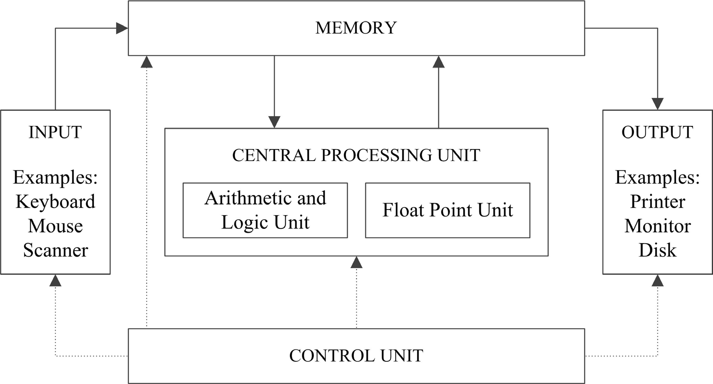

\### 9. Computer Organization

<!-- [8\\*, c1–c4] -->

From the perspective of a computer, a wide semantic gap exists between its

intended behavior and the workings of the underlying electronic devices that

actually do the work within the computer. This gap is bridged through

computer organization, which meshes various electrical, electronic, and

mechanical devices into one device that forms a computer. The objects that

computer organization deals with are the devices, connections, and controls.

The abstraction built in computer organization is the computer.

\#### 9.1. Computer Organization Overview

A computer generally consists of a CPU, memory, input devices, and output

devices. Abstractly speaking, the organization of a computer can be divided

into four levels (Figure 13.4). The \\_macro architecture\\_ level is the formal

specification of all the functions a particular machine can carry out and is

known as the instruction set architecture (ISA). The \\_micro architecture\\_ level

is the implementation of the ISA in a specific CPU - in other words, the way in

which the ISA’s specifications are actually carried out. The \\_logic circuits\\_

level is the level where each functional component of the micro architecture is

built up of circuits that make decisions based on simple rules. The \\_devices\\_

level is the level where, finally, each logic circuit is actually built of

electronic devices such as complementary metal-oxide semiconductors (CMOS),

n-channel metal oxide semiconductors (NMOS), or gallium arsenide (GaAs)

transistors, and so forth.

1. Macro Architecture Level (ISA)
1. Micro Architecture Level
1. Logic Circuits Level
1. Devices Level

Figure 13.4. Machine Architecture Levels

Each level provides an abstraction to the level above and is dependent on the

level below. To a programmer, the most important abstraction is the ISA, which

specifies such things as the native data types, instructions, registers,

addressing modes, the memory architecture, interrupt and exception handling,

and the I/Os. Overall, the ISA specifies the ability of a computer and what can

be done on the computer with programming.

\#### 9.2. Digital Systems

At the lowest level, computations are carried out by the electrical and

electronic devices within a computer. The computer uses circuits and memory

to hold charges that represents the presence or absence of voltage. The

presence of voltage is equal to a 1 while the absence of voltage is a zero. On

disk the polarity of the voltage is represented by 0s and 1s that in turn

represents the data stored. Everything - including instruction and data - is

expressed or encoded using digital zeros and ones. In this sense, a computer

becomes a digital system. For example, decimal value 6 can be encoded as 110,

the addition instruction may be encoded as 0001, and so forth. The component of

the computer such as the control unit, ALU, memory and I/O use the information

to compute the instructions.

\#### 9.3. Digital Logic

Obviously, logics are needed to manipulate data and to control the operation of

computers. This logic, which is behind a computer’s proper function, is

called digital logic because it deals with the operations of digital zeros and

ones. Digital logic specifies the rules both for building various digital

devices from the simplest elements (such as transistors) and for governing the

operation of digital devices. For example, digital logic spells out what the

value will be if a zero and one is ANDed, ORed, or exclusively ORed together.

It also specifies how to build decoders, multiplexers (MUX), memory, and

adders that are used to assemble the computer.

\#### 9.4. Computer Expression of Data

<!-- FIXME: math equations -->

As mentioned before, a computer expresses data with electrical signals or

digital zeros and ones. Since there are only two different digits used in data

expression, such a system is called a \\_binary expression system\\_. Due to the

inherent nature of a binary system, the maximum numerical value expressible by

an n-bits binary code is 2n − 1. Specifically, binary number \\_a\\_ n \\_a\\_ n−1...

\\_a\\_ 1 \\_a\\_ 0 corre- sponds to \\_a\\_ n × 2 n + \\_a\\_ n−1 × 2 n−1 + ... + \\_a\\_ 1 × 21 +

\\_a\\_ 0 × 20. Thus, the numerical value of the binary expression of 1011 is 1 × 8

\+ 0 × 4 + 1 × 2 + 1 × 1 = 11. To express a nonnumerical value, we need to

decide the number of zeros and ones to use and the order in which those zeros

and ones are arranged.

Of course, there are different ways to do the encoding, and this gives rise to

different data expression schemes and subschemes. For example, integers can be

expressed in the form of unsigned, one’s complement, or two’s complement. For

characters, there are ASCII, Unicode, and IBM’s EBCDIC standards. For floating

point numbers, there are IEEE-754 FP 1, 2, and 3 standards.

\#### 9.5. The Central Processing Unit (CPU)

The central processing unit is the place where instructions (or programs) are

actually executed. The execution usually takes several steps, including

fetching the program instruction, decoding the instruction, fetching operands,

performing arithmetic and logical operations on the operands, and storing the

result. The main components of a CPU consist of registers where instructions

and data are often read from and written to, the arithmetic and logic

unit (ALU) that performs the actual arithmetic (such as addition, subtraction,

multiplication, and division) and logic (such as AND, OR, shift, and so

forth) operations, the control unit that is responsible for producing proper

signals to control the operations, and various (data, address, and control)

buses that link the components together and transport data to and from these

components.

\#### 9.6. Memory System Organization

Memory is the storage unit of a computer. It concerns the assembling of a

large-scale memory system from smaller and single-digit storage units. The main

topics covered by memory system architecture include the following:

1. Memory cells and chips
1. Memory boards and modules
1. Memory hierarchy and cache
1. Memory as a subsystem of the computer.

Memory cells and chips deal with single-digital storage and the assembling of

single-digit units into one-dimensional memory arrays as well as the assembling

of one-dimensional storage arrays into multi-dimensional storage memory chips.

Memory boards and modules concern the assembling of memory chips into memory

systems, with the focus being on the organization, operation, and management

of the individual chips in the system. Memory hierarchy and cache are used to

support efficient memory operations. Memory as a sub-system deals with the

interface between the memory system and other parts of the computer.

\#### 9.7. Input and Output (I/O)

A computer is useless without I/O. Common input devices include the keyboard

and mouse; common output devices include the disk, the screen, the printer, and

speakers. Different I/O devices operate at different data rates and reli-

abilities. How computers connect and manage various input and output devices to

facilitate the interaction between computers and humans (or other computers) is

the focus of topics in I/O. The main issues that must be resolved in input and

output are the ways I/O can and should be performed.

In general, I/O is performed at both hardware and software levels. Hardware

I/O can be performed in any of three ways. Dedicated I/O dedicates the CPU to

the actual input and output operations during I/O; memory-mapped I/O treats I/O

operations as memory operations; and hybrid I/O combines dedicated I/O and

memory-mapped I/O into a single holistic I/O operation mode. Coincidentally,

software I/O can also be performed in one of three ways. Programmed I/O lets

the CPU wait while the I/O device is doing I/O; interrupt-driven I/O lets the

CPU’s handling of I/O be driven by the I/O device; and direct memory access (

DMA) lets I/O be handled by a secondary CPU embedded in a DMA device (or

channel). (Except during the initial setup, the main CPU is not disturbed

during a DMA I/O operation.)

Regardless of the types of I/O scheme being used, the main issues involved in

I/O include \\_I/O addressing\\_ (which deals with the issue of how to identify the

I/O device for a specific I/O operation), \\_synchronization\\_ (which deals with

the issue of how to make the CPU and I/O device work in harmony during I/O),

and \\_error detection and correction\\_ (which deals with the occurrence of

transmission errors).

\### 10. Compiler Basics

<!-- [4\\*, s6.4] [8\\*, s8.4] -->

\#### 10.1. Compiler/Interpreter Overview

Programmers usually write programs in high level language code, which the CPU

cannot execute; so this source code has to be converted into machine code to

be understood by a computer. Due to the differences between different ISAs, the

translation must be done for each ISA or specific machine language under

consideration. The translation is usually performed by a piece of software

called a compiler or an interpreter. This process of translation from a

high-level language to a machine language is called compilation, or,

sometimes, interpretation.

\#### 10.2. Interpretation and Compilation

There are two ways to translate a program written in a higher-level language

into machine code: interpretation and compilation. \\_Interpretation\\_ translates

the source code one statement at a time into machine language, executes it on

the spot, and then goes back for another statement. Both the

high-level-language source code and the interpreter are required every time

the program is run. \\_Compilation\\_ translates the high-level-language source

code into an entire machine-language program (an executable image) by a

program called a compiler. After compilation, only the executable image is

needed to run the program. Most application software is sold in this form.

While both compilation and interpretation convert high level language code

into machine code, there are some important differences between the two

methods. First, a compiler makes the conversion just once, while an

interpreter typically converts it every time a program is executed. Second,

interpreting code is slower than running the compiled code, because the

interpreter must analyze each statement in the program when it is executed and

then perform the desired action, whereas the compiled code just performs the

action within a fixed context determined by the compilation. Third, access to

variables is also slower in an interpreter because the mapping of identifiers

to storage locations must be done repeatedly at runtime rather than at

compile time.

The primary tasks of a compiler may include preprocessing, lexical analysis,

parsing, semantic analysis, code generation, and code optimization. Program

faults caused by incorrect compiler behavior can be very difficult to track

down. For this reason, compiler implementers invest a lot of time ensuring the

correctness of their software.

\#### 10.3. The Compilation Process

Compilation is a complex task. Most compilers divide the compilation process

into many phases. A typical breakdown is as follows:

1. Lexical Analysis
1. Syntax Analysis or Parsing
1. Semantic Analysis
1. Code Generation

Lexical analysis partitions the input text (the source code), which is a

sequence of characters, into separate comments, which are to be ignored in

subsequent actions, and basic symbols, which have lexical meanings. These basic

symbols must correspond to some terminal symbols of the grammar of the

particular programming language. Here terminal symbols refer to the ele-

mentary symbols (or tokens) in the grammar that cannot be changed.

Syntax analysis is based on the results of the lexical analysis and discovers

the structure in the program and determines whether or not a text conforms to

an expected format. Is this a textually correct C++ program? or Is this entry

textually correct? are typical questions that can be answered by syntax

analysis. Syntax analysis determines if the source code of a program is cor-

rect and converts it into a more structured representation (parse tree) for

semantic analysis or transformation.

\\_Semantic analysis\\_ adds semantic information to the parse tree built during

the syntax analysis and builds the symbol table. It performs various semantic

checks that include type checking, object binding (associating variable and

function references with their definitions), and definite assignment (requiring

all local variables to be initialized before use). If mistakes are found, the

semantically incorrect program statements are rejected and flagged as errors.

Once semantic analysis is complete, the phase of \\_code generation\\_ begins and

transforms the intermediate code produced in the previous phases into the

native machine language of the computer under consideration. This involves

resource and storage decisions—such as deciding which variables to fit into

registers and memory and the selection and scheduling of appropriate machine

instructions, along with their associated addressing modes.

It is often possible to combine multiple phases into one pass over the code in

a compiler implementation. Some compilers also have a preprocessing phase

at the beginning or after the lexical analysis that does necessary housekeeping

work, such as processing the program instructions for the compiler

(directives). Some compilers provide an optional optimization phase at the

end of the entire compilation to optimize the code (such as the rearrangement

of instruction sequence) for efficiency and other desirable objectives

requested by the users.

\### 11. Operating Systems Basics

<!-- [4\\*, c3] -->

Every system of meaningful complexity needs to be managed. A computer, as a

rather complex electrical-mechanical system, needs its own manager for

managing the resources and activities occurring on it. That manager is called

an \\_operating system\\_ (OS)\\_.

\#### 11.1. Operating Systems Overview

Operating systems is a collection of software and firmware, that controls the

execution of computer programs and provides such services as computer resource

allocation, job control, input/output control, and file management in a

computer system. Conceptually, an operating system is a computer program that

manages the hardware resources and makes it easier to use by applications by

presenting nice abstractions. This nice abstraction is often called the

virtual machine and includes such things as processes, virtual memory, and file

systems. An OS hides the complexity of the underlying hardware and is found on

all modern computers.

The principal roles played by OSs are management and illusion. Management

refers to the OS’s management (allocation and recovery) of physical resources

among multiple competing users/ applications/tasks. Illusion refers to the nice

abstractions the OS provides.

\#### 11.2. Tasks of an Operating System

The tasks of an operating system differ significantly depending on the

machine and time of its invention. However, modern operating systems have come

to agreement as to the tasks that must be performed by an OS. These tasks

include CPU management, memory management, disk management (file system), I/O

device management, and security and protection. Each OS task manages one type

of physical resource.

Specifically, CPU management deals with the allocation and releases of the CPU

among competing programs (called processes/threads in OS jargon), including

the operating system itself. The main abstraction provided by CPU management is

the process/thread model. Memory management deals with the allocation and

release of memory space among competing processes, and the main abstraction

provided by memory management is virtual memory. Disk management deals with the

sharing of magnetic or optical or solid state disks among multiple

programs/users and its main abstraction is the file system. I/O device manage-

ment deals with the allocation and releases of various I/O devices among

competing processes.

Security and protection deal with the protection of computer resources from

illegal use.

\#### 11.3. Operating System Abstractions

The arsenal of OSs is abstraction. Corresponding to the five physical tasks,

OSs use five abstractions: process/thread, virtual memory, file systems,

input/output, and protection domains. The overall OS abstraction is the virtual

machine. For each task area of OS, there is both a physical reality and a

conceptual abstraction. The physical reality refers to the hardware resource

under management; the conceptual abstraction refers to the interface the OS

presents to the users/programs above. For example, in the thread model of the

OS, the physical reality is the CPU and the abstraction is multiple CPUs. Thus,

a user doesn’t have to worry about sharing the CPU with others when working on

the abstraction provided by an OS. In the virtual memory abstraction of an OS,

the physical reality is the physical RAM or ROM (whatever), the abstraction is

multiple unlimited memory space. Thus, a user doesn’t have to worry about

sharing physical memory with others or about limited physical memory size.

Abstractions may be virtual or transparent; in this context virtual applies to

something that appears to be there, but isn’t (like usable memory beyond

physical), whereas transparent applies to something that is there, but appears

not to be there (like fetching memory contents from disk or physical memory).

\#### 11.4. Operating Systems Classification

Different operating systems can have different functionality implementation. In

the early days of the computer era, operating systems were relatively simple.

As time goes on, the complexity and sophistication of operating systems

increases significantly. From a historical perspective, an operating system can

be classified as one of the following.

1. \\_Batching OS:\\_ organizes and processes work in batches. Examples of such OSs

include IBM’s FMS, IBSYS, and University of Michigan’s UMES.

1. \\_Multiprogrammed batching OS:\\_ adds multitask capability into earlier simple

batching OSs. An example of such an OS is IBM’s OS/360.

1. \\_Time-sharing OS:\\_ adds multi-task and interactive capabilities into the OS.

Examples of such OSs include UNIX, Linux, and NT.

1. \\_Real-time OS:\\_ adds timing predictability into the OS by scheduling

individual tasks according to each task’s completion deadlines. Examples of

such OS include VxWorks (WindRiver) and DART (EMC).

1. \\_Distributed OS:\\_ adds the capability of managing a network of computers into

the OS.

1. \\_Embedded OS:\\_ has limited functionality and is used for embedded systems

such as cars and PDAs. Examples of such OSs include Palm OS, Windows CE, and

TOPPER.

Alternatively, an OS can be classified by its applicable target

machine/environment into the following.

1. \\_Mainframe OS:\\_ runs on the mainframe computers and include OS/360, OS/390,

AS/400, MVS, and VM.

1. \\_Server OS:\\_ runs on workstations or servers and includes such systems as

UNIX, Windows, Linux, and VMS.

1. \\_Multicomputer OS:\\_ runs on multiple computers and include such examples as

Novell Netware.

1. \\_Personal computers OS:\\_ runs on personal computers and include such examples

as DOS, Windows, Mac OS, and Linux.

1. \\_Mobile device OS:\\_ runs on personal devices such as cell phones, IPAD and

include such examples of iOS, Android, Symbian, etc.

\### 12. Database Basics and Data Management

<!-- [4\\*, c9] -->

A database consists of an organized collection of data for one or more uses. In

a sense, a database is a generalization and expansion of data structures. But

the difference is that a database is usually external to individual programs

and permanent in existence compared to data structures. Databases are used when

the data volume is large or logical relations between data items are important.

The factors considered in database design include performance, concurrency,

integrity, and recovery from hardware failures.

\#### 12.1. Entity and Schema

The things a database tries to model and store are called entities. Entities

can be real-world objects such as persons, cars, houses, and so forth, or they

may be abstract concepts such as persons, salary, names, and so forth. An

entity can be primitive such as a name or composite such as an employee that

consists of a name, identification number, salary, address, and so forth.

The single most important concept in a database is the \\_schema\\_, which is a

description of the entire database structure from which all other database

activities are built. A schema defines the relationships between the various

entities that compose a database. For example, a schema for a company payroll

system would consist of such things as employee ID, name, salary rate, address,

and so forth. Database software maintains the database according to the schema.

Another important concept in database is the \\_database model\\_ that describes

the type of relationship among various entities. The commonly used models

include relational, network, and object models.

\#### 12.2. Database Management Systems (DBMS)

Database Management System (DBMS) components include database applications

for the storage of structured and unstructured data and the required database

management functions needed to view, collect, store, and retrieve data from

the databases. A DBMS controls the creation, maintenance, and use of the

database and is usually categorized according to the database model it

supports—such as the relational, network, or object model. For example, a

relational database management system (RDBMS) implements features of the

relational model. An object database management system (ODBMS) implements

features of the object model.

\#### 12.3. Database Query Language

Users/applications interact with a database through a database query language,

which is a specialized programming language tailored to database use. The

database model tends to determine the query languages that are available to

access the database. One commonly used query language for the relational

database is the structured query language, more commonly abbreviated as SQL. A

common query language for object databases is the object query language

(abbreviated as OQL). There are three components of SQL: Data Definition

Language (DDL), Data Manipulation Language (DML), and Data Control Language

(DCL). An example of an DML query may look like the following:

\```

SELECT Component\\_No, Quantity FROM COMPONENT WHERE Item\\_No = 100

\```

The above query selects all the Component\\_No and its corresponding quantity

from a database table called COMPONENT, where the Item\\_No equals to 100.

\#### 12.4. Tasks of DBMS Packages

A DBMS system provides the following capabilities:

1. \\_Database development\\_ is used to define and organize the content,

relationships, and structure of the data needed to build a database.

1. \\_Database interrogation\\_ is used for accessing the data in a database for

information retrieval and report generation. End users can selectively

retrieve and display information and produce printed reports. This is the

operation that most users know about databases.

1. \\_Database Maintenance\\_ is used to add, delete, update, and correct the data

in a database.

1. \\_Application Development\\_ is used to develop prototypes of data entry

screens, queries, forms, reports, tables, and labels for a prototyped

application. It also refers to the use of 4th Generation Language or

application generators to develop or generate program code.

\#### 12.5. Data Management

A database must manage the data stored in it. This management includes both

organization and storage.

The organization of the actual data in a database depends on the database

model. In a relational model, data are organized as tables with different

tables representing different entities or relations among a set of entities.

The storage of data deals with the storage of these database tables on disks.

The common ways for achieving this is to use files. Sequential, indexed, and

hash files are all used in this purpose with different file structures

providing different access performance and convenience.

\#### 12.6. Data Mining

One often has to know what to look for before querying a database. This type of

“pinpointing” access does not make full use of the vast amount of information

stored in the database, and in fact reduces the database into a collection of

discrete records. To take full advantage of a database, one can perform

statistical analysis and pattern discovery on the content of a database using

a technique called \\_data mining.\\_ Such operations can be used to support a

number of business activities that include, but are not limited to, marketing,

fraud detection, and trend analysis.

Numerous ways for performing data mining have been invented in the past decade

and include such common techniques as class description, class discrimination,

cluster analysis, association analysis, and outlier analysis.

\### 13. Network Communication Basics

<!-- [8\\*, c12] -->

A computer network connects a collection of computers and allows users of

different computers to share resources with other users. A network

facilitates the communications between all the connected computers and may give

the illusion of a single, omnipresent computer. Every computer or device

connected to a network is called a \\_network node.\\_

A number of computing paradigms have emerged to benefit from the functions and

capabilities provided by computer networks. These paradigms include distributed

computing, grid computing, Internet computing, and cloud computing.

\#### 13.1. Types of Network

Computer networks are not all the same and may be classified according to a

wide variety of characteristics, including the network’s connection method,

wired technologies, wireless technologies, scale, network topology,

functions, and speed. But the classification that is familiar to most is based

on the scale of networking.

1. \\_Personal Area Network/Home Network\\_ is a computer network used for

communication among computer(s) and different information technological

devices close to one person. The devices connected to such a network may

include PCs, faxes, PDAs, and TVs. This is the base on which the Internet of

Things is built.

1. \\_Local Area Network\\_ (LAN) connects computers and devices in a limited

geographical area, such as a school campus, computer laboratory, office

building, or closely positioned group of buildings.

1. \\_Campus Network\\_ is a computer network made up of an interconnection of local

area networks (LANs) within a limited geographical area.

1. \\_Wide area network\\_ (WAN) is a computer network that covers a large

geographic area, such as a city or country or even across intercontinental

distances. A WAN limited to a city is sometimes called a Metropolitan Area

Network.

1. \\_Internet\\_ is the global network that connects computers located in many

(perhaps all) countries.

Other classifications may divide networks into control networks, storage

networks, virtual private networks (VPN), wireless networks, point-to-point

networks, and Internet of Things.

\#### 13.2. Basic Network Components

All networks are made up of the same basic hardware components, including

computers, network interface cards (NICs), bridges, hubs, switches, and

routers. All these components are called \\_nodes\\_ in the jargon of networking.

Each component performs a distinctive function that is essential for the

packaging, connection, transmission, amplification, controlling, unpacking,

and interpretation of the data. For example, a repeater amplifies the signals,

a switch performs many-to-many connections, a hub performs one-to-many

connections, an interface card is attached to the computer and performs data

packing and transmission, a bridge connects one network with another, and a

router is a computer itself and performs data analysis and flow control to

regulate the data from the network. The functions performed by various network

components correspond to the functions specified by one or more levels of the

seven-layer Open Systems Interconnect (OSI) networking model, which is

discussed below.

\#### 13.3. Networking Protocols and Standards

Computers communicate with each other using protocols, which specify the format

and regulations used to pack and un-pack data. To facilitate easier

communication and better structure, network protocols are divided into

different layers with each layer dealing with one aspect of the communication.

For example, the physical layers deal with the physical connection between

the parties that are to communicate, the data link layer deals with the raw

data transmission and flow control, and the network layer deals with the

packing and un-packing of data into a particular format that is understandable

by the relevant parties. The most commonly used OSI networking model

organizes network protocols into seven layers, as depicted in Figure 13.5.

One thing to note is that not all network protocols implement all layers of

the OSI model. For example, the TCP/IP protocol implements neither the

presentation layer nor the session layer. There can be more than one protocol

for each layer. For example, UDP and TCP both work on the transport layer above

IP’s network layer, providing best-effort, unreliable transport (UDP) vs.

reliable transport function (TCP). Physical layer protocols include token

ring, Ethernet, fast Ethernet, gigabit Ethernet, and wireless Ethernet.

Data link layer protocols include frame-relay, asynchronous transfer mode

(ATM), and Point-to-Point Protocol (PPP). Application layer protocols

include Fibre channel, Small Computer System Interface (SCSI), and

Bluetooth. For each layer or even each individual protocol, there may be

standards established by national or international organizations to guide

the design and development of the corresponding protocols.

1. Application Layer
1. Presentation Layer
1. Session Layer
1. Transport Layer
1. Network Layer
1. Data link Layer
1. Physical Layer

Figure 13.5. The Seven-Layer OSI Networking Model

\#### 13.4. The Internet

The Internet is a global system of interconnected governmental, academic,

corporate, public, and private computer networks. In the public domain access

to the internet is through organizations known as internet service providers

(ISP). The ISP maintains one or more switching centers called a point of

presence, which actually connects the users to the Internet.

\#### 13.5. Internet of Things

The Internet of Things refers to the networking of everyday objects—such as

cars, cell phones, PDAs, TVs, refrigerators, and even buildings— using wired or

wireless networking technologies. The function and purpose of Internet of

Things is to interconnect all things to facilitate autonomous and better

living. Technologies used in the Internet of Things include RFID, wireless and

wired networking, sensor technology, and much software of course. As the

paradigm of Internet of Things is still taking shape, much work is needed for

Internet of Things to gain wide spread acceptance.

\#### 13.6. Virtual Private Network (VPN)

A virtual private network is a preplanned virtual connection between nodes in a

LAN/WAN or on the internet. It allows the network administrator to separate

network traffic into user groups that have a common affinity for each other

such as all users in the same organization, or workgroup. This circuit type may

improve performance and security between nodes and allows for easier

maintenance of circuits when troubleshooting.

\### 14. Parallel and Distributed Computing

<!-- [8\\*, c9] -->

Parallel computing is a computing paradigm that emerges with the development of

multi-functional units within a computer. The main objective of parallel

computing is to execute several tasks simultaneously on different functional

units and thus improve throughput or response or both. Distributed computing,

on the other hand, is a computing paradigm that emerges with the development

of computer networks. Its main objective is to either make use of multiple

computers in the network to accomplish things otherwise not possible within a

single computer or improve computation efficiency by harnessing the power of

multiple computers.

\#### 14.1. Parallel and Distributed Computing Overview\\_

Traditionally, parallel computing investigates ways to maximize concurrency

(the simultaneous execution of multiple tasks) within the boundary of a

computer. Distributed computing studies distributed systems, which consists of

multiple \\_autonomous\\_ computers that communicate through a computer network.

Alternatively, distributed computing can also refer to the use of distributed

systems to solve computational or transactional problems. In the former

definition, distributed computing investigates the protocols, mechanisms, and

strategies that provide the foundation for distributed computation; in the

latter definition, distributed computing studies the ways of dividing a problem

into many tasks and assigning such tasks to various computers involved in the

computation.

Fundamentally, distributed computing is another form of parallel computing,

albeit on a grander scale. In distributed computing, the functional units are

not ALU, FPU, or separate cores, but individual computers. For this reason,

some people regard distributed computing as being the same as parallel

computing. Because both distributed and parallel computing involve some form

of concurrency, they are both also called concurrent computing.

\#### 14.2. Difference between Parallel and Distributed Computing

Though parallel and distributed computing resemble each other on the surface,

there is a subtle but real distinction between them: parallel computing does

not necessarily refer to the execution of programs on different computers—

instead, they can be run on different processors within a single computer. In

fact, consensus among computing professionals limits the scope of parallel

computing to the case where a shared memory is used by all processors

involved in the computing, while distributed computing refers to computations

where private memory exists for each processor involved in the computations.

Another subtle difference between parallel and distributed computing is that

parallel computing necessitates concurrent execution of several tasks while

distributed computing does not have this necessity.

Based on the above discussion, it is possible to classify concurrent systems as

being “parallel” or “distributed” based on the existence or nonexistence of

shared memory among all the processor: parallel computing deals with

computations within a single computer; distributed computing deals with

computations within a set of computers. According to this view, multicore

computing is a form of parallel computing.

\#### 14.3. Parallel and Distributed Computing Models

Since multiple computers/processors/cores are involved in distributed/parallel

computing, some coordination among the involved parties is necessary to

ensure correct behavior of the system.

Different ways of coordination give rise to different computing models. The

most common models in this regard are the shared memory (parallel) model

and the message-passing (distributed) model.

In a \\_shared memory (parallel)\\_ model, all computers have access to a shared

central memory where local caches are used to speed up the processing power.

These caches use a protocol to insure the localized data is fresh and up to

date, typically the MESI protocol. The algorithm designer chooses the program

for execution by each computer. Access to the central memory can be synchronous

or asynchronous, and must be coordinated such that coherency is maintained.

Different access models have been invented for such a purpose.

In a \\_message-passing (distributed)\\_ model, all computers run some programs

that collectively achieve some purpose. The system must work correctly

regardless of the structure of the network. This model can be further

classified into client-server (C/S), browser-server (B/S), and n-tier models.

In the C/S model, the server provides services and the client requests

services from the server. In the B/S model, the server provides services and

the client is the browser. In the n-tier model, each tier (i.e. layer) provides

services to the tier immediately above it and requests services from the tier

immediately below it. In fact, the n-tier model can be seen as a chain of

client-server models. Often, the tiers between the bottommost tier and the

topmost tier are called \\_middleware,\\_ which is a distinct subject of study in

its own right.

\#### 14.4. Main Issues in Distributed Computing

Coordination among all the components in a distributed computing environment

is often complex and time-consuming. As the number of cores/ CPUs/computers

increases, the complexity of distributed computing also increases. Among the

many issues faced, memory coherency and consensus among all computers are the

most difficult ones. Many computation paradigms have been invented to solve

these problems and are the main discussion issues in distributed/parallel

computing.

\### 15. Basic User Human Factors

<!-- [3\\*, c8] [9\\*, c5] -->

Software is developed to meet human desires or needs. Thus, all software design

and development must take into consideration human-user factors such as how

people use software, how people view software, and what humans expect from

software. There are numerous factors in the human-machine interaction, and ISO

9241 document series define all the detailed standards of such

interactions.[10] But the basic human-user factors considered here include

input/output, the handling of error messages, and the robustness of the

software in general.

\#### 15.1. Input and Output

Input and output are the interfaces between users and software. Software is

useless without input and output. Humans design software to process some input

and produce desirable output. All software engineers must consider input and

output as an integral part of the software product they engineer or develop.

Issues considered for input include (but are not limited to):

1. What input is required?
1. How is the input passed from users to computers?
1. What is the most convenient way for users to enter input?
1. What format does the computer require of the input data?

The designer should request the minimum data from human input, only when the

data is not already stored in the system. The designer should format and edit

the data at the time of entry to reduce errors arising from incorrect or

malicious data entry.

For output, we need to consider what the users wish to see:

1. In what format would users like to see output?
1. What is the most pleasing way to display output?

If the party interacting with the software isn’t human but another software or

computer or control system, then we need to consider the input/ output type

and format that the software should produce to ensure proper data exchange

between systems.

There are many rules of thumb for developers to follow to produce good

input/output for a software. These rules of thumb include simple and natural

dialogue, speaking users’ language, minimizing user memory load, consistency,

minimal surprise, conformance to standards (whether agreed to or not: e.g.,

automobiles have a standard interface for accelerator, brake, steering).

\#### 15.2. Error Messages

It is understandable that most software contains faults and fails from time

to time. But users should be notified if there is anything that impedes the

smooth execution of the program. Nothing is more frustrating than an unexpected

termination or behavioral deviation of software without any warning or

explanation. To be user friendly, the software should report all error con-

ditions to the users or upper-level applications so that some measure can be

taken to rectify the situation or to exit gracefully. There are several

guidelines that define what constitutes a good error message: error messages

should be clear, to the point, and timely.

First, error messages should clearly explain what is happening so that users

know what is going on in the software. Second, error messages should pinpoint

the cause of the error, if at all possible, so that proper actions can be

taken. Third, error messages should be displayed right when the error condition

occurs. According to Jakob Nielsen, “Good error messages should be expressed in

plain language (no codes), precisely indicate the problem, and constructively

suggest a solution” [9]. Fourth, error messages should not overload the users

with too much information and cause them to ignore the messages all together.

However, messages relating to security access errors should not provide extra

information that would help unauthorized persons break in.

\#### 15.3. Software Robustness

Software robustness refers to the ability of software to tolerate erroneous

inputs. Software is said to be robust if it continues to function even when

erroneous inputs are given. Thus, it is unacceptable for software to simply

crash when encountering an input problem as this may cause unexpected

consequences, such as the loss of valuable data. Software that exhibits such

behavior is considered to lack robustness.

Nielsen gives a simpler description of software robustness: “The software

should have a low error rate, so that users make few errors during the use of

the system and so that if they do make errors they can easily recover from

them. Further, catastrophic errors must not occur” [9]. There are many ways to

evaluate the robustness of software and just as many ways to make software

more robust. For example, to improve robustness, one should always check the

validity of the inputs and return values before progressing further; one

should always throw an exception when something unexpected occurs, and one

should never quit a program without first giving users/applications a chance to

correct the condition.

\### 16. Basic Developer Human Factors

<!-- [3\\*, c31–32] -->

Developer human factors refer to the considerations of human factors taken

when developing software. Software is developed by humans, read by humans, and

maintained by humans. If anything is wrong, humans are responsible for cor-

recting those wrongs. Thus, it is essential to write software in a way that is

easily understandable by humans or, at the very least, by other software

developers. A program that is easy to read and understand exhibits readability.

The means to ensure that software meet this objective are numerous and range

from proper architecture at the macro level to the particular coding style and

variable usage at the micro level. But the two prominent factors are structure

(or program layouts) and comments (documentation).

\#### 16.1. Structure

Well-structured programs are easier to understand and modify. If a program is

poorly structured, then no amount of explanation or comments is sufficient to

make it understandable. The ways to organize a program are numerous and range

from the proper use of white space, indentation, and parentheses to nice

arrangements of groupings, blank lines, and braces. Whatever style one chooses,

it should be consistent across the entire program.

\#### 16.2. Comments

To most people, programming is coding. These people do not realize that

programming also includes writing comments and that comments are an integral

part of programming. True, comments are not used by the computer and certainly

do not constitute final instructions for the computer, but they improve the

readability of the programs by explaining the meaning and logic of the

statements or sections of code. It should be remembered that programs are

not only meant for computers, they are also read, written, and modified by

humans. The types of comments include repeat of the code, explanation of

the code, marker of the code, summary of the code, description of the

code’s intent, and information that cannot possibly be expressed by the

code itself. Some comments are good, some are not. The good ones are

those that explain the intent of the code and justify why this code looks

the way it does. The bad ones are repeat of the code and stating irrel-

evant information. The best comments are self-documenting code. If the

code is written in such a clear and precise manner that its meaning is

self-proclaimed, then no comment is needed. But this is easier said than

done. Most programs are not self-explanatory and are often hard to read and

understand if no comments are given. Here are some general guidelines for

writing good comments:

1. Comments should be consistent across the entire program.
1. Each function should be associated with comments that explain the purpose of

the function and its role in the overall program.

- Within a function, comments should be given for each logical section

of coding to explain the meaning and purpose (intention) of the

section.

- Comments should stipulate what freedom does (or does not) the

maintaining programmers have with respect to making changes to that

code.

- Comments are seldom required for individual statements. If a

statement needs comments, one should reconsider the statement.

\### 17. Secure Software Development and Maintenance

<!-- [11\\*, c29] -->

Due to increasing malicious activities targeted at computer systems, security

has become a significant issue in the development of software. In addition to

the usual correctness and reliability, software developers must also pay

attention to the security of the software they develop. Secure software

development builds security in software by following a set of established

and/or recommended rules and practices in software development. Secure

software maintenance complements secure software development by ensuring the no

security problems are introduced during software maintenance.

A generally accepted view concerning software security is that it is much

better to design security into software than to patch it in after software is

developed. To design security into software, one must take into consideration

every stage of the software development lifecycle. In particular, secure

software development involves software requirements security, software

design security, software construction security, and software testing secu-

rity. In addition, security must also be taken into consideration when

performing software maintenance as security faults and loopholes can be and

often are introduced during maintenance.

\#### 17.1. Software Requirements Security

Software requirements security deals with the clarification and specification

of security policy and objectives into software requirements, which lays the

foundation for security considerations in the software development. Factors to

consider in this phase include software requirements and threats/risks. The

former refers to the specific functions that are required for the sake of secu-

rity; the latter refers to the possible ways that the security of software is

threatened.

\#### 17.2. Software Design Security

Software Design security deals with the design of software modules that fit

together to meet the security objectives specified in the security

requirements. This step clarifies the details of security considerations and

develops the specific steps for implementation. Factors considered may include

frameworks and access modes that set up the overall security

monitoring/enforcement strategies, as well as the individual policy

enforcement mechanisms.

\#### 17.3. Software Construction Security

Software construction security concerns the question of how to write actual

programming code for specific situations such that security considerations are

taken care of. The term “Software Construction Security” could mean different

things for different people. It can mean the way a specific function is coded,

such that the coding itself is secure, or it can mean the coding of security

into software. Most people entangle the two together without distinction. One

reason for such entanglement is that it is not clear how one can make sure that

a specific coding is secure. For example, in C programming language, the

expression of i<<1 (shift the binary representation of i’s value to the left by

one bit) and 2\\*i (multiply the value of variable i by constant 2) mean the same

thing semantically, but do they have the same security ramification? The answer

could be different for different combinations of ISAs and compilers. Due to

this lack of understanding, software construction security - in its current

state of existence—mostly refers to the second aspect mentioned above: the

coding of security into software. Coding of security into software can be

achieved by following recommended rules. A few such rules follow:

- Structure the process so that all sections requiring extra privileges are

modules. The modules should be as small as possible and should perform only

those tasks that require those privileges.

- Ensure that any assumptions in the program are validated. If this is not

possible, document them for the installers and maintainers so they know the

assumptions that attackers will try to invalidate.

- Ensure that the program does not share objects in memory with any other

program.

- The error status of every function must be checked. Do not try to recover

unless neither the cause of the error nor its effects affect any security

considerations. The program should restore the state of the software to the

state it had before the process began, and then terminate.

\#### 17.4. Software Testing Security

Software testing security determines that software protects data and

maintains security specification as given. For more information, please refer

to the Software Testing KA.

\#### 17.5. Build Security into Software Engineering Process

Software is only as secure as its development process goes. To ensure the

security of software, security must be built into the software engineering

process. One trend that emerges in this regard is the Secure Development

Lifecycle (SDL) concept, which is a classical spiral model that takes a

holistic view of security from the perspective of software lifecycle and

ensures that security is inherent in software design and development, not an

afterthought later in production. The SDL process is claimed to reduce

software maintenance costs and increase reliability of software concerning

software security related faults.

\#### 17.6. Software Security Guidelines

Although there are no bulletproof ways for secure software development, some

general guidelines do exist that can be used to aid such effort. These

guidelines span every phase of the software development lifecycle. Some

reputable guidelines are published by the Computer Emergency Response Team

(CERT) and below are its top 10 software security practices (the details can be

found in [12]:

1. Validate input.
1. Heed compiler warnings.
1. Architect and design for security policies.
1. Keep it simple.
1. Default deny.
1. Adhere to the principle of least privilege.
1. Sanitize data sent to other software.
1. Practice defense in depth.
1. Use effective quality assurance techniques.
1. Adopt a software construction security standard.

\### Matrix Of Topics vs. Reference Material

Voland 2003

[2]

McConnell 2004

[3]

Brookshear 2008

[4]

Horowitz et al. 2007

[5]

Sommerville 2011

[6]

Null and Lobur 2006

[8]

Nielsen 1993

[9]

Bishop 2002

[11]

\\*\\*1. Problem Solving Te c h n i que s\\*\\* s3.2, s4.2

1\.1. Definition of Problem Solving s3.2

1\.2. Formulating the Real Problem s3.2

1\.3. Analyze the Problem s3.2

1\.4. Design a Solution Search Strategy s4.2

1\.5. Problem Solving Using Programs c5

\\*\\*2. Abstraction\\*\\* s5.2– 5.4

2\.1. Levels of Abstraction s5.2– 5.3

2\.2. Encapsulation s5.3

2\.3. Hierarchy s5.2

\\*\\*3. Programming Fundamentals\\*\\* c6–19

3\.1. The Programming Process c6–c19

3\.2. Programming Paradigms c6–c19

3\.3. Defensive Programming c8

\\*\\*4. Programming Language Basics\\*\\* c6

4\.1. Programming Language Overview s6.1

4\.2. Syntax and Semantics of Programming Language s6.2

Voland 2003

[2]

McConnell 2004

[3]

Brookshear 2008

[4]

Horowitz et al. 2007

[5]

Sommerville 2011

[6]

Null and Lobur 2006

[8]

Nielsen 1993

[9]

Bishop 2002

[11]

4\.3. Low Level Programming Language s6.5– 6.7

4\.4. High Level Programing Language s6.5– 6.7

4\.5. Declarative vs. Imperative Programming Language s6.5– 6.7

\\*\\*5. Debugging Tools and Techniques\\*\\* c23

5\.1. Types of Errors s23.1

5\.2. Debugging Techniques: s23.2

5\.3. Debugging To ol s s23.5

\\*\\*6. Data Structure and Representation\\*\\* s2.1– 2.6

6\.1. Data Structure Overview s2.1– 2.6

6\.2. Types of Data Structure s2.1– 2.6

6\.3. Operations on Data Structures s2.1– 2.6

\\*\\*7. Algorithms and Complexity\\*\\* s1.1– 1.3, s3.3– 3.6, s4.1– 4.8, s5.1– 5.7, s6.1– 6.3, s7.1– 7.6, s11.1, s12.1

Voland 2003

[2]


McConnell 2004

[3]

Brookshear 2008

[4]

Horowitz et al. 2007

[5]

Sommerville 2011

[6]

Null and Lobur 2006

[8]

Nielsen 1993

[9]

Bishop 2002

[11]

7\.1. Overview of Algorithms s1.1–1.2

7\.2. Attributes of Algorithms s1.3

7\.3. Algorithmic Analysis s1.3

7\.4. Algorithmic Design Strategies s3.3– 3.6, s4.1– 4.8, s5.1– 5.7, s6.1– 6.3, s7.1– 7.6, s11.1, s12.1

7\.5. Algorithmic Analysis Strategies s3.3– 3.6, s4.1– 4.8, s5.1– 5.7, s6.1– 6.3, s7.1– 7.6, s11.1, s12.1

\\*\\*8. Basic Concept of a System\\*\\* c10

8\.1. Emergent System Properties s10.1

8\.2. System Engineering s10.2

8\.3. Overview of a Computer System

Voland 2003

[2]

McConnell 2004

[3]

Brookshear 2008

[4]

Horowitz et al. 2007

[5]

Sommerville 2011

[6]

Null and Lobur 2006

[8]

Nielsen 1993

[9]

Bishop 2002

[11]

\\*\\*9. Computer Organization\\*\\* c1–4

9\.1. Computer Organization Overview s1.1–1.2

9\.2. Digital Systems c3

9\.3. Digital Logic c3

9\.4. Computer Expression of Data c2

9\.5. The Central Processing Unit (CPU) s4.1– 4.2

9\.6. Memory System Organization s4.6

9\.7. Input and Output (I/O) s4.5

\\*\\*10. Compiler Basics\\*\\* s6.4 s8.4

1. Compiler Overview s8.4
1. Interpretation and Compilation s8.4
1. The Compilation Process s6.4 s8.4

\\*\\*11. Operating Systems Basics\\*\\* c3

11\.1. Operating Systems Overview s3.2

1. 2. Ta sk s of Operating System s3.3

11\.3. Operating System Abstractions s3.2

11\.4. Operating Systems Classification s3.1

Voland 2003

[2]

McConnell 2004

[3]

Brookshear 2008

[4]

Horowitz et al. 2007

[5]

Sommerville 2011

[6]

Null and Lobur 2006

[8]

Nielsen 1993

[9]

Bishop 2002

[11]

\\*\\*12. Database Basics and Data Management\\*\\* c9

12\.1. Entity and Schema s9.1

12\.2. Database Management Systems (DBMS) s9.1

12\.3. Database Query Language s9.2

12\.4. Ta sk s of DBMS Packages s9.2

12\.5. Data Management s9.5

12\.6. Data Mining s9.6

\\*\\*13. Network Communication Basics\\*\\* c12

13\.1. Ty p e s of Network s12.2– 12.3

13\.2. Basic Network Components s12.6

13\.3. Networking Protocols and Standards s12.4– 12.5

13\.4. The Internet

13\.5. Internet of Things s12.8

13\.6. Virtual Private Network

\\*\\*14. Parallel and Distributed Computing\\*\\* c9

14\.1. Parallel and Distributed Computing Overview s9.4.1– 9.4.3

Voland 2003

[2]

McConnell 2004

[3]

Brookshear 2008

[4]

Horowitz et al. 2007

[5]

Sommerville 2011

[6]

Null and Lobur 2006

[8]

Nielsen 1993

[9]

Bishop 2002

[11]

14\.2. Differences between Parallel and Distributed Computing s9.4.4– 9.4.5

14\.3. Parallel and Distributed Computing Models s9.4.4– 9.4.5

14\.4. Main Issues in Distributed Computing

\\*\\*15. Basic User Human Factors\\*\\* c8 c5

15\.1. Input and Output s5.1, s5.3

15\.2. Error Messages s5.2, s5.8

15\.3. Software Robustness s5.5– 5.6

\\*\\*16. Basic Developer Human Factors\\*\\* c31–32

16\.1. Structure c31

16\.2. Comments c32

\\*\\*17. Secure Software Development and Maintenance\\*\\* c29

17\.1. Two Aspects of Secure Coding s29.1

17\.2. Coding Security into Software s29.4

17\.3. Requirement Security s29.2

17\.4. Design Security s29.3

17\.5. Implementation Security s29.5

\\*\\*References\\*\\*

[1] Joint Task Force on Computing Curricula, IEEE Computer Society and

Association for Computing Machinery, \\_Software Engineering 2004: Curriculum

Guidelines for Undergraduate Degree Programs in Software Engineering\\_, 2004;

[http://sites.](http://sites.) computer.org/ccse/SE2004Volume.pdf.

[2] G. Voland, \\_Engineering by Design\\_, 2nd ed., Prentice Hall, 2003.

[3] S. McConnell, \\_Code Complete\\_, 2nd ed., Microsoft Press, 2004.

[4] J.G. Brookshear, \\_Computer Science: An Overview\\_, 10th ed.,

Addison-Wesley, 2008.

[5] E. Horowitz et al., \\_Computer Algorithms\\_, 2nd ed., Silicon Press, 2007.

[6] I. Sommerville, \\_Software Engineering\\_, 9th ed., Addison-Wesley, 2011.

[7] ISO/IEC/IEEE 24765:2010 Systems and Software Engineering—Vocabulary, ISO/

IEC/IEEE, 2010.

[8] L. Null and J. Lobur, The Essentials of Computer Organization and

Architecture, 2nd ed., Jones and Bartlett Publishers, 2006.

[9] J. Nielsen, Usability Engineering, Morgan Kaufmann, 1993.

[10] ISO 9241-420:2011 Ergonomics of Human-System Interaction, ISO, 2011.

[11] M. Bishop, Computer Security: Art and Science, Addison-Wesley, 2002.

[12] R.C. Seacord, The CERT C Secure Coding Standard, Addison-Wesley

Professional, 2008.

\## Chapter 14: Mathematical Foundations

\\*\\*Introduction\\*\\*

Software professionals live with programs. In a very simple language, one can

program only for something that follows a well-understood, non-ambiguous

logic. The Mathematical Foundations knowledge area (KA) helps software

engineers comprehend this logic, which in turn is translated into programming

language code. The mathematics that is the primary focus in this KA is quite

different from typical arithmetic, where numbers are dealt with and discussed.

Logic and reasoning are the essence of mathematics that a software engineer

must address.

Mathematics, in a sense, is the study of formal systems. The word “formal” is

associated with preciseness, so there cannot be any ambiguous or erroneous

interpretation of the fact. Mathematics is therefore the study of any and all

certain truths about any concept. This concept can be about numbers as well as

about symbols, images, sounds, video—almost anything. In short, not only

numbers and numeric equations are subject to preciseness. On the contrary, a

software engineer needs to have a precise abstraction on a diverse application

domain.

The \\_SWEBOK Guide\\_ ’s Mathematical Foundations KA covers basic techniques to

identify a set of rules for reasoning in the context of the system under study.

Anything that one can deduce following these rules is an absolute certainty

within the context of that system. In this KA, techniques that can represent

and take forward the reasoning and judgment of a software engineer in a precise

(and therefore mathematical) manner are defined and discussed. The language and

methods of logic that are discussed here allow us to describe mathematical

proofs to infer conclusively the absolute truth of certain concepts beyond the

numbers. In short, you can write a program for a problem only if it follows

some logic. The objective of this KA is to help you develop the skill to

identify and describe such logic. The emphasis is on helping you understand the

basic concepts rather than on challenging your arithmetic abilities.

\\*\\*Breakdown Of Topics For Mathematical Foundations\\*\\*

The breakdown of topics for the Mathematical Foundations KA is shown in Figure

14\.1.

\### 1. Set, Relations, Functions

<!-- [1\\*, c2] -->

Set. A set is a collection of objects, called elements of the set. A set can be

represented by listing its elements between braces, e.g., S = {1, 2, 3}. The

symbol ∈ is used to express that an element belongs to a set, or—in other

words—is a member of the set. Its negation is represented by ∉, e.g., 1 ∈ S,

but 4 ∉ S.

In a more compact representation of set using set builder notation, {x | P(x)}

is the set of all x such that P(x) for any proposition P(x) over any universe

of discourse. Examples for some important sets include the following:

N = {0, 1, 2, 3, ...} = the set of nonnegative

integers.

Z = {..., −3, −2, −1, 0, 1, 2, 3, ...} = the set of

integers.

Finite and Infinite Set. A set with a finite number of elements is called a

finite set. Conversely, any set that does not have a finite number of ele-

ments in it is an infinite set. The set of all natural numbers, for example, is

an infinite set.

\\_Cardinality.\\_ The cardinality of a finite set S is the number of elements in

S. This is represented |S|, e.g., if S = {1, 2, 3}, then |S| = 3.

\\_Universal Set.\\_ In general S = {x ∈ U | p(x)}, where U is the universe of

discourse in which the predicate P(x) must be interpreted. The “universe of

discourse” for a given predicate is often referred to as the universal set.

Alternately, one may define universal set as the set of all elements.

\\_Set Equality.\\_ Two sets are equal if and only if they have the same elements,

- e.:

X = Y ≡ ∀p (p ∈ X ↔ p ∈ Y).

\\_Subset.\\_ X is a subset of set Y, or X is contained in Y, if all elements of X

are included in Y. This is denoted by X ⊆ Y. In other words, X ⊆ Y if and only

if ∀p (p ∈ X → p ∈ Y).

For example, if X = {1, 2, 3} and Y = {1, 2, 3, 4, 5}, then X ⊆ Y.

If X is not a subset of Y, it is denoted as X Y.

\\_Proper Subset.\\_ X is a proper subset of Y (denoted by X ⊂ Y) if X is a subset

of Y but not equal to Y, i.e., there is some element in Y that is not in X. In

other words, X ⊂ Y if (X ⊆ Y) ∧ (X ≠ Y).

For example, if X = {1, 2, 3}, Y = {1, 2, 3,

4}, and Z = {1, 2, 3}, then X ⊂ Y, but X is not a

proper subset of Z. Sets X and Z are equal sets.

If X is not a proper subset of Y, it is denoted

as X ⊄ Y.

\\_Superset.\\_ If X is a subset of Y, then Y is called

a \\_superset\\_ of X. This is denoted by Y ⊇ X, i.e., Y

⊇ X if and only if X ⊆ Y.

For example, if X = {1, 2, 3} and Y = {1, 2, 3,

4, 5}, then Y ⊇ X.

Empty Set. A set with no elements is called an empty set. An empty set, denoted

by ∅, is also referred to as a null or void set. Power Set. The set of all

subsets of a set X is called the power set of X. It is represented as ℘(X).

For example, if X = {a, b, c}, then ℘(X) = {∅, {a}, {b}, {c}, {a, b}, {a, c},

{b, c}, {a, b, c}}. If |X| = n, then |℘(X)| = 2n.

Venn Diagrams. Venn diagrams are graphic representations of sets as enclosed

areas in the plane. For example, in Figure 14.2, the rectangle represents the

universal set and the shaded region represents a set X.

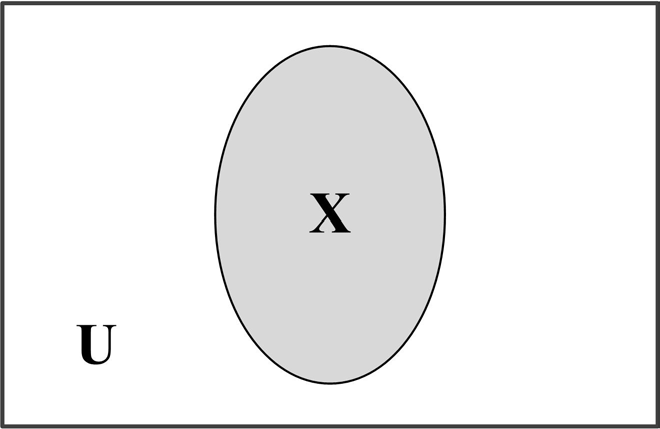

\#### 1.1. Set Operations

Intersection. The intersection of two sets X and Y, denoted by X ∩ Y, is the

set of common elements in both X and Y.

In other words, X ∩ Y = {p | (p ∈ X) ∧ (p ∈ Y)}. As, for example, {1, 2, 3} ∩

{3, 4, 6} = {3} If X ∩ Y = f, then the two sets X and Y are said to be a

disjoint pair of sets.

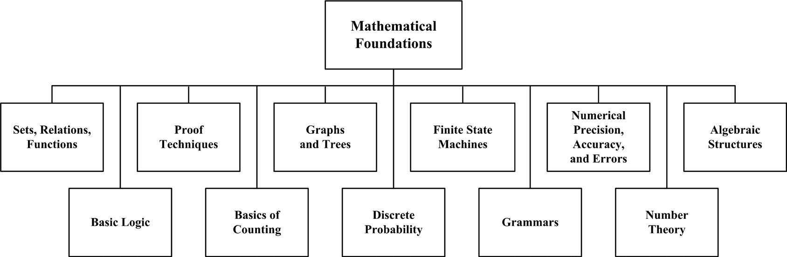

A Venn diagram for set intersection is shown in Figure 14.3. The common portion

of the two sets represents the set intersection.

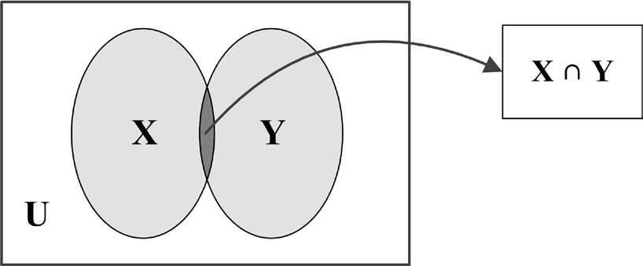

\\_Union.\\_ The union of two sets X and Y, denoted by X ∪ Y, is the set of all

elements either in X, or in Y, or in both.

In other words, X ∪ Y = {p | (p ∈ X) ∨ (p ∈ Y)}. As, for example, {1, 2, 3} ∪

{3, 4, 6} = {1, 2, 3, 4, 6}.

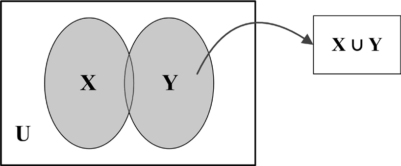

It may be noted that |X ∪ Y| = |X| + |Y| − |X ∩ Y|.

A Venn diagram illustrating the union of two sets is represented by the shaded

region in Figure 14.4.

\\_Complement.\\_ The set of elements in the universal set that do not belong to

a given set X is called its complement set X'.

In other words, X' ={p | (p ∈ U) ∧ (p ∉ X)}.

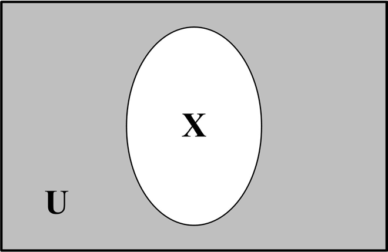

The shaded portion of the Venn diagram in Figure 14.5 represents the

complement set of X. Set Difference or Relative Complement. The set of elements

that belong to set X but not to set Y builds the set difference of Y from X.

This is represented by X − Y.

In other words, X − Y = {p | (p ∈ X) ∧ (p ∉ Y)}. As, for example, {1, 2, 3} −

{3, 4, 6} = {1, 2}. It may be proved that X − Y = X ∩ Y’.

Set difference X – Y is illustrated by the shaded region in Figure 14.6 using a

Venn diagram.

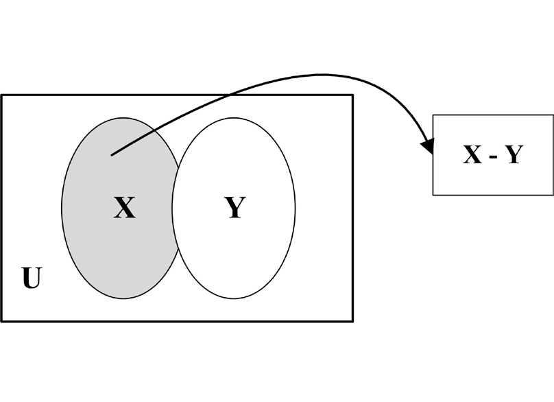

Cartesian Product. An ordinary pair {p, q} is a set with two elements. In a

set, the order of the elements is irrelevant, so {p, q} = {q, p}. In an ordered

pair (p, q), the order of occurrences of the elements is relevant. Thus, (p,

q) ≠ (q, p) unless p = q. In general (p, q) = (s, t) if and only if p = s and q

= t.

Given two sets X and Y, their Cartesian product X × Y is the set of all ordered

pairs (p, q) such that p ∈ X and q ∈ Y.

In other words, X × Y = {(p, q) | (p ∈ X) ∧ (q ∈ Y)}.

As for example, {a, b} × {1, 2} = {(a, 1), (a, 2), (b, 1), (b, 2)}

\#### 1.2. Properties of Set

Some of the important properties and laws of sets are mentioned below.

1. Associative Laws:

\```

X ∪ (Y ∪ Z) = (X ∪ Y) ∪ Z

X ∩ (Y ∩ Z) = (X ∩ Y) ∩ Z

\```

1. Commutative Laws:

\```

X ∪ Y = Y ∪ X X ∩ Y = Y ∩ X

\```

1. Distributive Laws:

\```

X ∪ (Y ∩ Z) = (X ∪ Y) ∩ (X ∪ Z)

X ∩ (Y ∪ Z) = (X ∩ Y) ∪ (X ∩ Z)

\```

1. Identity Laws:

X ∪ ∅ = X X ∩ U = X

1. Complement Laws:

X ∪ X' = U X ∩ X' = ∅

1. Idempotent Laws:

X ∪ X = X X ∩ X = X

1. Bound Laws:

X ∪ U = U X ∩ ∅ = ∅

1. Absorption Laws:

X ∪ (X ∩ Y) = X X ∩ (X ∪ Y) = X

1. De Morgan’s Laws:

(X ∪ Y)' = X' ∩ Y' (X ∩ Y)' = X' ∪ Y'

\#### 1.3. Relation and Function

A relation is an association between two sets of information. For example,

let’s consider a set of residents of a city and their phone numbers. The

pairing of names with corresponding phone numbers is a relation. This pairing

is \\_ordered\\_ for the entire relation. In the example being considered, for

each pair, either the name comes first followed by the phone number or the

reverse.

The set from which the first element is drawn is called the \\_domain set\\_ and

the other set is called the \\_range set\\_. The domain is what you start with and

the range is what you end up with.

A function is a \\_well-behaved\\_ relation. A relation R(X, Y) is well behaved

if the function maps every element of the domain set X to a single element of

the range set Y. Let’s consider domain set X as a set of persons and let

range set Y store their phone numbers. Assuming that a person may have more

than one phone number, the relation being considered is not a function.

However, if we draw a relation between names of residents and their date of

births with the name set as domain, then this becomes a well-behaved

relation and hence a function. This means that, while all functions are

relations, not all relations are functions. In case of a function given an

x, one gets one and exactly one y for each ordered pair ( x , y ).

For example, let’s consider the following two relations.

A: {(3, –9), (5, 8), (7, –6), (3, 9), (6, 3)}.

B: {(5, 8), (7, 8), (3, 8), (6, 8)}.

Are these functions as well? In case of relation A, the domain is all the

x-values, i.e., {3, 5, 6, 7}, and the range is all the y-values, i.e., {–9, –6,

3, 8, 9}.

Relation A is not a function, as there are two different range values, –9 and

9, for the same x-value of 3.

In case of relation B, the domain is same as that for A, i.e., {3, 5, 6, 7}.

However, the range is a single element {8}. This qualifies as an example of a

function even if all the x-values are mapped to the same y-value. Here, each

x-value is distinct and hence the function is well behaved. Relation B may be

represented by the equation y = 8. The characteristic of a function may be

verified using a vertical line test, which is stated below: Given the graph of

a relation, if one can draw a vertical line that crosses the graph in more than

one place, then the relation is not a function.

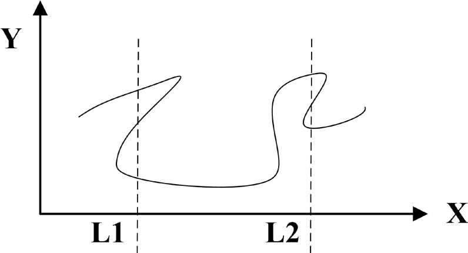

In this example, both lines L1 and L2 cut the graph for the relation thrice.

This signifies that for the same x-value, there are three different y-values

for each of case. Thus, the relation is not a function.

\### 2. Basic Logic

<!-- [1\\*, c1] -->

\#### 2.1. Propositional Logic

A proposition is a statement that is either true or false, but not both. Let’s

consider declarative sentences for which it is meaningful to assign either of

the two status values: \\_true\\_ or \\_false\\_. Some examples of propositions are

given below.

1. The sun is a star
1. Elephants are mammals.
1. 2 + 3 = 5.

However, a + 3 = b is not a proposition, as it is neither true nor false. It

depends on the values of the variables \\_a\\_ and \\_b\\_.

\\_The Law of Excluded Middle:\\_ For every proposition p, either p is true or p

is false.

\\_The Law of Contradiction:\\_ For every proposition p, it is not the case that

p is both true and false.

Propositional logic is the area of logic that deals with propositions. A truth

table displays the relationships between the truth values of propositions.

A Boolean variable is one whose value is either true or false. Computer bit

operations correspond to logical operations of Boolean variables.

The basic logical operators including negation (¬ p), conjunction (p ∧ q),

disjunction (p ∨ q), exclusive or (p ⊕ q), and implication (p → q) are to be

studied. Compound propositions may be formed using various logical operators.

A compound proposition that is always true is a tautology. A compound

proposition that is always false is a contradiction. A compound proposition

that is neither a tautology nor a contradiction is a contingency.

Compound propositions that always have the same truth value are called

logically equivalent (denoted by ≡). Some of the common equivalences are:

Identity laws:

p ∧ T ≡ p p ∨ F ≡ p

Domination laws:

p ∨ T ≡ T p ∧ F ≡ F

Idempotent laws:

p ∨ p ≡ p p ∧ p ≡ p

Double negation law:

¬ (¬ p) ≡ p

Commutative laws:

p ∨ q ≡ q ∨ p p ∧ q ≡ q ∧ p

Associative laws:

(p ∨ q) ∨ r ≡ p ∨ (q ∨ r)

(p ∧ q) ∧ r ≡ p ∧ (q ∧ r)

Distributive laws:

p ∨ (q ∧ r) ≡ (p ∨ q) ∧ (p ∨ r)

p ∧ (q ∨ r) ≡ (p ∧ q) ∨ (p ∧ r)

De Morgan’s laws:

¬ (p ∧ q) ≡ ¬ p ∨ ¬ q ¬ (p ∨ q) ≡ ¬ p ∧ ¬ q

\#### 2.2. Predicate Logic

A predicate is a verb phrase template that describes a property of objects or a

relationship among objects represented by the variables. For example, in the

sentence, The flower is red, the template is red is a predicate. It describes

the property of a flower. The same predicate may be used in other sentences

too.

Predicates are often given a name, e.g., “Red” or simply “R” can be used to

represent the predicate is red. Assuming R as the name for the predicate is

red , sentences that assert an object is of the color red can be represented as

R(x) , where x represents an arbitrary object. R(x) reads as x is red.

Quantifiers allow statements about entire collections of objects rather than

having to enumerate the objects by name.

The Universal quantifier ∀x asserts that a sentence is true for all values of

variable x. For example, ∀x Tiger(x) → Mammal(x) means all tigers are mammals.

The Existential quantifier ∃x asserts that a sentence is true for at least

one value of variable x. For example, ∃x Tiger(x) → Man-eater(x) means there

exists at least one tiger that is a man-eater. Thus, while universal

quantification uses implication, the existential quantification naturally

uses conjunction.

A variable \\_x\\_ that is introduced into a logical expression by a quantifier is

bound to the closest enclosing quantifier.

A variable is said to be a free variable if it is not bound to a quantifier.

Similarly, in a block-structured programming language, a variable in a logical

expression refers to the closest quantifier within whose scope it appears.

For example, in ∃x (Cat(x) ∧ ∀x (Black(x))), x in Black(x) is universally

quantified. The expression implies that cats exist and everything is black.

Propositional logic falls short in representing many assertions that are used

in computer science and mathematics. It also fails to compare equivalence and

some other types of relationship between propositions.

For example, the assertion \\_a is greater than 1\\_ is not a proposition because

one cannot infer whether it is true or false without knowing the value of \\_a\\_.

Thus, propositional logic cannot deal with such sentences. However, such

assertions appear quite often in mathematics and we want to infer on those

assertions. Also, the pattern involved in the following two logical equiva-

lences cannot be captured by propositional logic: “ \\_Not all men are smokers\\_ ”

and “ \\_Some men don’t smoke.\\_ ” Each of these two propositions is treated

independently in propositional logic. There is no mechanism in propositional

logic to find out whether or not the two are equivalent to one another. Hence,

in propositional logic, each equivalent proposition is treated individually

rather than dealing with a general formula that covers all equivalences

collectively.

Predicate logic is supposed to be a more powerful logic that addresses these

issues. In a sense, predicate logic (also known as first-order logic or

predicate calculus) is an extension of propositional logic to formulas

involving terms and predicates.

\### 3. Proof Techniques

<!-- [1\\*, c1] -->

A proof is an argument that rigorously establishes the truth of a statement.

Proofs can themselves be represented formally as discrete structures.

Statements used in a proof include axioms and postulates that are essentially

the underlying assumptions about mathematical structures, the hypotheses of the

theorem to be proved, and previously proved theorems.

A theorem is a statement that can be shown to be true.

A lemma is a simple theorem used in the proof of other theorems.

A corollary is a proposition that can be established directly from a theorem

that has been proved.

A conjecture is a statement whose truth value is unknown.

When a conjecture’s proof is found, the conjecture becomes a theorem. Many

times conjectures are shown to be false and, hence, are not theorems.

\#### 3.1. Methods of Proving Theorems

Direct Proof. Direct proof is a technique to establish that the implication p

→ q is true by showing that q must be true when p is true.

For example, to show that if n is odd then n^2 −1 is even, suppose n is odd,

- e., n = 2k + 1 for some integer k:

∴ n^2 = (2k + 1)^2 = 4k^2 + 4k + 1.

As the first two terms of the Right Hand Side (RHS) are even numbers

irrespective of the value of k, the Left Hand Side (LHS) (i.e., n^2 ) is an odd

number. Therefore, n^2 −1 is even.

Proof by Contradiction. A proposition p is true by contradiction if proved

based on the truth of the implication ¬ p → q where q is a contradiction. For

example, to show that the sum of 2x + 1 and 2y − 1 is even, assume that the sum

of 2x + 1 and 2y − 1is odd. In other words, 2(x + y), which is a multiple of 2,

is odd. This is a contradiction. Hence, the sum of 2x + 1 and 2y − 1 is even.

An inference rule is a pattern establishing that if a set of premises are all

true, then it can be deduced that a certain conclusion statement is true. The

reference rules of addition, simplification, and conjunction need to be

studied.

Proof by Induction. Proof by induction is done in two phases. First, the

proposition is established to be true for a base case—typically for the

positive integer 1. In the second phase, it is established that if the

proposition holds for an arbitrary positive integer \\_k,\\_ then it must also hold

for the next greater integer, \\_k + 1\\_. In other words, proof by induction is

based on the rule of inference that tells us that the truth of an infinite

sequence of propositions P(n), ∀n ∈ [1 ... ∞] is established if P(1) is

true, and secondly, ∀k ∈ [2 ... n] if P(k) → P(k + 1).

It may be noted here that, for a proof by mathematical induction, it is not

assumed that P(k) is true for all positive integers k. Proving a theorem or

proposition only requires us to establish that if it is assumed P(k) is true

for any arbitrary positive integer k, then P(k + 1) is also true. The

correctness of mathematical induction as a valid proof technique is beyond

discussion of the current text. Let us prove the following proposition

using induction.

Proposition: \\_The sum of the first n positive odd integers P(n) is n\\_^2\\_.\\_

Basis Step: The proposition is true for n = 1 as P(1) = 1^2 = 1. The basis step

is complete. Inductive Step: The induction hypothesis (IH) is that the

proposition is true for n = k, k being an arbitrary positive integer k.

∴ 1 + 3 + 5+ ... + (2k − 1) = k^2

Now, it’s to be shown that P(k) → P(k + 1).

P(k + 1) = 1 + 3 + 5+ ... +(2k − 1) + (2k + 1)

= P(k) + (2k + 1)

= k^2 + (2k + 1) [using IH]

= k^2 + 2k + 1

= (k + 1)^2

Thus, it is shown that if the proposition is true for n = k, then it is also

true for n = k + 1. The basis step together with the inductive step of the

proof show that P(1) is true and the conditional statement P(k) → P(k + 1) is

true for all positive integers k. Hence, the proposition is proved.

\### 4. Basics of Counting

<!-- [1\\*c6] -->

The sum rule states that if a task t 1 can be done in n 1 ways and a second

task t 2 can be done in n 2 ways, and if these tasks cannot be done at the same

time, then there are n 1 + n 2 ways to do either task.

- If A and B are disjoint sets, then |A ∪ B|=|A|

\+ |B|.

- In general if A1, A2, .... , An are disjoint

sets, then |A1 ∪ A2 ∪ ... ∪ An| = |A1| + |A2|

\+ ... + |An|.

For example, if there are 200 athletes doing sprint events and 30 athletes who

participate in the long jump event, then how many ways are there to pick one

athlete who is either a sprinter or a long jumper?

Using the sum rule, the answer would be 200

\+ 30 = 230.

The product rule states that if a task t 1 can be done in n 1 ways and a second

task t 2 can be done in n 2 ways after the first task has been done, then there

are n 1 \\* n 2 ways to do the procedure.

- If A and B are disjoint sets, then |A × B| =

|A| \\* |B|.

- In general if A1, A2, ..., An are disjoint sets,

then |A1 × A2 × ... × An| = |A1| \\* |A2| \\* ....

1. |An|.

For example, if there are 200 athletes doing sprint events and 30 athletes who

participate in the long jump event, then how many ways are there to pick two

athletes so that one is a sprinter and the other is a long jumper?

Using the product rule, the answer would be 200 \\* 30 = 6000.

The principle of inclusion-exclusion states that if a task t 1 can be done in n

1. ways and a second task t 2 can be done in n 2 ways at the same time with t 1

, then to find the total number of ways the two tasks can be done, subtract the

number of ways to do both tasks from n 1 + n 2.

- If A and B are not disjoint, |A ∪ B| = |A| +

|B| − |A ∩ B|.

In other words, the principle of inclusion-exclusion aims to ensure that the

objects in the intersection of two sets are not counted more than once.

\\_Recursion\\_ is the general term for the practice of defining an object in terms

of itself. There are recursive algorithms, recursively defined functions,

relations, sets, etc.

A recursive function is a function that calls itself. For example, we define

f(n) = 3 \\* f(n − 1) for all n ∈ N and n ≠ 0 and f(0) = 5.

An algorithm is recursive if it solves a problem by reducing it to an instance

of the same problem with a smaller input.

A phenomenon is said to be random if individual outcomes are uncertain but

the long-term pattern of many individual outcomes is predictable. The

probability of any outcome for a random phenomenon is the proportion of times

the outcome would occur in a very long series of repetitions.

The probability P(A) of any event A satisfies 0 ≤ P(A) ≤ 1. Any probability is

a number between 0 and 1. If S is the sample space in a probability model,

the P(S) = 1. All possible outcomes together must have probability of 1.

Two events A and B are disjoint if they have no outcomes in common and so can

never occur together. If A and B are two disjoint events, P(A or B) = P(A) +

P(B). This is known as the addition rule for disjoint events.

If two events have no outcomes in common, the probability that one or the other

occurs is the sum of their individual probabilities.

Permutation is an arrangement of objects in which the order matters without

repetition. One can choose r objects in a particular order from a total of n

objects by using nPr ways, where, npr = n! / (n − r)!. Various notations like

nPr and P(n, r) are used to represent the number of permutations of a set of n

objects taken r at a time.

Combination is a selection of objects in which the order does not matter

without repetition. This is different from a permutation because the order does

not matter. If the order is only changed (and not the members) then no new

combination is formed. One can choose r objects in any order from a total of n

objects by using nCr ways, where, nC

r = n! / [r! \\* (n − r)!].

\### 5. Graphs and Trees

<!-- [1\\*, c10, c11] -->

\#### 5.1. Graphs

A graph G = (V, E) where V is the set of vertices (nodes) and E is the set of

edges. Edges are also referred to as arcs or links.

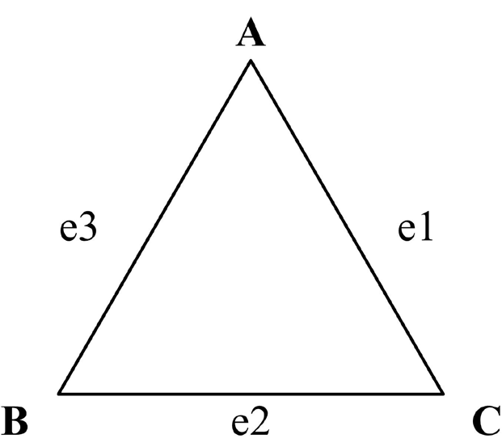

F is a function that maps the set of edges E to a set of ordered or unordered

pairs of elements V. For example, in Figure 14.8, G = (V, E) where V = {A, B,

C}, E = {e1, e2, e3}, and F = {(e1, (A, C)), (e2, (C, B)), (e3, (B, A))}.

The graph in Figure 14.8 is a simple graph that consists of a set of vertices

or nodes and a set of edges connecting unordered pairs.

The edges in simple graphs are undirected. Such graphs are also referred to as

undirected graphs.

For example, in Figure 14.8, (e1, (A, C)) may be replaced by (e1, (C, A)) as

the pair between vertices A and C is unordered. This holds good for the other

two edges too.

In a multigraph, more than one edge may connect the same two vertices. Two or

more connecting edges between the same pair of vertices may reflect multiple

associations between the same two vertices. Such edges are called parallel or

multiple edges.

For example, in Figure 14.9, the edges e3 and e4 are both between A and B.

Figure 14.9 is a multigraph where edges e3 and e4 are multiple edges.

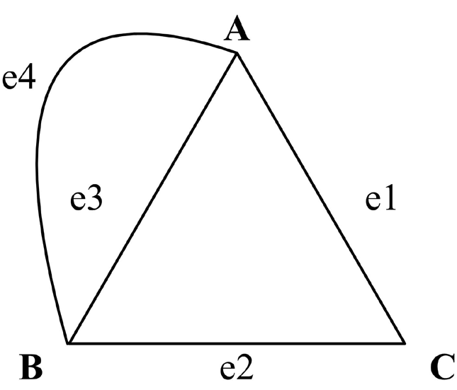

In a \\_pseudograph\\_ , edges connecting a node to itself are allowed. Such edges

are called loops.

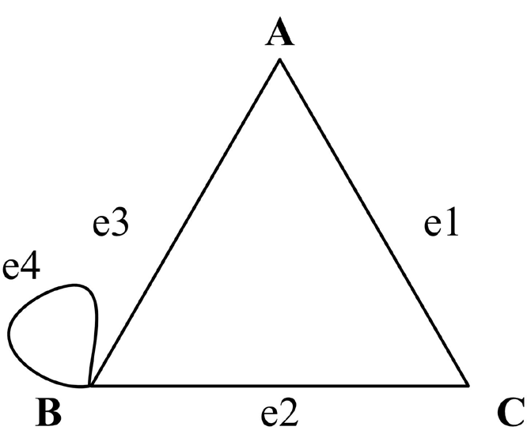

For example, in Figure 14.10, the edge e4 both starts and ends at B. Figure

14\.10 is a pseudo-graph in which e4 is a loop.

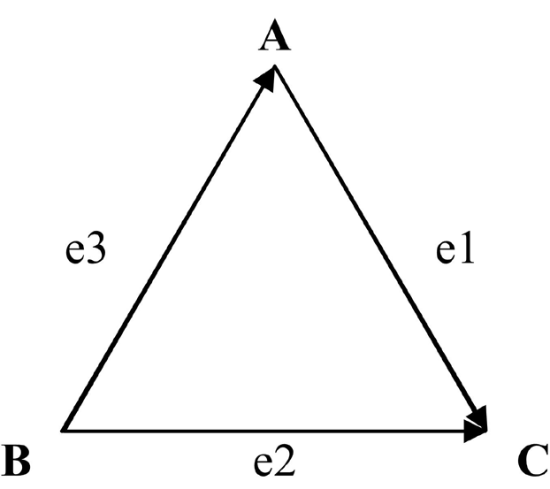

A directed graph G = (V, E) consists of a set of vertices V and a set of edges

E that are ordered pairs of elements of V. A directed graph may contain

loops.

For example, in Figure 14.11, G = (V, E) where V = {A, B, C}, E = {e1, e2, e3},

and F = {(e1, (A, C)), (e2, (B, C)), (e3, (B, A))}.

<!-- FIXME:  -->

In a weighted graph G = (V, E), each edge has a weight associated with it. The

weight of an edge typically represents the numeric value associated with the

relationship between the corresponding two vertices.

For example, in Figure 14.12, the weights for the edges e1, e2, and e3 are

taken to be 76, 93, and 15 respectively. If the vertices A, B, and C represent

three cities in a state, the weights, for example, could be the distances in

miles between these cities.

Let G = (V, E) be an undirected graph with edge set E. Then, for an edge e ∈ E

where e = {u, v}, the following terminologies are often used:

- u, v are said to be \\_adjacent\\_ or \\_neighbors\\_ or \\_connected\\_.
- edge e is \\_incident\\_ with vertices u and v.
- edge e \\_connects\\_ u and v.
- vertices u and v are \\_endpoints\\_ for edge e.

If vertex v ∈ V, the set of vertices in the undirected graph G(V, E), then:

- the \\_degree\\_ of v, deg(v), is its number of incident edges, except that any

self-loops are counted twice.

- a vertex with degree 0 is called an \\_isolated\\_ \\_vertex\\_.
- a vertex of degree 1 is called a \\_pendant\\_ \\_vertex\\_.

Let G(V, E) be a directed graph. If e(u, v) is an edge of G, then the following

terminologies are often used:

- u is \\_adjacent to\\_ v, and v is \\_adjacent from\\_ u.
- e \\_comes from\\_ u and \\_goes to\\_ v.
- e \\_connects\\_ u to v, or e \\_goes from\\_ u to v.
- the \\_initial vertex\\_ of e is u.
- the \\_terminal vertex\\_ of e is v.

If vertex v is in the set of vertices for the directed graph G(V, E), then

- \\_in-degree\\_ of v, deg−(v), is the number of edges going to v, i.e., for which

v is the terminal vertex.

- \\_out-degree\\_ of v, deg+(v), is the number of edges coming from v, i.e., for

which v is the initial vertex.

- \\_degree\\_ of v, deg(v) = deg−(v) + deg+(v), is the sum of vs in-degree and

out-degree.

- a loop at a vertex contributes 1 to both in-degree and out-degree of this

vertex.

It may be noted that, following the definitions above, the degree of a node is

unchanged whether we consider its edges to be directed or undirected. In an

undirected graph, a path of length n from u to v is a sequence of n adjacent

edges from vertex u to vertex v.

- A path is a \\_circuit\\_ if u=v.
- A path \\_traverses\\_ the vertices along it.
- A path is \\_simple\\_ if it contains no edge more than once.

A cycle on n vertices Cn for any n ≥ 3 is a simple graph where V = {v 1 , v 2

, ..., vn} and E = {{v 1 , v 2 }, {v 2 , v 3 }, ... , {vn−1, vn}, {vn, v 1 }}.

For example, Figure 14.13 illustrates two cycles of length 3 and 4.

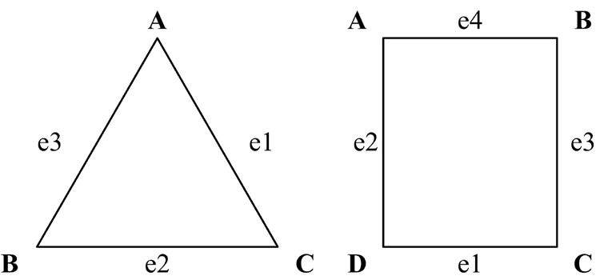

An adjacency list is a table with one row per vertex, listing its adjacent

vertices. The adjacency listing for a directed graph maintains a listing of the

terminal nodes for each of the vertex in the graph.

Ve r t ex

Adjacency

List

A B, C

B A, B, C

C A, B

<!-- -->

For example, Figure 14.14 illustrates the adjacency lists for the pseudograph

in Figure 14.10 and the directed graph in Figure 14.11. As the out-degree of

vertex C in Figure 14.11 is zero, there is no entry against C in the adjacency

list. Different representations for a graph—like adjacency matrix, incidence

matrix, and adjacency lists—need to be studied.

\#### 5.2. Trees

A tree T(N, E) is a hierarchical data structure of n = |N| nodes with a

specially designated root node R while the remaining n − 1 nodes form subtrees

under the root node R. The number of edges |E| in a tree would always be equal

to |N| − 1.

The subtree at node X is the subgraph of the tree consisting of node X and its

descendants and all edges incident to those descendants. As an alternate to

this recursive definition, a tree may be defined as a connected undirected

graph with no simple circuits.

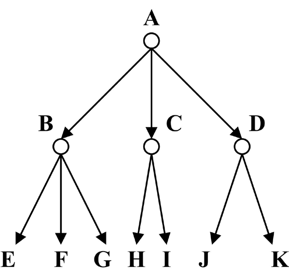

However, one should remember that a tree is strictly hierarchical in nature as

compared to a graph, which is flat. In case of a tree, an ordered pair is built

between two nodes as parent and child. Each child node in a tree is associated

with only one parent node, whereas this restriction becomes meaningless for a

graph where no parent-child association exists.

An undirected graph is a tree if and only if there is a unique simple path

between any two of its vertices.

Figure 14.15 presents a tree T(N, E) where the set of nodes N = {A, B, C, D, E,

F, G, H, I, J, K}. The edge set E is {(A, B), (A, C), (A, D), (B, E), (B, F),

(B, G), (C, H), (C, I), (D, J), (D, K)}. The parent of a nonroot node v is the

unique node u with a directed edge from u to v. Each node in the tree has a

unique parent node except the root of the tree.

For example, in Figure 14.15, root node A is the parent node for nodes B, C,

and D. Similarly, B is the parent of E, F, G, and so on. The root node A does

not have any parent. A node that has children is called an internal node.

For example, in Figure 14.15, node A or node B are examples of internal nodes.

The degree of a node in a tree is the same as its number of children.

For example, in Figure 14.15, root node A and its child B are both of degree 3.

Nodes C and D have degree 2.

The distance of a node from the root node in terms of number of hops is called

its \\_level\\_. Nodes in a tree are at different levels. The root node is at level

0\. Alternately, the level of a node X is the length of the unique path from the

root of the tree to node X.

For example, root node A is at level 0 in Figure 14.15. Nodes B, C, and D are

at level 1. The remaining nodes in Figure 14.15 are all at level 2. The height

of a tree is the maximum of the levels of nodes in the tree.

For example, in Figure 14.15, the height of the tree is 2.

A node is called a leaf if it has no children. The degree of a leaf node is 0.

For example, in Figure 14.15, nodes E through K are all leaf nodes with degree

0\. The ancestors or predecessors of a nonroot node X are all the nodes in the

path from root to node X.

For example, in Figure 14.15, nodes A and D form the set of ancestors for J.

The successors or descendents of a node X are all the nodes that have X as its

ancestor. For a tree with n nodes, all the remaining n − 1 nodes are successors

of the root node.

For example, in Figure 14.15, node B has successors in E, F, and G.

If node X is an ancestor of node Y, then node Y is a successor of X.

Two or more nodes sharing the same parent node are called sibling nodes.

For example, in Figure 14.15, nodes E and G are siblings. However, nodes E and

J, though from the same level, are not sibling nodes. Two sibling nodes are of

the same level, but two nodes in the same level are not necessarily siblings.

A tree is called an ordered tree if the relative position of occurrences of

children nodes is significant.

For example, a family tree is an ordered tree if, as a rule, the name of an

elder sibling appears always before (i.e., on the left of) the younger sibling.

In an unordered tree, the relative position of occurrences between the siblings

does not bear any significance and may be altered arbitrarily. A binary tree is

formed with zero or more nodes where there is a root node R and all the

remaining nodes form a pair of ordered subtrees under the root node.

In a binary tree, no internal node can have more than two children. However,

one must consider that besides this criterion in terms of the degree of

internal nodes, a binary tree is always ordered. If the positions of the left

and right subtrees for any node in the tree are swapped, then a new tree is

derived.

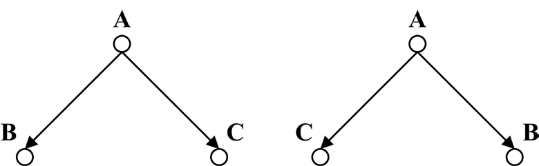

For example, in Figure 14.16, the two binary trees are different as the

positions of occurrences of the children of A are different in the two trees.

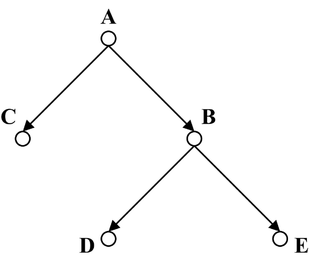

According to [1], a binary tree is called a full binary tree if every internal

node has exactly two children.

For example, the binary tree in Figure 14.17 is a full binary tree, as both of

the two internal nodes A and B are of degree 2.

A full binary tree following the definition above is also referred to as a

\\_strictly binary tree\\_. For example, both binary trees in Figure 14.18 are

complete binary trees. The tree in Figure 14.18(a) is a complete as well as a

full binary tree. A complete binary tree has all its levels, except possibly

the last one, filled up to capacity. In case the last level of a complete

binary tree is not full, nodes occur from the leftmost positions available.

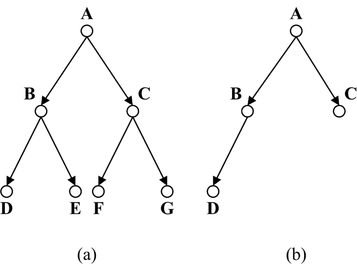

Interestingly, following the definitions above, the tree in Figure 14.18(b) is

a complete but not full binary tree as node B has only one child in D. On the

contrary, the tree in Figure 14.17 is a full —but not complete—binary tree, as

the children of B occur in the tree while the children of C do not appear in

the last level.

A binary tree of height H is balanced if all its leaf nodes occur at levels H

or H − 1.

For example, all three binary trees in Figures 14.17 and 14.18 are balanced

binary trees. There are at most 2H leaves in a binary tree of height H. In

other words, if a binary tree with L leaves is full and balanced, then its

height is H = ⎡log 2 L⎤.

For example, this statement is true for the two trees in Figures 14.17 and

14\.18(a) as both trees are full and balanced. However, the expression above

does not match for the tree in Figure 14.18(b) as it is not a full binary tree.

A binary search tree (BST) is a special kind of binary tree in which each node

contains a distinct key value, and the key value of each node in the tree is

less than every key value in its right subtree and greater than every key value

in its left subtree. A traversal algorithm is a procedure for systematically

visiting every node of a binary tree. Tree traversals may be defined

recursively. If T is binary tree with root R and the remaining nodes form an

ordered pair of nonnull left subtree TL and nonnull right subtree TR below R,

then the preorder traversal function PreOrder(T) is defined as:

PreOrder(T) = R, PreOrder(TL), PreOrder(TR)

... eqn. 1

The recursive process of finding the preorder traversal of the subtrees

continues till the subtrees are found to be Null. Here, commas have been used

as delimiters for the sake of improved readability.

The postorder and in-order may be similarly defined using eqn. 2 and eqn. 3

respectively.

PostOrder(T) = PostOrder(TL), PostOrder(TR),

R ... eqn 2

InOrder(T) = InOrder(TL), R, InOrder(TR) ...

eqn 3

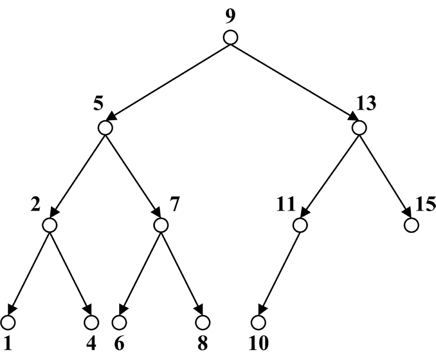

For example, the tree in Figure 14.19 is a binary search tree (BST). The

preorder, postorder, and in-order traversal outputs for the BST are given below

in their respective order.

Preorder output: 9, 5, 2, 1, 4, 7, 6, 8, 13, 11,

10, 15

Postorder output: 1, 4, 2, 6, 8, 7, 5, 10, 11, 15,

13, 9

In-order output: 1, 2, 4, 5, 6, 7, 8, 9, 10, 11,

13, 15

Further discussion on trees and their usage has been included in section 6,

Data Structure and Representation, of the Computing Foundations KA.

\### 6. Discrete Probability

<!-- [1\\*, c7] -->

Probability is the mathematical description of randomness. Basic definition of

probability and randomness has been defined in section 4 of this KA. Here, let

us start with the concepts behind probability distribution and discrete

probability. A probability model is a mathematical description of a random

phenomenon consisting of two parts: a sample space S and a way of assigning

probabilities to events. The sample space defines the set of all possible

outcomes, whereas an event is a subset of a sample space representing a pos-

sible outcome or a set of outcomes.

A random variable is a function or rule that assigns a number to each outcome.

Basically, it is just a symbol that represents the outcome of an experiment.

For example, let X be the number of heads when the experiment is flipping a

coin n times. Similarly, let S be the speed of a car as registered on a radar

detector.

The values for a random variable could be discrete or continuous depending on

the experiment. A discrete random variable can hold all possible outcomes

without missing any, although it might take an infinite amount of time.

A continuous random variable is used to measure an uncountable number of

values even if an infinite amount of time is given.

For example, if a random variable X represents an outcome that is a real number

between 1 and 100, then X may have an infinite number of values. One can

never list all possible outcomes for X even if an infinite amount of time is

allowed. Here, X is a continuous random variable. On the contrary, for the same

interval of 1 to 100, another random variable Y can be used to list all the

integer values in the range. Here, Y is a discrete random variable.

An upper-case letter, say X, will represent the name of the random variable.

Its lower-case counterpart, x, will represent the value of the random

variable.

The probability that the random variable X will equal x is:

P(X = x) or, more simply, P(x).

A probability distribution (density) function is a table, formula, or graph

that describes the values of a random variable and the probability asso-

ciated with these values.

Probabilities associated with discrete random variables have the following

properties:

1. 0 ≤ P(x) ≤ 1 for all x
1. ΣP(x) = 1

A discrete probability distribution can be represented as a discrete random

variable.

X 1 2 3 4 5 6

P(x) 1/6 1/6 1/6 1/6 1/6 1/6

<!-- FIXME:  -->

The mean μ of a probability distribution model is the sum of the product terms

for individual events and its outcome probability. In other words, for the

possible outcomes x 1 , x 2 , ... , xn in a sample space S if pk is the

probability of outcome xk, the mean of this probability would be μ = x 1

p 1 + x 2 p 2 + ... + xnpn.

For example, the mean of the probability density for the distribution in

Figure 14.20 would be

1. \\* (1/6) + 2 \\* (1/6) + 3 \\* (1/6) + 4 \\* (1/6) + 5
* (1/6) + 6 \\* (1/6)

= 21 \\* (1/6) = 3.5

Here, the sample space refers to the set of all possible outcomes.

The variance s^2 of a discrete probability model is: s^2 = (x 1 – μ)^2 p 1 + (x

2 – μ)^2 p 2 + ... + (xk – μ)^2 pk. The \\_standard deviation\\_ s is the square

root of the variance.

For example, for the probability distribution in Figure 14.20, the variation

σ^2 would be

s^2 = [(1 – 3.5)^2 \\* (1/6) + (2 – 3.5)^2 \\* (1/6) +

(3 – 3.5)^2 \\* (1/6) + (4 – 3.5)^2 \\* (1/6) + (5 –

3\.5)^2 \\* (1/6) + (6 – 3.5)^2 \\* (1/6)]

= (6.25 + 2.25 + 0.25 + 0.5 + 2.25 + 6.25) \\*

(1/6)

= 17.5 \\* (1/6)

= 2.90

∴ standard deviation s =

These numbers indeed aim to derive the average value from repeated

experiments. This is based on the single most important phenomenon of

probability, i.e., the average value from repeated experiments is likely to be

close to the expected value of one experiment. Moreover, the average value is

more likely to be closer to the expected value of any one experiment as the

number of experiments increases.

\### 7. Finite State Machines

<!-- [1\\*, c13] -->

A computer system may be abstracted as a mapping from state to state driven

by inputs. In other words, a system may be considered as a transition function

T: S × I → S × O, where S is the set of states and I, O are the input and

output functions. If the state set S is finite (not infinite), the system is

called a finite state machine (FSM). Alternately, a finite state machine (FSM)

is a mathematical abstraction composed of a finite number of states and

transitions between those states. If the domain S × I is reasonably small, then

one can specify T explicitly using diagrams similar to a flow graph to

illustrate the way logic flows for different inputs. However, this is prac-

tical only for machines that have a very small information capacity.

An FSM has a finite internal memory, an input feature that reads symbols in a

sequence and one at a time, and an output feature.

The operation of an FSM begins from a start state, goes through transitions

depending on input to different states, and can end in any valid state.

However, only a few of all the states mark a successful flow of operation.

These are called accept states.

The information capacity of an FSM is C = log |S|. Thus, if we represent a

machine having an information capacity of C bits as an FSM, then its state

transition graph will have |S| = 2C nodes. A finite state machine is formally

defined as M = ( S , I , O , f , g , s 0 ).

S is the state set;

I is the set of input symbols;

O is the set of output symbols;

f is the state transition function;

g is the output function;

and s 0 is the initial state.

Given an input x ∈ I on state Sk, the FSM makes a transition to state Sh

following state transition function f and produces an output y ∈ O using the

output function g.

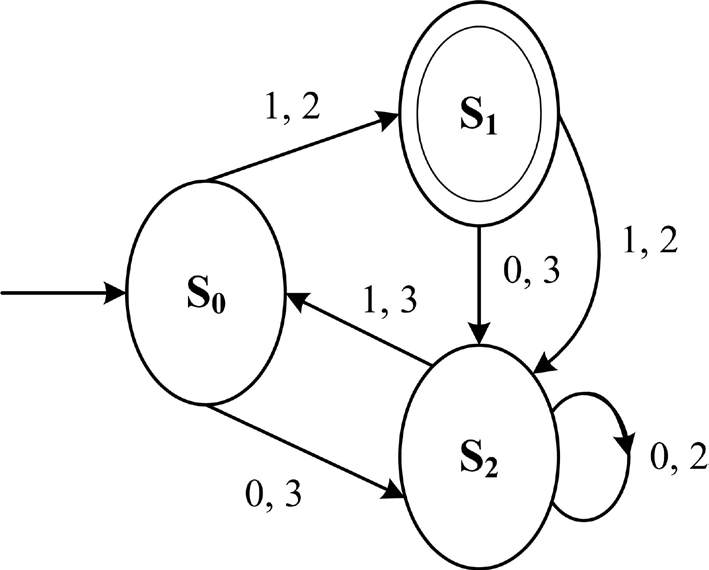

For example, Figure 14.21 illustrates an FSM

with S 0 as the start state and S 1 as the final state.

Here, S = {S 0 , S 1 , S 2 }; I = {0, 1}; O = {2, 3}; f(S 0 ,

\0) = S 2 , f(S 0 , 1) = S 1 , f(S 1 , 0) = S 2 , f(S 1 , 1) = S 2 , f(S 2 ,

\0) = S 2 , f(S 2 , 1) = S 0 ; g(S 0 , 0) = 3, g(S 0 , 1) = 2, g(S 1 ,

\0) = 3, g(S 1 , 1) = 2, g(S 2 , 0) = 2, g(S 2 , 1) = 3\.

Current

State

Input

0 1

S 0 S 2 S 1

S 1 S 2 S 2

S 2 S 2 S 0

(a)

Current

State

Output State

Input Input

0 1 0 1

S 0 3 2 S 2 S 1

S 1 3 2 S 2 S 2

S 2 2 3 S 2 S 0


(b)

<!-- FIXME:  -->

The state transition and output values for different inputs on different

states may be represented using a state table. The state table for the FSM in

Figure 14.21 is shown in Figure 14.22. Each pair against an input symbol

represents the new state and the output symbol.

For example, Figures 14.22(a) and 14.22(b) are two alternate representations of

the FSM in Figure 14.21.

\### 8. Grammars

<!-- [1\\*, c13] -->

The grammar of a natural language tells us whether a combination of words makes

a valid sentence. Unlike natural languages, a formal language is specified by

a well-defined set of rules for syntaxes. The valid sentences of a formal

language can be described by a grammar with the help of these rules, referred

to as production rules. A formal language is a set of finite-length words or

strings over some finite alphabet, and a grammar specifies the rules for

formation of these words or strings. The entire set of words that are valid for

a grammar constitutes the language for the grammar. Thus, the grammar G is

any compact, precise mathematical definition of a language L as opposed to just

a raw listing of all of the language’s legal sentences or examples of those

sentences.

A grammar implies an algorithm that would generate all legal sentences of the

language. There are different types of grammars. A phrase-structure or Type-0

grammar G = (V, T, S, P) is a 4-tuple in which:

- V is the vocabulary, i.e., set of words.
- T ⊆ V is a set of words called terminals.
- S ∈ N is a special word called the start symbol.
- P is the set of productions rules for substituting one sentence fragment

for another.

There exists another set N = V − T of words called nonterminals. The

nonterminals represent concepts like noun. Production rules are applied on

strings containing nonterminals until no more nonterminal symbols are present

in the string. The start symbol S is a nonterminal.

The language generated by a formal grammar G, denoted by L(G), is the set of

all strings over the set of alphabets V that can be generated, starting with

the start symbol, by applying production rules until all the nonterminal

symbols are replaced in the string.

For example, let G = ({S, A, a, b}, {a, b}, S, {S → aA, S → b, A → aa}). Here,

the set of terminals are N = {S, A}, where S is the start symbol. The three

production rules for the grammar are given as P1: S → aA; P2: S → b; P3: A →

aa. Applying the production rules in all possible ways, the following words may

be generated from the start symbol.

S → aA (using P1 on start symbol)

→ aaa (using P3)

S → b (using P2 on start symbol)

Nothing else can be derived for G. Thus, the language of the grammar G consists

of only two words: L(G) = {aaa, b}.

\#### 8.1. Language Recognition

Formal grammars can be classified according to the types of productions that

are allowed. The Chomsky hierarchy (introduced by Noam Chomsky in 1956)

describes such a classification scheme.

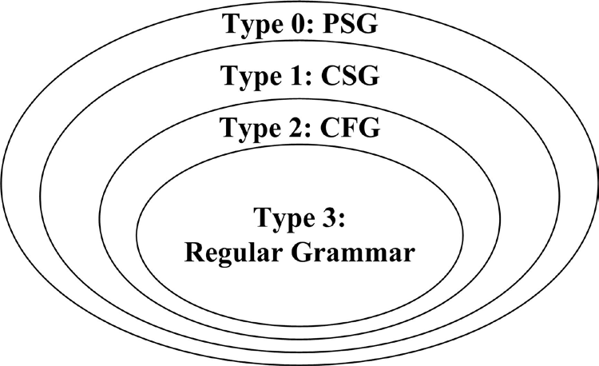

As illustrated in Figure 14.23, we infer the following on different types of

grammars:

1. Every regular grammar is a context-free grammar (CFG).
1. Every CFG is a context-sensitive grammar (CSG).
1. Every CSG is a phrase-structure grammar (PSG).

Context-Sensitive Grammar: All fragments in the RHS are either longer than the

corresponding fragments in the LHS or empty, i.e., if b → a, then |b| < |a| or

a = ∅.

A formal language is context-sensitive if a context-sensitive grammar

generates it. Context-Free Grammar: All fragments in the LHS are of length 1,

1. e., if A → a, then |A| = 1 for all A ∈ N.

The term context-free derives from the fact that A can always be replaced by a,

regardless of the context in which it occurs.

A formal language is context-free if a contextfree grammar generates it.

Context-free languages are the theoretical basis for the syntax of most

programming languages.

Regular Grammar. All fragments in the RHS are either single terminals or a pair

built by a terminal and a nonterminal; i.e., if A → a, then either a ∈ T, or a

= cD, or a = Dc for c ∈ T, D ∈ N. If a = cD, then the grammar is called a right

linear grammar. On the other hand, if a = Dc, then the grammar is called a left

linear grammar. Both the right linear and left linear grammars are regular or

Type-3 grammar.

The language L(G) generated by a regular grammar G is called a regular

language. A regular expression A is a string (or pattern) formed from the

following six pieces of information: a ∈ S, the set of alphabets, e, 0 and

the operations, OR (+), PRODUCT (.), CONCATENATION (\\*). The language of G,

L(G) is equal to all those strings that match G, L(G) = {x ∈ S\\*|x matches G}.

For any a ∈ S, L(a) = a; L(e) = {ε}; L(0) = 0.

\+ functions as an or, L(A + B) = L(A) ∪ L(B).

. creates a product structure, L(AB) = L(A).

L(B).

* denotes concatenation, L(A\\*) = {x 1 x 2 ...xn |

xi ∈ L(A) and n ³ 0}

For example, the regular expression (ab)\\*

matches the set of strings: {e, ab, abab, ababab,

abababab, ...}.

For example, the regular expression (aa)\\* matches the set of strings on one

letter \\_a\\_ that have even length.

For example, the regular expression (aaa)\\* +

(aaaaa)\\* matches the set of strings of length equal

to a multiple of 3 or 5.

\### 9. Numerical Precision, Accuracy, and Errors

<!-- [2\\*, c2] -->

The main goal of numerical analysis is to develop efficient algorithms for

computing precise numerical values of functions, solutions of algebraic and

differential equations, optimization problems, etc.

A matter of fact is that all digital computers can only store finite numbers.

In other words, there is no way that a computer can represent an infinitely

large number—be it an integer, rational number, or any real or all complex

numbers (see section 10, Number Theory). So the mathematics of approximation

becomes very critical to handle all the numbers in the finite range that a

computer can handle.

Each number in a computer is assigned a location or word, consisting of a

specified number of binary digits or bits. A k bit word can store a total of N

= 2k different numbers.

For example, a computer that uses 32 bit arithmetic can store a total of N =

2^32 ≈ 4.3 × 10^9 different numbers, while another one that uses 64 bits can

handle N’ = 2^64 ≈ 1.84 × 10^19 different numbers. The question is how to

distribute these N numbers over the real line for maximum efficiency and

accuracy in practical computations. One evident choice is to distribute them

evenly, leading to fixed-point arithmetic. In this system, the first bit in a

word is used to represent a sign and the remaining bits are treated for integer

values. This allows representation of the integers from 1 − ½N, i.e., = 1 −

2k−1 to 1. As an approximating method, this is not good for noninteger

numbers.

Another option is to space the numbers closely together—say with a uniform gap

of 2−n—and so distribute the total N numbers uniformly over the interval

−2−n−1N < x ≤ 2−n−1N. Real numbers lying between the gaps are represented by

either \\_rounding\\_ (meaning the closest exact representative) or chopping

(meaning the exact representative immediately below —or above, if negative—the

number).

Numbers lying beyond the range must be represented by the largest (or largest

negative) number that can be represented. This becomes a symbol for overflow.

Overflow occurs when a computation produces a value larger than the maximum

value in the range.

When processing speed is a significant bottleneck, the use of the fixed-point

representations is an attractive and faster alternative to the more cumbersome

floating-point arithmetic most commonly used in practice.

Let’s define a couple of very important terms: accuracy and precision as

associated with numerical analysis.

Accuracy is the closeness with which a measured or computed value agrees with

the true value. Precision, on the other hand, is the closeness with which two

or more measured or computed values for the same physical substance agree with

each other. In other words, precision is the closeness with which a number

represents an exact value.

Let x be a real number and let x\\* be an approximation. The absolute error in

the approximation x\\* ≈ x is defined as | x\\* − x |. The relative error is

defined as the ratio of the absolute error to the size of x, i.e., |x\\* − x| / |

x |, which assumes x ¹ 0; otherwise, relative error is not defined. For

example, 1000000 is an approximation to 1000001 with an absolute error of 1 and

a relative error of 10−6, while 10 is an approximation of 11 with an absolute

error of 1 and a relative error of 0.1. Typically, relative error is more

intuitive and the preferred determiner of the size of the error. The present

convention is that errors are always ≥ 0, and are = 0 if and only if the

approximation is exact.

An approximation x\\* has k significant decimal digits if its relative error is

< 5 × 10−k−1. This means that the first k digits of x\\* following its first

nonzero digit are the same as those of x. Significant digits are the digits of

a number that are known to be correct. In a measurement, one uncertain digit is

included.

For example, measurement of length with a ruler of 15.5 mm with ±0.5 mm maximum

allowable error has 2 significant digits, whereas a measurement of the same

length using a caliper and recorded as 15.47 mm with ±0.01 mm maximum

allowable error has 3 significant digits.

\### 10. Number Theory

<!-- [1\\*, c4] -->

Number theory is one of the oldest branches of pure mathematics and one of the

largest. Of course, it concerns questions about numbers, usually meaning whole

numbers and fractional or rational numbers. The different types of numbers

include integer, real number, natural number, complex number, rational number,

etc.

\#### 10.1. Divisibility

Let’s start this section with a brief description of each of the above types of

numbers, starting with the natural numbers.

\\_Natural Numbers.\\_ This group of numbers starts at 1 and continues: 1, 2, 3, 4,

5, and so on. Zero is not in this group. There are no negative or fractional

numbers in the group of natural numbers. The common mathematical symbol for the

set of all natural numbers is N.

\\_Whole Numbers.\\_ This group has all of the natural numbers in it plus the

number 0.

Unfortunately, not everyone accepts the above definitions of natural and whole

numbers. There seems to be no general agreement about whether to include 0 in

the set of natural numbers. Many mathematicians consider that, in Europe, the

sequence of natural numbers traditionally started with 1 (0 was not even

considered to be a number by the Greeks). In the 19th century, set

theoreticians and other mathematicians started the convention of including 0 in

the set of natural numbers.

\\_Integers.\\_ This group has all the whole numbers in it and their negatives. The

common mathematical symbol for the set of all integers is Z, i.e., Z = {...,

−3, −2, −1, 0, 1, 2, 3, ...}.

\\_Rational Numbers.\\_ These are any numbers that can be expressed as a ratio of

two integers. The common symbol for the set of all rational numbers is Q.

Rational numbers may be classified into three types, based on how the decimals

act. The decimals either do not exist, e.g., 15, or, when decimals do exist,

they may terminate, as in 15.6, or they may repeat with a pattern, as in

1\.666..., (which is 5/3).

Irrational Numbers. These are numbers that cannot be expressed as an integer

divided by an integer. These numbers have decimals that never terminate and

never repeat with a pattern, e.g., PI or √2.

Real Numbers. This group is made up of all the rational and irrational numbers.

The numbers that are encountered when studying algebra are real numbers. The

common mathematical symbol for the set of all real numbers is R.

Imaginary Numbers. These are all based on the imaginary number i. This

imaginary number is equal to the square root of −1. Any real number multiple of

i is an imaginary number, e.g., i , 5 i , 3.2 i , −2.6 i, etc.

Complex Numbers. A complex number is a combination of a real number and an

imaginary number in the form a + b i. The real part is a, and b is called the

imaginary part. The common mathematical symbol for the set of all complex

numbers is C.

For example, 2 + 3 i , 3−5 i , 7.3 + 0 i , and 0 + 5 i. Consider the last two

examples: 7.3 + 0 i is the same as the real number 7.3. Thus, all real numbers

are complex numbers with zero for the imaginary part. Similarly, 0 + 5 i is

just the imaginary number 5 i. Thus, all imaginary numbers are complex numbers

with zero for the real part. Elementary number theory involves divisibility

among integers. Let a, b ∈ Z with a ≠ 0.The expression a|b, i.e., a divides b

if ∃c ∈ Z: b = ac, i.e., there is an integer c such that c times a equals b.

For example, 3|−12 is true, but 3|7 is false. If a divides b , then we say

that a is a factor of b or a is a divisor of b , and b is a multiple of a.

b is even if and only if 2| b. Let a, d ∈ Z with d > 1. Then a mod d

denotes that the remainder r from the division algorithm with dividend a

and divisor d , i.e., the remainder when a is divided by d. We can compute

(a mod d) by: a − d \\* ⎣ a/d ⎦ , where ⎣ a/d ⎦ represents the floor of the

real number. Let Z+ = {n ∈ Z | n > 0} and a, b ∈ Z, m ∈ Z+, then a is

congruent to b modulo m , written as a ≡ b (mod m) , if and only if m |

a−b.

Alternately, \\_a\\_ is congruent to \\_b modulo m\\_ if and only if \\_(a−b) mod m = 0\\_.

\#### 10.2. Prime Number, GCD

An integer p > 1 is prime if and only if it is not the product of any two

integers greater than 1, i.e., p is prime if p > 1 ∧ ∃ ¬ a, b ∈ N: a > 1, b >

1, a \\* b = p.

The only positive factors of a prime p are 1 and p itself. For example, the

numbers 2, 13, 29, 61, etc. are prime numbers. Nonprime integers greater than 1

are called composite numbers. A composite number may be composed by multi-

plying two integers greater than 1.

There are many interesting applications of prime numbers; among them are the

public-key cryptography scheme, which involves the exchange of public keys

containing the product \\_p\\*q\\_ of two random large primes \\_p\\_ and \\_q\\_ (a private

key) that must be kept secret by a given party. The greatest common divisor

gcd(a, b) of integers a, b is the greatest integer d that is a divisor both

of a and of b, i.e.,

d = gcd(a, b) for max(d: d|a ∧ d|b)

For example, gcd(24, 36) = 12. Integers \\_a\\_ and \\_b\\_ are called relatively prime

or coprime if and only if their GCD is 1. For example, neither 35 nor 6 are

prime, but they are coprime as these two numbers have no common factors greater

than 1, so their GCD is 1. A set of integers X = {i 1 , i 2 , ...} is

relatively prime if all possible pairs ih, ik, h ≠ k drawn from the set X are

relatively prime.

\### 11. Algebraic Structures

This section introduces a few representations used in higher algebra. An

algebraic structure consists of one or two sets closed under some operations

and satisfying a number of axioms, including none.

For example, group, monoid, ring, and lattice are examples of algebraic

structures. Each of these is defined in this section.

\#### 11.1. Group

A set S closed under a binary operation • forms a group if the binary operation

satisfies the following four criteria:

- Associative: ∀a, b, c ∈ S, the equation (a • b) - c = a • (b • c) holds.
- Identity: There exists an identity element I ∈ S such that for all a ∈ S, I •

a = a • I = a.

- Inverse: Every element a ∈ S, has an inverse a' ∈ S with respect to the

binary operation, i.e., a • a' = I; for example, the set of integers Z with

respect to the addition operation is a group. The identity element of the set

is 0 for the addition operation. ∀x ∈ Z, the inverse of x would be –x, which

is also included in Z.

- Closure property: ∀a, b ∈ S, the result of the operation a • b ∈ S.
- A group that is commutative, i.e., a • b = b • a, is known as a commutative

or Abelian group.

The set of natural numbers N (with the operation of addition) is not a group,

since there is no inverse for any x > 0 in the set of natural numbers. Thus,

the third rule (of inverse) for our operation is violated. However, the set of

natural number has some structure.

Sets with an associative operation (the first condition above) are called

semigroups; if they also have an identity element (the second condition),

then they are called monoids.

Our set of natural numbers under addition is then an example of a monoid, a

structure that is not quite a group because it is missing the requirement that

every element have an inverse under the operation.

A monoid is a set S that is closed under a single associative binary operation

- and has an identity element I ∈ S such that for all a ∈ S, I • a = a • I = a.

A monoid must contain at least one element. For example, the set of natural

numbers N forms a commutative monoid under addition with identity element 0.

The same set of natural numbers N also forms a monoid under multiplication

with identity element 1. The set of positive integers P forms a commutative

monoid under multiplication with identity element 1. It may be noted that,

unlike those in a group, elements of a monoid need not have inverses. A monoid

can also be thought of as a semigroup with an identity element.

A \\_subgroup\\_ is a group \\_H\\_ contained within a bigger one, \\_G,\\_ such that the

identity element of \\_G\\_ is contained in \\_H\\_ , and whenever \\_h\\_ 1 and \\_h\\_ 2 are

in \\_H\\_ , then so are \\_h\\_ 1 • \\_h\\_ 2 and \\_h\\_ 1 −1. Thus, the elements of \\_H\\_ ,

equipped with the group operation on \\_G\\_ restricted to \\_H\\_ , indeed form a

group.

Given any subset \\_S\\_ of a group \\_G\\_ , the subgroup generated by \\_S\\_ consists of

products of elements of \\_S\\_ and their inverses. It is the smallest subgroup of

\\_G\\_ containing \\_S\\_.

For example, let \\_G\\_ be the Abelian group whose elements are \\_G\\_ = {0, 2, 4, 6,

1, 3, 5, 7} and whose group operation is addition modulo 8. This group has a

pair of nontrivial subgroups: \\_J\\_ = {0, 4} and \\_H\\_ = {0, 2, 4, 6}, where \\_J\\_ is

also a subgroup of \\_H\\_. In group theory, a cyclic group is a group that can be

generated by a single element, in the sense that the group has an element \\_a\\_

(called the \\_generator\\_ of the group) such that, when written multiplicatively,

every element of the group is a power of \\_a\\_.

A group G is cyclic if G = {an for any integer n}. Since any group generated by

an element in a group is a subgroup of that group, showing that the only

subgroup of a group G that contains \\_a\\_ is G itself suffices to show that G is

cyclic. For example, the group \\_G\\_ = {0, 2, 4, 6, 1, 3, 5, 7}, with respect to

addition modulo 8 operation, is cyclic. The subgroups \\_J\\_ = {0, 4} and \\_H\\_ =

{0, 2, 4, 6} are also cyclic.

\#### 11.2. Rings

If we take an Abelian group and define a second operation on it, a new

structure is found that is different from just a group. If this second opera-

tion is associative and is distributive over the first, then we have a ring.

A ring is a triple of the form (S, +, •), where (S, +) is an Abelian group, (S,

•) is a semigroup, and - is distributive over +; i.e., “ a, b, c ∈ S, the equa-

tion \\_a\\_ • ( \\_b\\_ + \\_c\\_ ) = ( \\_a\\_ • \\_b\\_ ) + ( \\_a\\_ • \\_c\\_ ) holds. Further, if -

is commutative, then the ring is said to be commutative. If there is an

identity element for the • operation, then the ring is said to have an

identity. For example, (Z, +, \\*), i.e., the set of integers Z, with the usual

addition and multiplication operations, is a ring. As (Z, \\*) is

commutative, this ring is a commutative or Abelian ring. The ring has 1 as

its identity element.

Let’s note that the second operation may not have an identity element, nor

do we need to find an inverse for every element with respect to this second

operation. As for what distributive means, intuitively it is what we do

in elementary mathematics when performing the following change:

a \\* (b + c) = (a \\* b) + (a \\* c).

A field is a ring for which the elements of the set, excluding 0, form an

Abelian group with the second operation.

A simple example of a field is the field of rational numbers (R, +, \\*)

with the usual addition and multiplication operations. The numbers of the

format \\_a\\_ / \\_b\\_ ∈ R, where \\_a, b\\_ are integers and \\_b\\_ ≠ 0. The additive

inverse of such a fraction is simply − \\_a\\_ / \\_b\\_ , and the multiplicative

inverse is \\_b/a\\_ provided that \\_a\\_ ≠ 0.

\### Matrix Of Topics vs. Reference Material

Rosen 2011

[1]

Cheney and Kincaid 2007

[2]

\\*\\*1. Sets, Relations, Functions\\*\\* c2

\\*\\*2. Basic Logic\\*\\* c1

\\*\\*3. Proof Techniques\\*\\* c1

\\*\\*4. Basic Counting\\*\\* c6

\\*\\*5. Graphs and Trees\\*\\* c10, c11

\\*\\*6. Discrete Probability\\*\\* c7

\\*\\*7. Finite State Machines\\*\\* c13

\\*\\*8. Grammars\\*\\* c13

\\*\\*9. Numerical Precision, Accuracy, and Errors\\*\\* c2

\\*\\*10. Number Theory\\*\\* c4

\\*\\*11. Algebraic Structures\\*\\*

\\*\\*References\\*\\*

[1] K. Rosen, \\_Discrete Mathematics and Its Applications\\_ , 7th ed.,

McGraw-Hill, 2011.

[2] E.W. Cheney and D.R. Kincaid, \\_Numerical Mathematics and Computing\\_ , 6th

ed., Brooks/Cole, 2007.

\\*\\*Acknowledgments\\*\\*

The author thankfully acknowledges the contribution of Prof. Arun Kumar

Chatterjee, Ex-Head, Department of Mathematics, Manipur University, India,

and Prof. Devadatta Sinha, Ex-Head, Department of Computer Science and

Engineering, University of Calcutta, India, in preparing this chapter on

Mathematical Foundations.

\## Chapter 15: Engineering Foundations

\\*\\*Acronyms\\*\\*

- CAD Computer-Aided Design
- CMMI Capability Maturity Model Integration
- pdf Probability Density Function
- pmf Probability Mass Function
- RCA Root Cause Analysis
- SDLC Software Development Life Cycle

\\*\\*Introduction\\*\\*

IEEE defines engineering as “the application of a systematic, disciplined,

quantifiable approach to structures, machines, products, systems or processes”

[1]. This chapter outlines some of the engineering foundational skills and

techniques that are useful for a software engineer. The focus is on topics that

support other KAs while minimizing duplication of subjects covered elsewhere

in this document.

As the theory and practice of software engineering matures, it is

increasingly apparent that software engineering is an engineering discipline

that is based on knowledge and skills common to all engineering disciplines.

This Engineering Foundations knowledge area (KA) is concerned with the

engineering foundations that apply to software engineering and other engi-

neering disciplines. Topics in this KA include empirical methods and

experimental techniques; statistical analysis; measurement; engineering design;

modeling, prototyping, and simulation; standards; and root cause analysis.

Application of this knowledge, as appropriate, will allow software engineers to

develop and maintain software more efficiently and effectively. Completing

their engineering work efficiently and effectively is a goal of all engineers

in all engineering disciplines.

\\*\\*Breakdown Of Topics For Engineering Foundations\\*\\*

The breakdown of topics for the Engineering Foundations KA is shown in Figure

15\.1.

\### 1. Empirical Methods and Experimental Techniques

<!-- [2\\*, c1] -->

An engineering method for problem solving involves proposing solutions or

models of solutions and then conducting experiments or tests to study the

proposed solutions or models. Thus, engineers must understand how to create an

experiment and then analyze the results of the experiment in order to

evaluate the proposed solution. Empirical methods and experimental techniques

help the engineer to describe and understand variability in their

observations, to identify the sources of variability, and to make decisions.

Three different types of empirical studies commonly used in engineering

efforts are designed experiments, observational studies, and retrospective

studies. Brief descriptions of the commonly used methods are given below.

\#### 1.1. Designed Experiment

A designed or controlled experiment is an investigation of a testable

hypothesis where one or more independent variables are manipulated to measure

their effect on one or more dependent variables. A precondition for conducting

an experiment is the existence of a clear hypothesis. It is important for an

engineer to understand how to formulate clear hypotheses.

Designed experiments allow engineers to determine in precise terms how the

variables are related and, specifically, whether a cause-effect relationship

exists between them. Each combination of values of the independent variables

is a \\_treatment\\_. The simplest experiments have just two treatments

representing two levels of a single independent variable (e.g., using a tool

vs. not using a tool). More complex experimental designs arise when more than

two levels, more than one independent variable, or any dependent variables are

used.

\#### 1.2. Observational Study

An observational or case study is an empirical inquiry that makes observations

of processes or phenomena within a real-life context. While an experiment

deliberately ignores context, an observational or case study includes context

as part of the observation. A case study is most useful when the focus of the

study is on \\_how\\_ and \\_why\\_ questions, when the behavior of those involved in

the study cannot be manipulated, and when contextual conditions are relevant

and the boundaries between the phenomena and context are not clear.

\#### 1.3. Retrospective Study

A retrospective study involves the analysis of historical data. Retrospective

studies are also known as historical studies. This type of study uses data

(regarding some phenomenon) that has been archived over time. This archived

data is then analyzed in an attempt to find a relationship between variables,

to predict future events, or to identify trends. The quality of the analysis

results will depend on the quality of the information contained in the archived

data. Historical data may be incomplete, inconsistently measured, or

incorrect.

\### 2. Statistical Analysis

<!-- [2\\*, c9s1, c2s1] [3\\*, c10s3] -->

In order to carry out their responsibilities, engineers must understand how

different product and process characteristics vary. Engineers often come across

situations where the relationship between different variables needs to be

studied. An important point to note is that most of the studies are carried out

on the basis of samples and so the observed results need to be understood with

respect to the full population. Engineers must, therefore, develop an adequate

understanding of statistical techniques for collecting reliable data in terms

of sampling and analysis to arrive at results that can be generalized. These

techniques are discussed below.

\#### 2.1. Unit of Analysis (Sampling Units), Population, and Sample

Unit of analysis. While carrying out any empirical study, observations need

to be made on chosen units called the units of analysis or sampling units.

The unit of analysis must be identified and must be appropriate for the

analysis. For example, when a software product company wants to find the

perceived usability of a software product, the user or the software function

may be the unit of analysis.

Population. The set of all respondents or items (possible sampling units) to be

studied forms the population. As an example, consider the case of studying the

perceived usability of a software product. In this case, the set of all

possible users forms the population.

While defining the population, care must be exercised to understand the study

and target population. There are cases when the population studied and the

population for which the

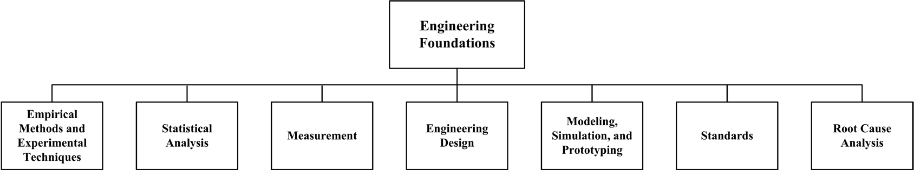

results are being generalized may be different. For example, when the study

population consists of only past observations and generalizations are required

for the future, the study population and the target population may not be the

same.

\\_Sample\\_ A sample is a subset of the population. The most crucial issue

towards the selection of a sample is its representativeness, including size.

The samples must be drawn in a manner so as to ensure that the draws are

independent, and the rules of drawing the samples must be predefined so that

the probability of selecting a particular sampling unit is known beforehand.

This method of selecting samples is called \\_probability sampling\\_.

\\_Random variable\\_ In statistical terminology, the process of making

observations or measurements on the sampling units being studied is referred

to as conducting the experiment. For example, if the experiment is to toss a

coin 10 times and then count the number of times the coin lands on heads, each

10 tosses of the coin is a sampling unit and the number of heads for a given

sample is the observation or outcome for the experiment. The outcome of an

experiment is obtained in terms of real numbers and defines the random variable

being studied. Thus, the attribute of the items being measured at the outcome

of the experiment represents the random variable being studied; the observation

obtained from a particular sampling unit is a particular realization of the

random variable. In the example of the coin toss, the random variable is the

number of heads observed for each experiment. In statistical studies,

attempts are made to understand population characteristics on the basis of

samples. The set of possible values of a random variable may be finite or

infinite but countable (e.g., the set of all integers or the set of all odd

numbers). In such a case, the random variable is called a \\_discrete random

variable.\\_ In other cases, the random variable under consideration may take

values on a continuous scale and is called a \\_continuous random variable.

Event.\\_ A subset of possible values of a random variable is called an event.

Suppose X denotes some random variable; then, for example, we may define

different events such as X³ x or X < x and so on.

Distribution of a random variable. The range and pattern of variation of a

random variable is given by its distribution. When the distribution of a random

variable is known, it is possible to compute the chance of any event. Some

distributions are found to occur commonly and are used to model many random

variables occurring in practice in the context of engineering. A few of the

more commonly occurring distributions are given below.

- Binomial distribution: used to model random variables that count the number

of successes in \\_n\\_ trials carried out independently of each other, where

each trial results in success or failure. We make an assumption that the

chance of obtaining a success remains constant [2\\*, c3s6].

- Poisson distribution: used to model the count of occurrence of some event

over time or space [2\\*, c3s9].

- Normal distribution: used to model continuous random variables or discrete

random variables by taking a very large number of values [2\\*, c4s6].

Concept of parameters. A statistical distribution is characterized by some

parameters. For example, the proportion of success in any given trial is the

only parameter characterizing a binomial distribution. Similarly, the Poisson

distribution is characterized by a rate of occurrence. A normal distribution is

characterized by two parameters: namely, its mean and standard deviation.

Once the values of the parameters are known, the distribution of the random

variable is completely known and the chance (probability) of any event can be

computed. The probabilities for a discrete random variable can be computed

through the probability mass function, called the pmf. The pmf is defined at

discrete points and gives the point mass—i.e., the probability that the random

variable will take that particular value. Likewise, for a continuous random

variable, we have the probability density function, called the pdf. The pdf

is very much like density and needs to be integrated over a range to obtain the

probability that the continuous random variable lies between certain values.

Thus, if the pdf or pmf is known, the chances of the random variable taking

certain set of values may be computed theoretically.

\\_Concept of estimation\\_ [2\\*, c6s2, c7s1, c7s3]. The true values of the

parameters of a distribution are usually unknown and need to be estimated from

the sample observations. The estimates are functions of the sample values and

are called statistics. For example, the sample mean is a statistic and may be

used to estimate the population mean. Similarly, the rate of occurrence of

defects estimated from the sample (rate of defects per line of code) is a

statistic and serves as the estimate of the population rate of rate of defects

per line of code. The statistic used to estimate some population parameter is

often referred to as the \\_estimator\\_ of the parameter.

A very important point to note is that the results of the estimators themselves

are random. If we take a different sample, we are likely to get a different

estimate of the population parameter. In the theory of estimation, we need to

understand different properties of estimators—particularly, how much the

estimates can vary across samples and how to choose between different

alternative ways to obtain the estimates. For example, if we wish to estimate

the mean of a population, we might use as our estimator a sample mean, a sample

median, a sample mode, or the midrange of the sample. Each of these estimators

has different statistical properties that may impact the standard error of the

estimate.

\\_Types of estimates\\_ [2\\*, c7s3, c8s1].There are two types of estimates: namely,

point estimates and interval estimates. When we use the value of a statistic to

estimate a population parameter, we get a point estimate. As the name

indicates, a point estimate gives a point value of the parameter being

estimated.

Although point estimates are often used, they leave room for many questions.

For instance, we are not told anything about the possible size of error or

statistical properties of the point estimate. Thus, we might need to

supplement a point estimate with the sample size as well as the variance of

the estimate. Alternately, we might use an interval estimate. An interval

estimate is a random interval with the lower and upper limits of the interval

being functions of the sample observations as well as the sample size. The lim-

its are computed on the basis of some assumptions regarding the sampling

distribution of the point estimate on which the limits are based. Properties of

estimators. Various statistical properties of estimators are used to decide

about the appropriateness of an estimator in a given situation. The most

important properties are that an estimator is unbiased, efficient, and

consistent with respect to the population.

Tests of hypotheses [2\\*, c9s1].A hypothesis is a statement about the possible

values of a parameter. For example, suppose it is claimed that a new method

of software development reduces the occurrence of defects. In this case, the

hypothesis is that the rate of occurrence of defects has reduced. In tests of

hypotheses, we decide —  on the basis of sample observations—whether a proposed

hypothesis should be accepted or rejected. For testing hypotheses, the null and

alternative hypotheses are formed. The null hypothesis is the hypothesis of no

change and is denoted as H 0. The alternative hypothesis is written as H 1. It

is important to note that the alternative hypothesis may be one-sided or

two-sided. For example, if we have the null hypothesis that the population mean

is not less than some given value, the alternative hypothesis would be that

it is less than that value and we would have a one-sided test. However, if we

have the null hypothesis that the population mean is equal to some given value,

the alternative hypothesis would be that it is not equal and we would have a

two-sided test (because the true value could be either less than or greater

than the given value). In order to test some hypothesis, we first compute

some statistic. Along with the computation of the statistic, a region is

defined such that in case the computed value of the statistic falls in that

region, the null hypothesis is rejected. This region is called the critical

region (also known as the confidence interval). In tests of hypotheses, we need

to accept or reject the null hypothesis on the basis of the evidence obtained.

We note that, in general, the alternative hypothesis is the hypothesis of

interest. If the computed value of the statistic does not fall inside the

critical region, then we cannot reject the null hypothesis. This indicates that

there is not enough evidence to believe that the alternative hypothesis is

true.

As the decision is being taken on the basis of sample observations, errors are

possible; the types of such errors are summarized in the following table.

<!-- FIXME: table -->

Nature

Statistical Decision

Accept H 0 Reject H 0

H 0 is

true

\##### OK

Type I error (probability = a) H 0 is false

Type II error (probability = b)

\##### OK

In test of hypotheses, we aim at maximizing the power of the test (the value of

1−b) while ensuring that the probability of a type I error (the value of a)

is maintained within a particular value— typically 5 percent.

It is to be noted that construction of a test of hypothesis includes

identifying statistic(s) to estimate the parameter(s) and defining a critical

region such that if the computed value of the statistic falls in the critical

region, the null hypothesis is rejected.

\#### 2.2. Concepts of Correlation and Regression

<!-- [2\\*, c11s2, c11s8] -->

A major objective of many statistical investigations is to establish

relationships that make it possible to predict one or more variables in terms

of others. Although it is desirable to predict a quantity exactly in terms of

another quantity, it is seldom possible and, in many cases, we have to be

satisfied with estimating the average or expected values.

The relationship between two variables is studied using the methods of

correlation and regression. Both these concepts are explained briefly in the

following paragraphs.

\\_Correlation\\_ The strength of linear relationship between two variables is

measured using the correlation coefficient. While computing the correlation

coefficient between two variables, we assume that these variables measure two

different attributes of the same entity. The correlation coefficient takes a

value between –1 to +1. The values –1 and +1 indicate a situation when the

association between the variables is perfect—i.e., given the value of one

variable, the other can be estimated with no error. A positive correlation

coefficient indicates a positive relationship—that is, if one variable

increases, so does the other. On the other hand, when the variables are

negatively correlated, an increase of one leads to a decrease of the other.

It is important to remember that correlation does not imply causation. Thus, if

two variables are correlated, we cannot conclude that one causes the other.

Regression. The correlation analysis only measures the degree of relationship

between two variables. The analysis to find the relationship between two

variables is called regression analysis. The strength of the relationship

between two variables is measured using the coefficient of determination. This

is a value between 0 and 1. The closer the coefficient is to 1, the stronger

the relationship between the variables. A value of 1 indicates a perfect

relationship.

\### 3. Measurement

<!-- [4\\*, c3s1, c3s2] [5\\*, c4s4] [6\\*, c7s5] [7\\*, p442–447] -->

Knowing what to measure and which measurement method to use is critical in

engineering endeavors. It is important that everyone involved in an engineering

project understand the measurement methods and the measurement results that

will be used.

Measurements can be physical, environmental, economic, operational, or some

other sort of measurement that is meaningful for the particular project. This

section explores the theory of measurement and how it is fundamental to

engineering. Measurement starts as a conceptualization then moves from

abstract concepts to definitions of the measurement method to the actual appli-

cation of that method to obtain a measurement result. Each of these steps must

be understood, communicated, and properly employed in order to generate usable

data. In traditional engineering, direct measures are often used. In software

engineering, a combination of both direct and derived measures is necessary

[6\\*, p273]. The theory of measurement states that measurement is an attempt

to describe an underlying real empirical system. Measurement methods define

activities that allocate a value or a symbol to an attribute of an entity.

Attributes must then be defined in terms of the operations used to identify and

measure them— that is, the measurement methods. In this approach, a measurement

method is defined to be a precisely specified operation that yields a number

(called the \\_measurement result)\\_ when measuring an attribute. It follows

that, to be useful, the measurement method has to be well defined.

Arbitrariness in the method will reflect itself in ambiguity in the measurement

results.

In some cases—particularly in the physical world—the attributes that we wish to

measure are easy to grasp; however, in an artificial world like software

engineering, defining the attributes may not be that simple. For example, the

attributes of height, weight, distance, etc. are easily and uniformly

understood (though they may not be very easy to measure in all circumstances),

whereas attributes such as software size or complexity require clear

definitions.

\\_Operational definitions.\\_ The definition of attributes, to start with, is

often rather abstract. Such definitions do not facilitate measurements. For

example, we may define a circle as \\_a line forming a closed loop such that the

distance between any point on this line and a fixed interior point called the

center is constant.\\_ We may further say that the fixed distance from the center

to any point on the closed loop gives the radius of the circle. It may be noted

that though the concept has been defined, no means of measuring the radius has

been proposed. The operational definition specifies the exact steps or method

used to carry out a specific measurement. This can also be called the

\\_measurement method\\_ ; sometimes a \\_measurement procedure\\_ may be required to

be even more precise. The importance of operational definitions can hardly be

overstated. Take the case of the apparently simple measurement of height of

individuals. Unless we specify various factors like the time when the height

will be measured (it is known that the height of individuals vary across

various time points of the day), how the variability due to hair would be taken

care of, whether the measurement will be with or without shoes, what kind of

accuracy is expected (correct up to an inch, 1/2 inch, centimeter, etc.)—even

this simple measurement will lead to substantial variation. Engineers must

appreciate the need to define measures from an operational perspective.

\#### 3.1. Levels (Scales) of Measurement

<!-- [4\\*, c3s2] [6\\*, c7s5] -->

Once the operational definitions are determined, the actual measurements need

to be undertaken. It is to be noted that measurement may be carried out in

four different scales: namely, nominal, ordinal, interval, and ratio. Brief

descriptions of each are given below.

Nominal scale: This is the lowest level of measurement and represents the

most unrestricted assignment of numerals. The numerals serve only as labels,

and words or letters would serve as well. The nominal scale of measurement

involves only classification and the observed sampling units are put into any

one of the mutually exclusive and collectively exhaustive categories (classes).

Some examples of nominal scales are:

- Job titles in a company
- The software development life cycle (SDLC) model (like waterfall, iterative,

agile, etc.) followed by different software projects

In nominal scale, the names of the different categories are just labels and

no relationship between them is assumed. The only operations that can be

carried out on nominal scale is that of counting the number of occurrences in

the different classes and determining if two occurrences have the same nominal

value. However, statistical analyses may be carried out to understand how

entities belonging to different classes perform with respect to some other

response variable.

Ordinal scale: Refers to the measurement scale where the different values

obtained through the process of measurement have an implicit ordering. The

intervals between values are not specified and there is no objectively

defined zero element. Typical examples of measurements in ordinal scales are:

- Skill levels (low, medium, high)
- Capability Maturity Model Integration (CMMI) maturity levels of software

development organizations

- Level of adherence to process as measured in a 5-point scale of excellent,

above average, average, below average, and poor, indicating the range from

total adherence to no adherence at all

Measurement in ordinal scale satisfies the transitivity property in the sense

that if A > B and B

\> C, then A > C. However, arithmetic operations

cannot be carried out on variables measured in ordinal scales. Thus, if we

measure customer satisfaction on a 5-point ordinal scale of 5 implying a very

high level of satisfaction and 1 implying a very high level of dissatisfaction,

we cannot say that a score of four is twice as good as a score of two. So, it

is better to use terminology such as excellent, above average, average, below

average, and poor than ordinal numbers in order to avoid the error of

treating an ordinal scale as a ratio scale. It is important to note that

ordinal scale measures are commonly misused and such misuse can lead to

erroneous conclusions [6\\*, p274]. A common misuse of ordinal scale measures

is to present a mean and standard deviation for the data set, both of which are

meaningless. However, we can find the median, as computation of the median

involves counting only. \\_Interval scales:\\_ With the interval scale, we come to

a form that is quantitative in the ordinary sense of the word. Almost all the

usual statistical measures are applicable here, unless they require knowledge

of a \\_true\\_ zero point. The zero point on an interval scale is a matter of

convention. Ratios do not make sense, but the difference between levels of

attributes can be computed and is meaningful. Some examples of interval scale

of measurement follow:

- Measurement of temperature in different scales, such as Celsius and

Fahrenheit. Suppose T 1 and T 2 are temperatures measured in some scale. We

note that the fact that T 1 is twice T 2 does not mean that one object is

twice as hot as another. We also note that the zero points are arbitrary.

- Calendar dates. While the difference between dates to measure the time

elapsed is a meaningful concept, the ratio does not make sense.

- Many psychological measurements aspire to create interval scales.

Intelligence is often measured in interval scale, as it is not necessary to

define what zero intelligence would mean.

If a variable is measured in interval scale, most of the usual statistical

analyses like mean, standard deviation, correlation, and regression may be

carried out on the measured values. Ratio scale: These are quite commonly

encountered in physical science. These scales of measures are characterized

by the fact that operations exist for determining all 4 relations: equality,

rank order, equality of intervals, and equality of ratios. Once such a scale is

available, its numerical values can be transformed from one unit to another

by just multiplying by a constant, e.g., conversion of inches to feet or

centimeters. When measurements are being made in ratio scale, existence of a

nonarbitrary zero is mandatory. All statistical measures are applicable to

ratio scale; logarithm usage is valid only when these scales are used, as in

the case of decibels. Some examples of ratio measures are

- the number of statements in a software program
- temperature measured in the Kelvin (K) scale or in Fahrenheit (F).

An additional measurement scale, the absolute scale, is a ratio scale with

uniqueness of the measure; i.e., a measure for which no transformation is

possible (for example, the number of programmers working on a project).

\#### 3.2. Direct and Derived Measures

<!-- [6\\*, c7s5] -->

Measures may be either direct or derived (sometimes called indirect

measures). An example of a direct measure would be a count of how many times an

event occurred, such as the number of defects found in a software product. A

derived measure is one that combines direct measures in some way that is

consistent with the measurement method. An example of a derived measure would

be calculating the productivity of a team as the number of lines of code

developed per developer-month. In both cases, the measurement method

determines how to make the measurement.

\#### 3.3. Reliability and Validity

<!-- [4\\*, c3s4, c3s5] -->

A basic question to be asked for any measurement method is whether the

proposed measurement method is truly measuring the concept with good quality.

Reliability and validity are the two most important criteria to address this

question. The reliability of a measurement method is the extent to which the

application of the measurement method yields consistent measurement results.

Essentially, \\_reliability\\_ refers to the consistency of the values obtained

when the same item is measured a number of times. When the results agree with

each other, the measurement method is said to be reliable. Reliability usually

depends on the operational definition. It can be quantified by using the index

of variation, which is computed as the ratio between the standard deviation

and the mean. The smaller the index, the more reliable the measurement results.

\\_Validity\\_ refers to whether the measurement method really measures what we

intend to measure. Validity of a measurement method may be looked at from

three different perspectives: namely, construct validity, criteria validity,

and content validity.

\#### 3.4. Assessing Reliability

<!-- [4\\*, c3s5] -->

There are several methods for assessing reliability; these include the

test-retest method, the alternative form method, the split-halves method, and

the internal consistency method. The easiest of these is the test-retest

method. In the test-retest method, we simply apply the measurement method to

the same subjects twice. The correlation coefficient between the first and

second set of measurement results gives the reliability of the measurement

method.

\### 4. Engineering Design

<!-- [5\\*, c1s2, c1s3, c1s4] -->

A product’s life cycle costs are largely influenced by the design of the

product. This is true for manufactured products as well as for software

products.

The design of a software product is guided by the features to be included and

the quality attributes to be provided. It is important to note that software

engineers use the term “design” within their own context; while there are some

commonalities, there are also many differences between engineering design as

discussed in this section and software engineering design as discussed in the

Software Design KA. The scope of engineering design is generally viewed as

much broader than that of software design. The primary aim of this section is

to identify the concepts needed to develop a clear understanding regarding the

process of engineering design.

Many disciplines engage in problem solving activities where there is a single

correct solution. In engineering, most problems have many solutions and the

focus is on finding a feasible solution (among the many alternatives) that best

meets the needs presented. The set of possible solutions is often constrained

by explicitly imposed limitations such as cost, available resources, and the

state of discipline or domain knowledge. In engineering problems, sometimes

there are also implicit constraints (such as the physical properties of

materials or laws of physics) that also restrict the set of feasible

solutions for a given problem.

\#### 4.1. Engineering Design in Engineering Education

The importance of engineering design in engineering education can be clearly

seen by the high expectations held by various accreditation bodies for

engineering education. Both the Canadian Engineering Accreditation Board and

the Accreditation Board for Engineering and Technology (ABET) note the

importance of including engineering design in education programs.

The Canadian Engineering Accreditation Board includes requirements for the

amount of engineering design experience/coursework that is necessary for

engineering students as well as qualifications for the faculty members who

teach such coursework or supervise design projects. Their accreditation

criteria states:

Design: An ability to design solutions for complex, open-ended engineering

problems and to design systems, components or processes that meet specified

needs with appropriate attention to health and safety risks, applicable

standards, and economic, environmental, cultural and societal considerations.

[8, p12]

In a similar manner, ABET defines engineering design as the process of devising

a system, component, or process to meet desired needs. It is a

decision-making process (often iterative), in which the basic sciences, math-

ematics, and the engineering sciences are applied to convert resources

optimally to meet these stated needs. [9, p4]

Thus, it is clear that engineering design is a vital component in the training

and education for all engineers. The remainder of this section will focus on

various aspects of engineering design.

\#### 4.2. Design as a Problem Solving Activity

<!-- [5\\*, c1s4, c2s1, c3s3] -->

It is to be noted that engineering design is primarily a problem solving

activity. Design problems are open ended and more vaguely defined. There are

usually several alternative ways to solve the same problem. Design is generally

considered to be a \\_wicked problem\\_ —a term first coined by Horst Rittel in the

1960s when design methods were a subject of intense interest. Rittel sought an

alternative to the linear, step-by-step model of the design process being

explored by many designers and design theorists and argued that most of the

problems addressed by the designers are wicked problems. As explained by

Steve McConnell, a wicked problem is one that could be clearly defined only by

solving it or by solving part of it. This paradox implies, essentially, that a

wicked problem has to be solved once in order to define it clearly and then

solved again to create a solution that works. This has been an important

insight for software designers for several decades [10\\*, c5s1].

\#### 4.3. Steps Involved in Engineering Design

<!-- [7\\*, c4] -->

Engineering problem solving begins when a need is recognized and no existing

solution will meet that need. As part of this problem solving, the design goals

to be achieved by the solution should be identified. Additionally, a set of

acceptance criteria must be defined and used to determine how well a

proposed solution will satisfy the need. Once a need for a solution to a

problem has been identified, the process of engineering design has the

following generic steps:

1. define the problem
1. gather pertinent information
1. generate multiple solutions
1. analyze and select a solution
1. implement the solution

All of the engineering design steps are iterative, and knowledge gained at

any step in the process may be used to inform earlier tasks and trigger an

iteration in the process. These steps are expanded in the subsequent sections.

1. Define the problem. At this stage, the customer’s requirements are

gathered. Specific information about product functions and features are also

closely examined. This step includes refining the problem statement to identify

the real problem to be solved and setting the design goals and criteria for

success.

The problem definition is a crucial stage in engineering design. A point to

note is that this step is deceptively simple. Thus, enough care must be taken

to carry out this step judiciously. It is important to identify needs and link

the success criteria with the required product characteristics. It is also an

engineering task to limit the scope of a problem and its solution through

negotiation among the stakeholders.

1. Gather pertinent information. At this stage, the designer attempts to expand

his/her knowledge about the problem. This is a vital, yet often neglected,

stage. Gathering pertinent information can reveal facts leading to a

redefinition of the problem—in particular, mistakes and false starts may be

identified. This step may also involve the decomposition of the problem into

smaller, more easily solved subproblems.

While gathering pertinent information, care must be taken to identify how a

product may be used as well as misused. It is also important to understand the

perceived value of the product/ service being offered. Included in the

pertinent information is a list of constraints that must be satisfied by the

solution or that may limit the set of feasible solutions.

\\_c. Generate multiple solutions.\\_ During this stage, different solutions to the

same problem are developed. It has already been stated that design problems

have multiple solutions. The goal of this step is to conceptualize multiple

possible solutions and refine them to a sufficient level of detail that a

comparison can be done among them.

\\_d. Analyze and select a solution.\\_ Once alternative solutions have been

identified, they need to be analyzed to identify the solution that best suits

the current situation. The analysis includes a functional analysis to assess

whether the proposed design would meet the functional requirements. Physical

solutions that involve human users often include analysis of the ergonomics or

user friendliness of the proposed solution. Other aspects of the solu-

tion—such as product safety and liability, an economic or market analysis to

ensure a return (profit) on the solution, performance predictions and anal-

ysis to meet quality characteristics, opportunities for incorrect data input or

hardware malfunctions, and so on—may be studied. The types and amount of

analysis used on a proposed solution are dependent on the type of problem and

the needs that the solution must address as well as the constraints imposed on

the design.

\\_e. Implement the solution.\\_ The final phase of the design process is

implementation. Implementation refers to development and testing of the

proposed solution. Sometimes a preliminary, partial solution called a

\\_prototyp\\_ e may be developed initially to test the proposed design solu-

tion under certain conditions. Feedback resulting from testing a prototype may

be used either to refine the design or drive the selection of an alternative

design solution. One of the most important activities in design is

documentation of the design solution as well as of the tradeoffs for the

choices made in the design of the solution. This work should be carried out in

a manner such that the solution to the design problem can be communicated

clearly to others.

The testing and verification take us back to the success criteria. The engineer

needs to devise tests such that the ability of the design to meet the success

criteria is demonstrated. While designing the tests, the engineer must think

through different possible failure modes and then design tests based on those

failure modes. The engineer may choose to carry out designed experiments to

assess the validity of the design.

\### 5. Modeling, Simulation, and Prototyping

<!-- [5\\*, c6] [11\\*, c13s3] [12\\*, c2s3.1] -->

Modeling is part of the abstraction process used to represent some aspects of a

system. Simulation uses a model of the system and provides a means of

conducting designed experiments with that model to better understand the

system, its behavior, and relationships between subsystems, as well as to

analyze aspects of the design. Modeling and simulation are techniques that

can be used to construct theories or hypotheses about the behavior of the

system; engineers then use those theories to make predictions about the system.

Prototyping is another abstraction process where a partial representation (that

captures aspects of interest) of the product or system is built. A prototype

may be an initial version of the system but lacks the full functionality of the

final version.

\#### 5.1. Modeling

A model is always an abstraction of some real or imagined artifact. Engineers

use models in many ways as part of their problem solving activities. Some

models are physical, such as a made-to-scale miniature construction of a bridge

or building. Other models may be nonphysical representations, such as a CAD

drawing of a cog or a mathematical model for a process. Models help engineers

reason and understand aspects of a problem. They can also help engineers under-

stand what they do know and what they don’t know about the problem at hand.

There are three types of models: iconic, analogic, and symbolic. An iconic

model is a visu- ally equivalent but incomplete 2-dimensional or 3-dimensional

representation—for example, maps, globes, or built-to-scale models of

structures such as bridges or highways. An iconic model actually resembles the

artifact modeled. In contrast, an analogic model is a functionally equivalent

but incomplete representation. That is, the model behaves like the physical

artifact even though it may not physically resemble it. Examples of analogic

models include a miniature airplane for wind tunnel testing or a computer

simulation of a manufacturing process.

Finally, a symbolic model is a higher level of abstraction, where the model is

represented using symbols such as equations. The model captures the relevant

aspects of the process or system in symbolic form. The symbols can then be used

to increase the engineer’s understanding of the final system. An example is an

equation such as \\_F = Ma\\_. Such mathematical models can be used to describe and

predict properties or behavior of the final system or product.

\#### 5.2. Simulation

All simulation models are a specification of reality. A central issue in

simulation is to abstract and specify an appropriate simplification of reality.

Developing this abstraction is of vital importance, as misspecification of the

abstraction would invalidate the results of the simulation exercise.

Simulation can be used for a variety of testing purposes.

Simulation is classified based on the type of system under study. Thus,

simulation can be either continuous or discrete. In the context of software

engineering, the emphasis will be primarily on discrete simulation. Discrete

simulations may model event scheduling or process interaction. The main

components in such a model include entities, activities and events, resources,

the state of the system, a simulation clock, and a random number generator.

Output is generated by the simulation and must be analyzed.

An important problem in the development of a discrete simulation is that of

initialization. Before a simulation can be run, the initial values of all the

state variables must be provided. As the simulation designer may not know

what initial values are appropriate for the state variables, these values

might be chosen somewhat arbitrarily. For instance, it might be decided that a

queue should be initialized as empty and idle. Such a choice of initial

condition can have a significant but unrecognized impact on the outcome of

the simulation.

\#### 5.3. Prototyping

Constructing a prototype of a system is another abstraction process. In this

case, an initial version of the system is constructed, often while the system

is being designed. This helps the designers determine the feasibility of their

design. There are many uses for a prototype, including the elicitation of

requirements, the design and refinement of a user interface to the system,

validation of functional requirements, and so on. The objectives and purposes

for building the prototype will determine its construction and the level of

abstraction used.

The role of prototyping is somewhat different between physical systems and

software. With physical systems, the prototype may actually be the first fully

functional version of a system or it may be a model of the system. In software

engineering, prototypes are also an abstract model of part of the software but

are usually not constructed with all of the architectural, performance, and

other quality characteristics expected in the finished product. In either case,

prototype construction must have a clear purpose and be planned, monitored, and

controlled—it is a technique to study a specific problem within a limited

context [6\\*, c2s8].

In conclusion, modeling, simulation, and prototyping are powerful techniques

for studying the behavior of a system from a given perspective. All can be used

to perform designed experiments to study various aspects of the system.

However, these are abstractions and, as such, may not model all

attributes of interest.

\### 6. Standards

<!-- [5\\*, c9s3.2] [13\\*, c1s2] -->

Moore states that a standard can be; (a) an object or measure of comparison

that defines or represents the magnitude of a unit; (b) a characterization

that establishes allowable tolerances for categories of items; and (c) a degree

or level of required excellence or attainment. Standards are definitional in

nature, established either to further understanding and interaction or to

acknowledge observed (or desired) norms of exhibited characteristics or

behavior. [13\\*, p8]

Standards provide requirements, specifications, guidelines, or

characteristics that must be observed by engineers so that the products, pro-

cesses, and materials have acceptable levels of quality. The qualities that

various standards provide may be those of safety, reliability, or other

product characteristics. Standards are considered critical to engineers and

engineers are expected to be familiar with and to use the appropriate stan-

dards in their discipline.

Compliance or conformance to a standard lets an organization say to the public

that they (or their products) meet the requirements stated in that standard.

Thus, standards divide organizations or their products into those that

conform to the standard and those that do not. For a standard to be useful,

conformance with the standard must add value—real or perceived—to the product,

process, or effort.

Apart from the organizational goals, standards are used for a number of other

purposes such as protecting the buyer, protecting the business, and better

defining the methods and procedures to be followed by the practice. Standards

also provide users with a common terminology and expectations.

There are many internationally recognized standards-making organizations

including the International Telecommunications Union (ITU), the International

Electrotechnical Commission (IEC), IEEE, and the International Organization for

Standardization (ISO). In addition, there are regional and governmentally

recognized organizations that generate standards for that region or country.

For example, in the United States, there are over 300 organizations that

develop standards. These include organizations such as the American National

Standards Institute (ANSI), the American Society for Testing and Materials

(ASTM), the Society of Automotive Engineers (SAE), and Underwriters

Laboratories, Inc. (UL), as well as the US government. For more detail on

standards used in software engineering, see Appendix B on standards.

There is a set of commonly used principles behind standards. Standards makers

attempt to have consensus around their decisions. There is usually an openness

within the community of interest so that once a standard has been set, there is

a good chance that it will be widely accepted. Most standards organizations

have well-defined processes for their efforts and adhere to those processes

carefully. Engineers must be aware of the existing standards but must also

update their understanding of the standards as those standards change over

time.

In many engineering endeavors, knowing and understanding the applicable

standards is critical and the law may even require use of particular standards.

In these cases, the standards often represent minimal requirements that must

be met by the endeavor and thus are an element in the constraints imposed on

any design effort. The engineer must review all current standards related to

a given endeavor and determine which must be met. Their designs must then

incorporate any and all constraints imposed by the applicable standard.

Standards important to software engineers are discussed in more detail in an

appendix specifically on this subject.

\### 7. Root Cause Analysis

<!-- [4\\*, c5, c3s7, c9s8] [5\\*, c9s3, c9s4, c9s5] [13\\*, c13s3.4.5] -->

Root cause analysis (RCA) is a process designed to investigate and identify why

and how an undesirable event has happened. Root causes are underlying causes.

The investigator should attempt to identify specific underlying causes of the

event that has occurred. The primary objective of RCA is to prevent recurrence

of the undesirable event. Thus, the more specific the investigator can be

about why an event occurred, the easier it will be to prevent recurrence. A

common way to identify specific underlying cause(s) is to ask a series of \\_why\\_

questions.

\#### 7.1. Techniques for Conducting Root Cause Analysis

<!-- [4\\*, c5] [5\\*, c3] -->

There are many approaches used for both quality control and root cause

analysis. The first step in any root cause analysis effort is to identify the

real problem. Techniques such as statement-restatement, why-why diagrams, the

revision method, present state and desired state diagrams, and the fresh-eye

approach are used to identify and refine the real problem that needs to be

addressed. Once the real problem has been identified, then work can begin to

determine the cause of the problem. Ishikawa is known for the seven tools for

quality control that he promoted. Some of those tools are helpful in

identifying the causes for a given problem. Those tools are check sheets or

checklists, Pareto diagrams, histograms, run charts, scatter diagrams, control

charts, and fishbone or cause-and-effect diagrams. More recently, other

approaches for quality improvement and root cause analysis have emerged. Some

examples of these newer methods are affinity diagrams, relations diagrams,

tree diagrams, matrix charts, matrix data analysis charts, process decision

program charts, and arrow diagrams. A few of these techniques are briefly

described below. A fishbone or cause-and-effect diagram is a way to visualize

the various factors that affect some characteristic. The main line in the

diagram represents the problem and the connecting lines represent the factors

that led to or influenced the problem. Those factors are broken down into sub-

factors and sub-subfactors until root causes can be identified.

A very simple approach that is useful in quality control is the use of a

checklist. Checklists are a list of key points in a process with tasks that

must be completed. As each task is completed, it is checked off the list. If a

problem occurs, then sometimes the checklist can quickly identify tasks that

may have been skipped or only partially completed.

Finally, relations diagrams are a means for displaying complex relationships.

They give visual support to cause-and-effect thinking. The diagram relates

the specific to the general, revealing key causes and key effects.

Root cause analysis aims at preventing the recurrence of undesirable events.

Reduction of variation due to common causes requires utilization of a number

of techniques. An important point to note is that these techniques should be

used offline and not necessarily in direct response to the occurrence of some

undesirable event. Some of the techniques that may be used to reduce variation

due to common causes are given below.

- Cause-and-effect diagrams may be used to identify the sub and sub-sub

causes.

- Fault tree analysis is a technique that may be used to understand the

sources of failures.

- Designed experiments may be used to understand the impact of various

causes on the occurrence of undesirable events (see Empirical Methods and

Experimental Techniques in this KA).

- Various kinds of correlation analyses may be used to understand the

relationship between various causes and their impact. These techniques may

be used in cases when conducting controlled experiments is difficult but

data may be gathered (see Statistical Analysis in this KA).

\### Matrix Of Topics vs. Reference Material

Montgomery and Runger 2007

[2]

Null and Lobur 2006

[3]

Kan 2002

[4]

Voland 2003

[5]

Fairley 2009

[6]

Tockey 2004

[7]

McConnell 2004

[10]

Cheney and Kincaid 2007

[11]

Sommerville 2011

[12]

Moore 2006

[13]

\\*\\*1. Empirical Methods and Experimental Te c h n i que s\\*\\* c1

1\.1. Designed Experiment

1\.2. Observational Study

1\.3. Retrospective Study

\\*\\*2. Statistical Analysis\\*\\* c9s1, c2s1 c10s3

2\.1. Concept of Unit of Analysis (Sampling Units), Sample, and Population c3s6, c3s9, c4s6, c6s2, c7s1, c7s3, c8s1, c9s1

2\.2. Concepts of Correlation and Regression c11s2, c11s 8

\\*\\*3. Measurement\\*\\* c3s1, c3s2 c4s4 c7s5

3\.1. Levels (Scales) of Measurement c3s2 c7s5 p442 –447

3\.2. Direct and Derived Measures

Montgomery and Runger 2007

[2]

Null and Lobur 2006

[3]

Kan 2002

[4]

Voland 2003

[5]

Fairley 2009

[6]

Tockey 2004

[7]

McConnell 2004

[10]

Cheney and Kincaid 2007

[11]

Sommerville 2011

[12]

Moore 2006

[13]

3\.3. Reliability a nd Va l id it y c3s4, c3s5

3\.4. Assessing Reliability c3s5

\\*\\*4. Engineering Design\\*\\* c1s2, c1s3, c1s4

- Design in Engineering Education 4.2. Design as a Problem Solving Activity c1s4, c2s1, c3s3 c5s1

4\.3. Steps Involved in Engineering Design c4

\\*\\*5. Modeling, Prototyping, and Simulation\\*\\* c6 c13s3 c2 s3.1

5\.1. Modeling

5\.2. Simulation

5\.3. Prototyping

\\*\\*6. Standards\\*\\* c9 s3.2 c1s2

\\*\\*7. Root Cause Analysis\\*\\* c5, c3s7, c9s8 c9s3, c9s4, c9s5 c13 s3.4.5

7\.1. Te c h n i q u e s for Conducting Root Cause Analysis c5 c3

\\*\\*Further Readings\\*\\*

- Abran, \\_Software Metrics and Software Metrology\\_. [14]

This book provides very good information on the proper use of the terms

measure, measurement method and measurement outcome. It provides strong support

material for the entire section on Measurement.

W.G. Vincenti, What Engineers Know and How They Know It. [15]

This book provides an interesting introduction to engineering foundations

through a series of case studies that show many of the foundational concepts

as used in real world engineering applications.

\\*\\*References\\*\\*

[1] \\_ISO/IEC/IEEE 24765:2010 Systems and Software Engineering—Vocabulary\\_,

ISO/ IEC/IEEE, 2010.

[2] D.C. Montgomery and G.C. Runger, \\_Applied Statistics and Probability for

Engineers\\_, 4th ed., Wiley, 2007.

[3] L. Null and J. Lobur, \\_The Essentials of Computer Organization and

Architecture\\_, 2nd ed., Jones and Bartlett Publishers, 2006.

[4] S.H. Kan, \\_Metrics and Models in Software Quality Engineering\\_, 2nd ed.,

Addison-Wesley, 2002.

[5] G. Voland, \\_Engineering by Design\\_, 2nd ed., Prentice Hall, 2003.

[6] R.E. Fairley, \\_Managing and Leading Software Projects\\_, Wiley-IEEE

Computer Society Press, 2009.

[7] S. Tockey, \\_Return on Software: Maximizing the Return on Your Software

Investment\\_, Addison-Wesley, 2004.

[8] Canadian Engineering Accreditation Board, Engineers Canada, “Accreditation

Criteria and Procedures,” Canadian Council of Professional Engineers, 2011;

[http://www.](http://www.) engineerscanada.ca/files/w\\_Accreditation\\_

Criteria\\_Procedures\\_2011.pdf.

[9] ABET Engineering Accreditation Commission, “Criteria for Accrediting

Engineering Programs, 2012-2013,” ABET, 2011;

http://www.abet.org/uploadedFiles/ Accreditation/Accreditation\\_Process/

Accreditation\\_Documents/Current/eac-criteria-2012-2013.pdf.

[10] S. McConnell, Code Complete, 2nd ed., Microsoft Press, 2004.

[11] E.W. Cheney and D.R. Kincaid, Numerical Mathematics and Computing, 6th

ed., Brooks/Cole, 2007.

[12] I. Sommerville, Software Engineering, 9th ed., Addison-Wesley, 2011.

[13] J.W. Moore, The Road Map to Software Engineering: A Standards-Based Guide

, Wiley-IEEE Computer Society Press, 2006.

[14] A. Abran, Software Metrics and Software Metrology, Wiley-IEEE Computer

Society Press, 2010.

[15] W.G. Vincenti, What Engineers Know and How They Know It, John Hopkins

University Press, 1990.
